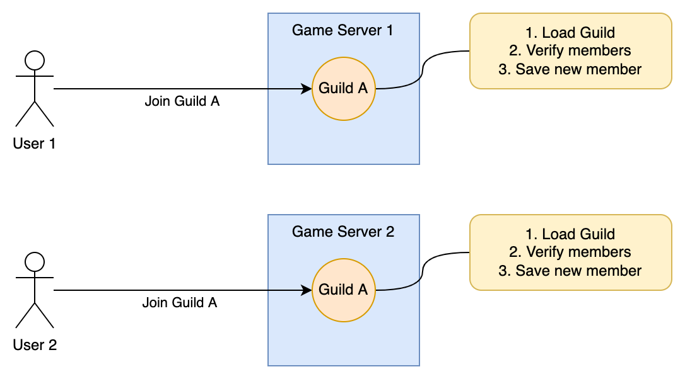
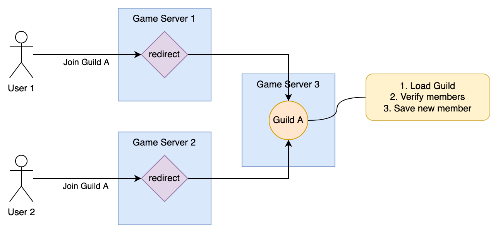
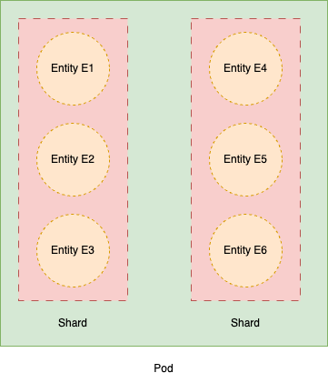
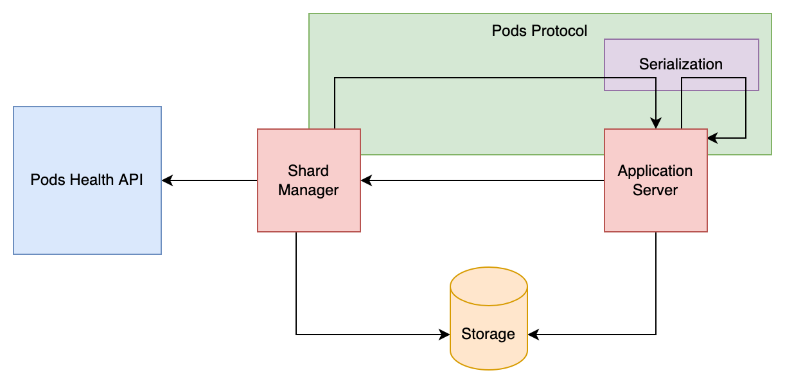

# Overview

## @effect/cluster

`@effect/cluster` provides sharding and location transparency, enabling the definition of an actor model with types of entities and a messaging contract for each entity. You can then define the behavior for each type of activity. What `@effect/cluster` does is handle the spawning of instances of known entity types, manages their messaging, and potentially returns results.

The aspect of location transparency allows multiple processes to manage entities and send messages to entities without knowing which process hosts them. Additionally, the system distributes how entities are spread across various processes in the cluster to evenly distribute the workload.

This architecture facilitates a robust actor model where the cluster handles the distribution of entities. Developers can interact with these entities using their IDs without needing to know their hosting locations, while the system manages the backend processes, including the rebalancing of loads if a process fails or new processes are initiated.

The sharding component ensures that an entity is always executed on no more than one machine at a time.

## @effect/cluster-workflow

`@effect/cluster-workflow` is designed to define and manage long-running and persistent workflows. It focuses on implementing durable execution through the use of sagas and a persistent event journal. Should a workflow need to be resumed, its execution state is reconstructed using an event-sourced approach from the journal data.
For more detailed information, you can visit the [README](https://github.com/Effect-TS/effect/tree/main/packages/cluster-workflow).

How do `@effect/cluster` and `@effect/cluster-workflow` are connected? When there are multiple workflows involving various systems or processes, it becomes challenging to manage them with a single process. The clustering component ensures that each workflow is executed consistently and exclusively once.

# Getting Started

Adapted from https://devsisters.github.io/shardcake/docs/#getting-started

`@effect/cluster` is a TypeScript open source library that makes it easy to distribute entities across multiple servers and interact with those entities using their ID without knowing their actual location (this is also known as _location transparency_).

`@effect/cluster` exposes a purely functional API and depends heavily on [Effect](https://github.com/Effect-TS/effect). It is recommended to be familiar with Effect to read this documentation.

## A simple use case

We are building a multiplayer game where **users** can join **guilds**.
We expect our game to be successful, so we need to be able to scale out (deploy it on multiple servers to handle the load).

A guild is limited to 30 members.
Let's consider the case where 2 users try to join a guild at the exact same time, but our guild already had 29 members.



If we implement this naively, 2 different servers might receive our 2 requests to join the guild.
They will both check the current size of the guild at the same time, which will be 29 and they will both accept the new guild member. Now our guild has 31 members :scream:.

There are 2 common approaches to deal with this issue:

- **Global lock** approach: when checking the members of the guild, acquire a lock that is shared between the different game servers, and release it after saving the new member.
  That way, if 2 different game servers try to do it at the same time, the 2nd one will wait for the first one to finish.
- **Single writer** approach: instead of handling the requests on 2 game servers concurrently, redirect the 2 requests to a single entity that will handle them sequentially.

**Entity Sharding** is a way to implement the second approach. In this case our entities (here, our guilds) will be spread across our game servers so that
each entity exists in only one place at the time.



If our entity might be on any game server, how do we know where it is? This is the second characteristic of entity sharding, known as location transparency: we only need to know the entity ID.
Using the entity ID, the sharding system will be able to find on which server the entity is located.

`@effect/cluster` provides components to:

- automatically manage the assignments of entities to game servers
- send messages to your entities using their IDs

Once sharding is setup, it will let you write code like the following (sending a message to guild regardless of its location):

```ts
const joinGuild = (guildId: string) =>
  Effect.gen(function* () {
    const guild = yield* Sharding.messenger(GuildEntity)
    const userId = yield* getCurrentUserFromContext
    const msg = new JoinGuild({ userId })
    const joined = yield* guild.send(guildId)(msg)
  })
```

## Terminology

Before we go further, let's define a few terms:

- An **entity** is a small message handler that can be addressed by ID.
  For example, `User A` or `Guild B` are entities. In this case we say that `User` and `Guild` are **entity types**.
- A **pod** is an application server that can host entities.
  Entities usually run on multiple pods, but a single entity will only run on a single pod at the time. You will never have the same entity running on 2 different pods.
- A **shard** is a logical group of entities that will always be located on the same pod.
  There might be millions of entities, so instead of keeping millions of entities-to-pods mappings, we group entities into shards and maintain reasonably-sized shards-to-pods mappings.



## Key components

`@effect/cluster` is composed of 2 main components:

- The **Shard Manager** is an independent component that needs a single instance running. It is in charge of assigning shards to pods.
- **Entities** will run on your application servers and process messages that are sent to them. Note that the entity behavior (including entity persistence) is entirely up to you.
  `@effect/cluster` only takes care of starting entities on the right pods as well as the communication between them.

There are 4 pluggable parts that can be implemented with the technology of your choice.

- The `Storage` trait defines where shard assignments will be stored.
- The `Pods` trait defines how to communicate with remote pods.
- The `Serialization` defines how to encode and decode messages.
- The `PodsHealth` trait defines how to check if a pod is healthy or not.



## An example

TODO

### Shard Manager

### Entity Behavior

### Run the application

# Credits

- [Shardcake](https://devsisters.github.io/shardcake/)

# Reference Docs

https://effect-ts.github.io/cluster
