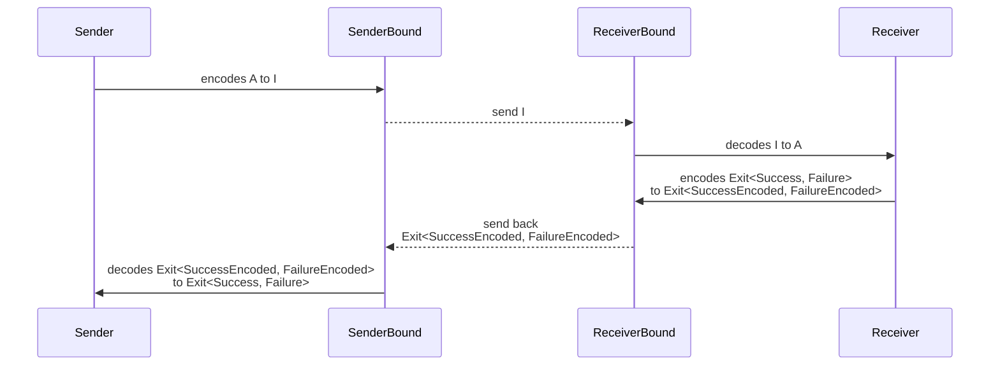

# Introduction

The `@effect/rpc` library facilitates the development of remote procedure call (RPC) systems in TypeScript, enhancing application scalability and maintainability. It provides a type-safe environment that reduces runtime errors by aligning with TypeScript's strong typing. This library simplifies the creation of network-exposed services, handling the intricacies of data serialization and network communication, allowing developers to concentrate on core business logic. Its features support custom serialization, error handling, and middleware, making it adaptable for diverse application needs.

# Quickstart

## Declaring Requests

The `TaggedRequest` API in the `effect/Schema` module is designed to facilitate the creation of structured requests that can serialize function signatures involving input arguments, successful outcomes, and potential failures. Essentially, it's a tool for defining a serializable function that can be reliably transported across different systems or network layers.

Here’s a simplified explanation:

1. **Function Modeling**: `TaggedRequest` allows you to model a function signature as a class, which includes the input arguments, the type of the success response, and the type of the failure response.

2. **Serialization Schema**: For each component (input, success, failure), you specify a corresponding schema. This setup helps ensure that the data associated with each request can be properly serialized (converted to a format suitable for storage or transmission) and deserialized (converted back to usable format).

3. **Usage Scenario**: This API is particularly useful when you need to handle remote procedure calls (RPCs) where functions and their arguments need to be sent over a network, processed, and then responded to asynchronously.

4. **Streamlined Code**: By leveraging `Schema.TaggedRequest`, developers can reduce the amount of boilerplate code typically required for handling complex data serialization and deserialization tasks in distributed systems.

In practice, when you create an instance of `TaggedRequest`, you define the function's behavior along with its serialization rules, which streamlines the process of encoding input data, sending it across a network, and decoding responses.



```ts filename="request.ts"
// request.ts
import { Schema } from "effect"

// Define a user with an ID and name
export class User extends Schema.Class<User>("User")({
  id: Schema.String, // User's ID as a string
  name: Schema.String // User's name as a string
}) {}

// Request to retrieve a list of users
export class UserList extends Schema.TaggedRequest<UserList>()("UserList", {
  failure: Schema.Never, // Indicates that no errors are expected
  success: Schema.Array(User), // Specifies that the response is an array of Users
  payload: {}
}) {}

// Request to retrieve a user by ID
export class UserById extends Schema.TaggedRequest<UserById>()("UserById", {
  failure: Schema.String, // Indicates that errors, if any, will be returned as strings
  success: User, // Specifies that the response is a User
  payload: {
    id: Schema.String
  }
}) {}

// Request to create a new user
export class UserCreate extends Schema.TaggedRequest<UserCreate>()(
  "UserCreate",
  {
    failure: Schema.Never, // Indicates that no errors are expected
    success: User, // Specifies that the response is a User
    payload: {
      name: Schema.String
    }
  }
) {}
```

## Defining a Router

This section introduces how to configure a router using an imaginary database setup to manage user data.

```ts filename="router.ts"
// router.ts
import { RpcRouter, Rpc } from "@effect/rpc"
import { Effect, Ref } from "effect"
import { User, UserById, UserCreate, UserList } from "./request.js"

// ---------------------------------------------
// Imaginary Database
// ---------------------------------------------

const ref = Ref.unsafeMake<Array<User>>([
  new User({ id: "1", name: "Alice" }),
  new User({ id: "2", name: "Bob" })
])

const db = {
  user: {
    findMany: () => ref.get,
    findById: (id: string) =>
      Ref.get(ref).pipe(
        Effect.andThen((users) => {
          const user = users.find((user) => user.id === id)
          return user
            ? Effect.succeed(user)
            : Effect.fail(`User not found: ${id}`)
        })
      ),
    create: (name: string) =>
      Ref.updateAndGet(ref, (users) => [
        ...users,
        new User({ id: String(users.length + 1), name })
      ]).pipe(Effect.andThen((users) => users[users.length - 1]))
  }
}

// ---------------------------------------------
// Router
// ---------------------------------------------

export const appRouter = RpcRouter.make(
  Rpc.effect(UserList, () => db.user.findMany()),
  Rpc.effect(UserById, ({ id }) => db.user.findById(id)),
  Rpc.effect(UserCreate, ({ name }) => db.user.create(name))
)

export type AppRouter = typeof appRouter
```

## Serving the API

This part explains how to serve the API using the defined router.

```ts filename="server.ts"
// server.ts
import { HttpRouter, HttpServer } from "@effect/platform"
import { NodeHttpServer, NodeRuntime } from "@effect/platform-node"
import { toHttpApp } from "@effect/rpc-http/HttpRouter"
import { Layer } from "effect"
import { createServer } from "http"
import { appRouter } from "./router.js"

const HttpLive = HttpRouter.empty.pipe(
  HttpRouter.post("/rpc", toHttpApp(appRouter)),
  HttpServer.serve(),
  HttpServer.withLogAddress,
  Layer.provide(NodeHttpServer.layer(createServer, { port: 3000 }))
)

NodeRuntime.runMain(Layer.launch(HttpLive))
```

**Testing the API with curl**

Use this `curl` command to test if the API is operational:

```bash
curl -X POST http://localhost:3000/rpc \
     -H "Content-Type: application/json" \
     -d '[
           {
             "request": { "_tag": "UserList" },
             "traceId": "traceId",
             "spanId": "spanId",
             "sampled": true,
             "headers": {}
           }
         ]'
```

## Using your new backend on the client

Let's now move to the client-side code and embrace the power of end-to-end typesafety.

```ts
// client.ts
import { HttpClient, HttpClientRequest } from "@effect/platform"
import { RpcResolver } from "@effect/rpc"
import { HttpRpcResolver } from "@effect/rpc-http"
import { Effect } from "effect"
import { UserCreate, UserList } from "./request.js"
import type { AppRouter } from "./router.js"

// Define an effect which creates the client
const makeClient = Effect.gen(function*() {
  const baseClient = yield* HttpClient.HttpClient
  const client = baseClient.pipe(
    HttpClient.filterStatusOk,
    HttpClient.mapRequest(HttpClientRequest.prependUrl("http://localhost:3000/rpc"))
  )
  return RpcResolver.toClient(HttpRpcResolver.make<AppRouter>(client))
})

// Use the client
const program = Effect.gen(function* () {
  const client = yield* makeClient
  let users = yield* client(new UserList())
  if (!users.find((user) => user.id === "3")) {
    console.log(`Creating user "Charlie"`)
    yield* client(new UserCreate({ name: "Charlie" }))
    users = yield* client(new UserList())
  } else {
    console.log(`User "Charlie" already exists`)
  }
  return users
})

program.pipe(
  Effect.provide(FetchHttpClient.layer),
  Effect.runPromise
).then(console.log)
```

# Stream

## Setting Up the Stream Request

```ts filename="request.ts"
// request.ts
import * as Rpc from "@effect/rpc/Rpc"
import { Schema } from "effect"

export class Counts extends Rpc.StreamRequest<Counts>()("Counts", {
  failure: Schema.Never, // Indicates that no errors are expected
  success: Schema.Number, // Specifies that the response is a number
  payload: {}
}) {}
```

## Defining the Router

In the router setup, we link the Counts request to a function that emits numbers from 1 to 5 at regular intervals.

```ts filename="router.ts"
// router.ts
import { Router, Rpc } from "@effect/rpc"
import { Effect, Stream } from "effect"
import { Counts } from "./request.js"

export const appRouter = Router.make(
  Rpc.stream(Counts, () =>
    Stream.make(1, 2, 3, 4, 5).pipe(Stream.tap(() => Effect.sleep("1 second")))
  )
)

export type AppRouter = typeof appRouter
```

## Serving the API

The server code configures an HTTP server to handle requests, using our appRouter to manage incoming stream requests.

```ts filename="server.ts"
// server.ts
import { HttpRouter, HttpServer } from "@effect/platform"
import { NodeHttpServer, NodeRuntime } from "@effect/platform-node"
import { toHttpApp } from "@effect/rpc-http/HttpRouter"
import { Layer } from "effect"
import { createServer } from "http"
import { appRouter } from "./router.js"

const HttpLive = HttpRouter.empty.pipe(
  HttpRouter.post("/rpc", toHttpApp(appRouter)),
  HttpServer.serve(),
  HttpServer.withLogAddress,
  Layer.provide(NodeHttpServer.layer(createServer, { port: 3000 }))
)

NodeRuntime.runMain(Layer.launch(HttpLive))
```

## Consuming the Stream from the Client

```ts filename="client.ts"
// client.ts
import { HttpClient, HttpClientRequest } from "@effect/platform"
import { RpcResolver } from "@effect/rpc"
import { HttpRpcResolver } from "@effect/rpc-http"
import { Effect, Stream } from "effect"
import { Counts } from "./request.js"
import type { AppRouter } from "./router.js"

const makeClient = Effect.gen(function*() {
  const baseClient = yield* HttpClient.HttpClient
  const client = baseClient.pipe(
    HttpClient.filterStatusOk,
    HttpClient.mapRequest(HttpClientRequest.prependUrl("http://localhost:3000/rpc"))
  )
  return RpcResolver.toClient(HttpRpcResolver.make<AppRouter>(client))
})

const program = Effect.gen(function* () {
  const client = yield* makeClient
  yield* Effect.log("Running the client")
  const stream = client(new Counts())
  return yield* stream.pipe(
    Stream.tap((element) => Effect.log(element)),
    Stream.runCollect
  )
})

program.pipe(
  Effect.provide(FetchHttpClient.layer),
  Effect.runPromise
)
/*
timestamp=...:50.395Z level=INFO fiber=#0 message="Running the client"
timestamp=...:52.438Z level=INFO fiber=#1 message=1
timestamp=...:53.438Z level=INFO fiber=#1 message=2
timestamp=...:54.440Z level=INFO fiber=#1 message=3
timestamp=...:55.445Z level=INFO fiber=#1 message=4
timestamp=...:55.447Z level=INFO fiber=#1 message=5
*/
```
