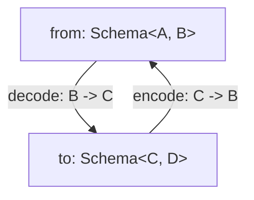

# Introduction

Welcome to the documentation for `@effect/schema`, **a library for defining and using schemas** to validate and transform data in TypeScript.

`@effect/schema` allows you to define a `Schema<I, A>` that provides a blueprint for describing the structure and data types of your data. Once defined, you can leverage this schema to perform a range of operations, including:

| Operation       | Description                                                                                                     |
| --------------- | --------------------------------------------------------------------------------------------------------------- |
| Parsing         | Convert from `unknown` value to output type `A`.                                                                |
| Decoding        | Transforming data from an input type `I` to an output type `A`.                                                 |
| Encoding        | Converting data from an output type `A` back to an input type `I`.                                              |
| Asserting       | Verifying that a value adheres to the schema's output type `A`.                                                 |
| Arbitraries     | Generate arbitraries for [fast-check](https://github.com/dubzzz/fast-check) testing.                            |
| Pretty printing | Support pretty printing for data structures.                                                                    |
| JSON Schemas    | Create JSON Schemas based on defined schemas.                                                                   |
| Equivalence     | Create [Equivalences](https://effect-ts.github.io/effect/modules/Equivalence.ts.html) based on defined schemas. |

If you're eager to learn how to define your first schema, jump straight to the [**Basic usage**](#basic-usage) section!

## Understanding Parsing, Decoding, and Encoding

We'll break down these concepts using an example with a `Schema<string, Date>`. This schema serves as a tool to transform a `string` into a `Date` and vice versa.

**Encoding**

When we talk about "encoding," we are referring to the process of changing a `Date` into a `string`. To put it simply, it's the act of converting data from one format to another.

**Decoding**

Conversely, "decoding" entails transforming a `string` back into a `Date`. It's essentially the reverse operation of encoding, where data is returned to its original form.

**Parsing**

Parsing involves two key steps:

1. **Checking:** Initially, we verify that the input data (which is of the `unknown` type) matches the expected structure. In our specific case, this means ensuring that the input is indeed a `string`.

2. **Decoding:** Following the successful check, we proceed to convert the `string` into a `Date`. This process completes the parsing operation, where the data is both validated and transformed.

> [!NOTE]
> As a general rule, schemas should be defined such that encode + decode return the original value.

## The Rule of Schemas: Keeping Encode and Decode in Sync

When working with schemas, there's an important rule to keep in mind: your schemas should be crafted in a way that when you perform both encoding and decoding operations, you should end up with the original value.

In simpler terms, if you encode a value and then immediately decode it, the result should match the original value you started with. This rule ensures that your data remains consistent and reliable throughout the encoding and decoding process.

# Credits

This library was inspired by the following projects:

- [io-ts](https://github.com/gcanti/io-ts)
- [zod](https://github.com/colinhacks/zod)
- [zio-schema](https://github.com/zio/zio-schema)

# Requirements

- TypeScript 5.0 or newer
- The `strict` flag enabled in your `tsconfig.json` file
- The `exactOptionalPropertyTypes` flag enabled in your `tsconfig.json` file
  ```
  {
    // ...
    "compilerOptions": {
      // ...
      "strict": true,
      "exactOptionalPropertyTypes": true
    }
  }
  ```
- Additionally, make sure to install the following packages, as they are peer dependencies. Note that some package managers might not install peer dependencies by default, so you need to install them manually:
  - `effect` package (peer dependency)
  - [fast-check](https://github.com/dubzzz/fast-check) package (peer dependency)

## Understanding `exactOptionalPropertyTypes`

The `@effect/schema` library takes advantage of the `exactOptionalPropertyTypes` option of `tsconfig.json`. This option affects how optional properties are typed (to learn more about this option, you can refer to the official [TypeScript documentation](https://www.typescriptlang.org/tsconfig#exactOptionalPropertyTypes)).

Let's delve into this with an example.

**With `exactOptionalPropertyTypes` Enabled**

```ts
import * as S from "@effect/schema/Schema";

/*
const schema: S.Schema<{
    readonly myfield?: string; // the type is strict
}, {
    readonly myfield?: string; // the type is strict
}>
*/
const schema = S.struct({
  myfield: S.optional(S.string.pipe(S.nonEmpty()), {
    exact: true,
  }),
});

S.decodeSync(schema)({ myfield: undefined }); // Error: Type 'undefined' is not assignable to type 'string'.ts(2379)
```

Here, notice that the type of `myfield` is strict (`string`), which means the type checker will catch any attempt to assign an invalid value (like `undefined`).

**With `exactOptionalPropertyTypes` Disabled**

If, for some reason, you can't enable the `exactOptionalPropertyTypes` option (perhaps due to conflicts with other third-party libraries), you can still use `@effect/schema`. However, there will be a mismatch between the types and the runtime behavior:

```ts
import * as S from "@effect/schema/Schema";

/*
const schema: S.Schema<{
    readonly myfield?: string | undefined; // the type is widened to string | undefined
}, {
    readonly myfield?: string | undefined; // the type is widened to string | undefined
}>
*/
const schema = S.struct({
  myfield: S.optional(S.string.pipe(S.nonEmpty()), {
    exact: true,
  }),
});

S.decodeSync(schema)({ myfield: undefined }); // No type error, but a decoding failure occurs
/*
Error: error(s) found
└─ ["a"]
   └─ Expected string, actual undefined
*/
```

In this case, the type of `myfield` is widened to `string | undefined`, which means the type checker won't catch the invalid value (`undefined`). However, during decoding, you'll encounter an error, indicating that `undefined` is not allowed.

# Getting started

To install the **alpha** version:

```
npm install @effect/schema
```

Additionally, make sure to install the following packages, as they are peer dependencies. Note that some package managers might not install peer dependencies by default, so you need to install them manually:

- `effect` package (peer dependency)
- [fast-check](https://github.com/dubzzz/fast-check) package (peer dependency)

> [!WARNING]
> This package is primarily published to receive early feedback and for contributors, during this development phase we cannot guarantee the stability of the APIs, consider each release to contain breaking changes.

Once you have installed the library, you can import the necessary types and functions from the `@effect/schema/Schema` module.

```ts
import * as S from "@effect/schema/Schema";
```

# Defining a schema

To define a `Schema`, you can use the provided `struct` function to define a new `Schema` that describes an object with a fixed set of properties. Each property of the object is described by a `Schema`, which specifies the data type and validation rules for that property.

For example, consider the following `Schema` that describes a person object with a `name` property of type `string` and an `age` property of type `number`:

```ts
import * as S from "@effect/schema/Schema";

const Person = S.struct({
  name: S.string,
  age: S.number,
});
```

You can also use the `union` function to define a `Schema` that describes a value that can be one of a fixed set of types. For example, the following `Schema` describes a value that can be either a `string` or a `number`:

```ts
const StringOrNumber = S.union(S.string, S.number);
```

In addition to the provided `struct` and `union` functions, `@effect/schema/Schema` also provides a number of other functions for defining `Schema`s, including functions for defining arrays, tuples, and records.

## Extracting Inferred Types

After you've defined a `Schema<I, A>`, you can extract the inferred type `A` that represents the data described by the schema using the `Schema.To` type.

For instance, with the `Person` schema we defined earlier, you can extract the inferred type of a `Person` object as demonstrated below:

```ts
import * as S from "@effect/schema/Schema";

const Person = S.struct({
  name: S.string,
  age: S.number,
});

interface Person extends S.Schema.To<typeof Person> {}
/*
Equivalent to:
interface Person {
  readonly name: string;
  readonly age: number;
}
*/
```

Alternatively you can also extract a `type` instead of an `interface`:

```ts
type Person = S.Schema.To<typeof Person>;
/*
Equivalent to:
type Person {
  readonly name: string;
  readonly age: number;
}
*/
```

### Advanced extracting Inferred Types

In cases where `I` differs from `A`, you can also extract the inferred `I` type using `Schema.From`.

To create a schema with an opaque type, you can use the following technique that re-declares the schema:

```ts
import * as S from "@effect/schema/Schema";

const _Person = S.struct({
  name: S.string,
  age: S.number,
});

interface Person extends S.Schema.To<typeof _Person> {}

// Re-declare the schema to create a schema with an opaque type
const Person: S.Schema<Person> = _Person;
```

Alternatively, you can use `Schema.Class` (see the [Class](#classes) section below for more details).

Note that the technique shown above becomes more complex when the schema is defined such that `A` is different from `I`. For example:

```ts
import * as S from "@effect/schema/Schema";

/*
const _Person: S.Schema<{
    readonly name: string;
    readonly age: string;
}, {
    readonly name: string;
    readonly age: number;
}>
*/
const _Person = S.struct({
  name: S.string,
  age: S.NumberFromString,
});

interface Person extends S.Schema.To<typeof _Person> {}

interface PersonFrom extends S.Schema.From<typeof _Person> {}

// Re-declare the schema to create a schema with an opaque type
const Person: S.Schema<PersonFrom, Person> = _Person;
```

In this case, the field `"age"` is of type `string` in the `From` type of the schema and is of type `number` in the `To` type of the schema. Therefore, we need to define **two** interfaces (`PersonFrom` and `Person`) and use both to redeclare our final schema `Person`.

## Parsing

To parse a value from the `unknown` type using the previously defined `Schema`, you can make use of the `parse*` functions provided by the `@effect/schema/Schema` module. Let's explore an example using the `parseEither` function:

```ts
import * as S from "@effect/schema/Schema";
import * as Either from "effect/Either";

const Person = S.struct({
  name: S.string,
  age: S.number,
});

const parsePerson = S.parseEither(Person);

const input: unknown = { name: "Alice", age: 30 };

const result1 = parsePerson(input);
if (Either.isRight(result1)) {
  console.log(result1.right);
  /*
  Output:
  { name: "Alice", age: 30 }
  */
}

const result2 = parsePerson(null);
if (Either.isLeft(result2)) {
  console.log(result2.left);
  /*
  Output:
  {
    _id: 'ParseError',
    message: 'error(s) found\n└─ Expected <anonymous type literal schema>, actual null'
  }
  */
}
```

The `parsePerson` function returns an `Either<ParseError, A>`, where `ParseError` is defined as follows:

```ts
interface ParseError {
  readonly _tag: "ParseError";
  // A non-empty list of errors
  readonly errors: ReadonlyArray.NonEmptyReadonlyArray<ParseIssue>;
}
```

`ParseError` represents a list of errors that may have occurred during the parsing process, and `A` is the inferred data type described by the `Schema`. A successful parse results in a `Right` value, containing the parsed data `A`. In the case of a failed parse, the result will be a `Left` value containing a non-empty list of `ParseIssue`.

Now, let's see another example using the `parseSync` function.

The `parseSync` function is used to parse a value and throw an error if the parsing fails. This is especially useful when you want to ensure that the parsed value adheres to the correct format and are ready to throw an error if it does not.

```ts
try {
  const person = S.parseSync(Person)({});
  console.log(person);
} catch (e) {
  console.error("Parsing failed:");
  console.error(e);
}
/*
Parsing failed:
Error: error(s) found
└─ ["name"]
   └─ is missing
  ...stack...
*/
```

In this example, we attempt to parse an empty object, but the `name` property is missing, resulting in an error being thrown.

### Handling Async Transformations

When your schema involves asynchronous transformations, neither the `parseSync` nor the `parseEither` functions will work for you. In such cases, you must turn to the `parse` function, which returns an `Effect`.

```ts
import * as S from "@effect/schema/Schema";
import { Effect } from "effect";

const PersonId = S.number;

const Person = S.struct({
  id: PersonId,
  name: S.string,
  age: S.number,
});

const asyncSchema = S.transformOrFail(
  PersonId,
  Person,
  // Simulate an async transformation
  (id) =>
    Effect.succeed({ id, name: "name", age: 18 }).pipe(
      Effect.delay("10 millis")
    ),
  (person) => Effect.succeed(person.id).pipe(Effect.delay("10 millis"))
);

const syncParsePersonId = S.parseEither(asyncSchema);

console.log(JSON.stringify(syncParsePersonId(1), null, 2));
/*
Output:
{
  "_id": "Either",
  "_tag": "Left",
  "left": {
    "_id": "ParseError",
    "message": "error(s) found\n└─ is forbidden"
  }
}
*/

const asyncParsePersonId = S.parse(asyncSchema);

Effect.runPromise(asyncParsePersonId(1)).then(console.log);
/*
Output:
{ id: 1, name: 'name', age: 18 }
*/
```

As shown in the code above, the first approach returns a `Forbidden` error, indicating that using `parseEither` with an async transformation is not allowed. However, the second approach works as expected, allowing you to handle async transformations and return the desired result.

### Excess properties

When using a `Schema` to parse a value, any properties that are not specified in the `Schema` will be stripped out from the output. This is because the `Schema` is expecting a specific shape for the parsed value, and any excess properties do not conform to that shape.

However, you can use the `onExcessProperty` option (default value: `"ignore"`) to trigger a parsing error. This can be particularly useful in cases where you need to detect and handle potential errors or unexpected values.

Here's an example of how you might use `onExcessProperty`:

```ts
import * as S from "@effect/schema/Schema";

const Person = S.struct({
  name: S.string,
  age: S.number,
});

console.log(
  S.parseSync(Person)({
    name: "Bob",
    age: 40,
    email: "bob@example.com",
  })
);
/*
Output:
{ name: 'Bob', age: 40 }
*/

S.parseSync(Person)(
  {
    name: "Bob",
    age: 40,
    email: "bob@example.com",
  },
  { onExcessProperty: "error" }
);
/*
throws
Error: error(s) found
└─ ["email"]
   └─ is unexpected, expected "name" or "age"
*/
```

### All errors

The `errors` option allows you to receive all parsing errors when attempting to parse a value using a schema. By default only the first error is returned, but by setting the `errors` option to `"all"`, you can receive all errors that occurred during the parsing process. This can be useful for debugging or for providing more comprehensive error messages to the user.

Here's an example of how you might use `errors`:

```ts
import * as S from "@effect/schema/Schema";

const Person = S.struct({
  name: S.string,
  age: S.number,
});

S.parseSync(Person)(
  {
    name: "Bob",
    age: "abc",
    email: "bob@example.com",
  },
  { errors: "all", onExcessProperty: "error" }
);
/*
throws
Error: error(s) found
├─ ["email"]
│  └─ is unexpected, expected "name" or "age"
└─ ["age"]
   └─ Expected number, actual "abc"
*/
```

## Encoding

To use the `Schema` defined above to encode a value to `unknown`, you can use the `encode` function:

```ts
import * as S from "@effect/schema/Schema";
import * as Either from "effect/Either";

// Age is a schema that can decode a string to a number and encode a number to a string
const Age = S.NumberFromString;

const Person = S.struct({
  name: S.string,
  age: Age,
});

const encoded = S.encodeEither(Person)({ name: "Alice", age: 30 });
if (Either.isRight(encoded)) {
  console.log(encoded.right);
  /*
  Output:
  { name: "Alice", age: "30" }
  */
}
```

Note that during encoding, the number value `30` was converted to a string `"30"`.

## Formatting Errors

When you're working with Effect Schema and encounter errors during parsing, decoding, or encoding functions, you can format these errors in two different ways: using the `TreeFormatter` or the `ArrayFormatter`.

### TreeFormatter (default)

The `TreeFormatter` is the default way to format errors. It arranges errors in a tree structure, making it easy to see the hierarchy of issues.

Here's an example of how it works:

```ts
import * as S from "@effect/schema/Schema";
import { formatErrors } from "@effect/schema/TreeFormatter";
import * as Either from "effect/Either";

const Person = S.struct({
  name: S.string,
  age: S.number,
});

const result = S.parseEither(Person)({});
if (Either.isLeft(result)) {
  console.error("Parsing failed:");
  console.error(formatErrors(result.left.errors));
}
/*
Parsing failed:
error(s) found
└─ ["name"]
   └─ is missing
*/
```

### ArrayFormatter

The `ArrayFormatter` is an alternative way to format errors, presenting them as an array of issues. Each issue contains properties such as `_tag`, `path`, and `message`:

```ts
interface Issue {
  readonly _tag: ParseErrors["_tag"];
  readonly path: ReadonlyArray<PropertyKey>;
  readonly message: string;
}
```

Here's an example of how it works:

```ts
import { formatErrors } from "@effect/schema/ArrayFormatter";
import * as S from "@effect/schema/Schema";
import * as Either from "effect/Either";

const Person = S.struct({
  name: S.string,
  age: S.number,
});

const result = S.parseEither(Person)(
  { name: 1, foo: 2 },
  { errors: "all", onExcessProperty: "error" }
);
if (Either.isLeft(result)) {
  console.error("Parsing failed:");
  console.error(formatErrors(result.left.errors));
}
/*
Parsing failed:
[
  {
    _tag: 'Unexpected',
    path: [ 'foo' ],
    message: 'Unexpected, expected "name" or "age"'
  },
  {
    _tag: 'Type',
    path: [ 'name' ],
    message: 'Expected string, actual 1'
  },
  { _tag: 'Missing', path: [ 'age' ], message: 'Missing key or index' }
]
*/
```

## Assertions

The `is` function provided by the `@effect/schema/Schema` module represents a way of verifying that a value conforms to a given `Schema`. `is` is a refinement that takes a value of type `unknown` as an argument and returns a `boolean` indicating whether or not the value conforms to the `Schema`.

```ts
import * as S from "@effect/schema/Schema";

const Person = S.struct({
  name: S.string,
  age: S.number,
});

// const isPerson: (u: unknown) => u is Person
const isPerson = S.is(Person);

console.log(isPerson({ name: "Alice", age: 30 })); // true
console.log(isPerson(null)); // false
console.log(isPerson({})); // false
```

The `asserts` function takes a `Schema` and returns a function that takes an input value and checks if it matches the schema. If it does not match the schema, it throws an error with a comprehensive error message.

```ts
import * as S from "@effect/schema/Schema";

const Person = S.struct({
  name: S.string,
  age: S.number,
});

// const assertsPerson: (input: unknown, options?: ParseOptions) => asserts input is { readonly name: string; readonly age: number; }
const assertsPerson: S.Schema.ToAsserts<typeof Person> = S.asserts(Person);

try {
  assertsPerson({ name: "Alice", age: "30" });
} catch (e) {
  console.error("The input does not match the schema:");
  console.error(e);
}
/*
The input does not match the schema:
Error: error(s) found
└─ ["age"]
   └─ Expected number, actual "30"
*/

// this will not throw an error
assertsPerson({ name: "Alice", age: 30 });
```

## [fast-check](https://github.com/dubzzz/fast-check) arbitraries

The `arbitrary` function provided by the `@effect/schema/Arbitrary` module represents a way of generating random values that conform to a given `Schema`. This can be useful for testing purposes, as it allows you to generate random test data that is guaranteed to be valid according to the `Schema`.

```ts
import * as Arbitrary from "@effect/schema/Arbitrary";
import * as S from "@effect/schema/Schema";
import * as fc from "fast-check";

const Person = S.struct({
  name: S.string,
  age: S.string.pipe(S.numberFromString, S.int()),
});

// Arbitrary for the To type
const PersonArbitraryTo = Arbitrary.to(Person)(fc);

console.log(fc.sample(PersonArbitraryTo, 2));
/*
Output:
[ { name: 'iP=!', age: -6 }, { name: '', age: 14 } ]
*/

// Arbitrary for the From type
const PersonArbitraryFrom = Arbitrary.from(Person)(fc);

console.log(fc.sample(PersonArbitraryFrom, 2));
/*
Output:
[ { name: '{F', age: '$"{|' }, { name: 'nB}@BK', age: '^V+|W!Z' } ]
*/
```

### Troubleshooting: Dealing with `"type": "module"` in `package.json`

If you have set the `"type"` field in your `package.json` to `"module"`, you might encounter the following error:

```ts
import * as S from "@effect/schema/Schema";
import * as Arbitrary from "@effect/schema/Arbitrary";
import * as fc from "fast-check";

const arb = Arbitrary.to(S.string)(fc);
/*
...more lines...
  Types have separate declarations of a private property 'internalRng'.
*/
```

To address this issue, you can apply a patch, for example using `pnpm patch`, to the `fast-check` package in the `node_modules` directory:

```diff
diff --git a/CHANGELOG.md b/CHANGELOG.md
deleted file mode 100644
index 41d6274a9d4bb2d9924fb82f77e502f232fd12f5..0000000000000000000000000000000000000000
diff --git a/package.json b/package.json
index e871dfde5f8877b1b7de9bd3d9a6e3e4f7f59843..819035d70e22d246c615bda25183db9b5e124287 100644
--- a/package.json
+++ b/package.json
@@ -12,7 +12,7 @@
         "default": "./lib/fast-check.js"
       },
       "import": {
-        "types": "./lib/esm/types/fast-check.d.ts",
+        "types": "./lib/types/fast-check.d.ts",
         "default": "./lib/esm/fast-check.js"
       }
     }
```

This patch helps resolve the issue caused by the declaration of a private property 'internalRng' having separate declarations in the types when using `"type": "module"` in `package.json`.

## Pretty print

The `to` function provided by the `@effect/schema/Pretty` module represents a way of pretty-printing values that conform to a given `Schema`.

You can use the `to` function to create a human-readable string representation of a value that conforms to a `Schema`. This can be useful for debugging or logging purposes, as it allows you to easily inspect the structure and data types of the value.

```ts
import * as Pretty from "@effect/schema/Pretty";
import * as S from "@effect/schema/Schema";

const Person = S.struct({
  name: S.string,
  age: S.number,
});

const PersonPretty = Pretty.to(Person);

// returns a string representation of the object
console.log(PersonPretty({ name: "Alice", age: 30 }));
/*
Output:
{ "name": "Alice", "age": 30 }
*/
```

## Generating JSON Schemas

The `to` / `from` functions, which are part of the `@effect/schema/JSONSchema` module, allow you to generate a JSON Schema based on a schema definition:

```ts
import * as JSONSchema from "@effect/schema/JSONSchema";
import * as S from "@effect/schema/Schema";

const Person = S.struct({
  name: S.string,
  age: S.number,
});

const jsonSchema = JSONSchema.to(Person);

console.log(JSON.stringify(jsonSchema, null, 2));
/*
Output:
{
  "$schema": "http://json-schema.org/draft-07/schema#",
  "type": "object",
  "required": [
    "name",
    "age"
  ],
  "properties": {
    "name": {
      "type": "string",
      "description": "a string",
      "title": "string"
    },
    "age": {
      "type": "number",
      "description": "a number",
      "title": "number"
    }
  },
  "additionalProperties": false
}
*/
```

In this example, we have created a schema for a "Person" with a name (a string) and an age (a number). We then use the `JSONSchema.to` function to generate the corresponding JSON Schema.

### Identifier Annotations

You can enhance your schemas with identifier annotations. If you do, your schema will be included within a "definitions" object property on the root and referenced from there:

```ts
import * as JSONSchema from "@effect/schema/JSONSchema";
import * as S from "@effect/schema/Schema";

const Name = S.string.pipe(S.identifier("Name"));
const Age = S.number.pipe(S.identifier("Age"));
const Person = S.struct({
  name: Name,
  age: Age,
});

const jsonSchema = JSONSchema.to(Person);

console.log(JSON.stringify(jsonSchema, null, 2));
/*
Output:
{
  "$schema": "http://json-schema.org/draft-07/schema#",
  "type": "object",
  "required": [
    "name",
    "age"
  ],
  "properties": {
    "name": {
      "$ref": "#/$defs/Name"
    },
    "age": {
      "$ref": "#/$defs/Age"
    }
  },
  "additionalProperties": false,
  "$defs": {
    "Name": {
      "type": "string",
      "description": "a string",
      "title": "string"
    },
    "Age": {
      "type": "number",
      "description": "a number",
      "title": "number"
    }
  }
}
*/
```

This technique helps organize your JSON Schema by creating separate definitions for each identifier annotated schema, making it more readable and maintainable.

### Recursive and Mutually Recursive Schemas

Recursive and mutually recursive schemas are supported, but in these cases, identifier annotations are **required**:

```ts
import * as JSONSchema from "@effect/schema/JSONSchema";
import * as S from "@effect/schema/Schema";

interface Category {
  readonly name: string;
  readonly categories: ReadonlyArray<Category>;
}

const schema: S.Schema<Category> = S.struct({
  name: S.string,
  categories: S.array(S.suspend(() => schema).pipe(S.identifier("Category"))),
});

const jsonSchema = JSONSchema.to(schema);

console.log(JSON.stringify(jsonSchema, null, 2));
/*
Output:
{
  "$schema": "http://json-schema.org/draft-07/schema#",
  "$ref": "#/$defs/Category",
  "$defs": {
    "Category": {
      "type": "object",
      "required": [
        "name",
        "categories"
      ],
      "properties": {
        "name": {
          "type": "string",
          "description": "a string",
          "title": "string"
        },
        "categories": {
          "type": "array",
          "items": {
            "$ref": "#/$defs/Category"
          }
        }
      },
      "additionalProperties": false
    }
  }
}
*/
```

In the example above, we define a schema for a "Category" that can contain a "name" (a string) and an array of nested "categories." To support recursive definitions, we use the `S.suspend` function and identifier annotations to name our schema.

This ensures that the JSON Schema properly handles the recursive structure and creates distinct definitions for each annotated schema, improving readability and maintainability.

### JSON Schema Annotations

When defining a **refinement** (e.g., through the `filter` function), you can attach a JSON Schema annotation to your schema containing a JSON Schema "fragment" related to this particular refinement. This fragment will be used to generate the corresponding JSON Schema. Note that if the schema consists of more than one refinement, the corresponding annotations will be merged.

```ts
import * as JSONSchema from "@effect/schema/JSONSchema";
import * as S from "@effect/schema/Schema";

// Simulate one or more refinements
const Positive = S.number.pipe(
  S.filter((n) => n > 0, {
    jsonSchema: { minimum: 0 },
  })
);

const schema = Positive.pipe(
  S.filter((n) => n <= 10, {
    jsonSchema: { maximum: 10 },
  })
);

console.log(JSONSchema.to(schema));
/*
Output:
{
  '$schema': 'http://json-schema.org/draft-07/schema#',
  type: 'number',
  description: 'a number',
  title: 'number',
  minimum: 0,
  maximum: 10
}
*/
```

As seen in the example, the JSON Schema annotations are merged with the base JSON Schema from `S.number`. This approach helps handle multiple refinements while maintaining clarity in your code.

## Generating Equivalences

The `to` function, which is part of the `@effect/schema/Equivalence` module, allows you to generate an [Equivalence](https://effect-ts.github.io/effect/modules/Equivalence.ts.html) based on a schema definition:

```ts
import * as S from "@effect/schema/Schema";
import * as Equivalence from "@effect/schema/Equivalence";

const Person = S.struct({
  name: S.string,
  age: S.number,
});

// $ExpectType Equivalence<{ readonly name: string; readonly age: number; }>
const PersonEquivalence = Equivalence.to(Person);

const john = { name: "John", age: 23 };
const alice = { name: "Alice", age: 30 };

console.log(PersonEquivalence(john, { name: "John", age: 23 })); // Output: true
console.log(PersonEquivalence(john, alice)); // Output: false
```

# Basic usage

## Cheatsheet

| Typescript Type                              | Description / Notes                      | Schema / Combinator                                       |
| -------------------------------------------- | ---------------------------------------- | --------------------------------------------------------- |
| `null`                                       |                                          | `S.null`                                                  |
| `undefined`                                  |                                          | `S.undefined`                                             |
| `string`                                     |                                          | `S.string`                                                |
| `number`                                     |                                          | `S.number`                                                |
| `boolean`                                    |                                          | `S.boolean`                                               |
| `symbol`                                     |                                          | `S.symbolFromSelf` / `S.symbol`                           |
| `bigint`                                     |                                          | `S.bigintFromSelf` / `S.bigint`                           |
| `unknown`                                    |                                          | `S.unknown`                                               |
| `any`                                        |                                          | `S.any`                                                   |
| `never`                                      |                                          | `S.never`                                                 |
| `object`                                     |                                          | `S.object`                                                |
| `unique symbol`                              |                                          | `S.uniqueSymbol`                                          |
| `"a"`, `1`, `true`                           | type literals                            | `S.literal("a")`, `S.literal(1)`, `S.literal(true)`       |
| `a${string}`                                 | template literals                        | `S.templateLiteral(S.literal("a"), S.string)`             |
| `{ readonly a: string, readonly b: number }` | structs                                  | `S.struct({ a: S.string, b: S.number })`                  |
| `{ readonly a?: string }`                    | optional fields                          | `S.struct({ a: S.optional(S.string, { exact: true }) })`  |
| `Record<A, B>`                               | records                                  | `S.record(A, B)`                                          |
| `readonly [string, number]`                  | tuples                                   | `S.tuple(S.string, S.number)`                             |
| `ReadonlyArray<string>`                      | arrays                                   | `S.array(S.string)`                                       |
| `A \| B`                                     | unions                                   | `S.union(A, B)`                                           |
| `A & B`                                      | intersections of non-overlapping structs | `S.extend(A, B)`                                          |
| `Record<A, B> & Record<C, D>`                | intersections of non-overlapping records | `S.extend(S.record(A, B), S.record(C, D))`                |
| `type A = { readonly a: A \| null }`         | recursive types                          | `S.struct({ a: S.union(S.null, S.suspend(() => self)) })` |
| `keyof A`                                    |                                          | `S.keyof(A)`                                              |
| `Partial<A>`                                 |                                          | `S.partial(A)`                                            |
| `Required<A>`                                |                                          | `S.required(A)`                                           |

## Primitives

```ts
import * as S from "@effect/schema/Schema";

// primitive values
S.string;
S.number;
S.bigint; // Schema<string, bigint>
S.boolean;
S.symbol; // Schema<string, symbol>
S.object;

// empty types
S.undefined;
S.void; // accepts undefined

// catch-all types
// allows any value
S.any;
S.unknown;

// never type
// allows no values
S.never;

S.json;
S.UUID;
S.ULID;
```

## Literals

```ts
S.null; // same as S.literal(null)
S.literal("a");
S.literal("a", "b", "c"); // union of literals
S.literal(1);
S.literal(2n); // bigint literal
S.literal(true);
```

## Template literals

The `templateLiteral` combinator allows you to create a schema for a TypeScript template literal type.

```ts
// $ExpectType Schema<`a${string}`>
S.templateLiteral(S.literal("a"), S.string);

// example from https://www.typescriptlang.org/docs/handbook/2/template-literal-types.html
const EmailLocaleIDs = S.literal("welcome_email", "email_heading");
const FooterLocaleIDs = S.literal("footer_title", "footer_sendoff");

// $ExpectType Schema<"welcome_email_id" | "email_heading_id" | "footer_title_id" | "footer_sendoff_id">
S.templateLiteral(S.union(EmailLocaleIDs, FooterLocaleIDs), S.literal("_id"));
```

## Filters

In the `@effect/schema/Schema` library, you can apply custom validation logic using _filters_.

You can define a custom validation check on any schema using the `filter` function. Here's a simple example:

```ts
import * as S from "@effect/schema/Schema";

const LongString = S.string.pipe(
  S.filter((s) => s.length >= 10, {
    message: () => "a string at least 10 characters long",
  })
);

console.log(S.parseSync(LongString)("a"));
/*
throws:
error(s) found
└─ a string at least 10 characters long
*/
```

It's recommended to include as much metadata as possible for later introspection of the schema, such as an identifier, JSON schema representation, and a description:

```ts
const LongString = S.string.pipe(
  S.filter((s) => s.length >= 10, {
    message: () => "a string at least 10 characters long",
    identifier: "LongString",
    jsonSchema: { minLength: 10 },
    description:
      "Lorem ipsum dolor sit amet, consectetur adipiscing elit, sed do eiusmod tempor incididunt ut labore et dolore magna aliqua",
  })
);
```

For more complex scenarios, you can return an `Option<ParseError>` type instead of a boolean. In this context, `None` indicates success, and `Some(error)` rejects the input with a specific error. Here's an example:

```ts
import * as ParseResult from "@effect/schema/ParseResult";
import * as S from "@effect/schema/Schema";

const schema = S.struct({ a: S.string, b: S.string }).pipe(
  S.filter((o) =>
    o.b === o.a
      ? Option.none()
      : Option.some(
          ParseResult.parseError([
            ParseResult.key("b", [
              ParseResult.type(
                S.literal(o.a).ast,
                o.b,
                `should be equal to a's value ("${o.a}")`
              ),
            ]),
          ])
        )
  )
);

console.log(S.parseSync(schema)({ a: "a", b: "b" }));
/*
throws:
error(s) found
└─ ["b"]
   └─ should be equal to a's value ("a")
*/
```

> [!WARNING]
> Please note that the use of filters do not alter the type of the `Schema`. They only serve to add additional constraints to the parsing process.

### String filters

```ts
S.string.pipe(S.maxLength(5));
S.string.pipe(S.minLength(5));
S.string.pipe(nonEmpty()); // same as S.minLength(1)
S.string.pipe(S.length(5));
S.string.pipe(S.pattern(regex));
S.string.pipe(S.startsWith(string));
S.string.pipe(S.endsWith(string));
S.string.pipe(S.includes(searchString));
S.string.pipe(S.trimmed()); // verifies that a string contains no leading or trailing whitespaces
S.string.pipe(S.lowercased()); // verifies that a string is lowercased
```

**Note**: The `trimmed` combinator does not make any transformations, it only validates. If what you were looking for was a combinator to trim strings, then check out the `trim` combinator ot the `Trim` schema.

### Number filters

```ts
S.number.pipe(S.greaterThan(5));
S.number.pipe(S.greaterThanOrEqualTo(5));
S.number.pipe(S.lessThan(5));
S.number.pipe(S.lessThanOrEqualTo(5));
S.number.pipe(S.between(-2, 2)); // -2 <= x <= 2

S.number.pipe(S.int()); // value must be an integer

S.number.pipe(S.nonNaN()); // not NaN
S.number.pipe(S.finite()); // ensures that the value being parsed is finite and not equal to Infinity or -Infinity

S.number.pipe(S.positive()); // > 0
S.number.pipe(S.nonNegative()); // >= 0
S.number.pipe(S.negative()); // < 0
S.number.pipe(S.nonPositive()); // <= 0

S.number.pipe(S.multipleOf(5)); // evenly divisible by 5
```

### Bigint filters

```ts
import * as S from "@effect/schema/Schema";

S.bigint.pipe(S.greaterThanBigint(5n));
S.bigint.pipe(S.greaterThanOrEqualToBigint(5n));
S.bigint.pipe(S.lessThanBigint(5n));
S.bigint.pipe(S.lessThanOrEqualToBigint(5n));
S.bigint.pipe(S.betweenBigint(-2n, 2n)); // -2n <= x <= 2n

S.bigint.pipe(S.positiveBigint()); // > 0n
S.bigint.pipe(S.nonNegativeBigint()); // >= 0n
S.bigint.pipe(S.negativeBigint()); // < 0n
S.bigint.pipe(S.nonPositiveBigint()); // <= 0n
```

### BigDecimal filters

```ts
import * as S from "@effect/schema/Schema";
import * as BigDecimal from "effect/BigDecimal";

S.BigDecimal.pipe(S.greaterThanBigDecimal(BigDecimal.fromNumber(5)));
S.BigDecimal.pipe(S.greaterThanOrEqualToBigDecimal(BigDecimal.fromNumber(5)));
S.BigDecimal.pipe(S.lessThanBigDecimal(BigDecimal.fromNumber(5)));
S.BigDecimal.pipe(S.lessThanOrEqualToBigDecimal(BigDecimal.fromNumber(5)));
S.BigDecimal.pipe(
  S.betweenBigDecimal(BigDecimal.fromNumber(-2), BigDecimal.fromNumber(2))
);

S.BigDecimal.pipe(S.positiveBigDecimal());
S.BigDecimal.pipe(S.nonNegativeBigDecimal());
S.BigDecimal.pipe(S.negativeBigDecimal());
S.BigDecimal.pipe(S.nonPositiveBigDecimal());
```

### Duration filters

```ts
import * as S from "@effect/schema/Schema";
import * as Duration from "effect/BigDecimal";

S.Duration.pipe(S.greaterThanDuration("5 seconds"));
S.Duration.pipe(S.greaterThanOrEqualToDuration("5 seconds"));
S.Duration.pipe(S.lessThanDuration("5 seconds"));
S.Duration.pipe(S.lessThanOrEqualToDuration("5 seconds"));
S.Duration.pipe(S.betweenDuration("5 seconds", "10 seconds"));
```

### Array filters

```ts
import * as S from "@effect/schema/Schema";

S.array(S.number).pipe(S.maxItems(2)); // max array length
S.array(S.number).pipe(S.minItems(2)); // min array length
S.array(S.number).pipe(S.itemsCount(2)); // exact array length
```

## Branded types

TypeScript's type system is structural, which means that any two types that are structurally equivalent are considered the same. This can cause issues when types that are semantically different are treated as if they were the same.

```ts
type UserId = string
type Username = string

const getUser = (id: UserId) => { ... }

const myUsername: Username = "gcanti"

getUser(myUsername) // works fine
```

In the above example, `UserId` and `Username` are both aliases for the same type, `string`. This means that the `getUser` function can mistakenly accept a `Username` as a valid `UserId`, causing bugs and errors.

To avoid these kinds of issues, the `@effect` ecosystem provides a way to create custom types with a unique identifier attached to them. These are known as "branded types".

```ts
import type * as B from "effect/Brand"

type UserId = string & B.Brand<"UserId">
type Username = string

const getUser = (id: UserId) => { ... }

const myUsername: Username = "gcanti"

getUser(myUsername) // error
```

By defining `UserId` as a branded type, the `getUser` function can accept only values of type `UserId`, and not plain strings or other types that are compatible with strings. This helps to prevent bugs caused by accidentally passing the wrong type of value to the function.

There are two ways to define a schema for a branded type, depending on whether you:

- want to define the schema from scratch
- have already defined a branded type via `effect/Brand` and want to reuse it to define a schema

### Defining a schema from scratch

To define a schema for a branded type from scratch, you can use the `brand` combinator exported by the `@effect/schema/Schema` module. Here's an example:

```ts
import * as S from "@effect/schema/Schema";

const UserId = S.string.pipe(S.brand("UserId"));
type UserId = S.Schema.To<typeof UserId>; // string & Brand<"UserId">
```

Note that you can use `unique symbol`s as brands to ensure uniqueness across modules / packages:

```ts
import * as S from "@effect/schema/Schema";

const UserIdBrand = Symbol.for("UserId");
const UserId = S.string.pipe(S.brand(UserIdBrand));
type UserId = S.Schema.To<typeof UserId>; // string & Brand<typeof UserIdBrand>
```

### Reusing an existing branded type

If you have already defined a branded type using the `effect/Brand` module, you can reuse it to define a schema using the `fromBrand` combinator exported by the `@effect/schema/Schema` module. Here's an example:

```ts
import * as B from "effect/Brand";

// the existing branded type
type UserId = string & B.Brand<"UserId">;
const UserId = B.nominal<UserId>();

import * as S from "@effect/schema/Schema";

// Define a schema for the branded type
const UserIdSchema = S.string.pipe(S.fromBrand(UserId));
```

## Native enums

```ts
enum Fruits {
  Apple,
  Banana,
}

// $ExpectType Schema<Fruits>
S.enums(Fruits);
```

## Nullables

```ts
// $ExpectType Schema<string | null>
S.nullable(S.string);
```

## Unions

`@effect/schema/Schema` includes a built-in `union` combinator for composing "OR" types.

```ts
// $ExpectType Schema<string | number>
S.union(S.string, S.number);
```

### Union of literals

While the following is perfectly acceptable:

```ts
// $ExpectType Schema<"a" | "b" | "c">
const schema = S.union(S.literal("a"), S.literal("b"), S.literal("c"));
```

It is possible to use `literal` and pass multiple literals, which is less cumbersome:

```ts
// $ExpectType Schema<"a" | "b" | "c">
const schema = S.literal("a", "b", "c");
```

Under the hood, they are the same, as `literal(...literals)` will be converted into a union.

### Discriminated unions

TypeScript reference: https://www.typescriptlang.org/docs/handbook/2/narrowing.html#discriminated-unions

Discriminated unions in TypeScript are a way of modeling complex data structures that may take on different forms based on a specific set of conditions or properties. They allow you to define a type that represents multiple related shapes, where each shape is uniquely identified by a shared discriminant property.

In a discriminated union, each variant of the union has a common property, called the discriminant. The discriminant is a literal type, which means it can only have a finite set of possible values. Based on the value of the discriminant property, TypeScript can infer which variant of the union is currently in use.

Here is an example of a discriminated union in TypeScript:

```ts
type Circle = {
  readonly kind: "circle";
  readonly radius: number;
};

type Square = {
  readonly kind: "square";
  readonly sideLength: number;
};

type Shape = Circle | Square;
```

This code defines a discriminated union using the `@effect/schema` library:

```ts
import * as S from "@effect/schema/Schema";

const Circle = S.struct({
  kind: S.literal("circle"),
  radius: S.number,
});

const Square = S.struct({
  kind: S.literal("square"),
  sideLength: S.number,
});

const Shape = S.union(Circle, Square);
```

The `literal` combinator is used to define the discriminant property with a specific string literal value.

Two structs are defined for `Circle` and `Square`, each with their own properties. These structs represent the variants of the union.

Finally, the `union` combinator is used to create a schema for the discriminated union `Shape`, which is a union of `Circle` and `Square`.

### How to transform a simple union into a discriminated union

If you're working on a TypeScript project and you've defined a simple union to represent a particular input, you may find yourself in a situation where you're not entirely happy with how it's set up. For example, let's say you've defined a `Shape` union as a combination of `Circle` and `Square` without any special property:

```ts
import * as S from "@effect/schema/Schema";

const Circle = S.struct({
  radius: S.number,
});

const Square = S.struct({
  sideLength: S.number,
});

const Shape = S.union(Circle, Square);
```

To make your code more manageable, you may want to transform the simple union into a discriminated union. This way, TypeScript will be able to automatically determine which member of the union you're working with based on the value of a specific property.

To achieve this, you can add a special property to each member of the union, which will allow TypeScript to know which type it's dealing with at runtime. Here's how you can transform the `Shape` schema into another schema that represents a discriminated union:

```ts
import * as S from "@effect/schema/Schema";

const Circle = S.struct({
  radius: S.number,
});

const Square = S.struct({
  sideLength: S.number,
});

const DiscriminatedShape = S.union(
  Circle.pipe(
    S.transform(
      Circle.pipe(S.extend(S.struct({ kind: S.literal("circle") }))), // Add a "kind" property with the literal value "circle" to Circle
      (circle) => ({ ...circle, kind: "circle" as const }), // Add the discriminant property to Circle
      ({ kind: _kind, ...rest }) => rest // Remove the discriminant property
    )
  ),
  Square.pipe(
    S.transform(
      Square.pipe(S.extend(S.struct({ kind: S.literal("square") }))), // Add a "kind" property with the literal value "square" to Square
      (square) => ({ ...square, kind: "square" as const }), // Add the discriminant property to Square
      ({ kind: _kind, ...rest }) => rest // Remove the discriminant property
    )
  )
);

expect(S.parseSync(DiscriminatedShape)({ radius: 10 })).toEqual({
  kind: "circle",
  radius: 10,
});

expect(S.parseSync(DiscriminatedShape)({ sideLength: 10 })).toEqual({
  kind: "square",
  sideLength: 10,
});
```

In this example, we use the `extend` function to add a "kind" property with a literal value to each member of the union. Then we use `transform` to add the discriminant property and remove it afterwards. Finally, we use `union` to combine the transformed schemas into a discriminated union.

However, when we use the schema to encode a value, we want the output to match the original input shape. Therefore, we must remove the discriminant property we added earlier from the encoded value to match the original shape of the input.

The previous solution works perfectly and shows how we can add and remove properties to our schema at will, making it easier to consume the result within our domain model. However, it requires a lot of boilerplate. Fortunately, there is an API called `attachPropertySignature` designed specifically for this use case, which allows us to achieve the same result with much less effort:

```ts
const Circle = S.struct({ radius: S.number });
const Square = S.struct({ sideLength: S.number });
const DiscriminatedShape = S.union(
  Circle.pipe(S.attachPropertySignature("kind", "circle")),
  Square.pipe(S.attachPropertySignature("kind", "square"))
);

// parsing
expect(S.parseSync(DiscriminatedShape)({ radius: 10 })).toEqual({
  kind: "circle",
  radius: 10,
});

// encoding
expect(
  S.encodeSync(DiscriminatedShape)({
    kind: "circle",
    radius: 10,
  })
).toEqual({ radius: 10 });
```

## Tuples

```ts
// $ExpectType Schema<readonly [string, number]>
S.tuple(S.string, S.number);
```

### Append a required element

```ts
// $ExpectType Schema<readonly [string, number, boolean]>
S.tuple(S.string, S.number).pipe(S.element(S.boolean));
```

### Append an optional element

```ts
// $ExpectType Schema<readonly [string, number, boolean?]>
S.tuple(S.string, S.number).pipe(S.optionalElement(S.boolean));
```

### Append a rest element

```ts
// $ExpectType Schema<readonly [string, number, ...boolean[]]>
S.tuple(S.string, S.number).pipe(S.rest(S.boolean));
```

## Arrays

```ts
// $ExpectType Schema<readonly number[]>
S.array(S.number);
```

### Mutable Arrays

By default, when you use `S.array`, it generates a type marked as readonly. The `mutable` combinator is a useful function for creating a new schema with a mutable type in a **shallow** manner:

```ts
// $ExpectType Schema<number[]>
S.mutable(S.array(S.number));
```

### Non empty arrays

```ts
// $ExpectType Schema<readonly [number, ...number[]]>
S.nonEmptyArray(S.number);
```

## Structs

```ts
// $ExpectType Schema<{ readonly a: string; readonly b: number; }>
S.struct({ a: S.string, b: S.number });
```

### Mutable Properties

By default, when you use `S.struct`, it generates a type with properties that are marked as readonly. The `mutable` combinator is a useful function for creating a new schema with properties made mutable in a **shallow** manner:

```ts
// $ExpectType Schema<{ a: string; b: number; }>
S.mutable(S.struct({ a: S.string, b: S.number }));
```

### Optional fields

**Cheatsheet**

| Combinator | From                              | To                                                              |
| ---------- | --------------------------------- | --------------------------------------------------------------- |
| `optional` | `Schema<I, A>`                    | `PropertySignature<I \| undefined, true, A \| undefined, true>` |
| `optional` | `Schema<I, A>`, `{ exact: true }` | `PropertySignature<I, true, A, true>`                           |

#### optional(schema)

- decoding
  - `<missing value>` -> `<missing value>`
  - `undefined` -> `undefined`
  - `i` -> `a`
- encoding
  - `<missing value>` -> `<missing value>`
  - `undefined` -> `undefined`
  - `a` -> `i`

#### optional(schema, { exact: true })

- decoding
  - `<missing value>` -> `<missing value>`
  - `i` -> `a`
- encoding
  - `<missing value>` -> `<missing value>`
  - `a` -> `i`

### Default values

| Combinator | From                                                                | To                                                          |
| ---------- | ------------------------------------------------------------------- | ----------------------------------------------------------- |
| `optional` | `Schema<I, A>`, `{ default: () => A }`                              | `PropertySignature<I \| undefined, true, A, false>`         |
| `optional` | `Schema<I, A>`, `{ exact: true, default: () => A }`                 | `PropertySignature<I, true, A, false>`                      |
| `optional` | `Schema<I, A>`, `{ nullable: true, default: () => A }`              | `PropertySignature<I \| null \| undefined, true, A, false>` |
| `optional` | `Schema<I, A>`, `{ exact: true, nullable: true, default: () => A }` | `PropertySignature<I \| null, true, A, false>`              |

#### optional(schema, { default: () => A })

- decoding
  - `<missing value>` -> `<default value>`
  - `undefined` -> `<default value>`
  - `i` -> `a`
- encoding
  - `a` -> `i`

#### optional(schema, { exact: true, default: () => A })

- decoding
  - `<missing value>` -> `<default value>`
  - `i` -> `a`
- encoding
  - `a` -> `i`

#### optional(schema, { nullable: true, default: () => A })

- decoding
  - `<missing value>` -> `<default value>`
  - `undefined` -> `<default value>`
  - `null` -> `<default value>`
  - `i` -> `a`
- encoding
  - `a` -> `i`

#### optional(schema, { exact: true, nullable: true, default: () => A })

- decoding
  - `<missing value>` -> `<default value>`
  - `null` -> `<default value>`
  - `i` -> `a`
- encoding
  - `a` -> `i`

### Optional fields as `Option`s

| Combinator | From                                                            | To                                                                  |
| ---------- | --------------------------------------------------------------- | ------------------------------------------------------------------- |
| `optional` | `Schema<I, A>`, `{ as: "Option" }`                              | `PropertySignature<I \| undefined, true, Option<A>, false>`         |
| `optional` | `Schema<I, A>`, `{ exact: true, as: "Option" }`                 | `PropertySignature<I, true, Option<A>, false>`                      |
| `optional` | `Schema<I, A>`, `{ nullable: true, as: "Option" }`              | `PropertySignature<I \| undefined \| null, true, Option<A>, false>` |
| `optional` | `Schema<I, A>`, `{ exact: true, nullable: true, as: "Option" }` | `PropertySignature<I \| null, true, Option<A>, false>`              |

#### optional(schema, { as: "Option" })

- decoding
  - `<missing value>` -> `Option.none()`
  - `undefined` -> `Option.none()`
  - `i` -> `Option.some(a)`
- encoding
  - `Option.none()` -> `<missing value>`
  - `Option.some(a)` -> `i`

#### optional(schema, { exact: true, as: "Option" })

- decoding
  - `<missing value>` -> `Option.none()`
  - `i` -> `Option.some(a)`
- encoding
  - `Option.none()` -> `<missing value>`
  - `Option.some(a)` -> `i`

#### optional(schema, { nullable: true, as: "Option" })

- decoding
  - `<missing value>` -> `Option.none()`
  - `undefined` -> `Option.none()`
  - `null` -> `Option.none()`
  - `i` -> `Option.some(a)`
- encoding
  - `Option.none()` -> `<missing value>`
  - `Option.some(a)` -> `i`

#### optional(schema, { exact: true, nullable: true, as: "Option" })

- decoding
  - `<missing value>` -> `Option.none()`
  - `null` -> `Option.none()`
  - `i` -> `Option.some(a)`
- encoding
  - `Option.none()` -> `<missing value>`
  - `Option.some(a)` -> `i`

### Renaming Properties

To rename one or more properties, you can utilize the `rename` API:

```ts
import * as S from "@effect/schema/Schema";

// Original Schema
const originalSchema = S.struct({ a: S.string, b: S.number });

// Renaming the "a" property to "c"
const renamedSchema = S.rename(originalSchema, { a: "c" });

S.parseSync(renamedSchema)({ a: "a", b: 1 }); // Output: { c: "a", b: 1 }
```

In the example above, we have an original schema with properties "a" and "b." Using the `rename` API, we create a new schema where we rename the "a" property to "c." The resulting schema, when used with `S.parseSync`, transforms the input object by renaming the specified property.

## Classes

When working with schemas, you have a choice beyond the `S.struct` constructor. You can leverage the power of classes through the `Class` utility, which comes with its own set of advantages tailored to common use cases.

### The Benefits of Using Classes

Classes offer several features that simplify the schema creation process:

- **All-in-One Definition**: With classes, you can define both a schema and an opaque type simultaneously.
- **Shared Functionality**: You can incorporate shared functionality using class methods or getters.
- **Value Equality and Hashing**: Utilize the built-in capability for checking value equality and applying hashing (thanks to `Class` implementing `Data.Case`).

Let's dive into an illustrative example to better understand how classes work:

```ts
import * as S from "@effect/schema/Schema";

// Define your schema by providing the type to `Class` and the desired fields
class Person extends S.Class<Person>()({
  id: S.number,
  name: S.string.pipe(S.nonEmpty()),
}) {}
```

### Validation and Instantiation

The class constructor serves as a validation and instantiation tool. It ensures that the provided properties meet the schema requirements:

```ts
const tim = new Person({ id: 1, name: "Tim" });
```

Keep in mind that it throws an error for invalid properties:

```ts
new Person({ id: 1, name: "" });
/* throws
error(s) found
└─ ["name"]
   └─ Expected a non empty string, actual ""
*/
```

### Custom Getters and Methods

For more flexibility, you can also introduce custom getters and methods:

```ts
import * as S from "@effect/schema/Schema";

class Person extends S.Class<Person>()({
  id: S.number,
  name: S.string.pipe(S.nonEmpty()),
}) {
  get upperName() {
    return this.name.toUpperCase();
  }
}

const john = new Person({ id: 1, name: "John" });

console.log(john.upperName); // "JOHN"
```

### Accessing Related Schemas

The class constructor itself is a Schema, and can be assigned/provided anywhere a Schema is expected. There is also a `.struct` property, which can be used when the class prototype is not required.

```ts
// $ExpectType Schema<{ readonly id: number; name: string; }, Person>
S.suspend(() => Person);

// $ExpectType Schema<{ readonly id: number; name: string; }, { readonly id: number; name: string; }>
Person.struct;
```

### Tagged Class variants

You can also create classes that extend `TaggedClass` & `TaggedError` from the `effect/Data` module:

```ts
import * as S from "@effect/schema/Schema";

class TaggedPerson extends S.TaggedClass<TaggedPerson>()("TaggedPerson", {
  name: S.string,
}) {}

class HttpError extends S.TaggedError<HttpError>()("HttpError", {
  status: S.number,
}) {}

const joe = new TaggedPerson({ name: "Joe" });
console.log(joe._tag); // "TaggedPerson"

const error = new HttpError({ status: 404 });
console.log(error._tag); // "HttpError"
console.log(error.stack); // access the stack trace
```

### Extending existing Classes

In situations where you need to augment your existing class with more fields, the built-in `extend` utility comes in handy:

```ts
import * as S from "@effect/schema/Schema";

class Person extends S.Class<Person>()({
  id: S.number,
  name: S.string.pipe(S.nonEmpty()),
}) {
  get upperName() {
    return this.name.toUpperCase();
  }
}

class PersonWithAge extends Person.extend<PersonWithAge>()({
  age: S.number,
}) {
  get isAdult() {
    return this.age >= 18;
  }
}
```

### Transforms

You have the option to enhance a class with (effectful) transforms. This becomes valuable when you want to enrich or validate an entity sourced from a data store.

```ts
import * as ParseResult from "@effect/schema/ParseResult";
import * as S from "@effect/schema/Schema";
import * as Effect from "effect/Effect";
import * as Option from "effect/Option";

export class Person extends S.Class<Person>()({
  id: S.number,
  name: S.string,
}) {}

console.log(S.parseSync(Person)({ id: 1, name: "name" }));
/*
Output:
Person { id: 1, name: 'name' }
*/

function getAge(id: number): Effect.Effect<never, Error, number> {
  return Effect.succeed(id + 2);
}

export class PersonWithTransform extends Person.transform<PersonWithTransform>()(
  {
    age: S.optional(S.number), { exact: true, as: "Option" }),
  },
  (input) =>
    Effect.mapBoth(getAge(input.id), {
      onFailure: (e) =>
        ParseResult.parseError([
          ParseResult.type(S.string.ast, input.id, e.message),
        ]),
      // must return { age: Option<number> }
      onSuccess: (age) => ({ ...input, age: Option.some(age) }),
    }),
  ParseResult.succeed
) {}

S.parsePromise(PersonWithTransform)({ id: 1, name: "name" }).then(console.log);
/*
Output:
PersonWithTransform {
  id: 1,
  name: 'name',
  age: { _id: 'Option', _tag: 'Some', value: 3 }
}
*/

export class PersonWithTransformFrom extends Person.transformFrom<PersonWithTransformFrom>()(
  {
    age: S.optional(S.number, { exact: true, as: "Option" }),
  },
  (input) =>
    Effect.mapBoth(getAge(input.id), {
      onFailure: (e) =>
        ParseResult.parseError([
          ParseResult.type(S.string.ast, input, e.message),
        ]),
      // must return { age?: number }
      onSuccess: (age) => (age > 18 ? { ...input, age } : { ...input }),
    }),
  ParseResult.succeed
) {}

S.parsePromise(PersonWithTransformFrom)({ id: 1, name: "name" }).then(
  console.log
);
/*
Output:
PersonWithTransformFrom {
  id: 1,
  name: 'name',
  age: { _id: 'Option', _tag: 'None' }
}
*/
```

The decision of which API to use, either `transform` or `transformFrom`, depends on when you wish to execute the transformation:

1. Using `transform`:

   - The transformation occurs at the end of the process.
   - It expects you to provide a value of type `{ age: Option<number> }`.
   - After processing the initial input, the new transformation comes into play, and you need to ensure the final output adheres to the specified structure.

2. Using `transformFrom`:
   - The new transformation starts as soon as the initial input is handled.
   - You should provide a value `{ age?: number }`.
   - Based on this fresh input, the subsequent transformation `{ age: S.optionalToOption(S.number, { exact: true }) }` is executed.
   - This approach allows for immediate handling of the input, potentially influencing the subsequent transformations.

## Pick

The `pick` operation is used to select specific properties from a schema.

```ts
import * as S from "@effect/schema/Schema";

// $ExpectType Schema<{ readonly a: string; }>
S.struct({ a: S.string, b: S.number, c: S.boolean }).pipe(S.pick("a"));

// $ExpectType Schema<{ readonly a: string; readonly c: boolean; }>
S.struct({ a: S.string, b: S.number, c: S.boolean }).pipe(S.pick("a", "c"));
```

## Omit

The `omit` operation is employed to exclude certain properties from a schema.

```ts
import * as S from "@effect/schema/Schema";

// $ExpectType Schema<{ readonly b: number; readonly c: boolean; }>
S.struct({ a: S.string, b: S.number, c: S.boolean }).pipe(S.omit("a"));

// $ExpectType Schema<{ readonly b: number; }>
S.struct({ a: S.string, b: S.number, c: S.boolean }).pipe(S.omit("a", "c"));
```

## Partial

The `partial` operation makes all properties within a schema optional.

```ts
// $ExpectType Schema<{ readonly a?: string; readonly b?: number; }>
S.partial(S.struct({ a: S.string, b: S.number }));
```

## Required

The `required` operation ensures that all properties in a schema are mandatory.

```ts
// $ExpectType Schema<{ readonly a: string; readonly b: number; }>
S.required(
  S.struct({
    a: S.optional(S.string, { exact: true }),
    b: S.optional(S.number, { exact: true }),
  })
);
```

## Records

### String keys

```ts
// $ExpectType Schema<{ readonly [x: string]: string; }>
S.record(S.string, S.string);

// $ExpectType Schema<{ readonly a: string; readonly b: string; }>
S.record(S.union(S.literal("a"), S.literal("b")), S.string);
```

### Keys refinements

```ts
// $ExpectType Schema<{ readonly [x: string]: string; }>
S.record(S.string.pipe(S.minLength(2)), S.string);
```

### Symbol keys

```ts
// $ExpectType Schema<{ readonly [x: symbol]: string; }>
S.record(S.symbolFromSelf, S.string);
```

### Template literal keys

```ts
// $ExpectType Schema<{ readonly [x: `a${string}`]: string; }>
S.record(S.templateLiteral(S.literal("a"), S.string), S.string);
```

### Mutable Records

By default, when you use `S.record`, it generates a type marked as readonly. The `mutable` combinator is a useful function for creating a new schema with a mutable type in a **shallow** manner:

```ts
// $ExpectType Schema<{ [x: string]: string; }>
S.mutable(S.record(S.string, S.string););
```

## Extend

The `extend` combinator allows you to add additional fields or index signatures to an existing `Schema`.

```ts
// $ExpectType Schema<{ readonly [x: string]: string; readonly a: string; readonly b: string; readonly c: string; }>
S.struct({ a: S.string, b: S.string }).pipe(
  S.extend(S.struct({ c: S.string })), // <= you can add more fields
  S.extend(S.record(S.string, S.string)) // <= you can add index signatures
);
```

## Compose

Combining and reusing schemas is a common requirement, the `compose` combinator allows you to do just that. It enables you to combine two schemas, `Schema<A, B>` and `Schema<B, C>`, into a single schema `Schema<A, C>`:

```ts
// $ExpectType Schema<string, readonly string[]>
const schema1 = S.split(S.string, ",");

// $ExpectType Schema<readonly string[], readonly number[]>
const schema2 = S.array(S.NumberFromString);

// $ExpectType Schema<string, readonly number[]>
const composedSchema = S.compose(schema1, schema2);
```

In this example, we have two schemas, `schema1` and `schema2`. The first schema, `schema1`, takes a string and splits it into an array using a comma as the delimiter. The second schema, `schema2`, transforms an array of strings into an array of numbers.

Now, by using the `compose` combinator, we can create a new schema, `composedSchema`, that combines the functionality of both `schema1` and `schema2`. This allows us to parse a string and directly obtain an array of numbers as a result.

## InstanceOf

In the following section, we demonstrate how to use the `instanceOf` combinator to create a `Schema` for a class instance.

```ts
class Test {
  constructor(readonly name: string) {}
}

// $ExpectType Schema<Test>
S.instanceOf(Test);
```

## Recursive types

The `suspend` combinator is useful when you need to define a `Schema` that depends on itself, like in the case of recursive data structures. In this example, the `Category` schema depends on itself because it has a field `subcategories` that is an array of `Category` objects.

```ts
import * as S from "@effect/schema/Schema";

interface Category {
  readonly name: string;
  readonly subcategories: ReadonlyArray<Category>;
}

const Category: S.Schema<Category> = S.struct({
  name: S.string,
  subcategories: S.array(S.suspend(() => Category)),
});
```

Here's an example of two mutually recursive schemas, `Expression` and `Operation`, that represent a simple arithmetic expression tree.

```ts
import * as S from "@effect/schema/Schema";

interface Expression {
  readonly type: "expression";
  readonly value: number | Operation;
}

interface Operation {
  readonly type: "operation";
  readonly operator: "+" | "-";
  readonly left: Expression;
  readonly right: Expression;
}

const Expression: S.Schema<Expression> = S.struct({
  type: S.literal("expression"),
  value: S.union(
    S.number,
    S.suspend(() => Operation)
  ),
});

const Operation: S.Schema<Operation> = S.struct({
  type: S.literal("operation"),
  operator: S.union(S.literal("+"), S.literal("-")),
  left: Expression,
  right: Expression,
});
```

## Transformations

In some cases, we may need to transform the output of a schema to a different type. For instance, we may want to parse a string into a number, or we may want to transform a date string into a `Date` object.

To perform these kinds of transformations, the `@effect/schema` library provides the `transform` combinator.

### transform

```ts
declare const transform: <A, B, C, D>(
  from: Schema<A, B>,
  to: Schema<C, D>,
  decode: (b: B) => C,
  encode: (c: C) => B
) => Schema<A, D>;
```



The `transform` combinator takes a source schema, a target schema, a transformation function from the source type to the target type, and a reverse transformation function from the target type back to the source type. It returns a new schema that applies the transformation function to the output of the original schema before returning it. If the original schema fails to parse a value, the transformed schema will also fail.

```ts
import * as S from "@effect/schema/Schema";

// use the transform combinator to convert the string schema into the tuple schema
export const transformedSchema: S.Schema<string, readonly [string]> =
  S.transform(
    S.string,
    S.tuple(S.string),
    // define a function that converts a string into a tuple with one element of type string
    (s) => [s] as const,
    // define a function that converts a tuple with one element of type string into a string
    ([s]) => s
  );
```

In the example above, we defined a schema for the `string` type and a schema for the tuple type `[string]`. We also defined the functions `decode` and `encode` that convert a `string` into a tuple and a tuple into a `string`, respectively. Then, we used the `transform` combinator to convert the string schema into a schema for the tuple type `[string]`. The resulting schema can be used to parse values of type `string` into values of type `[string]`.

#### Non-strict option

If you need to be less restrictive in your `decode` and `encode` functions, you can make use of the `{ strict: false }` option:

```ts
declare const transform: <A, B, C, D>(
  from: Schema<A, B>,
  to: Schema<C, D>,
  decode: (b: B) => unknown, // Less strict constraint
  encode: (c: C) => unknown, // Less strict constraint
  options: { strict: false }
) => Schema<A, D>;
```

This is useful when you want to relax the type constraints imposed by the `decode` and `encode` functions, making them more permissive.

### transformOrFail

The `transformOrFail` combinator works in a similar way, but allows the transformation function to return a `ParseResult` object, which can either be a success or a failure.

```ts
import * as ParseResult from "@effect/schema/ParseResult";
import * as S from "@effect/schema/Schema";

export const transformedSchema: S.Schema<string, boolean> = S.transformOrFail(
  S.string,
  S.boolean,
  // define a function that converts a string into a boolean
  (s) =>
    s === "true"
      ? ParseResult.succeed(true)
      : s === "false"
        ? ParseResult.succeed(false)
        : ParseResult.fail(ParseResult.type(S.literal("true", "false").ast, s)),
  // define a function that converts a boolean into a string
  (b) => ParseResult.succeed(String(b))
);
```

The transformation may also be async:

```ts
import * as ParseResult from "@effect/schema/ParseResult";
import * as S from "@effect/schema/Schema";
import * as TreeFormatter from "@effect/schema/TreeFormatter";
import * as Effect from "effect/Effect";

const api = (url: string) =>
  Effect.tryPromise({
    try: () =>
      fetch(url).then((res) => {
        if (res.ok) {
          return res.json() as Promise<unknown>;
        }
        throw new Error(String(res.status));
      }),
    catch: (e) => new Error(String(e)),
  });

const PeopleId = S.string.pipe(S.brand("PeopleId"));

const PeopleIdFromString = S.transformOrFail(
  S.string,
  PeopleId,
  (s, _, ast) =>
    Effect.mapBoth(api(`https://swapi.dev/api/people/${s}`), {
      onFailure: (e) =>
        ParseResult.parseError([ParseResult.type(ast, s, e.message)]),
      onSuccess: () => s,
    }),
  ParseResult.succeed
);

const parse = (id: string) =>
  Effect.mapError(S.parse(PeopleIdFromString)(id), (e) =>
    TreeFormatter.formatErrors(e.errors)
  );

Effect.runPromiseExit(parse("1")).then(console.log);
/*
Output:
{ _id: 'Exit', _tag: 'Success', value: '1' }
*/

Effect.runPromiseExit(parse("fail")).then(console.log);
/*
Output:
{
  _id: 'Exit',
  _tag: 'Failure',
  cause: {
    _id: 'Cause',
    _tag: 'Fail',
    failure: 'error(s) found\n└─ Error: 404'
  }
}
*/
```

### String transformations

#### split

The `split` combinator allows splitting a string into an array of strings.

```ts
import * as S from "@effect/schema/Schema";

// $ExpectType Schema<string, string[]>
const schema = S.string.pipe(S.split(","));
const parse = S.parseSync(schema);

parse(""); // [""]
parse(","); // ["", ""]
parse("a,"); // ["a", ""]
parse("a,b"); // ["a", "b"]
```

#### Trim

The `Trim` schema allows removing whitespaces from the beginning and end of a string.

```ts
import * as S from "@effect/schema/Schema";

// $ExpectType Schema<string, string>
const schema = S.Trim;
const parse = S.parseSync(schema);

parse("a"); // "a"
parse(" a"); // "a"
parse("a "); // "a"
parse(" a "); // "a"
```

**Note**. If you were looking for a combinator to check if a string is trimmed, check out the `trimmed` combinator.

#### Lowercase

The `Lowercase` schema converts a string to lowercase.

```ts
import * as S from "@effect/schema/Schema";

// const schema: S.Schema<string, string>
const schema = S.Lowercase;
const parse = S.parseSync(schema);

parse("A"); // "a"
parse(" AB"); // " ab"
parse("Ab "); // "ab "
parse(" ABc "); // " abc "
```

**Note**. If you were looking for a combinator to check if a string is lowercased, check out the `lowercased` combinator.

#### ParseJson

The `ParseJson` schema offers a method to convert JSON strings into the `unknown` type using the underlying functionality of `JSON.parse`. It also employs `JSON.stringify` for encoding.

```ts
import * as S from "@effect/schema/Schema";

// $ExpectType Schema<string, unknown>
const schema = S.ParseJson;
const parse = S.parseSync(schema);

parse("{}"); // {}
parse(`{"a":"b"}`); // { "a": "b" }
parse(""); // throws Unexpected end of JSON input
```

You can also compose the `ParseJson` schema with other schemas to refine the parsing result:

```ts
import * as S from "@effect/schema/Schema";

// $ExpectType Schema<string, { readonly a: number; }>
const schema = S.ParseJson.pipe(S.compose(S.struct({ a: S.number })));
```

In this example, we've composed the `ParseJson` schema with a struct schema to ensure that the result will have a specific shape, including an object with a numeric property "a".

Alternatively, you can achieve the same result by using the equivalent built-in combinator `fromJson`:

```ts
import * as S from "@effect/schema/Schema";

// $ExpectType Schema<string, { readonly a: number; }>
const schema = S.fromJson(S.struct({ a: S.number }));
```

### Number transformations

#### NumberFromString

Transforms a `string` into a `number` by parsing the string using `parseFloat`.

The following special string values are supported: "NaN", "Infinity", "-Infinity".

```ts
import * as S from "@effect/schema/Schema";

// $ExpectType Schema<string, number>
const schema = S.NumberFromString;
const parse = S.parseSync(schema);

// success cases
parse("1"); // 1
parse("-1"); // -1
parse("1.5"); // 1.5
parse("NaN"); // NaN
parse("Infinity"); // Infinity
parse("-Infinity"); // -Infinity

// failure cases
parse("a"); // throws
```

#### clamp

Clamps a `number` between a minimum and a maximum value.

```ts
import * as S from "@effect/schema/Schema";

// $ExpectType Schema<number, number>
const schema = S.number.pipe(S.clamp(-1, 1)); // clamps the input to -1 <= x <= 1

const parse = S.parseSync(schema);
parse(-3); // -1
parse(0); // 0
parse(3); // 1
```

### BigDecimal transformations

#### BigDecimal

Transforms a `string` into a `BigDecimal`.

```ts
import * as S from "@effect/schema/Schema";

// $ExpectType Schema<string, BigDecimal>
const schema = S.BigDecimal;
const parse = S.parseSync(schema);

parse(".124"); // BigDecimal(.124)
```

#### BigDecimalFromNumber

Transforms a `number` into a `BigDecimal`.

> [!WARNING]
> Warning: When encoding, this Schema will produce incorrect results if the BigDecimal exceeds the 64-bit range of a number.

```ts
import * as S from "@effect/schema/Schema";

// $ExpectType Schema<number, BigDecimal>
const schema = S.BigDecimalFromNumber;
const parse = S.parseSync(schema);

parse(0.111); // BigDecimal(.111)
```

#### clampBigDecimal

Clamps a `BigDecimal` between a minimum and a maximum value.

```ts
import * as S from "@effect/schema/Schema";
import * as BigDecimal from "effect/BigDecimal";

// $ExpectType Schema<BigDecimal.BigDecimal, BigDecimal.BigDecimal>
const schema = S.BigDecimal.pipe(
  S.clampBigDecimal(BigDecimal.fromNumber(-1), BigDecimal.fromNumber(1))
);

const parse = S.parseSync(schema);
parse("-2"); // BigDecimal(-1)
parse("0"); // BigDecimal(0)
parse("3"); // BigDecimal(1)
```

#### negateBigDecimal

Negates a `BigDecimal`.

```ts
import * as S from "@effect/schema/Schema";
import * as BigDecimal from "effect/BigDecimal";

// $ExpectType Schema<BigDecimal.BigDecimal, BigDecimal.BigDecimal>
const schema = S.BigDecimal.pipe(S.negateBigDecimal);

const parse = S.parseSync(schema);
parse("-2"); // BigDecimal(2)
parse("0"); // BigDecimal(0)
parse("3"); // BigDecimal(-3)
```

### Duration transformations

#### Duration

Converts an hrtime(i.e. `[seconds: number, nanos: number]`) into a `Duration`.

```ts
import * as S from "@effect/schema/Schema";
import * as Duration from "effect/Duration";

// $ExpectType Schema<number, Duration>
const schema = S.Duration;

const parse = S.parseSync(schema);
parse([0, 0]); // 0 seconds
parse([5000, 0]); // 5 seconds
```

#### DurationFromNumber

Converts a `number` into a `Duration` where the number represents the number of milliseconds.

```ts
import * as S from "@effect/schema/Schema";
import * as Duration from "effect/Duration";

// $ExpectType Schema<number, Duration>
const schema = S.DurationFromNumber;

const parse = S.parseSync(schema);
parse(0); // 0 seconds
parse(5000); // 5 seconds
```

#### DurationFromBigint

Converts a `bigint` into a `Duration` where the number represents the number of nanoseconds.

```ts
import * as S from "@effect/schema/Schema";
import * as Duration from "effect/Duration";

// $ExpectType Schema<bigint, Duration>
const schema = S.DurationFromBigint;

const parse = S.parseSync(schema);
parse(0n); // 0 seconds
parse(5000000000n); // 5 seconds
```

#### clampDuration

Clamps a `Duration` between a minimum and a maximum value.

```ts
import * as S from "@effect/schema/Schema";
import * as Duration from "effect/Duration";

// $ExpectType Schema<Duration.Duration, Duration.Duration>
const schema = S.DurationFromSelf.pipe(
  S.clampDuration("5 seconds", "10 seconds")
);

const parse = S.parseSync(schema);
parse(Duration.decode("2 seconds")); // 5 seconds
parse(Duration.decode("6 seconds")); // 6 seconds
parse(Duration.decode("11 seconds")); // 10 seconds
```

### Secret transformations

#### Secret

Converts a `string` into a `Secret`.

```ts
import * as S from "@effect/schema/Schema";
import * as Secret from "effect/Secret";

// $ExpectType Schema<string, Secret>
const schema = S.Secret;

const parse = S.parseSync(schema);
parse("keep it secret, keep it safe"); // Secret
```

### Symbol transformations

#### symbol

Transforms a `string` into a `symbol` by parsing the string using `Symbol.for`.

```ts
import * as S from "@effect/schema/Schema";

// $ExpectType Schema<string, symbol>
const schema = S.symbol;
const parse = S.parseSync(schema);

parse("a"); // Symbol.for("a")
```

### Bigint transformations

#### bigint

Transforms a `string` into a `bigint` by parsing the string using `BigInt`.

```ts
import * as S from "@effect/schema/Schema";

// $ExpectType Schema<string, bigint>
const schema = S.bigint;
const parse = S.parseSync(schema);

// success cases
parse("1"); // 1n
parse("-1"); // -1n

// failure cases
parse("a"); // throws
parse("1.5"); // throws
parse("NaN"); // throws
parse("Infinity"); // throws
parse("-Infinity"); // throws
```

#### BigintFromNumber

Transforms a `number` into a `bigint` by parsing the number using `BigInt`.

```ts
import * as S from "@effect/schema/Schema";

// const schema: S.Schema<number, bigint>
const schema = S.BigintFromNumber;
const parse = S.parseSync(schema);
const encode = S.encodeSync(schema);

// success cases
parse(1); // 1n
parse(-1); // -1n
encode(1n); // 1
encode(-1n); // -1

// failure cases
parse(1.5); // throws
parse(NaN); // throws
parse(Infinity); // throws
parse(-Infinity); // throws
encode(BigInt(Number.MAX_SAFE_INTEGER) + 1n); // throws
encode(BigInt(Number.MIN_SAFE_INTEGER) - 1n); // throws
```

#### clamp

Clamps a `bigint` between a minimum and a maximum value.

```ts
import * as S from "@effect/schema/Schema";

// $ExpectType Schema<bigint, bigint>
const schema = S.bigint.pipe(S.clampBigint(-1n, 1n)); // clamps the input to -1n <= x <= 1n

const parse = S.parseSync(schema);
parse(-3n); // -1n
parse(0n); // 0n
parse(3n); // 1n
```

### Boolean transformations

#### not

Negates a boolean value.

```ts
import * as S from "@effect/schema/Schema";

// $ExpectType Schema<boolean, boolean>
const schema = S.boolean.pipe(S.not);

const parse = S.parseSync(schema);
parse(true); // false
parse(false); // true
```

### Date transformations

#### Date

Transforms a `string` into a **valid** `Date`, ensuring that invalid dates, such as `new Date("Invalid Date")`, are rejected.

```ts
import * as S from "@effect/schema/Schema";

// $ExpectType Schema<string, Date>
const schema = S.Date;
const parse = S.parseSync(schema);

parse("1970-01-01T00:00:00.000Z"); // new Date(0)

parse("a"); // throws

const validate = S.validateSync(schema);

validate(new Date(0)); // new Date(0)
validate(new Date("Invalid Date")); // throws
```

## Interop with `effect/Data`

The `effect/Data` module in the Effect ecosystem serves as a utility module that simplifies the process of comparing values for equality without the need for explicit implementations of the `Equal` and `Hash` interfaces. It provides convenient APIs that automatically generate default implementations for equality checks, making it easier for developers to perform equality comparisons in their applications.

```ts
import * as Data from "effect/Data";
import * as Equal from "effect/Equal";

const person1 = Data.struct({ name: "Alice", age: 30 });
const person2 = Data.struct({ name: "Alice", age: 30 });

console.log(Equal.equals(person1, person2)); // true
```

You can use the `Schema.data(schema)` combinator to build a schema from an existing schema that can decode a value `A` to a value `Data<A>`:

```ts
/*
S.Schema<{
    readonly name: string;
    readonly age: number;
}, Data.Data<{
    readonly name: string;
    readonly age: number;
}>>
*/
const schema = S.data(
  S.struct({
    name: S.string,
    age: S.number,
  })
);

const decode = S.decode(schema);

const person1 = decode({ name: "Alice", age: 30 });
const person2 = decode({ name: "Alice", age: 30 });

console.log(Equal.equals(person1, person2)); // true
```

## Option

**Cheatsheet**

| Combinator           | From                                | To                                          |
| -------------------- | ----------------------------------- | ------------------------------------------- |
| `option`             | `Schema<I, A>`                      | `Schema<OptionFrom<I>, Option<A>>`          |
| `optionFromSelf`     | `Schema<I, A>`                      | `Schema<Option<I>, Option<A>>`              |
| `optionFromNullable` | `Schema<I, A>`                      | `Schema<I \| null, Option<A>>`              |
| `optionFromNullish`  | `Schema<I, A>`, `null \| undefined` | `Schema<I \| null \| undefined, Option<A>>` |

where

```ts
type OptionFrom<I> =
  | {
      readonly _tag: "None";
    }
  | {
      readonly _tag: "Some";
      readonly value: I;
    };
```

### option(schema)

- decoding
  - `{ _tag: "None" }` -> `Option.none()`
  - `{ _tag: "Some", value: i }` -> `Option.some(a)`
- encoding
  - `Option.none()` -> `{ _tag: "None" }`
  - `Option.some(a)` -> `{ _tag: "Some", value: i }`

### optionFromSelf(schema)

- decoding
  - `Option.none()` -> `Option.none()`
  - `Option.some(i)` -> `Option.some(a)`
- encoding
  - `Option.none()` -> `Option.none()`
  - `Option.some(a)` -> `Option.some(i)`

### optionFromNullable(schema)

- decoding
  - `null` -> `Option.none()`
  - `i` -> `Option.some(a)`
- encoding
  - `Option.none()` -> `null`
  - `Option.some(a)` -> `i`

### optionFromNullish(schema, onNoneEncoding)

- decoding
  - `null` -> `Option.none()`
  - `undefined` -> `Option.none()`
  - `i` -> `Option.some(a)`
- encoding
  - `Option.none()` -> `<onNoneEncoding value>`
  - `Option.some(a)` -> `i`

## ReadonlySet

In the following section, we demonstrate how to use the `readonlySet` combinator to parse a `ReadonlySet` from an array of values.

```ts
import * as S from "@effect/schema/Schema";

// $ExpectType Schema<readonly number[], ReadonlySet<number>>
const schema = S.readonlySet(S.number); // define a schema for ReadonlySet with number values
const parse = S.parseSync(schema);

parse([1, 2, 3]); // new Set([1, 2, 3])
```

## ReadonlyMap

In the following section, we demonstrate how to use the `readonlyMap` combinator to parse a `ReadonlyMap` from an array of entries.

```ts
import * as S from "@effect/schema/Schema";

// $ExpectType Schema<readonly (readonly [number, string])[], ReadonlyMap<number, string>>
const schema = S.readonlyMap(S.number, S.string); // define the schema for ReadonlyMap with number keys and string values
const parse = S.parseSync(schema);

parse([
  [1, "a"],
  [2, "b"],
  [3, "c"],
]); // new Map([[1, "a"], [2, "b"], [3, "c"]])
```

# Technical overview

## Understanding Schemas

A schema is a description of a data structure that can be used to generate various artifacts from a single declaration.

From a technical point of view a schema is just a typed wrapper of an `AST` value:

```ts
interface Schema<I, A> {
  readonly ast: AST;
}
```

The `AST` type represents a tiny portion of the TypeScript AST, roughly speaking the part describing ADTs (algebraic data types),
i.e. products (like structs and tuples) and unions, plus a custom transformation node.

This means that you can define your own schema constructors / combinators as long as you are able to manipulate the `AST` value accordingly, let's see an example.

Say we want to define a `pair` schema constructor, which takes a `Schema<A>` as input and returns a `Schema<readonly [A, A]>` as output.

First of all we need to define the signature of `pair`

```ts
import * as S from "@effect/schema/Schema";

declare const pair: <A>(schema: S.Schema<A>) => S.Schema<readonly [A, A]>;
```

Then we can implement the body using the APIs exported by the `@effect/schema/AST` module:

```ts
import * as S from "@effect/schema/Schema";
import * as AST from "@effect/schema/AST";
import * as Option from "effect/Option";

const pair = <A>(schema: S.Schema<A>): S.Schema<readonly [A, A]> => {
  const element = AST.createElement(
    schema.ast, // <= the element type
    false // <= is optional?
  );
  const tuple = AST.createTuple(
    [element, element], // <= elements definitions
    Option.none(), // <= rest element
    true // <= is readonly?
  );
  return S.make(tuple); // <= wrap the AST value in a Schema
};
```

This example demonstrates the use of the low-level APIs of the `AST` module, however, the same result can be achieved more easily and conveniently by using the high-level APIs provided by the `Schema` module.

```ts
const pair = <A>(schema: S.Schema<A>): S.Schema<readonly [A, A]> =>
  S.tuple(schema, schema);
```

## Annotations

One of the fundamental requirements in the design of `@effect/schema` is that it is extensible and customizable. Customizations are achieved through "annotations". Each node contained in the AST of `@effect/schema/AST` contains an `annotations: Record<symbol, unknown>` field that can be used to attach additional information to the schema.

Let's see some examples:

```ts
import * as S from "@effect/schema/Schema";

const Password =
  // initial schema, a string
  S.string.pipe(
    // add an error message for non-string values (annotation)
    S.message(() => "not a string"),
    // add a constraint to the schema, only non-empty strings are valid
    // and add an error message for empty strings (annotation)
    S.nonEmpty({ message: () => "required" }),
    // add a constraint to the schema, only strings with a length less or equal than 10 are valid
    // and add an error message for strings that are too long (annotation)
    S.maxLength(10, { message: (s) => `${s} is too long` }),
    // add an identifier to the schema (annotation)
    S.identifier("Password"),
    // add a title to the schema (annotation)
    S.title("password"),
    // add a description to the schema (annotation)
    S.description(
      "A password is a string of characters used to verify the identity of a user during the authentication process"
    ),
    // add examples to the schema (annotation)
    S.examples(["1Ki77y", "jelly22fi$h"]),
    // add documentation to the schema (annotation)
    S.documentation(`
    jsDoc documentation...
  `)
  );
```

The example shows some built-in combinators to add meta information, but users can easily add their own meta information by defining a custom combinator.

Here's an example of how to add a `deprecated` annotation:

```ts
import * as AST from "@effect/schema/AST";
import * as S from "@effect/schema/Schema";

const DeprecatedId = Symbol.for(
  "some/unique/identifier/for/the/custom/annotation"
);

const deprecated = <I, A>(self: S.Schema<I, A>): S.Schema<I, A> =>
  S.make(AST.setAnnotation(self.ast, DeprecatedId, true));

const schema = deprecated(S.string);

console.log(schema);
/*
Output:
{
  ast: {
    _tag: 'StringKeyword',
    annotations: {
      [Symbol(@effect/schema/annotation/Title)]: 'string',
      [Symbol(@effect/schema/annotation/Description)]: 'a string',
      [Symbol(some/unique/identifier/for/the/custom/annotation)]: true
    }
  }
  ...
}
*/
```

Annotations can be read using the `getAnnotation` helper, here's an example:

```ts
import * as Option from "effect/Option";

const isDeprecated = <A>(schema: S.Schema<A>): boolean =>
  AST.getAnnotation<boolean>(DeprecatedId)(schema.ast).pipe(
    Option.getOrElse(() => false)
  );

console.log(isDeprecated(S.string)); // false
console.log(isDeprecated(schema)); // true
```

# Documentation

- [API Reference](https://effect-ts.github.io/schema/)

# License

The MIT License (MIT)

# Contributing Guidelines

Thank you for considering contributing to our project! Here are some guidelines to help you get started:

## Reporting Bugs

If you have found a bug, please open an issue on our [issue tracker](https://github.com/Effect-TS/schema/issues) and provide as much detail as possible. This should include:

- A clear and concise description of the problem
- Steps to reproduce the problem
- The expected behavior
- The actual behavior
- Any relevant error messages or logs

## Suggesting Enhancements

If you have an idea for an enhancement or a new feature, please open an issue on our [issue tracker](https://github.com/Effect-TS/schema/issues) and provide as much detail as possible. This should include:

- A clear and concise description of the enhancement or feature
- Any potential benefits or use cases
- Any potential drawbacks or trade-offs

## Pull Requests

We welcome contributions via pull requests! Here are some guidelines to help you get started:

1. Fork the repository and clone it to your local machine.
2. Create a new branch for your changes: `git checkout -b my-new-feature`
3. Ensure you have the required dependencies installed by running: `pnpm install` (assuming pnpm version `8.x`).
4. Make your desired changes and, if applicable, include tests to validate your modifications.
5. Run the following commands to ensure the integrity of your changes:
   - `pnpm check`: Verify that the code compiles.
   - `pnpm test`: Execute the tests.
   - `pnpm circular`: Confirm there are no circular imports.
   - `pnpm lint`: Check for code style adherence (if you happen to encounter any errors during this process, you can add the `--fix` option to automatically fix some of these style issues).
   - `pnpm dtslint`: Run type-level tests.
   - `pnpm docgen`: Update the automatically generated documentation.
6. Create a changeset for your changes: before committing your changes, create a changeset to document the modifications. This helps in tracking and communicating the changes effectively. To create a changeset, run the following command: `pnpm changeset`.
7. Commit your changes: after creating the changeset, commit your changes with a descriptive commit message: `git commit -am 'Add some feature'`.
8. Push your changes to your fork: `git push origin my-new-feature`.
9. Open a pull request against our `main` branch.

### Pull Request Guidelines

- Please make sure your changes are consistent with the project's existing style and conventions.
- Please write clear commit messages and include a summary of your changes in the pull request description.
- Please make sure all tests pass and add new tests as necessary.
- If your change requires documentation, please update the relevant documentation.
- Please be patient! We will do our best to review your pull request as soon as possible.

## License

By contributing to this project, you agree that your contributions will be licensed under the project's [MIT License](./LICENSE).
