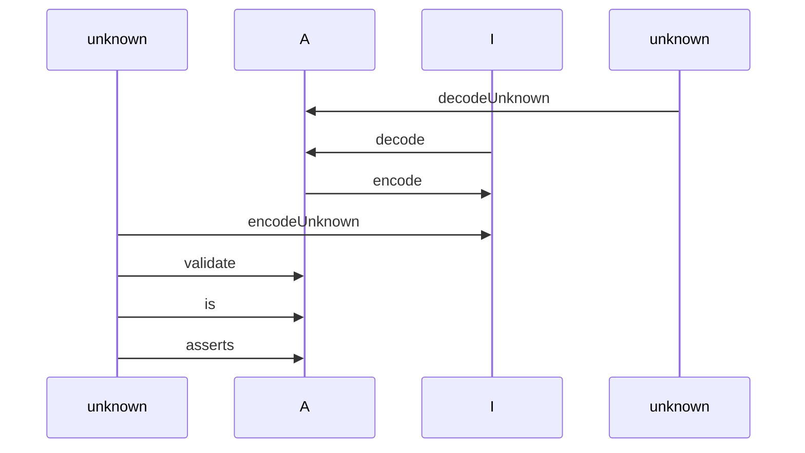
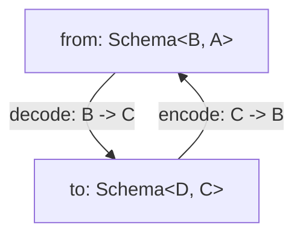

# Introduction

Welcome to the documentation for `@effect/schema`, **a library for defining and using schemas** to validate and transform data in TypeScript.

`@effect/schema` allows you to define a `Schema<Type, Encoded, Context>` that provides a blueprint for describing the structure and data types of your data. Once defined, you can leverage this schema to perform a range of operations, including:

| Operation       | Description                                                                                                    |
| --------------- | -------------------------------------------------------------------------------------------------------------- |
| Decoding        | Transforming data from an input type `Encoded` to an output type `Type`.                                       |
| Encoding        | Converting data from an output type `Type` back to an input type `Encoded`.                                    |
| Asserting       | Verifying that a value adheres to the schema's output type `Type`.                                             |
| Arbitraries     | Generate arbitraries for [fast-check](https://github.com/dubzzz/fast-check) testing.                           |
| Pretty printing | Support pretty printing for data structures.                                                                   |
| JSON Schemas    | Create JSON Schemas based on defined schemas.                                                                  |
| Equivalence     | Create [Equivalences](https://effect-ts.github.io/effect/schema/Equivalence.ts.html) based on defined schemas. |

If you're eager to learn how to define your first schema, jump straight to the [**Basic usage**](#basic-usage) section!

## The Schema Type

The `Schema<Type, Encoded, Context>` type represents an immutable value that describes the structure of your data.

The `Schema` type has three type parameters with the following meanings:

- **Type**. Represents the type of value that a schema can succeed with during decoding.
- **Encoded**. Represents the type of value that a schema can succeed with during encoding. By default, it's equal to `Type` if not explicitly provided.
- **Context**. Similar to the [`Effect`](https://effect.website/docs/guides/essentials/the-effect-type) type, it represents the contextual data required by the schema to execute both decoding and encoding. If this type parameter is `never` (default if not explicitly provided), it means the schema has no requirements.

**Examples**

- `Schema<string>` (defaulted to `Schema<string, string, never>`) represents a schema that decodes to `string`, encodes to `string`, and has no requirements.
- `Schema<number, string>` (defaulted to `Schema<number, string, never>`) represents a schema that decodes to `number` from `string`, encodes a `number` to a `string`, and has no requirements.

> [!NOTE]
> In the Effect ecosystem, you may often encounter the type parameters of `Schema` abbreviated as `A`, `I`, and `R` respectively. This is just shorthand for the type value of type **A**, **I**nput, and **R**equirements.

`Schema` values are immutable, and all `@effect/schema` functions produce new `Schema` values.

`Schema` values do not actually do anything, they are just values that model or describe the structure of your data.

`Schema` values don't perform any actions themselves; they simply describe the structure of your data. A `Schema` can be interpreted by various "compilers" into specific operations, depending on the compiler type (decoding, encoding, pretty printing, arbitraries, etc.).

## Understanding Decoding and Encoding



We'll break down these concepts using an example with a `Schema<Date, string, never>`. This schema serves as a tool to transform a `string` into a `Date` and vice versa.

**Encoding**

When we talk about "encoding," we are referring to the process of changing a `Date` into a `string`. To put it simply, it's the act of converting data from one format to another.

**Decoding**

Conversely, "decoding" entails transforming a `string` back into a `Date`. It's essentially the reverse operation of encoding, where data is returned to its original form.

**Decoding From Unknown**

Decoding from `unknown` involves two key steps:

1. **Checking:** Initially, we verify that the input data (which is of the `unknown` type) matches the expected structure. In our specific case, this means ensuring that the input is indeed a `string`.

2. **Decoding:** Following the successful check, we proceed to convert the `string` into a `Date`. This process completes the decoding operation, where the data is both validated and transformed.

**Encoding From Unknown**

Encoding from `unknown` involves two key steps:

1. **Checking:** Initially, we verify that the input data (which is of the `unknown` type) matches the expected structure. In our specific case, this means ensuring that the input is indeed a `Date`.

2. **Encoding:** Following the successful check, we proceed to convert the `Date` into a `string`. This process completes the encoding operation, where the data is both validated and transformed.

> [!NOTE]
> As a general rule, schemas should be defined such that encode + decode return the original value.

## The Rule of Schemas: Keeping Encode and Decode in Sync

When working with schemas, there's an important rule to keep in mind: your schemas should be crafted in a way that when you perform both encoding and decoding operations, you should end up with the original value.

In simpler terms, if you encode a value and then immediately decode it, the result should match the original value you started with. This rule ensures that your data remains consistent and reliable throughout the encoding and decoding process.

# Credits

This library was inspired by the following projects:

- [io-ts](https://github.com/gcanti/io-ts)
- [zod](https://github.com/colinhacks/zod)
- [zio-schema](https://github.com/zio/zio-schema)

# Requirements

- TypeScript 5.0 or newer
- The `strict` flag enabled in your `tsconfig.json` file
- The `exactOptionalPropertyTypes` flag enabled in your `tsconfig.json` file
  ```
  {
    // ...
    "compilerOptions": {
      // ...
      "strict": true,
      "exactOptionalPropertyTypes": true
    }
  }
  ```
- Additionally, make sure to install the following packages, as they are peer dependencies. Note that some package managers might not install peer dependencies by default, so you need to install them manually:
  - `effect` package (peer dependency)
  - [fast-check](https://github.com/dubzzz/fast-check) package (peer dependency)

## Understanding `exactOptionalPropertyTypes`

The `@effect/schema` library takes advantage of the `exactOptionalPropertyTypes` option of `tsconfig.json`. This option affects how optional properties are typed (to learn more about this option, you can refer to the official [TypeScript documentation](https://www.typescriptlang.org/tsconfig#exactOptionalPropertyTypes)).

Let's delve into this with an example.

**With `exactOptionalPropertyTypes` Enabled**

```ts
import * as S from "@effect/schema/Schema";

const Person = S.struct({
  name: S.optional(S.string.pipe(S.nonEmpty()), {
    exact: true,
  }),
});

/*
type Type = {
    readonly name?: string; // the type is strict (no `| undefined`)
}
*/
type Type = S.Schema.Type<typeof Person>;

S.decodeSync(Person)({ name: undefined });
/*
TypeScript Error:
Argument of type '{ name: undefined; }' is not assignable to parameter of type '{ readonly name?: string; }' with 'exactOptionalPropertyTypes: true'. Consider adding 'undefined' to the types of the target's properties.
  Types of property 'name' are incompatible.
    Type 'undefined' is not assignable to type 'string'.ts(2379)
*/
```

Here, notice that the type of `name` is "exact" (`string`), which means the type checker will catch any attempt to assign an invalid value (like `undefined`).

**With `exactOptionalPropertyTypes` Disabled**

If, for some reason, you can't enable the `exactOptionalPropertyTypes` option (perhaps due to conflicts with other third-party libraries), you can still use `@effect/schema`. However, there will be a mismatch between the types and the runtime behavior:

```ts
import * as S from "@effect/schema/Schema";

const Person = S.struct({
  name: S.optional(S.string.pipe(S.nonEmpty()), {
    exact: true,
  }),
});

/*
type Type = {
    readonly name?: string | undefined; // the type is widened to string | undefined
}
*/
type Type = S.Schema.Type<typeof Person>;

S.decodeSync(Person)({ name: undefined }); // No type error, but a decoding failure occurs
/*
Error: { name?: a non empty string }
└─ ["name"]
   └─ a non empty string
      └─ From side refinement failure
         └─ Expected a string, actual undefined
*/
```

In this case, the type of `name` is widened to `string | undefined`, which means the type checker won't catch the invalid value (`undefined`). However, during decoding, you'll encounter an error, indicating that `undefined` is not allowed.

# Getting started

To install the **alpha** version:

```
npm install @effect/schema
```

Additionally, make sure to install the following packages, as they are peer dependencies. Note that some package managers might not install peer dependencies by default, so you need to install them manually:

- `effect` package (peer dependency)
- [fast-check](https://github.com/dubzzz/fast-check) package (peer dependency)

> [!WARNING]
> This package is primarily published to receive early feedback and for contributors, during this development phase we cannot guarantee the stability of the APIs, consider each release to contain breaking changes.

Once you have installed the library, you can import the necessary types and functions from the `@effect/schema/Schema` module.

**Example** (Namespace Import)

```ts
import * as Schema from "@effect/schema/Schema";
```

**Example** (Named Import)

```ts
import { Schema } from "@effect/schema";
```

## Defining a schema

One common way to define a `Schema` is by utilizing the `struct` constructor provided by `@effect/schema`. This function allows you to create a new `Schema` that outlines an object with specific properties. Each property in the object is defined by its own `Schema`, which specifies the data type and any validation rules.

For example, consider the following `Schema` that describes a person object with a `name` property of type `string` and an `age` property of type `number`:

```ts
import * as S from "@effect/schema/Schema";

const Person = S.struct({
  name: S.string,
  age: S.number,
});
```

> [!NOTE]
> It's important to note that by default, most constructors exported by `@effect/schema` return `readonly` types. For instance, in the `Person` schema above, the resulting type would be `{ readonly name: string; readonly age: number; }`.

## Extracting Inferred Types

### Type

After you've defined a `Schema<A, I, R>`, you can extract the inferred type `A` that represents the data described by the schema using the `Schema.Type` utility.

For instance you can extract the inferred type of a `Person` object as demonstrated below:

```ts
import * as S from "@effect/schema/Schema";

const Person = S.struct({
  name: S.string,
  age: S.NumberFromString,
});

interface Person extends S.Schema.Type<typeof Person> {}
/*
Equivalent to:
interface Person {
  readonly name: string;
  readonly age: number;
}
*/
```

Alternatively, you can define the `Person` type using the `type` keyword:

```ts
type Person = S.Schema.Type<typeof Person>;
/*
Equivalent to:
type Person {
  readonly name: string;
  readonly age: number;
}
*/
```

Both approaches yield the same result, but using an interface provides benefits such as performance advantages and improved readability.

### Encoded

In cases where in a `Schema<A, I>` the `I` type differs from the `A` type, you can also extract the inferred `I` type using the `Schema.Encoded` utility.

```ts
import * as S from "@effect/schema/Schema";

const Person = S.struct({
  name: S.string,
  age: S.NumberFromString,
});

type PersonEncoded = S.Schema.Encoded<typeof Person>;
/*
type PersonEncoded = {
    readonly name: string;
    readonly age: string;
}
*/
```

### Context

You can also extract the inferred type `R` that represents the context described by the schema using the `Schema.Context` utility:

```ts
import * as S from "@effect/schema/Schema";

const Person = S.struct({
  name: S.string,
  age: S.NumberFromString,
});

// type PersonContext = never
type PersonContext = S.Schema.Context<typeof Person>;
```

### Advanced extracting Inferred Types

To create a schema with an opaque type, you can use the following technique that re-declares the schema:

```ts
import * as S from "@effect/schema/Schema";

const _Person = S.struct({
  name: S.string,
  age: S.number,
});

interface Person extends S.Schema.Type<typeof _Person> {}

// Re-declare the schema to create a schema with an opaque type
const Person: S.Schema<Person> = _Person;
```

Alternatively, you can use the `Class` APIs (see the [Class](#classes) section below for more details).

Note that the technique shown above becomes more complex when the schema is defined such that `A` is different from `I`. For example:

```ts
import * as S from "@effect/schema/Schema";

const _Person = S.struct({
  name: S.string,
  age: S.NumberFromString,
});

interface Person extends S.Schema.Type<typeof _Person> {}

interface PersonEncoded extends S.Schema.Encoded<typeof _Person> {}

// Re-declare the schema to create a schema with an opaque type
const Person: S.Schema<Person, PersonEncoded> = _Person;
```

In this case, the field `"age"` is of type `string` in the `Encoded` type of the schema and is of type `number` in the `Type` type of the schema. Therefore, we need to define **two** interfaces (`PersonEncoded` and `Person`) and use both to redeclare our final schema `Person`.

## Decoding From Unknown Values

When working with unknown data types in TypeScript, decoding them into a known structure can be challenging. Luckily, `@effect/schema` provides several functions to help with this process. Let's explore how to decode unknown values using these functions.

### Using `decodeUnknown*` Functions

The `@effect/schema/Schema` module offers a variety of `decodeUnknown*` functions, each tailored for different decoding scenarios:

- `decodeUnknownSync`: Synchronously decodes a value and throws an error if parsing fails.
- `decodeUnknownOption`: Decodes a value and returns an `Option` type.
- `decodeUnknownEither`: Decodes a value and returns an `Either` type.
- `decodeUnknownPromise`: Decodes a value and returns a `Promise`.
- `decodeUnknown`: Decodes a value and returns an `Effect`.

**Example** (Using `decodeUnknownSync`)

Let's begin with an example using the `decodeUnknownSync` function. This function is useful when you want to parse a value and immediately throw an error if the parsing fails.

```ts
import * as S from "@effect/schema/Schema";

const Person = S.struct({
  name: S.string,
  age: S.number,
});

// Simulate an unknown input
const input: unknown = { name: "Alice", age: 30 };

console.log(S.decodeUnknownSync(Person)(input));
// Output: { name: 'Alice', age: 30 }

console.log(S.decodeUnknownSync(Person)(null));
/*
throws:
Error: Expected { name: string; age: number }, actual null
*/
```

**Example** (Using `decodeUnknownEither`)

Now, let's see how to use the `decodeUnknownEither` function, which returns an `Either` type representing success or failure.

```ts
import * as S from "@effect/schema/Schema";
import * as Either from "effect/Either";

const Person = S.struct({
  name: S.string,
  age: S.number,
});

const decode = S.decodeUnknownEither(Person);

// Simulate an unknown input
const input: unknown = { name: "Alice", age: 30 };

const result1 = decode(input);
if (Either.isRight(result1)) {
  console.log(result1.right);
  /*
  Output:
  { name: "Alice", age: 30 }
  */
}

const result2 = decode(null);
if (Either.isLeft(result2)) {
  console.log(result2.left);
  /*
  Output:
  {
    _id: 'ParseError',
    message: 'Expected { name: string; age: number }, actual null'
  }
  */
}
```

The `decode` function returns an `Either<A, ParseError>`, where `ParseError` is defined as follows:

```ts
interface ParseError {
  readonly _tag: "ParseError";
  readonly error: ParseIssue;
}
```

Here, `ParseIssue` represents an error that might occur during the parsing process. It is wrapped in a tagged error to make it easier to catch errors using `Effect.catchTag`. The result `Either<A, ParseError>` contains the inferred data type described by the schema. A successful parse yields a `Right` value with the parsed data `A`, while a failed parse results in a `Left` value containing a `ParseError`.

### Handling Async Transformations

When your schema involves asynchronous transformations, neither the `decodeUnknownSync` nor the `decodeUnknownEither` functions will work for you. In such cases, you must turn to the `decodeUnknown` function, which returns an `Effect`.

```ts
import * as S from "@effect/schema/Schema";
import * as Effect from "effect/Effect";

const PersonId = S.number;

const Person = S.struct({
  id: PersonId,
  name: S.string,
  age: S.number,
});

const asyncSchema = S.transformOrFail(
  PersonId,
  Person,
  // Simulate an async transformation
  (id) =>
    Effect.succeed({ id, name: "name", age: 18 }).pipe(
      Effect.delay("10 millis")
    ),
  (person) => Effect.succeed(person.id).pipe(Effect.delay("10 millis"))
);

const syncParsePersonId = S.decodeUnknownEither(asyncSchema);

console.log(JSON.stringify(syncParsePersonId(1), null, 2));
/*
Output:
{
  "_id": "Either",
  "_tag": "Left",
  "left": {
    "_id": "ParseError",
    "message": "(number <-> { id: number; name: string; age: number })\n└─ cannot be be resolved synchronously, this is caused by using runSync on an effect that performs async work"
  }
}
*/

const asyncParsePersonId = S.decodeUnknown(asyncSchema);

Effect.runPromise(asyncParsePersonId(1)).then(console.log);
/*
Output:
{ id: 1, name: 'name', age: 18 }
*/
```

As shown in the code above, the first approach returns a `Forbidden` error, indicating that using `decodeUnknownEither` with an async transformation is not allowed. However, the second approach works as expected, allowing you to handle async transformations and return the desired result.

### Excess properties

When using a `Schema` to parse a value, by default any properties that are not specified in the `Schema` will be stripped out from the output. This is because the `Schema` is expecting a specific shape for the parsed value, and any excess properties do not conform to that shape.

However, you can use the `onExcessProperty` option (default value: `"ignore"`) to trigger a parsing error. This can be particularly useful in cases where you need to detect and handle potential errors or unexpected values.

Here's an example of how you might use `onExcessProperty` set to `"error"`:

```ts
import * as S from "@effect/schema/Schema";

const Person = S.struct({
  name: S.string,
  age: S.number,
});

console.log(
  S.decodeUnknownSync(Person)({
    name: "Bob",
    age: 40,
    email: "bob@example.com",
  })
);
/*
Output:
{ name: 'Bob', age: 40 }
*/

S.decodeUnknownSync(Person)(
  {
    name: "Bob",
    age: 40,
    email: "bob@example.com",
  },
  { onExcessProperty: "error" }
);
/*
throws
Error: { name: string; age: number }
└─ ["email"]
   └─ is unexpected, expected "name" | "age"
*/
```

If you want to allow excess properties to remain, you can use `onExcessProperty` set to `"preserve"`:

```ts
import * as S from "@effect/schema/Schema";

const Person = S.struct({
  name: S.string,
  age: S.number,
});

console.log(
  S.decodeUnknownSync(Person)(
    {
      name: "Bob",
      age: 40,
      email: "bob@example.com",
    },
    { onExcessProperty: "preserve" }
  )
);
/*
{ email: 'bob@example.com', name: 'Bob', age: 40 }
*/
```

> [!NOTE]
> The [`onExcessProperty`](#excess-properties) and [`error`](#all-errors) options also affect encoding.

### All errors

The `errors` option allows you to receive all parsing errors when attempting to parse a value using a schema. By default only the first error is returned, but by setting the `errors` option to `"all"`, you can receive all errors that occurred during the parsing process. This can be useful for debugging or for providing more comprehensive error messages to the user.

Here's an example of how you might use `errors`:

```ts
import * as S from "@effect/schema/Schema";

const Person = S.struct({
  name: S.string,
  age: S.number,
});

S.decodeUnknownSync(Person)(
  {
    name: "Bob",
    age: "abc",
    email: "bob@example.com",
  },
  { errors: "all", onExcessProperty: "error" }
);
/*
throws
Error: { name: string; age: number }
├─ ["email"]
│  └─ is unexpected, expected "name" | "age"
└─ ["age"]
   └─ Expected a number, actual "abc"
*/
```

> [!NOTE]
> The [`onExcessProperty`](#excess-properties) and [`error`](#all-errors) options also affect encoding.

## Encoding

The `@effect/schema/Schema` module provides several `encode*` functions to encode data according to a schema:

- `encodeSync`: Synchronously encodes data and throws an error if encoding fails.
- `encodeOption`: Encodes data and returns an `Option` type.
- `encodeEither`: Encodes data and returns an `Either` type representing success or failure.
- `encodePromise`: Encodes data and returns a `Promise`.
- `encode`: Encodes data and returns an `Effect`.

Let's consider an example where we have a schema for a `Person` object with a `name` property of type `string` and an `age` property of type `number`.

```ts
import * as S from "@effect/schema/Schema";

// Age is a schema that can decode a string to a number and encode a number to a string
const Age = S.NumberFromString;

const Person = S.struct({
  name: S.NonEmpty,
  age: Age,
});

console.log(S.encodeSync(Person)({ name: "Alice", age: 30 }));
// Output: { name: 'Alice', age: '30' }

console.log(S.encodeSync(Person)({ name: "", age: 30 }));
/*
throws:
Error: { name: NonEmpty; age: NumberFromString }
└─ ["name"]
   └─ NonEmpty
      └─ Predicate refinement failure
         └─ Expected NonEmpty (a non empty string), actual ""
*/
```

Note that during encoding, the number value `30` was converted to a string `"30"`.

> [!NOTE]
> The [`onExcessProperty`](#excess-properties) and [`error`](#all-errors) options also affect encoding.

## Formatting Errors

When you're working with Effect Schema and encounter errors during decoding, or encoding functions, you can format these errors in two different ways: using the `TreeFormatter` or the `ArrayFormatter`.

### TreeFormatter (default)

The `TreeFormatter` is the default method for formatting errors. It organizes errors in a tree structure, providing a clear hierarchy of issues.

Here's an example of how it works:

```ts
import * as S from "@effect/schema/Schema";
import { formatError } from "@effect/schema/TreeFormatter";
import * as Either from "effect/Either";

const Person = S.struct({
  name: S.string,
  age: S.number,
});

const result = S.decodeUnknownEither(Person)({});
if (Either.isLeft(result)) {
  console.error("Decoding failed:");
  console.error(formatError(result.left));
}
/*
Decoding failed:
{ name: string; age: number }
└─ ["name"]
   └─ is missing
*/
```

In this example, the tree error message is structured as follows:

- `{ name: string; age: number }` represents the schema, providing a visual representation of the expected structure. This can be customized using annotations, such as setting the `identifier` annotation.
- `["name"]` indicates the offending property, in this case, the `"name"` property.
- `is missing` represents the specific error for the `"name"` property.

### ArrayFormatter

The `ArrayFormatter` is an alternative way to format errors, presenting them as an array of issues. Each issue contains properties such as `_tag`, `path`, and `message`.

Here's an example of how it works:

```ts
import { formatError } from "@effect/schema/ArrayFormatter";
import * as S from "@effect/schema/Schema";
import * as Either from "effect/Either";

const Person = S.struct({
  name: S.string,
  age: S.number,
});

const result = S.decodeUnknownEither(Person)(
  { name: 1, foo: 2 },
  { errors: "all", onExcessProperty: "error" }
);
if (Either.isLeft(result)) {
  console.error("Parsing failed:");
  console.error(formatError(result.left));
}
/*
Parsing failed:
[
  {
    _tag: 'Unexpected',
    path: [ 'foo' ],
    message: 'is unexpected, expected "name" | "age"'
  },
  {
    _tag: 'Type',
    path: [ 'name' ],
    message: 'Expected a string, actual 1'
  },
  { _tag: 'Missing', path: [ 'age' ], message: 'is missing' }
]
*/
```

## Assertions

The `is` function provided by the `@effect/schema/Schema` module represents a way of verifying that a value conforms to a given `Schema`. `is` is a refinement that takes a value of type `unknown` as an argument and returns a `boolean` indicating whether or not the value conforms to the `Schema`.

```ts
import * as S from "@effect/schema/Schema";

const Person = S.struct({
  name: S.string,
  age: S.number,
});

/*
const isPerson: (a: unknown, options?: ParseOptions | undefined) => a is {
    readonly name: string;
    readonly age: number;
}
*/
const isPerson = S.is(Person);

console.log(isPerson({ name: "Alice", age: 30 })); // true
console.log(isPerson(null)); // false
console.log(isPerson({})); // false
```

The `asserts` function takes a `Schema` and returns a function that takes an input value and checks if it matches the schema. If it does not match the schema, it throws an error with a comprehensive error message.

```ts
import * as S from "@effect/schema/Schema";

const Person = S.struct({
  name: S.string,
  age: S.number,
});

// const assertsPerson: (input: unknown, options?: ParseOptions) => asserts input is { readonly name: string; readonly age: number; }
const assertsPerson: S.Schema.ToAsserts<typeof Person> = S.asserts(Person);

try {
  assertsPerson({ name: "Alice", age: "30" });
} catch (e) {
  console.error("The input does not match the schema:");
  console.error(e);
}
/*
The input does not match the schema:
Error: { name: string; age: number }
└─ ["age"]
   └─ Expected a number, actual "30"
*/

// this will not throw an error
assertsPerson({ name: "Alice", age: 30 });
```

## Using [fast-check](https://github.com/dubzzz/fast-check) Arbitraries

The `make` function provided by the `@effect/schema/Arbitrary` module represents a way of generating random values that conform to a given `Schema`. This can be useful for testing purposes, as it allows you to generate random test data that is guaranteed to be valid according to the `Schema`.

```ts
import * as Arbitrary from "@effect/schema/Arbitrary";
import * as S from "@effect/schema/Schema";
import * as fc from "fast-check";

const Person = S.struct({
  name: S.string,
  age: S.string.pipe(S.compose(S.NumberFromString), S.int()),
});

/*
fc.Arbitrary<{
    readonly name: string;
    readonly age: number;
}>
*/
const PersonArbitraryType = Arbitrary.make(Person)(fc);

console.log(fc.sample(PersonArbitraryType, 2));
/*
Output:
[ { name: 'iP=!', age: -6 }, { name: '', age: 14 } ]
*/

/*
Arbitrary for the "Encoded" type:
fc.Arbitrary<{
    readonly name: string;
    readonly age: string;
}>
*/
const PersonArbitraryEncoded = Arbitrary.make(S.encodedSchema(Person))(fc);

console.log(fc.sample(PersonArbitraryEncoded, 2));
/*
Output:
[ { name: '{F', age: '$"{|' }, { name: 'nB}@BK', age: '^V+|W!Z' } ]
*/
```

### Customizations

You can customize the output by using the `arbitrary` annotation:

```ts
import * as Arbitrary from "@effect/schema/Arbitrary";
import * as S from "@effect/schema/Schema";
import * as fc from "fast-check";

const schema = S.number.annotations({
  arbitrary: () => (fc) => fc.nat(),
});

const arb = Arbitrary.make(schema)(fc);

console.log(fc.sample(arb, 2));
// Output: [ 1139348969, 749305462 ]
```

> [!WARNING]
> Note that when customizing any schema, any filter **preceding** the customization will be lost, only filters **following** the customization will be respected.

**Example**

```ts
import * as Arbitrary from "@effect/schema/Arbitrary";
import * as S from "@effect/schema/Schema";
import * as fc from "fast-check";

const bad = S.number
  .pipe(S.positive())
  .annotations({ arbitrary: () => (fc) => fc.integer() });

console.log(fc.sample(Arbitrary.make(bad)(fc), 2));
// Example Output: [ -1600163302, -6 ]

const good = S.number
  .annotations({ arbitrary: () => (fc) => fc.integer() })
  .pipe(S.positive());

console.log(fc.sample(Arbitrary.make(good)(fc), 2));
// Example Output: [ 7, 1518247613 ]
```

### Troubleshooting: Dealing with `"type": "module"` in `package.json`

If you have set the `"type"` field in your `package.json` to `"module"`, you might encounter the following error:

```ts
import * as S from "@effect/schema/Schema";
import * as Arbitrary from "@effect/schema/Arbitrary";
import * as fc from "fast-check";

const arb = Arbitrary.make(S.string)(fc);
/*
...more lines...
  Types have separate declarations of a private property 'internalRng'.
*/
```

To address this issue, you can apply a patch, for example using `pnpm patch`, to the `fast-check` package in the `node_modules` directory:

```diff
diff --git a/CHANGELOG.md b/CHANGELOG.md
deleted file mode 100644
index 41d6274a9d4bb2d9924fb82f77e502f232fd12f5..0000000000000000000000000000000000000000
diff --git a/package.json b/package.json
index e871dfde5f8877b1b7de9bd3d9a6e3e4f7f59843..819035d70e22d246c615bda25183db9b5e124287 100644
--- a/package.json
+++ b/package.json
@@ -12,7 +12,7 @@
         "default": "./lib/fast-check.js"
       },
       "import": {
-        "types": "./lib/esm/types/fast-check.d.ts",
+        "types": "./lib/types/fast-check.d.ts",
         "default": "./lib/esm/fast-check.js"
       }
     }
```

This patch helps resolve the issue caused by the declaration of a private property 'internalRng' having separate declarations in the types when using `"type": "module"` in `package.json`.

## Pretty print

The `make` function provided by the `@effect/schema/Pretty` module represents a way of pretty-printing values that conform to a given `Schema`.

You can use the `make` function to create a human-readable string representation of a value that conforms to a `Schema`. This can be useful for debugging or logging purposes, as it allows you to easily inspect the structure and data types of the value.

```ts
import * as Pretty from "@effect/schema/Pretty";
import * as S from "@effect/schema/Schema";

const Person = S.struct({
  name: S.string,
  age: S.number,
});

const PersonPretty = Pretty.make(Person);

// returns a string representation of the object
console.log(PersonPretty({ name: "Alice", age: 30 }));
/*
Output:
'{ "name": "Alice", "age": 30 }'
*/
```

### Customizations

You can customize the output using the `pretty` annotation:

```ts
import * as Pretty from "@effect/schema/Pretty";
import * as S from "@effect/schema/Schema";

const schema = S.number.annotations({
  pretty: () => (n) => `my format: ${n}`,
});

console.log(Pretty.make(schema)(1)); // my format: 1
```

## Generating JSON Schemas

The `make` function from the `@effect/schema/JSONSchema` module enables you to create a JSON Schema based on a defined schema:

```ts
import * as JSONSchema from "@effect/schema/JSONSchema";
import * as S from "@effect/schema/Schema";

const Person = S.struct({
  name: S.string,
  age: S.number,
});

const jsonSchema = JSONSchema.make(Person);

console.log(JSON.stringify(jsonSchema, null, 2));
/*
Output:
{
  "$schema": "http://json-schema.org/draft-07/schema#",
  "type": "object",
  "required": [
    "name",
    "age"
  ],
  "properties": {
    "name": {
      "type": "string",
      "description": "a string",
      "title": "string"
    },
    "age": {
      "type": "number",
      "description": "a number",
      "title": "number"
    }
  },
  "additionalProperties": false
}
*/
```

In this example, we have created a schema for a "Person" with a name (a string) and an age (a number). We then use the `JSONSchema.make` function to generate the corresponding JSON Schema.

### Identifier Annotations

You can enhance your schemas with `identifier` annotations. If you do, your schema will be included within a "definitions" object property on the root and referenced from there:

```ts
import * as JSONSchema from "@effect/schema/JSONSchema";
import * as S from "@effect/schema/Schema";

const Name = S.string.annotations({ identifier: "Name" });
const Age = S.number.annotations({ identifier: "Age" });
const Person = S.struct({
  name: Name,
  age: Age,
});

const jsonSchema = JSONSchema.make(Person);

console.log(JSON.stringify(jsonSchema, null, 2));
/*
Output:
{
  "$schema": "http://json-schema.org/draft-07/schema#",
  "type": "object",
  "required": [
    "name",
    "age"
  ],
  "properties": {
    "name": {
      "$ref": "#/$defs/Name"
    },
    "age": {
      "$ref": "#/$defs/Age"
    }
  },
  "additionalProperties": false,
  "$defs": {
    "Name": {
      "type": "string",
      "description": "a string",
      "title": "string"
    },
    "Age": {
      "type": "number",
      "description": "a number",
      "title": "number"
    }
  }
}
*/
```

This technique helps organize your JSON Schema by creating separate definitions for each identifier annotated schema, making it more readable and maintainable.

### Recursive and Mutually Recursive Schemas

Recursive and mutually recursive schemas are supported, but in these cases, identifier annotations are **required**:

```ts
import * as JSONSchema from "@effect/schema/JSONSchema";
import * as S from "@effect/schema/Schema";

interface Category {
  readonly name: string;
  readonly categories: ReadonlyArray<Category>;
}

const schema: S.Schema<Category> = S.struct({
  name: S.string,
  categories: S.array(S.suspend(() => schema)),
}).annotations({ identifier: "Category" });

const jsonSchema = JSONSchema.make(schema);

console.log(JSON.stringify(jsonSchema, null, 2));
/*
Output:
{
  "$schema": "http://json-schema.org/draft-07/schema#",
  "$ref": "#/$defs/Category",
  "$defs": {
    "Category": {
      "type": "object",
      "required": [
        "name",
        "categories"
      ],
      "properties": {
        "name": {
          "type": "string",
          "description": "a string",
          "title": "string"
        },
        "categories": {
          "type": "array",
          "items": {
            "$ref": "#/$defs/Category"
          }
        }
      },
      "additionalProperties": false
    }
  }
}
*/
```

In the example above, we define a schema for a "Category" that can contain a "name" (a string) and an array of nested "categories." To support recursive definitions, we use the `S.suspend` function and identifier annotations to name our schema.

This ensures that the JSON Schema properly handles the recursive structure and creates distinct definitions for each annotated schema, improving readability and maintainability.

### JSON Schema Annotations

When defining a **refinement** (e.g., through the `filter` function), you can attach a JSON Schema annotation to your schema containing a JSON Schema "fragment" related to this particular refinement. This fragment will be used to generate the corresponding JSON Schema. Note that if the schema consists of more than one refinement, the corresponding annotations will be merged.

```ts
import * as JSONSchema from "@effect/schema/JSONSchema";
import * as S from "@effect/schema/Schema";

// Simulate one or more refinements
const Positive = S.number.pipe(
  S.filter((n) => n > 0, {
    jsonSchema: { minimum: 0 },
  })
);

const schema = Positive.pipe(
  S.filter((n) => n <= 10, {
    jsonSchema: { maximum: 10 },
  })
);

console.log(JSONSchema.make(schema));
/*
Output:
{
  '$schema': 'http://json-schema.org/draft-07/schema#',
  type: 'number',
  description: 'a number',
  title: 'number',
  minimum: 0,
  maximum: 10
}
*/
```

As seen in the example, the JSON Schema annotations are merged with the base JSON Schema from `S.number`. This approach helps handle multiple refinements while maintaining clarity in your code.

## Generating Equivalences

The `make` function, which is part of the `@effect/schema/Equivalence` module, allows you to generate an [Equivalence](https://effect-ts.github.io/effect/schema/Equivalence.ts.html) based on a schema definition:

```ts
import * as S from "@effect/schema/Schema";
import * as Equivalence from "@effect/schema/Equivalence";

const Person = S.struct({
  name: S.string,
  age: S.number,
});

// $ExpectType Equivalence<{ readonly name: string; readonly age: number; }>
const PersonEquivalence = Equivalence.make(Person);

const john = { name: "John", age: 23 };
const alice = { name: "Alice", age: 30 };

console.log(PersonEquivalence(john, { name: "John", age: 23 })); // Output: true
console.log(PersonEquivalence(john, alice)); // Output: false
```

### Customizations

You can customize the output using the `equivalence` annotation:

```ts
import * as Equivalence from "@effect/schema/Equivalence";
import * as S from "@effect/schema/Schema";

const schema = S.string.annotations({
  equivalence: () => (a, b) => a.at(0) === b.at(0),
});

console.log(Equivalence.make(schema)("aaa", "abb")); // Output: true
```

# API Interfaces

## What's an API Interface?

An "API Interface" is an `interface` specifically defined for a schema exported from `@effect/schema` or for a particular API exported from `@effect/schema`. Let's see an example with a simple schema:

**Example** (an `Age` schema)

```ts
import * as S from "@effect/schema/Schema";

// API interface
interface Age extends S.Schema<number> {}

const Age: Age = S.number.pipe(S.between(0, 100));

// type AgeType = number
type AgeType = S.Schema.Type<typeof Age>;
// type AgeEncoded = number
type AgeEncoded = S.Schema.Encoded<typeof Age>;
```

The benefit is that when we hover over the `Age` schema, we see `Age` instead of `Schema<number, number, never>`. This is a small improvement if we only think about the `Age` schema, but as we'll see shortly, these improvements in schema visualization add up, resulting in a significant improvement in the readability of our schemas.

Many of the built-in schemas exported from `@effect/schema` have been equipped with API interfaces, for example `number` or `never`.

```ts
import * as S from "@effect/schema/Schema";

// const number: S.$number
S.number;

// const never: S.$never
S.never;
```

> [!NOTE]
> Notice that we had to add a `$` suffix to the API interface name because we couldn't simply use "number" since it's a reserved name for the TypeScript `number` type.

Now let's see an example with a combinator that, given an input schema for a certain type `A`, returns the schema of the pair `readonly [A, A]`:

**Example** (a `pair` combinator)

```ts
import * as S from "@effect/schema/Schema";

// API interface
export interface pair<S extends S.Schema.Any>
  extends S.Schema<
    readonly [S.Schema.Type<S>, S.Schema.Type<S>],
    readonly [S.Schema.Encoded<S>, S.Schema.Encoded<S>],
    S.Schema.Context<S>
  > {}

// API
export const pair = <S extends S.Schema.Any>(schema: S): pair<S> =>
  S.tuple(S.asSchema(schema), S.asSchema(schema));
```

> [!NOTE]
> The `S.Schema.Any` helper represents any schema, except for `never`. For more information on the `asSchema` helper, refer to the following section "Understanding Opaque Names".

If we try to use our `pair` combinator, we see that readability is also improved in this case:

```ts
// const Coords: pair<S.$number>
const Coords = pair(S.number);
```

In hover, we simply see `pair<S.$number>` instead of the verbose:

```ts
// const Coords: S.Schema<readonly [number, number], readonly [number, number], never>
const Coords = S.tuple(S.number, S.number);
```

The new name is not only shorter and more readable but also carries along the origin of the schema, which is a call to the `pair` combinator.

## Understanding Opaque Names

Opaque names generated in this way are very convenient, but sometimes there's a need to see what the underlying types are, perhaps for debugging purposes while you declare your schemas. At any time, you can use the `asSchema` function, which returns an `Schema<A, I, R>` compatible with your opaque definition:

```ts
// const Coords: pair<S.$number>
const Coords = pair(S.number);

// const NonOpaqueCoords: S.Schema<readonly [number, number], readonly [number, number], never>
const NonOpaqueCoords = S.asSchema(Coords);
```

> [!NOTE]
> The call to `asSchema` is negligible in terms of overhead since it's nothing more than a glorified identity function.

Many of the built-in combinators exported from `@effect/schema` have been equipped with API interfaces, for example `struct`:

```ts
import * as S from "@effect/schema/Schema";

/*
const Person: S.struct<{
    name: S.$string;
    age: S.$number;
}>
*/
const Person = S.struct({
  name: S.string,
  age: S.number,
});
```

In hover, we simply see:

```ts
const Person: S.struct<{
  name: S.$string;
  age: S.$number;
}>;
```

instead of the verbose:

```ts
const Person: S.Schema<
  {
    readonly name: string;
    readonly age: number;
  },
  {
    readonly name: string;
    readonly age: number;
  },
  never
>;
```

## Exposing Arguments

The benefits of API interfaces don't end with better readability; in fact, the driving force behind the introduction of API interfaces arises more from the need to expose some important information about the schemas that users generate. Let's see some examples related to literals and structs:

**Example** (exposed literals)

Now when we define literals, we can retrieve them using the `literals` field exposed by the generated schema:

```ts
import * as S from "@effect/schema/Schema";

// const myliterals: S.literal<["A", "B"]>
const myliterals = S.literal("A", "B");

// literals: readonly ["A", "B"]
myliterals.literals;

console.log(myliterals.literals); // Output: [ 'A', 'B' ]
```

**Example** (exposed fields)

Similarly to what we've seen for literals, when we define a struct, we can retrieve its `fields`:

```ts
import * as S from "@effect/schema/Schema";

/*
const Person: S.struct<{
    name: S.$string;
    age: S.$number;
}>
*/
const Person = S.struct({
  name: S.string,
  age: S.number,
});

/*
fields: {
    readonly name: S.$string;
    readonly age: S.$number;
}
*/
Person.fields;

console.log(Person.fields);
/*
{
  name: Schema {
    ast: StringKeyword { _tag: 'StringKeyword', annotations: [Object] },
    ...
  },
  age: Schema {
    ast: NumberKeyword { _tag: 'NumberKeyword', annotations: [Object] },
    ...
  }
}
*/
```

Being able to retrieve the `fields` is particularly advantageous when you want to extend a struct with new fields; now you can do it simply using the spread operator:

```ts
import * as S from "@effect/schema/Schema";

const Person = S.struct({
  name: S.string,
  age: S.number,
});

/*
const PersonWithId: S.struct<{
    id: S.$number;
    name: S.$string;
    age: S.$number;
}>
*/
const PersonWithId = S.struct({
  ...Person.fields,
  id: S.number,
});
```

The list of APIs equipped with API interfaces is extensive; here we provide only the main ones just to give you an idea of the new development possibilities that have opened up:

```ts
import * as S from "@effect/schema/Schema";

// ------------------------
// array value
// ------------------------

// value: S.$string
S.array(S.string).value;

// ------------------------
// record key and value
// ------------------------

// key: S.$string
S.record(S.string, S.number).key;
// value: S.$number
S.record(S.string, S.number).value;

// ------------------------
// union members
// ------------------------

// members: readonly [S.$string, S.$number]
S.union(S.string, S.number).members;

// ------------------------
// tuple elements
// ------------------------

// elements: readonly [S.$string, S.$number]
S.tuple(S.string, S.number).elements;
```

## Annotation Compatibility

All the API interfaces equipped with schemas and built-in combinators are compatible with the `annotations` method, meaning that their type is not lost but remains the original one before annotation:

```ts
import * as S from "@effect/schema/Schema";

// const Name: S.$string
const Name = S.string.annotations({ identifier: "Name" });
```

As you can see, the type of `Name` is still `$string` and has not been lost, becoming `Schema<string, string, never>`.

This doesn't happen by default with API interfaces defined in userland:

```ts
import * as S from "@effect/schema/Schema";

// API interface
interface Age extends S.Schema<number> {}

const Age: Age = S.number.pipe(S.between(0, 100));

// const AnotherAge: S.Schema<number, number, never>
const AnotherAge = Age.annotations({ identifier: "AnotherAge" });
```

However, the fix is very simple; just modify the definition of the `Age` API interface using the `Annotable` interface exported by `@effect/schema`:

```ts
import * as S from "@effect/schema/Schema";

// API interface
interface Age extends S.Annotable<Age, number> {}

const Age: Age = S.number.pipe(S.between(0, 100));

// const AnotherAge: Age
const AnotherAge = Age.annotations({ identifier: "AnotherAge" });
```

# Basic usage

## Cheatsheet

| Typescript Type                              | Description / Notes                      | Schema / Combinator                                       |
| -------------------------------------------- | ---------------------------------------- | --------------------------------------------------------- |
| `null`                                       |                                          | `S.null`                                                  |
| `undefined`                                  |                                          | `S.undefined`                                             |
| `string`                                     |                                          | `S.string`                                                |
| `number`                                     |                                          | `S.number`                                                |
| `boolean`                                    |                                          | `S.boolean`                                               |
| `symbol`                                     |                                          | `S.symbolFromSelf` / `S.symbol`                           |
| `bigint`                                     |                                          | `S.bigintFromSelf` / `S.bigint`                           |
| `unknown`                                    |                                          | `S.unknown`                                               |
| `any`                                        |                                          | `S.any`                                                   |
| `never`                                      |                                          | `S.never`                                                 |
| `object`                                     |                                          | `S.object`                                                |
| `unique symbol`                              |                                          | `S.uniqueSymbol`                                          |
| `"a"`, `1`, `true`                           | type literals                            | `S.literal("a")`, `S.literal(1)`, `S.literal(true)`       |
| `a${string}`                                 | template literals                        | `S.templateLiteral(S.literal("a"), S.string)`             |
| `{ readonly a: string, readonly b: number }` | structs                                  | `S.struct({ a: S.string, b: S.number })`                  |
| `{ readonly a?: string }`                    | optional fields                          | `S.struct({ a: S.optional(S.string, { exact: true }) })`  |
| `Record<A, B>`                               | records                                  | `S.record(A, B)`                                          |
| `readonly [string, number]`                  | tuples                                   | `S.tuple(S.string, S.number)`                             |
| `ReadonlyArray<string>`                      | arrays                                   | `S.array(S.string)`                                       |
| `A \| B`                                     | unions                                   | `S.union(A, B)`                                           |
| `A & B`                                      | intersections of non-overlapping structs | `S.extend(A, B)`                                          |
| `Record<A, B> & Record<C, D>`                | intersections of non-overlapping records | `S.extend(S.record(A, B), S.record(C, D))`                |
| `type A = { readonly a: A \| null }`         | recursive types                          | `S.struct({ a: S.union(S.null, S.suspend(() => self)) })` |
| `keyof A`                                    |                                          | `S.keyof(A)`                                              |
| `Partial<A>`                                 |                                          | `S.partial(A)`                                            |
| `Required<A>`                                |                                          | `S.required(A)`                                           |

## Primitives

Here are the primitive schemas provided by the `@effect/schema/Schema` module:

```ts
import * as S from "@effect/schema/Schema";

S.string; // Schema<string>
S.number; // Schema<number>
S.boolean; // Schema<boolean>
S.bigintFromSelf; // Schema<bigint>
S.symbolFromSelf; // Schema<symbol>
S.object; // Schema<object>
S.undefined; // Schema<undefined>
S.void; // Schema<void>
S.any; // Schema<any>
S.unknown; // Schema<unknown>
S.never; // Schema<never>
```

These primitive schemas are building blocks for creating more complex schemas to describe your data structures.

## Literals

Literals in schemas represent specific values that are directly specified. Here are some examples of literal schemas provided by the `@effect/schema/Schema` module:

```ts
import * as S from "@effect/schema/Schema";

S.null; // same as S.literal(null)
S.literal("a");
S.literal("a", "b", "c"); // union of literals
S.literal(1);
S.literal(2n); // bigint literal
S.literal(true);
```

We can also use `pickLiteral` with a literal schema to narrow down the possible values:

```ts
import * as S from "@effect/schema/Schema";

S.literal("a", "b", "c").pipe(S.pickLiteral("a", "b")); //same as S.literal("a", "b")
```

Sometimes, we need to reuse a schema literal in other parts of our code. Let's see an example:

```ts
import * as S from "@effect/schema/Schema";

const FruitId = S.number;
// the source of truth regarding the Fruit category
const FruitCategory = S.literal("sweet", "citrus", "tropical");

const Fruit = S.struct({
  id: FruitId,
  category: FruitCategory,
});

// Here, we want to reuse our FruitCategory definition to create a subtype of Fruit
const SweetAndCitrusFruit = S.struct({
  fruitId: FruitId,
  category: FruitCategory.pipe(S.pickLiteral("sweet", "citrus")),
  /*
    By using pickLiteral from the FruitCategory, we ensure that the values selected
    are those defined in the category definition above.
    If we remove "sweet" from the FruitCategory definition, TypeScript will notify us.
    */
});
```

In this example, `FruitCategory` serves as the source of truth for the categories of fruits. We reuse it to create a subtype of `Fruit` called `SweetAndCitrusFruit`, ensuring that only the categories defined in `FruitCategory` are allowed.

### Exposed Values

You can access the literals of a literal schema:

```ts
import * as S from "@effect/schema/Schema";

const schema = S.literal("a", "b");

// Accesses the literals
const literals = schema.literals; // readonly ["a", "b"]
```

## Template literals

The `templateLiteral` constructor allows you to create a schema for a TypeScript template literal type.

```ts
import * as S from "@effect/schema/Schema";

// Schema<`a${string}`>
S.templateLiteral(S.literal("a"), S.string);

// example from https://www.typescriptlang.org/docs/handbook/2/template-literal-types.html
const EmailLocaleIDs = S.literal("welcome_email", "email_heading");
const FooterLocaleIDs = S.literal("footer_title", "footer_sendoff");

// Schema<"welcome_email_id" | "email_heading_id" | "footer_title_id" | "footer_sendoff_id">
S.templateLiteral(S.union(EmailLocaleIDs, FooterLocaleIDs), S.literal("_id"));
```

## Unique Symbols

```ts
import * as S from "@effect/schema/Schema";

const mySymbol = Symbol.for("mysymbol");

// const mySymbolSchema: S.Schema<typeof mySymbol>
const mySymbolSchema = S.uniqueSymbolFromSelf(mySymbol);
```

## Filters

In the `@effect/schema/Schema` library, you can apply custom validation logic using _filters_.

You can define a custom validation check on any schema using the `filter` function. Here's a simple example:

```ts
import * as S from "@effect/schema/Schema";

const LongString = S.string.pipe(
  S.filter((s) => s.length >= 10, {
    message: () => "a string at least 10 characters long",
  })
);

console.log(S.decodeUnknownSync(LongString)("a"));
/*
throws:
Error: a string at least 10 characters long
*/
```

It's recommended to include as much metadata as possible for later introspection of the schema, such as an identifier, JSON schema representation, and a description:

```ts
import * as S from "@effect/schema/Schema";

const LongString = S.string.pipe(
  S.filter((s) => s.length >= 10, {
    message: () => "a string at least 10 characters long",
    identifier: "LongString",
    jsonSchema: { minLength: 10 },
    description:
      "Lorem ipsum dolor sit amet, consectetur adipiscing elit, sed do eiusmod tempor incididunt ut labore et dolore magna aliqua",
  })
);
```

For more complex scenarios, you can return an `Option<ParseError>` type instead of a boolean. In this context, `None` indicates success, and `Some(issue)` rejects the input with a specific error. Here's an example:

```ts
import * as ParseResult from "@effect/schema/ParseResult";
import * as S from "@effect/schema/Schema";
import * as Option from "effect/Option";

const schema = S.struct({ a: S.string, b: S.string }).pipe(
  S.filter((o) =>
    o.b === o.a
      ? Option.none()
      : Option.some(
          new ParseResult.Type(
            S.literal(o.a).ast,
            o.b,
            `b ("${o.b}") should be equal to a ("${o.a}")`
          )
        )
  )
);

console.log(S.decodeUnknownSync(schema)({ a: "foo", b: "bar" }));
/*
throws:
Error: <refinement schema>
└─ Predicate refinement failure
   └─ b ("bar") should be equal to a ("foo")
*/
```

> [!WARNING]
> Please note that the use of filters do not alter the type of the `Schema`. They only serve to add additional constraints to the parsing process. If you intend to modify the `Type`, consider using [Branded types](#branded-types).

### String Filters

```ts
import * as S from "@effect/schema/Schema";

S.string.pipe(S.maxLength(5)); // Specifies maximum length of a string
S.string.pipe(S.minLength(5)); // Specifies minimum length of a string
S.NonEmpty; // Equivalent to ensuring the string has a minimum length of 1
S.string.pipe(S.length(5)); // Specifies exact length of a string
S.string.pipe(S.pattern(regex)); // Matches a string against a regular expression pattern
S.string.pipe(S.startsWith(string)); // Ensures a string starts with a specific substring
S.string.pipe(S.endsWith(string)); // Ensures a string ends with a specific substring
S.string.pipe(S.includes(searchString)); // Checks if a string includes a specific substring
S.string.pipe(S.trimmed()); // Validates that a string has no leading or trailing whitespaces
S.string.pipe(S.lowercased()); // Validates that a string is entirely in lowercase
```

> [!NOTE]
> The `trimmed` combinator does not make any transformations, it only validates. If what you were looking for was a combinator to trim strings, then check out the `trim` combinator ot the `Trim` schema.

### Number Filters

```ts
import * as S from "@effect/schema/Schema";

S.number.pipe(S.greaterThan(5)); // Specifies a number greater than 5
S.number.pipe(S.greaterThanOrEqualTo(5)); // Specifies a number greater than or equal to 5
S.number.pipe(S.lessThan(5)); // Specifies a number less than 5
S.number.pipe(S.lessThanOrEqualTo(5)); // Specifies a number less than or equal to 5
S.number.pipe(S.between(-2, 2)); // Specifies a number between -2 and 2, inclusive

S.number.pipe(S.int()); // Specifies that the value must be an integer

S.number.pipe(S.nonNaN()); // Ensures the value is not NaN
S.number.pipe(S.finite()); // Ensures the value is finite and not Infinity or -Infinity

S.number.pipe(S.positive()); // Specifies a positive number (> 0)
S.number.pipe(S.nonNegative()); // Specifies a non-negative number (>= 0)
S.number.pipe(S.negative()); // Specifies a negative number (< 0)
S.number.pipe(S.nonPositive()); // Specifies a non-positive number (<= 0)

S.number.pipe(S.multipleOf(5)); // Specifies a number that is evenly divisible by 5
```

### Bigint Filters

```ts
import * as S from "@effect/schema/Schema";

S.bigint.pipe(S.greaterThanBigint(5n)); // Specifies a bigint greater than 5
S.bigint.pipe(S.greaterThanOrEqualToBigint(5n)); // Specifies a bigint greater than or equal to 5
S.bigint.pipe(S.lessThanBigint(5n)); // Specifies a bigint less than 5
S.bigint.pipe(S.lessThanOrEqualToBigint(5n)); // Specifies a bigint less than or equal to 5
S.bigint.pipe(S.betweenBigint(-2n, 2n)); // Specifies a bigint between -2 and 2, inclusive

S.bigint.pipe(S.positiveBigint()); // Specifies a positive bigint (> 0n)
S.bigint.pipe(S.nonNegativeBigint()); // Specifies a non-negative bigint (>= 0n)
S.bigint.pipe(S.negativeBigint()); // Specifies a negative bigint (< 0n)
S.bigint.pipe(S.nonPositiveBigint()); // Specifies a non-positive bigint (<= 0n)
```

### BigDecimal Filters

```ts
import * as S from "@effect/schema/Schema";
import * as BigDecimal from "effect/BigDecimal";

S.BigDecimal.pipe(S.greaterThanBigDecimal(BigDecimal.fromNumber(5))); // Specifies a BigDecimal greater than 5
S.BigDecimal.pipe(S.greaterThanOrEqualToBigDecimal(BigDecimal.fromNumber(5))); // Specifies a BigDecimal greater than or equal to 5
S.BigDecimal.pipe(S.lessThanBigDecimal(BigDecimal.fromNumber(5))); // Specifies a BigDecimal less than 5
S.BigDecimal.pipe(S.lessThanOrEqualToBigDecimal(BigDecimal.fromNumber(5))); // Specifies a BigDecimal less than or equal to 5
S.BigDecimal.pipe(
  S.betweenBigDecimal(BigDecimal.fromNumber(-2), BigDecimal.fromNumber(2))
); // Specifies a BigDecimal between -2 and 2, inclusive

S.BigDecimal.pipe(S.positiveBigDecimal()); // Specifies a positive BigDecimal (> 0)
S.BigDecimal.pipe(S.nonNegativeBigDecimal()); // Specifies a non-negative BigDecimal (>= 0)
S.BigDecimal.pipe(S.negativeBigDecimal()); // Specifies a negative BigDecimal (< 0)
S.BigDecimal.pipe(S.nonPositiveBigDecimal()); // Specifies a non-positive BigDecimal (<= 0)
```

### Duration Filters

```ts
import * as S from "@effect/schema/Schema";

S.Duration.pipe(S.greaterThanDuration("5 seconds")); // Specifies a duration greater than 5 seconds
S.Duration.pipe(S.greaterThanOrEqualToDuration("5 seconds")); // Specifies a duration greater than or equal to 5 seconds
S.Duration.pipe(S.lessThanDuration("5 seconds")); // Specifies a duration less than 5 seconds
S.Duration.pipe(S.lessThanOrEqualToDuration("5 seconds")); // Specifies a duration less than or equal to 5 seconds
S.Duration.pipe(S.betweenDuration("5 seconds", "10 seconds")); // Specifies a duration between 5 seconds and 10 seconds, inclusive
```

### Array Filters

```ts
import * as S from "@effect/schema/Schema";

S.array(S.number).pipe(S.maxItems(2)); // Specifies the maximum number of items in the array
S.array(S.number).pipe(S.minItems(2)); // Specifies the minimum number of items in the array
S.array(S.number).pipe(S.itemsCount(2)); // Specifies the exact number of items in the array
```

## Branded types

TypeScript's type system is structural, which means that any two types that are structurally equivalent are considered the same. This can cause issues when types that are semantically different are treated as if they were the same.

```ts
type UserId = string
type Username = string

const getUser = (id: UserId) => { ... }

const myUsername: Username = "gcanti"

getUser(myUsername) // works fine
```

In the above example, `UserId` and `Username` are both aliases for the same type, `string`. This means that the `getUser` function can mistakenly accept a `Username` as a valid `UserId`, causing bugs and errors.

To avoid these kinds of issues, the `@effect` ecosystem provides a way to create custom types with a unique identifier attached to them. These are known as "branded types".

```ts
import type * as B from "effect/Brand"

type UserId = string & B.Brand<"UserId">
type Username = string

const getUser = (id: UserId) => { ... }

const myUsername: Username = "gcanti"

getUser(myUsername) // error
```

By defining `UserId` as a branded type, the `getUser` function can accept only values of type `UserId`, and not plain strings or other types that are compatible with strings. This helps to prevent bugs caused by accidentally passing the wrong type of value to the function.

There are two ways to define a schema for a branded type, depending on whether you:

- want to define the schema from scratch
- have already defined a branded type via `effect/Brand` and want to reuse it to define a schema

### Defining a schema from scratch

To define a schema for a branded type from scratch, you can use the `brand` combinator exported by the `@effect/schema/Schema` module. Here's an example:

```ts
import * as S from "@effect/schema/Schema";

const UserId = S.string.pipe(S.brand("UserId"));
type UserId = S.Schema.Type<typeof UserId>; // string & Brand<"UserId">
```

Note that you can use `unique symbol`s as brands to ensure uniqueness across modules / packages:

```ts
import * as S from "@effect/schema/Schema";

const UserIdBrand = Symbol.for("UserId");
const UserId = S.string.pipe(S.brand(UserIdBrand));
type UserId = S.Schema.Type<typeof UserId>; // string & Brand<typeof UserIdBrand>
```

### Reusing an existing branded type

If you have already defined a branded type using the `effect/Brand` module, you can reuse it to define a schema using the `fromBrand` combinator exported by the `@effect/schema/Schema` module. Here's an example:

```ts
import * as B from "effect/Brand";

// the existing branded type
type UserId = string & B.Brand<"UserId">;
const UserId = B.nominal<UserId>();

import * as S from "@effect/schema/Schema";

// Define a schema for the branded type
const UserIdSchema = S.string.pipe(S.fromBrand(UserId));
```

## Native enums

```ts
import * as S from "@effect/schema/Schema";

enum Fruits {
  Apple,
  Banana,
}

// S.enums<typeof Fruits>
S.enums(Fruits);
```

## Nullables

```ts
import * as S from "@effect/schema/Schema";

// Represents a schema for a string or null value
S.nullable(S.string);

// Represents a schema for a string, null, or undefined value
S.nullish(S.string);

// Represents a schema for a string or undefined value
S.orUndefined(S.string);
```

## Unions

`@effect/schema/Schema` includes a built-in `union` combinator for composing "OR" types.

```ts
import * as S from "@effect/schema/Schema";

// Schema<string | number>
S.union(S.string, S.number);
```

### Union of Literals

While the following is perfectly acceptable:

```ts
import * as S from "@effect/schema/Schema";

// Schema<"a" | "b" | "c">
const schema = S.union(S.literal("a"), S.literal("b"), S.literal("c"));
```

It is possible to use `literal` and pass multiple literals, which is less cumbersome:

```ts
import * as S from "@effect/schema/Schema";

// Schema<"a" | "b" | "c">
const schema = S.literal("a", "b", "c");
```

Under the hood, they are the same, as `literal(...literals)` will be converted into a union.

### Discriminated unions

TypeScript reference: https://www.typescriptlang.org/docs/handbook/2/narrowing.html#discriminated-unions

Discriminated unions in TypeScript are a way of modeling complex data structures that may take on different forms based on a specific set of conditions or properties. They allow you to define a type that represents multiple related shapes, where each shape is uniquely identified by a shared discriminant property.

In a discriminated union, each variant of the union has a common property, called the discriminant. The discriminant is a literal type, which means it can only have a finite set of possible values. Based on the value of the discriminant property, TypeScript can infer which variant of the union is currently in use.

Here is an example of a discriminated union in TypeScript:

```ts
type Circle = {
  readonly kind: "circle";
  readonly radius: number;
};

type Square = {
  readonly kind: "square";
  readonly sideLength: number;
};

type Shape = Circle | Square;
```

This code defines a discriminated union using the `@effect/schema` library:

```ts
import * as S from "@effect/schema/Schema";

const Circle = S.struct({
  kind: S.literal("circle"),
  radius: S.number,
});

const Square = S.struct({
  kind: S.literal("square"),
  sideLength: S.number,
});

const Shape = S.union(Circle, Square);
```

The `literal` combinator is used to define the discriminant property with a specific string literal value.

Two structs are defined for `Circle` and `Square`, each with their own properties. These structs represent the variants of the union.

Finally, the `union` combinator is used to create a schema for the discriminated union `Shape`, which is a union of `Circle` and `Square`.

### How to transform a simple union into a discriminated union

If you're working on a TypeScript project and you've defined a simple union to represent a particular input, you may find yourself in a situation where you're not entirely happy with how it's set up. For example, let's say you've defined a `Shape` union as a combination of `Circle` and `Square` without any special property:

```ts
import * as S from "@effect/schema/Schema";

const Circle = S.struct({
  radius: S.number,
});

const Square = S.struct({
  sideLength: S.number,
});

const Shape = S.union(Circle, Square);
```

To make your code more manageable, you may want to transform the simple union into a discriminated union. This way, TypeScript will be able to automatically determine which member of the union you're working with based on the value of a specific property.

To achieve this, you can add a special property to each member of the union, which will allow TypeScript to know which type it's dealing with at runtime. Here's how you can transform the `Shape` schema into another schema that represents a discriminated union:

```ts
import * as S from "@effect/schema/Schema";
import * as assert from "node:assert";

const Circle = S.struct({
  radius: S.number,
});

const Square = S.struct({
  sideLength: S.number,
});

const DiscriminatedShape = S.union(
  Circle.pipe(
    S.transform(
      S.struct({ ...Circle.fields, kind: S.literal("circle") }), // Add a "kind" property with the literal value "circle" to Circle
      (circle) => ({ ...circle, kind: "circle" as const }), // Add the discriminant property to Circle
      ({ kind: _kind, ...rest }) => rest // Remove the discriminant property
    )
  ),
  Square.pipe(
    S.transform(
      S.struct({ ...Square.fields, kind: S.literal("square") }), // Add a "kind" property with the literal value "square" to Square
      (square) => ({ ...square, kind: "square" as const }), // Add the discriminant property to Square
      ({ kind: _kind, ...rest }) => rest // Remove the discriminant property
    )
  )
);

assert.deepStrictEqual(
  S.decodeUnknownSync(DiscriminatedShape)({ radius: 10 }),
  {
    kind: "circle",
    radius: 10,
  }
);

assert.deepStrictEqual(
  S.decodeUnknownSync(DiscriminatedShape)({ sideLength: 10 }),
  {
    kind: "square",
    sideLength: 10,
  }
);
```

The previous solution works perfectly and shows how we can add and remove properties to our schema at will, making it easier to consume the result within our domain model. However, it requires a lot of boilerplate. Fortunately, there is an API called `attachPropertySignature` designed specifically for this use case, which allows us to achieve the same result with much less effort:

```ts
import * as S from "@effect/schema/Schema";
import * as assert from "node:assert";

const Circle = S.struct({ radius: S.number });
const Square = S.struct({ sideLength: S.number });
const DiscriminatedShape = S.union(
  Circle.pipe(S.attachPropertySignature("kind", "circle")),
  Square.pipe(S.attachPropertySignature("kind", "square"))
);

// decoding
assert.deepStrictEqual(
  S.decodeUnknownSync(DiscriminatedShape)({ radius: 10 }),
  {
    kind: "circle",
    radius: 10,
  }
);

// encoding
assert.deepStrictEqual(
  S.encodeSync(DiscriminatedShape)({
    kind: "circle",
    radius: 10,
  }),
  { radius: 10 }
);
```

### Exposed Values

You can access the members of a union schema:

```ts
import * as S from "@effect/schema/Schema";

const schema = S.union(S.string, S.number);

// Accesses the members of the union
const members = schema.members; // readonly [S.$string, S.$number]
```

## Tuples

### Required Elements

To define a tuple with required elements, you simply specify the list of elements:

```ts
import * as S from "@effect/schema/Schema";

// const opaque: S.tuple<[S.$string, S.$number]>
const opaque = S.tuple(S.string, S.number);

// const nonOpaque: S.Schema<readonly [string, number], readonly [string, number], never>
const nonOpaque = S.asSchema(opaque);
```

### Append a required element

```ts
import * as S from "@effect/schema/Schema";

// Schema<readonly [string, number]>
const tuple1 = S.tuple(S.string, S.number);

// Schema<readonly [string, number, boolean]>
const tuple2 = S.tuple(...tuple1.elements, S.boolean);
```

### Optional Elements

To define an optional element, wrap the schema of the element with the `optionalElement` modifier:

```ts
import * as S from "@effect/schema/Schema";

// const opaque: S.tuple<[S.$string, S.OptionalElement<S.$number>]>
const opaque = S.tuple(S.string, S.optionalElement(S.number));

// const nonOpaque: S.Schema<readonly [string, number?], readonly [string, number?], never>
const nonOpaque = S.asSchema(opaque);
```

### Rest Element

To define rest elements, follow the list of elements (required or optional) with an element for the rest:

```ts
import * as S from "@effect/schema/Schema";

// const opaque: S.tupleType<readonly [S.$string, S.OptionalElement<S.$number>], [S.$boolean]>
const opaque = S.tuple([S.string, S.optionalElement(S.number)], S.boolean);

// const nonOpaque: S.Schema<readonly [string, number?, ...boolean[]], readonly [string, number?, ...boolean[]], never>
const nonOpaque = S.asSchema(opaque);
```

Optionally, you can include other elements after the rest:

```ts
import * as S from "@effect/schema/Schema";

// const opaque: S.tupleType<readonly [S.$string, S.OptionalElement<S.$number>], [S.$boolean, S.$string]>
const opaque = S.tuple(
  [S.string, S.optionalElement(S.number)],
  S.boolean,
  S.string
);

// const nonOpaque: S.Schema<readonly [string, number | undefined, ...boolean[], string], readonly [string, number | undefined, ...boolean[], string], never>
const nonOpaque = S.asSchema(opaque);
```

### Exposed Values

You can access the elements and rest elements of a tuple schema:

```ts
import * as S from "@effect/schema/Schema";

const schema = S.tuple(
  [S.string, S.optionalElement(S.number)],
  S.boolean,
  S.number
);

// Accesses the elements of the tuple
const tupleElements = schema.elements; // readonly [S.$string, S.OptionalElement<S.$number>]

// Accesses the rest elements of the tuple
const restElements = schema.rest; // readonly [S.$boolean, S.$number]
```

## Arrays

```ts
import * as S from "@effect/schema/Schema";

// Schema<readonly number[]>
S.array(S.number);
```

### Exposed Values

You can access the value of an array schema:

```ts
import * as S from "@effect/schema/Schema";

const schema = S.array(S.string);

// Accesses the value
const value = schema.value; // S.$string
```

### Mutable Arrays

By default, when you use `S.array`, it generates a type marked as readonly. The `mutable` combinator is a useful function for creating a new schema with a mutable type in a **shallow** manner:

```ts
import * as S from "@effect/schema/Schema";

// Schema<number[]>
S.mutable(S.array(S.number));
```

### Non empty arrays

```ts
import * as S from "@effect/schema/Schema";

// Schema<readonly [number, ...number[]]>
S.nonEmptyArray(S.number);
```

#### Exposed Values

You can access the value of a non-empty array schema:

```ts
import * as S from "@effect/schema/Schema";

const schema = S.nonEmptyArray(S.string);

// Accesses the value
const value = schema.value; // S.$string
```

## Records

### String keys

```ts
import * as S from "@effect/schema/Schema";

// Schema<{ readonly [x: string]: string; }>
S.record(S.string, S.string);

// Schema<{ readonly a: string; readonly b: string; }>
S.record(S.union(S.literal("a"), S.literal("b")), S.string);
```

### Keys refinements

```ts
import * as S from "@effect/schema/Schema";

// Schema<{ readonly [x: string]: string; }>
S.record(S.string.pipe(S.minLength(2)), S.string);
```

### Symbol keys

```ts
import * as S from "@effect/schema/Schema";

// Schema<{ readonly [x: symbol]: string; }>
S.record(S.symbolFromSelf, S.string);
```

### Template literal keys

```ts
import * as S from "@effect/schema/Schema";

// Schema<{ readonly [x: `a${string}`]: string; }>
S.record(S.templateLiteral(S.literal("a"), S.string), S.string);
```

### Mutable Records

By default, when you use `S.record`, it generates a type marked as readonly. The `mutable` combinator is a useful function for creating a new schema with a mutable type in a **shallow** manner:

```ts
import * as S from "@effect/schema/Schema";

// Schema<{ [x: string]: string; }>
S.mutable(S.record(S.string, S.string););
```

### Exposed Values

You can access the key and the value of a record schema:

```ts
import * as S from "@effect/schema/Schema";

const schema = S.record(S.string, S.number);

// Accesses the key
const key = schema.key; // S.$string

// Accesses the value
const value = schema.value; // S.$number
```

## Structs

```ts
import * as S from "@effect/schema/Schema";

// Schema<{ readonly a: string; readonly b: number; }>
S.struct({ a: S.string, b: S.number });
```

### Index Signatures

The `struct` constructor optionally accepts a list of key/value pairs representing index signatures:

```ts
const struct = (props, ...indexSignatures)
```

**Example**

```ts
import * as S from "@effect/schema/Schema";

/*
const opaque: S.typeLiteral<{
    a: S.$number;
}, readonly [{
    readonly key: S.$string;
    readonly value: S.$number;
}]>
*/
const opaque = S.struct(
  {
    a: S.number,
  },
  { key: S.string, value: S.number }
);

/*
const nonOpaque: S.Schema<{
    readonly [x: string]: number;
    readonly a: number;
}, {
    readonly [x: string]: number;
    readonly a: number;
}, never>
*/
const nonOpaque = S.asSchema(opaque);
```

Since the `record` constructor returns a schema that exposes both the `key` and the `value`, instead of passing a bare object `{ key, value }`, you can use the `record` constructor:

```ts
import * as S from "@effect/schema/Schema";

/*
const opaque: S.typeLiteral<{
    a: S.$number;
}, readonly [S.record<S.$string, S.$number>]>
*/
const opaque = S.struct({ a: S.number }, S.record(S.string, S.number));

/*
const nonOpaque: S.Schema<{
    readonly [x: string]: number;
    readonly a: number;
}, {
    readonly [x: string]: number;
    readonly a: number;
}, never>
*/
const nonOpaque = S.asSchema(opaque);
```

### Exposed Values

You can access the fields and the records of a struct schema:

```ts
import * as S from "@effect/schema/Schema";

const schema = S.struct({ a: S.number }, S.record(S.string, S.number));

// Accesses the fields
const fields = schema.fields; // { readonly a: S.$number; }

// Accesses the records
const records = schema.records; // [S.record<S.$string, S.$number>]
```

### Mutable Properties

By default, when you use `S.struct`, it generates a type with properties that are marked as readonly. The `mutable` combinator is a useful function for creating a new schema with properties made mutable in a **shallow** manner:

```ts
import * as S from "@effect/schema/Schema";

// Schema<{ a: string; b: number; }>
S.mutable(S.struct({ a: S.string, b: S.number }));
```

## Property Signatures

A `PropertySignature` generally represents a transformation from a "From" field:

```ts
{
  fromKey: fromType;
}
```

to a "To" field:

```ts
{
  toKey: toType;
}
```

Let's start with the simple definition of a property signature that can be used to add annotations:

```ts
import * as S from "@effect/schema/Schema";

/*
const Person: S.struct<{
    name: S.$string;
    age: S.PropertySignature<":", number, never, ":", string, never>;
}>
*/
const Person = S.struct({
  name: S.string,
  age: S.propertySignature(S.NumberFromString).annotations({ title: "Age" }),
});
```

Let's delve into the details of all the information contained in the type of a `PropertySignature`:

```ts
age: PropertySignature<ToToken, ToType, FromKey, FromToken, FromType, Context>;
```

- `age`: is the key of the "To" field
- `ToToken`: either `"?:"` or `":"`, `"?:"` indicates that the "To" field is optional, `":"` indicates that the "To" field is required
- `ToType`: the type of the "To" field
- `FromKey` (optional, default = `never`): indicates the key from the field from which the transformation starts, by default it is equal to the key of the "To" field (i.e., `"age"` in this case)
- `FormToken`: either `"?:"` or `":"`, `"?:"` indicates that the "From" field is optional, `":"` indicates that the "From" field is required
- `FromType`: the type of the "From" field

In our case, the type

```ts
PropertySignature<":", number, never, ":", string, never>;
```

indicates that there is the following transformation:

- `age` is the key of the "To" field
- `ToToken = ":"` indicates that the `age` field is required
- `ToType = number` indicates that the type of the `age` field is `number`
- `FromKey = never` indicates that the decoding occurs from the same field named `age`
- `FormToken = "."` indicates that the decoding occurs from a required `age` field
- `FromType = string` indicates that the decoding occurs from a `string` type `age` field

Let's see an example of decoding:

```ts
console.log(S.decodeUnknownSync(Person)({ name: "name", age: "18" }));
// Output: { name: 'name', age: 18 }
```

Now, suppose the field from which decoding occurs is named `"AGE"`, but for our model, we want to keep the name in lowercase `"age"`. To achieve this result, we need to map the field key from `"AGE"` to `"age"`, and to do that, we can use the `fromKey` combinator:

```ts
import * as S from "@effect/schema/Schema";

/*
const Person: S.struct<{
    name: S.$string;
    age: S.PropertySignature<":", number, "AGE", ":", string, never>;
}>
*/
const Person = S.struct({
  name: S.string,
  age: S.propertySignature(S.NumberFromString).pipe(S.fromKey("AGE")),
});
```

This modification is represented in the type of the created `PropertySignature`:

```ts
// fromKey ----------------------v
PropertySignature<":", number, "AGE", ":", string, never>;
```

Now, let's see an example of decoding:

```ts
console.log(S.decodeUnknownSync(Person)({ name: "name", AGE: "18" }));
// Output: { name: 'name', age: 18 }
```

### Optional Fields

**Cheatsheet**

| Combinator | From                                                 | To                                                                                                      |
| ---------- | ---------------------------------------------------- | ------------------------------------------------------------------------------------------------------- |
| `optional` | `Schema<A, I, R>`                                    | `PropertySignature<"?:", string \| undefined, never, "?:", string \| undefined, never>`                 |
| `optional` | `Schema<A, I, R>`, `{ nullable: true }`              | `PropertySignature<"?:", string \| null \| undefined, never, "?:", string \| null \| undefined, never>` |
| `optional` | `Schema<A, I, R>`, `{ exact: true }`                 | `PropertySignature<"?:", string, never, "?:", string, never>`                                           |
| `optional` | `Schema<A, I, R>`, `{ exact: true, nullable: true }` | `PropertySignature<"?:", string \| null, never, "?:", string \| null, never>`                           |

#### optional(schema)

- decoding
  - `<missing value>` -> `<missing value>`
  - `undefined` -> `undefined`
  - `i` -> `a`
- encoding
  - `<missing value>` -> `<missing value>`
  - `undefined` -> `undefined`
  - `a` -> `i`

#### optional(schema, { nullable: true })

- decoding
  - `<missing value>` -> `<missing value>`
  - `undefined` -> `undefined`
  - `null` -> `<missing value>`
  - `i` -> `a`
- encoding
  - `<missing value>` -> `<missing value>`
  - `undefined` -> `undefined`
  - `a` -> `i`

#### optional(schema, { exact: true })

- decoding
  - `<missing value>` -> `<missing value>`
  - `i` -> `a`
- encoding
  - `<missing value>` -> `<missing value>`
  - `a` -> `i`

#### optional(schema, { exact: true, nullable: true })

- decoding
  - `<missing value>` -> `<missing value>`
  - `null` -> `<missing value>`
  - `i` -> `a`
- encoding
  - `<missing value>` -> `<missing value>`
  - `a` -> `i`

### Default Values

| Combinator | From                                                                   | To                                                                                |
| ---------- | ---------------------------------------------------------------------- | --------------------------------------------------------------------------------- |
| `optional` | `Schema<A, I, R>`, `{ default: () => A }`                              | `PropertySignature<":", string, never, "?:", string \| undefined, never>`         |
| `optional` | `Schema<A, I, R>`, `{ exact: true, default: () => A }`                 | `PropertySignature<":", string, never, "?:", string, never>`                      |
| `optional` | `Schema<A, I, R>`, `{ nullable: true, default: () => A }`              | `PropertySignature<":", string, never, "?:", string \| null \| undefined, never>` |
| `optional` | `Schema<A, I, R>`, `{ exact: true, nullable: true, default: () => A }` | `PropertySignature<":", string, never, "?:", string \| null, never>`              |

#### optional(schema, { default: () => A })

- decoding
  - `<missing value>` -> `<default value>`
  - `undefined` -> `<default value>`
  - `i` -> `a`
- encoding
  - `a` -> `i`

#### optional(schema, { exact: true, default: () => A })

- decoding
  - `<missing value>` -> `<default value>`
  - `i` -> `a`
- encoding
  - `a` -> `i`

#### optional(schema, { nullable: true, default: () => A })

- decoding
  - `<missing value>` -> `<default value>`
  - `undefined` -> `<default value>`
  - `null` -> `<default value>`
  - `i` -> `a`
- encoding
  - `a` -> `i`

#### optional(schema, { exact: true, nullable: true, default: () => A })

- decoding
  - `<missing value>` -> `<default value>`
  - `null` -> `<default value>`
  - `i` -> `a`
- encoding
  - `a` -> `i`

### Optional Fields as `Option`s

| Combinator | From                                                               | To                                                                                        |
| ---------- | ------------------------------------------------------------------ | ----------------------------------------------------------------------------------------- |
| `optional` | `Schema<A, I, R>`, `{ as: "Option" }`                              | `PropertySignature<":", Option<string>, never, "?:", string \| undefined, never>`         |
| `optional` | `Schema<A, I, R>`, `{ exact: true, as: "Option" }`                 | `PropertySignature<":", Option<string>, never, "?:", string, never>`                      |
| `optional` | `Schema<A, I, R>`, `{ nullable: true, as: "Option" }`              | `PropertySignature<":", Option<string>, never, "?:", string \| null \| undefined, never>` |
| `optional` | `Schema<A, I, R>`, `{ exact: true, nullable: true, as: "Option" }` | `PropertySignature<":", Option<string>, never, "?:", string \| null, never>`              |

#### optional(schema, { as: "Option" })

- decoding
  - `<missing value>` -> `Option.none()`
  - `undefined` -> `Option.none()`
  - `i` -> `Option.some(a)`
- encoding
  - `Option.none()` -> `<missing value>`
  - `Option.some(a)` -> `i`

#### optional(schema, { exact: true, as: "Option" })

- decoding
  - `<missing value>` -> `Option.none()`
  - `i` -> `Option.some(a)`
- encoding
  - `Option.none()` -> `<missing value>`
  - `Option.some(a)` -> `i`

#### optional(schema, { nullable: true, as: "Option" })

- decoding
  - `<missing value>` -> `Option.none()`
  - `undefined` -> `Option.none()`
  - `null` -> `Option.none()`
  - `i` -> `Option.some(a)`
- encoding
  - `Option.none()` -> `<missing value>`
  - `Option.some(a)` -> `i`

#### optional(schema, { exact: true, nullable: true, as: "Option" })

- decoding
  - `<missing value>` -> `Option.none()`
  - `null` -> `Option.none()`
  - `i` -> `Option.some(a)`
- encoding
  - `Option.none()` -> `<missing value>`
  - `Option.some(a)` -> `i`

### Optional Fields Primitives

The `optional` API is based on two primitives: `optionalToOptional` and `optionalToRequired`. These primitives are incredibly useful for defining property signatures with more precision.

#### optionalToOptional

The `optionalToOptional` API is used to manage the transformation from an optional field to another optional field. With this, we can control both the output type and the presence or absence of the field.

For example a common use case is to equate a specific value in the source field with the absence of value in the destination field.

Here's the signature of the `optionalToOptional` API:

```ts
export const optionalToOptional = <FA, FI, FR, TA, TI, TR>(
  from: Schema<FA, FI, FR>,
  to: Schema<TA, TI, TR>,
  decode: (o: Option.Option<FA>) => Option.Option<TI>,
  encode: (o: Option.Option<TI>) => Option.Option<FA>
): PropertySignature<"?:", TA, never, "?:", FI, FR | TR>
```

As you can see, we can transform the type by specifying a schema for `to`, which can be different from the schema of `from`. Additionally, we can control the presence or absence of the field using `decode` and `encode`, with the following meanings:

- `decode`:
  - `none` as an argument means the value is missing in the input
  - `none` as a return value means the value will be missing in the output
- `encode`:
  - `none` as an argument means the value is missing in the input
  - `none` as a return value means the value will be missing in the output

**Example**

Suppose we have an optional field of type `string`, and we want to exclude empty strings from the output. In other words, if the input contains an empty string, we want the field to be absent in the output.

```ts
import * as S from "@effect/schema/Schema";
import { identity } from "effect/Function";
import * as Option from "effect/Option";

const schema = S.struct({
  a: S.optionalToOptional(
    S.string,
    S.string,
    (input) => {
      if (Option.isNone(input)) {
        // If the field is absent in the input, returning `Option.none()` will make it absent in the output too
        return Option.none();
      }
      const value = input.value;
      if (value === "") {
        // If the field is present in the input but is an empty string, returning `Option.none()` will make it absent in the output
        return Option.none();
      }
      // If the field is present in the input and is not an empty string, returning `Option.some` will make it present in the output
      return Option.some(value);
    },
    // Here in the encoding part, we can decide to handle things in the same way as in the decoding phase
    // or handle them differently. For example, we can leave everything unchanged and use the identity function
    identity
  ),
});

const decode = S.decodeUnknownSync(schema);

console.log(decode({})); // Output: {}
console.log(decode({ a: "" })); // Output: {}
console.log(decode({ a: "a non-empty string" })); // Output: { a: 'a non-empty string' }

const encode = S.encodeSync(schema);

console.log(encode({})); // Output: {}
console.log(encode({ a: "" })); // Output: { a: '' }
console.log(encode({ a: "foo" })); // Output: { a: 'foo' }
```

#### optionalToRequired

The `optionalToRequired` API allows us to transform an optional field into a required one, applying custom logic if the field is absent in the input.

```ts
export const optionalToRequired = <FA, FI, FR, TA, TI, TR>(
  from: Schema<FA, FI, FR>,
  to: Schema<TA, TI, TR>,
  decode: (o: Option.Option<FA>) => TI,
  encode: (ti: TI) => Option.Option<FA>
): PropertySignature<":", TA, never, "?:", FI, FR | TR>
```

For instance, a common use case is to assign a default value to the field in the output if it's missing in the input. Let's see an example:

```ts
import * as S from "@effect/schema/Schema";
import * as Option from "effect/Option";

const schema = S.struct({
  a: S.optionalToRequired(
    S.string,
    S.string,
    (input) => {
      if (Option.isNone(input)) {
        // If the field is absent in the input, we can return the default value for the field in the output
        return "default value";
      }
      // If the field is present in the input, return its value as it is in the output
      return input.value;
    },
    // During encoding, we can choose to handle things differently, or simply return the same value present in the input for the output
    (a) => Option.some(a)
  ),
});

const decode = S.decodeUnknownSync(schema);

console.log(decode({})); // Output: { a: 'default value' }
console.log(decode({ a: "foo" })); // Output: { a: 'foo' }

const encode = S.encodeSync(schema);

console.log(encode({ a: "foo" })); // Output: { a: 'foo' }
```

### Renaming Properties

```ts
import * as S from "@effect/schema/Schema";

const schema = S.struct({
  a: S.propertySignature(S.string).pipe(S.fromKey("c")),
  b: S.number,
});

console.log(S.decodeUnknownSync(schema)({ c: "c", b: 1 }));
// Output: { a: "c", b: 1 }
```

### Renaming Properties Of An Existing Schema

To rename one or more properties, you can utilize the `rename` API:

```ts
import * as S from "@effect/schema/Schema";

// Original Schema
const originalSchema = S.struct({ c: S.string, b: S.number });

// Renaming the "a" property to "c"
const renamedSchema = S.rename(originalSchema, { c: "a" });

console.log(S.decodeUnknownSync(renamedSchema)({ c: "c", b: 1 }));
// Output: { a: "c", b: 1 }
```

In the example above, we have an original schema with properties "a" and "b." Using the `rename` API, we create a new schema where we rename the "a" property to "c." The resulting schema, when used with `S.decodeUnknownSync`, transforms the input object by renaming the specified property.

## Pick

The `pick` operation is used to select specific properties from a schema.

```ts
import * as S from "@effect/schema/Schema";

// Schema<{ readonly a: string; }>
S.struct({ a: S.string, b: S.number, c: S.boolean }).pipe(S.pick("a"));

// Schema<{ readonly a: string; readonly c: boolean; }>
S.struct({ a: S.string, b: S.number, c: S.boolean }).pipe(S.pick("a", "c"));
```

## Omit

The `omit` operation is employed to exclude certain properties from a schema.

```ts
import * as S from "@effect/schema/Schema";

// Schema<{ readonly b: number; readonly c: boolean; }>
S.struct({ a: S.string, b: S.number, c: S.boolean }).pipe(S.omit("a"));

// Schema<{ readonly b: number; }>
S.struct({ a: S.string, b: S.number, c: S.boolean }).pipe(S.omit("a", "c"));
```

## Partial

The `partial` operation makes all properties within a schema optional.

By default, the `partial` operation adds a union with `undefined` to the types. If you wish to avoid this, you can opt-out by passing a `{ exact: true }` argument to the `partial` operation.

**Example**

```ts
import * as S from "@effect/schema/Schema";

/*
const schema: S.Schema<{
    readonly a?: string | undefined;
}, {
    readonly a?: string | undefined;
}, never>
*/
const schema = S.partial(S.struct({ a: S.string }));

S.decodeUnknownSync(schema)({ a: "a" }); // ok
S.decodeUnknownSync(schema)({ a: undefined }); // ok

/*
const exact: S.Schema<{
    readonly a?: string;
}, {
    readonly a?: string;
}, never>
*/
const exactSchema = S.partial(S.struct({ a: S.string }), { exact: true });

S.decodeUnknownSync(exactSchema)({ a: "a" }); // ok
S.decodeUnknownSync(exactSchema)({ a: undefined });
/*
throws:
Error: { a?: string }
└─ ["a"]
   └─ Expected a string, actual undefined
*/
```

## Required

The `required` operation ensures that all properties in a schema are mandatory.

```ts
import * as S from "@effect/schema/Schema";

// Schema<{ readonly a: string; readonly b: number; }>
S.required(
  S.struct({
    a: S.optional(S.string, { exact: true }),
    b: S.optional(S.number, { exact: true }),
  })
);
```

## Extend

The `extend` combinator allows you to add additional fields or index signatures to an existing `Schema`.

```ts
import * as S from "@effect/schema/Schema";

const schema = S.struct({ a: S.string, b: S.string });

// Schema<{ readonly [x: string]: string; readonly a: string; readonly b: string; readonly c: string; }>
const extended = schema.pipe(
  S.extend(S.struct({ c: S.string })), // <= you can add more fields
  S.extend(S.record(S.string, S.string)) // <= you can add index signatures
);
```

Alternatively, you can utilize the `fields` property of structs:

```ts
import * as S from "@effect/schema/Schema";

const schema = S.struct({ a: S.string, b: S.string });

// Schema<{ readonly [x: string]: string; readonly a: string; readonly b: string; readonly c: string; }>
const extended = S.struct(
  {
    ...schema.fields,
    c: S.string,
  },
  { key: S.string, value: S.string }
);
```

## Compose

Combining and reusing schemas is a common requirement, the `compose` combinator allows you to do just that. It enables you to combine two schemas, `Schema<B, A, R1>` and `Schema<C, B, R2>`, into a single schema `Schema<C, A, R1 | R2>`:

```ts
import * as S from "@effect/schema/Schema";

// Schema<readonly string[], string>
const schema1 = S.split(",");

// Schema<readonly number[], readonly string[]>
const schema2 = S.array(S.NumberFromString);

// Schema<readonly number[], string>
const composedSchema = S.compose(schema1, schema2);
```

In this example, we have two schemas, `schema1` and `schema2`. The first schema, `schema1`, takes a string and splits it into an array using a comma as the delimiter. The second schema, `schema2`, transforms an array of strings into an array of numbers.

Now, by using the `compose` combinator, we can create a new schema, `composedSchema`, that combines the functionality of both `schema1` and `schema2`. This allows us to parse a string and directly obtain an array of numbers as a result.

### Non-strict Option

If you need to be less restrictive when composing your schemas, i.e., when you have something like `Schema<R1, A, B>` and `Schema<R2, C, D>` where `C` is different from `B`, you can make use of the `{ strict: false }` option:

```ts
declare const compose: <A, B, R1, D, C, R2>(
  from: Schema<B, A, R1>,
  to: Schema<D, C, R2>, // Less strict constraint
  options: { strict: false }
) => Schema<D, A, R1 | R2>;
```

This is useful when you want to relax the type constraints imposed by the `decode` and `encode` functions, making them more permissive:

```ts
import * as S from "@effect/schema/Schema";

// error: Type 'string | null' is not assignable to type 'string'
S.compose(S.union(S.null, S.string), S.NumberFromString);

// ok
S.compose(S.union(S.null, S.string), S.NumberFromString, { strict: false });
```

## instanceOf

In the following section, we demonstrate how to use the `instanceOf` combinator to create a `Schema` for a class instance.

```ts
import * as S from "@effect/schema/Schema";

class Test {
  constructor(readonly name: string) {}
}

// Schema<Test>
S.instanceOf(Test);
```

## Recursive Schemas

The `suspend` combinator is useful when you need to define a `Schema` that depends on itself, like in the case of recursive data structures. In this example, the `Category` schema depends on itself because it has a field `subcategories` that is an array of `Category` objects.

```ts
import * as S from "@effect/schema/Schema";

interface Category {
  readonly name: string;
  readonly subcategories: ReadonlyArray<Category>;
}

const Category: S.Schema<Category> = S.struct({
  name: S.string,
  subcategories: S.array(S.suspend(() => Category)),
});
```

> [!NOTE]
> It is necessary to define the `Category` type and add an explicit type annotation (`const Category: S.Schema<Category>`) because otherwise TypeScript would struggle to infer types correctly. Without this annotation, you might encounter the error message: "'Category' implicitly has type 'any' because it does not have a type annotation and is referenced directly or indirectly in its own initializer.ts(7022)"

### A Helpful Pattern to Simplify Schema Definition

As we've observed, it's necessary to define an interface for the `Type` of the schema to enable recursive schema definition, which can complicate things and be quite tedious. One pattern to mitigate this is to **separate the field responsible for recursion** from all other fields.

```ts
import * as S from "@effect/schema/Schema";

const fields = {
  name: S.string,
  // ...possibly other fields
};

// Define an interface for the Category schema, extending the Type of the defined fields
interface Category extends S.Struct.Type<typeof fields> {
  readonly subcategories: ReadonlyArray<Category>; // Define `subcategories` using recursion
}

const Category: S.Schema<Category> = S.struct({
  ...fields, // Include the fields
  subcategories: S.array(S.suspend(() => Category)), // Define `subcategories` using recursion
});
```

### Mutually Recursive Schemas

Here's an example of two mutually recursive schemas, `Expression` and `Operation`, that represent a simple arithmetic expression tree.

```ts
import * as S from "@effect/schema/Schema";

interface Expression {
  readonly type: "expression";
  readonly value: number | Operation;
}

interface Operation {
  readonly type: "operation";
  readonly operator: "+" | "-";
  readonly left: Expression;
  readonly right: Expression;
}

const Expression: S.Schema<Expression> = S.struct({
  type: S.literal("expression"),
  value: S.union(
    S.number,
    S.suspend(() => Operation)
  ),
});

const Operation: S.Schema<Operation> = S.struct({
  type: S.literal("operation"),
  operator: S.literal("+", "-"),
  left: Expression,
  right: Expression,
});
```

### Recursive Types with Different Encoded and Type

Defining a recursive schema where the `Encoded` type differs from the `Type` type adds another layer of complexity. In such cases, we need to define two interfaces: one for the `Type` type, as seen previously, and another for the `Encoded` type.

Let's consider an example: suppose we want to add an `id` field to the `Category` schema, where the schema for `id` is `NumberFromString`. It's important to note that `NumberFromString` is a schema that transforms a string into a number, so the `Type` and `Encoded` types of `NumberFromString` differ, being `number` and `string` respectively. When we add this field to the `Category` schema, TypeScript raises an error:

```ts
import * as S from "@effect/schema/Schema";

const fields = {
  id: S.NumberFromString,
  name: S.string,
};

interface Category extends S.Struct.Type<typeof fields> {
  readonly subcategories: ReadonlyArray<Category>;
}

/*
TypeScript error:
Type 'Category' is not assignable to type '{ readonly id: string; readonly name: string; readonly subcategories: readonly Category[]; }'.
  Types of property 'id' are incompatible.
    Type 'number' is not assignable to type 'string'.ts(2322)
*/
const Category: S.Schema<Category> = S.struct({
  ...fields,
  subcategories: S.array(S.suspend(() => Category)),
});
```

This error occurs because the explicit annotation `const Category: S.Schema<Category>` is no longer sufficient and needs to be adjusted by explicitly adding the `Encoded` type:

```ts
import * as S from "@effect/schema/Schema";

const fields = {
  id: S.NumberFromString,
  name: S.string,
};

interface Category extends S.Struct.Type<typeof fields> {
  readonly subcategories: ReadonlyArray<Category>;
}

interface CategoryEncoded extends S.Struct.Encoded<typeof fields> {
  readonly subcategories: ReadonlyArray<CategoryEncoded>;
}

const Category: S.Schema<Category, CategoryEncoded> = S.struct({
  ...fields,
  subcategories: S.array(S.suspend(() => Category)),
});
```

# Classes

When working with schemas, you have a choice beyond the `S.struct` constructor. You can leverage the power of classes through the `Class` utility, which comes with its own set of advantages tailored to common use cases.

## The Benefits of Using Classes

Classes offer several features that simplify the schema creation process:

- **All-in-One Definition**: With classes, you can define both a schema and an opaque type simultaneously.
- **Shared Functionality**: You can incorporate shared functionality using class methods or getters.
- **Value Equality and Hashing**: Utilize the built-in capability for checking value equality and applying hashing (thanks to `Class` implementing `Data.Case`).

Let's dive into an illustrative example to better understand how classes work:

```ts
import * as S from "@effect/schema/Schema";

// Define your schema by providing the type to `Class` and the desired fields
class Person extends S.Class<Person>("Person")({
  id: S.number,
  name: S.string.pipe(S.nonEmpty()),
}) {}
```

## Validation and Instantiation

The class constructor serves as a validation and instantiation tool. It ensures that the provided properties meet the schema requirements:

```ts
const tim = new Person({ id: 1, name: "Tim" });
```

Keep in mind that it throws an error for invalid properties...

```ts
new Person({ id: 1, name: "" });
/* throws
Error: { id: number; name: a non empty string }
└─ ["name"]
   └─ a non empty string
      └─ Predicate refinement failure
         └─ Expected a non empty string, actual ""
*/
```

...unless you explicitly disable validation:

```ts
new Person({ id: 1, name: "" }, true); // no error
```

## No Args

If you don't want to have any arguments, you can use `{}`:

```ts
import * as S from "@effect/schema/Schema";

class NoArgs extends S.Class<NoArgs>("NoArgs")({}) {}

const noargs = new NoArgs();
```

## Custom Getters and Methods

For more flexibility, you can also introduce custom getters and methods:

```ts
import * as S from "@effect/schema/Schema";

class Person extends S.Class<Person>("Person")({
  id: S.number,
  name: S.string.pipe(S.nonEmpty()),
}) {
  get upperName() {
    return this.name.toUpperCase();
  }
}

const john = new Person({ id: 1, name: "John" });

console.log(john.upperName); // "JOHN"
```

## Accessing Related Schemas

The class constructor itself is a Schema, and can be assigned/provided anywhere a Schema is expected. There is also a `.fields` property, which can be used when the class prototype is not required.

```ts
import * as S from "@effect/schema/Schema";

class Person extends S.Class<Person>("Person")({
  id: S.number,
  name: S.string.pipe(S.nonEmpty()),
}) {}

console.log(S.isSchema(Person)); // true

/*
{
    readonly id: S.$number;
    readonly name: S.Schema<string, string, never>;
}
*/
Person.fields;
```

## Recursive Schemas

The `suspend` combinator is useful when you need to define a `Schema` that depends on itself, like in the case of recursive data structures. In this example, the `Category` schema depends on itself because it has a field `subcategories` that is an array of `Category` objects.

```ts
import * as S from "@effect/schema/Schema";

class Category extends S.Class<Category>("Category")({
  name: S.string,
  subcategories: S.array(S.suspend((): S.Schema<Category> => Category)),
}) {}
```

> [!NOTE]
> It is necessary to add an explicit type annotation (`S.suspend((): S.Schema<Category> => Category`) because otherwise TypeScript would struggle to infer types correctly. Without this annotation, you might encounter the error message: "Type 'typeof Category' is missing the following properties from type 'Schema<unknown, unknown, unknown>': ast, annotations, [TypeId], pipets(2739)"

### Mutually Recursive Schemas

Here's an example of two mutually recursive schemas, `Expression` and `Operation`, that represent a simple arithmetic expression tree.

```ts
import * as S from "@effect/schema/Schema";

class Expression extends S.Class<Expression>("Expression")({
  type: S.literal("expression"),
  value: S.union(
    S.number,
    S.suspend((): S.Schema<Operation> => Operation)
  ),
}) {}

class Operation extends S.Class<Operation>("Operation")({
  type: S.literal("operation"),
  operator: S.literal("+", "-"),
  left: Expression,
  right: Expression,
}) {}
```

### Recursive Types with Different Encoded and Type

Defining a recursive schema where the `Encoded` type differs from the `Type` type adds another layer of complexity. In such cases, we need to define an interface for the `Encoded` type.

Let's consider an example: suppose we want to add an `id` field to the `Category` schema, where the schema for `id` is `NumberFromString`. It's important to note that `NumberFromString` is a schema that transforms a string into a number, so the `Type` and `Encoded` types of `NumberFromString` differ, being `number` and `string` respectively. When we add this field to the `Category` schema, TypeScript raises an error:

```ts
import * as S from "@effect/schema/Schema";

/*
TypeScript error:
Type 'Category' is not assignable to type '{ readonly id: string; readonly name: string; readonly subcategories: readonly Category[]; }'.
  Types of property 'id' are incompatible.
    Type 'number' is not assignable to type 'string'.ts(2322)
*/
class Category extends S.Class<Category>("Category")({
  id: S.NumberFromString,
  name: S.string,
  subcategories: S.array(S.suspend((): S.Schema<Category> => Category)),
}) {}
```

This error occurs because the explicit annotation `S.suspend((): S.Schema<Category> => Category` is no longer sufficient and needs to be adjusted by explicitly adding the `Encoded` type:

```ts
import * as S from "@effect/schema/Schema";

interface CategoryEncoded {
  readonly id: string;
  readonly name: string;
  readonly subcategories: ReadonlyArray<CategoryEncoded>;
}

class Category extends S.Class<Category>("Category")({
  id: S.NumberFromString,
  name: S.string,
  subcategories: S.array(
    S.suspend((): S.Schema<Category, CategoryEncoded> => Category)
  ),
}) {}
```

As we've observed, it's necessary to define an interface for the `Encoded` of the schema to enable recursive schema definition, which can complicate things and be quite tedious. One pattern to mitigate this is to **separate the field responsible for recursion** from all other fields.

```ts
import * as S from "@effect/schema/Schema";

const fields = {
  id: S.NumberFromString,
  name: S.string,
  // ...possibly other fields
};

interface CategoryEncoded extends S.Struct.Encoded<typeof fields> {
  readonly subcategories: ReadonlyArray<CategoryEncoded>; // Define `subcategories` using recursion
}

class Category extends S.Class<Category>("Category")({
  ...fields, // Include the fields
  subcategories: S.array(
    S.suspend((): S.Schema<Category, CategoryEncoded> => Category)
  ), // Define `subcategories` using recursion
}) {}
```

## Tagged Class variants

You can also create classes that extend `TaggedClass` & `TaggedError` from the `effect/Data` module:

```ts
import * as S from "@effect/schema/Schema";

class TaggedPerson extends S.TaggedClass<TaggedPerson>()("TaggedPerson", {
  name: S.string,
}) {}

class HttpError extends S.TaggedError<HttpError>()("HttpError", {
  status: S.number,
}) {}

const joe = new TaggedPerson({ name: "Joe" });
console.log(joe._tag); // "TaggedPerson"

const error = new HttpError({ status: 404 });
console.log(error._tag); // "HttpError"
console.log(error.stack); // access the stack trace
```

## Extending existing Classes

In situations where you need to augment your existing class with more fields, the built-in `extend` utility comes in handy:

```ts
import * as S from "@effect/schema/Schema";

class Person extends S.Class<Person>("Person")({
  id: S.number,
  name: S.string.pipe(S.nonEmpty()),
}) {
  get upperName() {
    return this.name.toUpperCase();
  }
}

class PersonWithAge extends Person.extend<PersonWithAge>("PersonWithAge")({
  age: S.number,
}) {
  get isAdult() {
    return this.age >= 18;
  }
}
```

## Transformations

You have the option to enhance a class with (effectful) transformations. This becomes valuable when you want to enrich or validate an entity sourced from a data store.

```ts
import * as ParseResult from "@effect/schema/ParseResult";
import * as S from "@effect/schema/Schema";
import * as Effect from "effect/Effect";
import * as Option from "effect/Option";

export class Person extends S.Class<Person>("Person")({
  id: S.number,
  name: S.string,
}) {}

console.log(S.decodeUnknownSync(Person)({ id: 1, name: "name" }));
/*
Output:
Person { id: 1, name: 'name' }
*/

function getAge(id: number): Effect.Effect<number, Error> {
  return Effect.succeed(id + 2);
}

export class PersonWithTransform extends Person.transformOrFail<PersonWithTransform>(
  "PersonWithTransform"
)(
  {
    age: S.optional(S.number, { exact: true, as: "Option" }),
  },
  (input) =>
    Effect.mapBoth(getAge(input.id), {
      onFailure: (e) => new ParseResult.Type(S.string.ast, input.id, e.message),
      // must return { age: Option<number> }
      onSuccess: (age) => ({ ...input, age: Option.some(age) }),
    }),
  ParseResult.succeed
) {}

S.decodeUnknownPromise(PersonWithTransform)({ id: 1, name: "name" }).then(
  console.log
);
/*
Output:
PersonWithTransform {
  id: 1,
  name: 'name',
  age: { _id: 'Option', _tag: 'Some', value: 3 }
}
*/

export class PersonWithTransformFrom extends Person.transformOrFailFrom<PersonWithTransformFrom>(
  "PersonWithTransformFrom"
)(
  {
    age: S.optional(S.number, { exact: true, as: "Option" }),
  },
  (input) =>
    Effect.mapBoth(getAge(input.id), {
      onFailure: (e) => new ParseResult.Type(S.string.ast, input, e.message),
      // must return { age?: number }
      onSuccess: (age) => (age > 18 ? { ...input, age } : { ...input }),
    }),
  ParseResult.succeed
) {}

S.decodeUnknownPromise(PersonWithTransformFrom)({ id: 1, name: "name" }).then(
  console.log
);
/*
Output:
PersonWithTransformFrom {
  id: 1,
  name: 'name',
  age: { _id: 'Option', _tag: 'None' }
}
*/
```

The decision of which API to use, either `transform` or `transformFrom`, depends on when you wish to execute the transformation:

1. Using `transform`:

   - The transformation occurs at the end of the process.
   - It expects you to provide a value of type `{ age: Option<number> }`.
   - After processing the initial input, the new transformation comes into play, and you need to ensure the final output adheres to the specified structure.

2. Using `transformFrom`:
   - The new transformation starts as soon as the initial input is handled.
   - You should provide a value `{ age?: number }`.
   - Based on this fresh input, the subsequent transformation `{ age: S.optionalToOption(S.number, { exact: true }) }` is executed.
   - This approach allows for immediate handling of the input, potentially influencing the subsequent transformations.

# Transformations

In some cases, we may need to transform the output of a schema to a different type. For instance, we may want to parse a string into a number, or we may want to transform a date string into a `Date` object.

To perform these kinds of transformations, the `@effect/schema` library provides the `transform` combinator.

## transform

```ts
declare const transform: <B, A, R1, D, C, R2>(
  from: Schema<B, A, R1>,
  to: Schema<D, C, R2>,
  decode: (b: B) => C,
  encode: (c: C) => B
) => Schema<D, A, R1 | R2>;
```



The `transform` combinator takes a source schema, a target schema, a transformation function from the source type to the target type, and a reverse transformation function from the target type back to the source type. It returns a new schema that applies the transformation function to the output of the original schema before returning it. If the original schema fails to parse a value, the transformed schema will also fail.

```ts
import * as S from "@effect/schema/Schema";

// use the transform combinator to convert the string schema into the tuple schema
export const transformedSchema: S.Schema<readonly [string], string> =
  S.transform(
    S.string,
    S.tuple(S.string),
    // define a function that converts a string into a tuple with one element of type string
    (s) => [s] as const,
    // define a function that converts a tuple with one element of type string into a string
    ([s]) => s
  );
```

In the example above, we defined a schema for the `string` type and a schema for the tuple type `[string]`. We also defined the functions `decode` and `encode` that convert a `string` into a tuple and a tuple into a `string`, respectively. Then, we used the `transform` combinator to convert the string schema into a schema for the tuple type `[string]`. The resulting schema can be used to parse values of type `string` into values of type `[string]`.

### Non-strict option

If you need to be less restrictive in your `decode` and `encode` functions, you can make use of the `{ strict: false }` option:

```ts
declare const transform: <B, A, R1, D, C, R2>(
  from: Schema<B, A, R1>,
  to: Schema<D, C, R2>,
  decode: (b: B) => unknown, // Less strict constraint
  encode: (c: C) => unknown, // Less strict constraint
  options: { strict: false }
) => Schema<D, A, R1 | R2>;
```

This is useful when you want to relax the type constraints imposed by the `decode` and `encode` functions, making them more permissive.

## transformOrFail

The `transformOrFail` combinator works in a similar way, but allows the transformation function to return an `Effect<A, ParseError, R3`, which can either be a success or a failure.

```ts
import * as ParseResult from "@effect/schema/ParseResult";
import * as S from "@effect/schema/Schema";

export const transformedSchema: S.Schema<boolean, string> = S.transformOrFail(
  S.string,
  S.boolean,
  // define a function that converts a string into a boolean
  (s) =>
    s === "true"
      ? ParseResult.succeed(true)
      : s === "false"
        ? ParseResult.succeed(false)
        : ParseResult.fail(
            new ParseResult.Type(S.literal("true", "false").ast, s)
          ),
  // define a function that converts a boolean into a string
  (b) => ParseResult.succeed(String(b))
);
```

The transformation may also be async:

```ts
import * as ParseResult from "@effect/schema/ParseResult";
import * as S from "@effect/schema/Schema";
import * as TreeFormatter from "@effect/schema/TreeFormatter";
import * as Effect from "effect/Effect";

const api = (url: string): Effect.Effect<unknown, Error> =>
  Effect.tryPromise({
    try: () =>
      fetch(url).then((res) => {
        if (res.ok) {
          return res.json() as Promise<unknown>;
        }
        throw new Error(String(res.status));
      }),
    catch: (e) => new Error(String(e)),
  });

const PeopleId = S.string.pipe(S.brand("PeopleId"));

const PeopleIdFromString = S.transformOrFail(
  S.string,
  PeopleId,
  (s, _, ast) =>
    Effect.mapBoth(api(`https://swapi.dev/api/people/${s}`), {
      onFailure: (e) => new ParseResult.Type(ast, s, e.message),
      onSuccess: () => s,
    }),
  ParseResult.succeed
);

const decode = (id: string) =>
  Effect.mapError(S.decodeUnknown(PeopleIdFromString)(id), (e) =>
    TreeFormatter.formatError(e)
  );

Effect.runPromiseExit(decode("1")).then(console.log);
/*
Output:
{ _id: 'Exit', _tag: 'Success', value: '1' }
*/

Effect.runPromiseExit(decode("fail")).then(console.log);
/*
Output:
{
  _id: 'Exit',
  _tag: 'Failure',
  cause: {
    _id: 'Cause',
    _tag: 'Fail',
    failure: '(string <-> string)\n└─ Transformation process failure\n   └─ Error: 404'
  }
}
*/
```

You can also declare dependencies:

```ts
import * as ParseResult from "@effect/schema/ParseResult";
import * as S from "@effect/schema/Schema";
import * as TreeFormatter from "@effect/schema/TreeFormatter";
import * as Context from "effect/Context";
import * as Effect from "effect/Effect";
import * as Layer from "effect/Layer";

const Fetch = Context.GenericTag<"Fetch", typeof fetch>("Fetch");

const api = (url: string): Effect.Effect<unknown, Error, "Fetch"> =>
  Fetch.pipe(
    Effect.flatMap((fetch) =>
      Effect.tryPromise({
        try: () =>
          fetch(url).then((res) => {
            if (res.ok) {
              return res.json() as Promise<unknown>;
            }
            throw new Error(String(res.status));
          }),
        catch: (e) => new Error(String(e)),
      })
    )
  );

const PeopleId = S.string.pipe(S.brand("PeopleId"));

const PeopleIdFromString = S.transformOrFail(
  S.string,
  PeopleId,
  (s, _, ast) =>
    Effect.mapBoth(api(`https://swapi.dev/api/people/${s}`), {
      onFailure: (e) => new ParseResult.Type(ast, s, e.message),
      onSuccess: () => s,
    }),
  ParseResult.succeed
);

const decode = (id: string) =>
  Effect.mapError(S.decodeUnknown(PeopleIdFromString)(id), (e) =>
    TreeFormatter.formatError(e)
  );

const FetchLive = Layer.succeed(Fetch, fetch);

Effect.runPromiseExit(decode("1").pipe(Effect.provide(FetchLive))).then(
  console.log
);
/*
Output:
{ _id: 'Exit', _tag: 'Success', value: '1' }
*/

Effect.runPromiseExit(decode("fail").pipe(Effect.provide(FetchLive))).then(
  console.log
);
/*
Output:
{
  _id: 'Exit',
  _tag: 'Failure',
  cause: {
    _id: 'Cause',
    _tag: 'Fail',
    failure: '(string <-> string)\n└─ Transformation process failure\n   └─ Error: 404'
  }
}
*/
```

## String Transformations

### split

The `split` combinator allows splitting a string into an array of strings.

```ts
import * as S from "@effect/schema/Schema";

// Schema<string[], string>
const schema = S.split(",");
const decode = S.decodeUnknownSync(schema);

console.log(decode("")); // [""]
console.log(decode(",")); // ["", ""]
console.log(decode("a,")); // ["a", ""]
console.log(decode("a,b")); // ["a", "b"]
```

### Trim

The `Trim` schema allows removing whitespaces from the beginning and end of a string.

```ts
import * as S from "@effect/schema/Schema";

// Schema<string>
const schema = S.Trim;
const decode = S.decodeUnknownSync(schema);

console.log(decode("a")); // "a"
console.log(decode(" a")); // "a"
console.log(decode("a ")); // "a"
console.log(decode(" a ")); // "a"
```

**Note**. If you were looking for a combinator to check if a string is trimmed, check out the `trimmed` combinator.

### Lowercase

The `Lowercase` schema converts a string to lowercase.

```ts
import * as S from "@effect/schema/Schema";

// S.Schema<string>
const schema = S.Lowercase;
const decode = S.decodeUnknownSync(schema);

console.log(decode("A")); // "a"
console.log(decode(" AB")); // " ab"
console.log(decode("Ab ")); // "ab "
console.log(decode(" ABc ")); // " abc "
```

**Note**. If you were looking for a combinator to check if a string is lowercased, check out the `lowercased` combinator.

### Parse JSON

The `parseJson` constructor offers a method to convert JSON strings into the `unknown` type using the underlying functionality of `JSON.parse`. It also employs `JSON.stringify` for encoding.

```ts
import * as S from "@effect/schema/Schema";

// Schema<unknown, string>
const schema = S.parseJson();
const decode = S.decodeUnknownSync(schema);

// Parse valid JSON strings
console.log(decode("{}")); // Output: {}
console.log(decode(`{"a":"b"}`)); // Output: { a: "b" }

// Attempting to decode an empty string results in an error
decode("");
/*
throws:
Error: (JsonString <-> unknown)
└─ Transformation process failure
   └─ Unexpected end of JSON input
*/
```

Additionally, you can refine the parsing result by providing a schema to the `parseJson` constructor:

```ts
import * as S from "@effect/schema/Schema";

// Schema<{ readonly a: number; }, string>
const schema = S.parseJson(S.struct({ a: S.number }));
```

In this example, we've used `parseJson` with a struct schema to ensure that the parsed result has a specific structure, including an object with a numeric property "a". This helps in handling JSON data with predefined shapes.

## Number Transformations

### NumberFromString

Transforms a `string` into a `number` by parsing the string using `parseFloat`.

The following special string values are supported: "NaN", "Infinity", "-Infinity".

```ts
import * as S from "@effect/schema/Schema";

// Schema<number, string>
const schema = S.NumberFromString;
const decode = S.decodeUnknownSync(schema);

// success cases
console.log(decode("1")); // 1
console.log(decode("-1")); // -1
console.log(decode("1.5")); // 1.5
console.log(decode("NaN")); // NaN
console.log(decode("Infinity")); // Infinity
console.log(decode("-Infinity")); // -Infinity

// failure cases
decode("a");
/*
throws:
Error: NumberFromString
└─ Transformation process failure
   └─ Expected NumberFromString, actual "a"
*/
```

### clamp

Clamps a `number` between a minimum and a maximum value.

```ts
import * as S from "@effect/schema/Schema";

// Schema<number>
const schema = S.number.pipe(S.clamp(-1, 1)); // clamps the input to -1 <= x <= 1

const decode = S.decodeUnknownSync(schema);

console.log(decode(-3)); // -1
console.log(decode(0)); // 0
console.log(decode(3)); // 1
```

## Boolean Transformations

### Not

Negates a boolean value.

```ts
import * as S from "@effect/schema/Schema";

// Schema<boolean>
const schema = S.Not;

const decode = S.decodeUnknownSync(schema);

console.log(decode(true)); // false
console.log(decode(false)); // true
```

## Symbol transformations

### symbol

Transforms a `string` into a `symbol` by parsing the string using `Symbol.for`.

```ts
import * as S from "@effect/schema/Schema";

// Schema<symbol, string>
const schema = S.symbol;
const decode = S.decodeUnknownSync(schema);

console.log(decode("a")); // Symbol(a)
```

## Bigint transformations

### bigint

Transforms a `string` into a `bigint` by parsing the string using `BigInt`.

```ts
import * as S from "@effect/schema/Schema";

// Schema<bigint, string>
const schema = S.bigint;
const decode = S.decodeUnknownSync(schema);

// success cases
console.log(decode("1")); // 1n
console.log(decode("-1")); // -1n

// failure cases
decode("a");
/*
throws:
Error: bigint
└─ Transformation process failure
   └─ Expected bigint, actual "a"
*/
decode("1.5"); // throws
decode("NaN"); // throws
decode("Infinity"); // throws
decode("-Infinity"); // throws
```

### BigintFromNumber

Transforms a `number` into a `bigint` by parsing the number using `BigInt`.

```ts
import * as S from "@effect/schema/Schema";

// Schema<bigint, number>
const schema = S.BigintFromNumber;
const decode = S.decodeUnknownSync(schema);
const encode = S.encodeSync(schema);

// success cases
console.log(decode(1)); // 1n
console.log(decode(-1)); // -1n
console.log(encode(1n)); // 1
console.log(encode(-1n)); // -1

// failure cases
decode(1.5);
/*
throws:
Error: BigintFromNumber
└─ Transformation process failure
   └─ Expected BigintFromNumber, actual 1.5
*/
decode(NaN); // throws
decode(Infinity); // throws
decode(-Infinity); // throws
encode(BigInt(Number.MAX_SAFE_INTEGER) + 1n); // throws
encode(BigInt(Number.MIN_SAFE_INTEGER) - 1n); // throws
```

### clamp

Clamps a `bigint` between a minimum and a maximum value.

```ts
import * as S from "@effect/schema/Schema";

// Schema<bigint>
const schema = S.bigintFromSelf.pipe(S.clampBigint(-1n, 1n)); // clamps the input to -1n <= x <= 1n

const decode = S.decodeUnknownSync(schema);

console.log(decode(-3n)); // -1n
console.log(decode(0n)); // 0n
console.log(decode(3n)); // 1n
```

## Date transformations

### Date

Transforms a `string` into a **valid** `Date`, ensuring that invalid dates, such as `new Date("Invalid Date")`, are rejected.

```ts
import * as S from "@effect/schema/Schema";

// Schema<Date, string>
const schema = S.Date;
const decode = S.decodeUnknownSync(schema);

console.log(decode("1970-01-01T00:00:00.000Z")); // 1970-01-01T00:00:00.000Z

decode("a");
/*
throws:
Error: Date
└─ Predicate refinement failure
   └─ Expected Date (a valid Date), actual Invalid Date
*/

const validate = S.validateSync(schema);

console.log(validate(new Date(0))); // 1970-01-01T00:00:00.000Z
validate(new Date("Invalid Date"));
/*
throws:
Error: Date
└─ Predicate refinement failure
   └─ Expected Date (a valid Date), actual Invalid Date
*/
```

## BigDecimal Transformations

### BigDecimal

Transforms a `string` into a `BigDecimal`.

```ts
import * as S from "@effect/schema/Schema";

// Schema<BigDecimal, string>
const schema = S.BigDecimal;
const decode = S.decodeUnknownSync(schema);

console.log(decode(".124")); // { _id: 'BigDecimal', value: '124', scale: 3 }
```

### BigDecimalFromNumber

Transforms a `number` into a `BigDecimal`.

> [!WARNING]
> Warning: When encoding, this Schema will produce incorrect results if the BigDecimal exceeds the 64-bit range of a number.

```ts
import * as S from "@effect/schema/Schema";

// Schema<BigDecimal, number>
const schema = S.BigDecimalFromNumber;
const decode = S.decodeUnknownSync(schema);

console.log(decode(0.111)); // { _id: 'BigDecimal', value: '111', scale: 3 }
```

### clampBigDecimal

Clamps a `BigDecimal` between a minimum and a maximum value.

```ts
import * as S from "@effect/schema/Schema";
import * as BigDecimal from "effect/BigDecimal";

// Schema<BigDecimal, string>
const schema = S.BigDecimal.pipe(
  S.clampBigDecimal(BigDecimal.fromNumber(-1), BigDecimal.fromNumber(1))
);

const decode = S.decodeUnknownSync(schema);

console.log(decode("-2")); // { _id: 'BigDecimal', value: '-1', scale: 0 }
console.log(decode("0")); // { _id: 'BigDecimal', value: '0', scale: 0 }
console.log(decode("3")); // { _id: 'BigDecimal', value: '1', scale: 0 }
```

### negateBigDecimal

Negates a `BigDecimal`.

```ts
import * as S from "@effect/schema/Schema";

// Schema<BigDecimal, string>
const schema = S.BigDecimal.pipe(S.negateBigDecimal);

const decode = S.decodeUnknownSync(schema);

console.log(decode("-2")); // { _id: 'BigDecimal', value: '2', scale: 0 }
console.log(decode("0")); // { _id: 'BigDecimal', value: '0', scale: 0 }
console.log(decode("3")); // { _id: 'BigDecimal', value: '-3', scale: 0 }
```

## Duration Transformations

### Duration

Converts an hrtime(i.e. `[seconds: number, nanos: number]`) into a `Duration`.

```ts
import * as S from "@effect/schema/Schema";

// Schema<Duration, number>
const schema = S.Duration;

const decode = S.decodeUnknownSync(schema);

console.log(decode([0, 0])); // { _id: 'Duration', _tag: 'Nanos', hrtime: [ 0, 0 ] }
console.log(decode([5000, 0])); // { _id: 'Duration', _tag: 'Nanos', hrtime: [ 5000, 0 ] }
```

#### DurationFromMillis

Converts a `number` into a `Duration` where the number represents the number of milliseconds.

```ts
import * as S from "@effect/schema/Schema";

// Schema<Duration, number>
const schema = S.DurationFromMillis;

const decode = S.decodeUnknownSync(schema);

console.log(decode(0)); // { _id: 'Duration', _tag: 'Millis', millis: 0 }
console.log(decode(5000)); // { _id: 'Duration', _tag: 'Millis', millis: 5000 }
```

### DurationFromNanos

Converts a `bigint` into a `Duration` where the number represents the number of nanoseconds.

```ts
import * as S from "@effect/schema/Schema";

// Schema<Duration, bigint>
const schema = S.DurationFromNanos;

const decode = S.decodeUnknownSync(schema);

console.log(decode(0n)); // { _id: 'Duration', _tag: 'Nanos', hrtime: [ 0, 0 ] }
console.log(decode(5000000000n)); // { _id: 'Duration', _tag: 'Nanos', hrtime: [ 5, 0 ] }
```

### clampDuration

Clamps a `Duration` between a minimum and a maximum value.

```ts
import * as S from "@effect/schema/Schema";
import * as Duration from "effect/Duration";

// Schema<Duration>
const schema = S.DurationFromSelf.pipe(
  S.clampDuration("5 seconds", "10 seconds")
);

const decode = S.decodeUnknownSync(schema);

console.log(decode(Duration.decode("2 seconds"))); // { _id: 'Duration', _tag: 'Millis', millis: 5000 }
console.log(decode(Duration.decode("6 seconds"))); // { _id: 'Duration', _tag: 'Millis', millis: 6000 }
console.log(decode(Duration.decode("11 seconds"))); // { _id: 'Duration', _tag: 'Millis', millis: 10000 }
```

## Secret transformations

### Secret

Converts a `string` into a `Secret`.

```ts
import * as S from "@effect/schema/Schema";

// Schema<Secret, string>
const schema = S.Secret;

const decode = S.decodeUnknownSync(schema);

console.log(decode("keep it secret, keep it safe")); // {}
```

# Effect Data Types

## Interop with `effect/Data`

The `effect/Data` module in the Effect ecosystem serves as a utility module that simplifies the process of comparing values for equality without the need for explicit implementations of the `Equal` and `Hash` interfaces. It provides convenient APIs that automatically generate default implementations for equality checks, making it easier for developers to perform equality comparisons in their applications.

```ts
import * as Data from "effect/Data";
import * as Equal from "effect/Equal";

const person1 = Data.struct({ name: "Alice", age: 30 });
const person2 = Data.struct({ name: "Alice", age: 30 });

console.log(Equal.equals(person1, person2)); // true
```

You can use the `Schema.data(schema)` combinator to build a schema from an existing schema that can decode a value `A` to a value with `Equal` and `Hash` traits added:

```ts
import * as S from "@effect/schema/Schema";
import * as Equal from "effect/Equal";

/*
Schema<{
    readonly name: string;
    readonly age: number;
}, {
    readonly name: string;
    readonly age: number;
}>
*/
const schema = S.data(
  S.struct({
    name: S.string,
    age: S.number,
  })
);

const decode = S.decode(schema);

const person1 = decode({ name: "Alice", age: 30 });
const person2 = decode({ name: "Alice", age: 30 });

console.log(Equal.equals(person1, person2)); // true
```

## Option

**Cheatsheet**

| Combinator           | From                                   | To                                             |
| -------------------- | -------------------------------------- | ---------------------------------------------- |
| `option`             | `Schema<A, I, R>`                      | `Schema<Option<A>, OptionFrom<I>, R>`          |
| `optionFromSelf`     | `Schema<A, I, R>`                      | `Schema<Option<A>, Option<I>, R>`              |
| `optionFromNullable` | `Schema<A, I, R>`                      | `Schema<Option<A>, I \| null, R>`              |
| `optionFromNullish`  | `Schema<A, I, R>`, `null \| undefined` | `Schema<Option<A>, I \| null \| undefined, R>` |

where

```ts
type OptionFrom<I> =
  | {
      readonly _tag: "None";
    }
  | {
      readonly _tag: "Some";
      readonly value: I;
    };
```

### option

- decoding
  - `{ _tag: "None" }` -> `Option.none()`
  - `{ _tag: "Some", value: i }` -> `Option.some(a)`
- encoding
  - `Option.none()` -> `{ _tag: "None" }`
  - `Option.some(a)` -> `{ _tag: "Some", value: i }`

```ts
import * as S from "@effect/schema/Schema";
import * as Option from "effect/Option";

const schema = S.option(S.NumberFromString);

const decode = S.decodeUnknownSync(schema);
const encode = S.encodeSync(schema);

console.log(decode({ _tag: "None" })); // Option.none()
console.log(decode({ _tag: "Some", value: "1" })); // Option.some(1)

console.log(encode(Option.none())); // { _tag: 'None' }
console.log(encode(Option.some(1))); // { _tag: 'Some', value: '1' }
```

### optionFromSelf

- decoding
  - `Option.none()` -> `Option.none()`
  - `Option.some(i)` -> `Option.some(a)`
- encoding
  - `Option.none()` -> `Option.none()`
  - `Option.some(a)` -> `Option.some(i)`

```ts
import * as S from "@effect/schema/Schema";
import * as Option from "effect/Option";

const schema = S.optionFromSelf(S.NumberFromString);

const decode = S.decodeUnknownSync(schema);
const encode = S.encodeSync(schema);

console.log(decode(Option.none())); // Option.none()
console.log(decode(Option.some("1"))); // Option.some(1)

console.log(encode(Option.none())); // Option.none()
console.log(encode(Option.some(1))); // Option.some("1")
```

### optionFromNullable

- decoding
  - `null` -> `Option.none()`
  - `i` -> `Option.some(a)`
- encoding
  - `Option.none()` -> `null`
  - `Option.some(a)` -> `i`

```ts
import * as S from "@effect/schema/Schema";
import * as Option from "effect/Option";

const schema = S.optionFromNullable(S.NumberFromString);

const decode = S.decodeUnknownSync(schema);
const encode = S.encodeSync(schema);

console.log(decode(null)); // Option.none()
console.log(decode("1")); // Option.some(1)

console.log(encode(Option.none())); // null
console.log(encode(Option.some(1))); // "1"
```

### optionFromNullish

- decoding
  - `null` -> `Option.none()`
  - `undefined` -> `Option.none()`
  - `i` -> `Option.some(a)`
- encoding
  - `Option.none()` -> `<onNoneEncoding value>`
  - `Option.some(a)` -> `i`

```ts
import * as S from "@effect/schema/Schema";
import * as Option from "effect/Option";

const schema = S.optionFromNullish(S.NumberFromString, undefined);

const decode = S.decodeUnknownSync(schema);
const encode = S.encodeSync(schema);

console.log(decode(null)); // Option.none()
console.log(decode(undefined)); // Option.none()
console.log(decode("1")); // Option.some(1)

console.log(encode(Option.none())); // undefined
console.log(encode(Option.some(1))); // "1"
```

## Either

### either

- decoding
  - `{ _tag: "Left", left: li }` -> `Either.left(la)`
  - `{ _tag: "Right", right: ri }` -> `Either.right(ra)`
- encoding
  - `Either.left(la)` -> `{ _tag: "Left", left: li }`
  - `Either.right(ra)` -> `{ _tag: "Right", right: ri }`

```ts
import * as S from "@effect/schema/Schema";
import * as Either from "effect/Either";

const schema = S.either({ left: S.Trim, right: S.NumberFromString });

const decode = S.decodeUnknownSync(schema);
const encode = S.encodeSync(schema);

console.log(decode({ _tag: "Left", left: " a " })); // Either.left("a")
console.log(decode({ _tag: "Right", right: "1" })); // Either.right(1)

console.log(encode(Either.left("a"))); // { _tag: 'Left', left: 'a' }
console.log(encode(Either.right(1))); // { _tag: 'Right', right: '1' }
```

### eitherFromSelf

- decoding
  - `Either.left(li)` -> `Either.left(la)`
  - `Either.right(ri)` -> `Either.right(ra)`
- encoding
  - `Either.left(la)` -> `Either.left(li)`
  - `Either.right(ra)` -> `Either.right(ri)`

```ts
import * as S from "@effect/schema/Schema";
import * as Either from "effect/Either";

const schema = S.eitherFromSelf({ left: S.Trim, right: S.NumberFromString });

const decode = S.decodeUnknownSync(schema);
const encode = S.encodeSync(schema);

console.log(decode(Either.left(" a "))); // Either.left("a")
console.log(decode(Either.right("1"))); // Either.right(1)

console.log(encode(Either.left("a"))); // Either.left("a")
console.log(encode(Either.right(1))); // Either.right("1")
```

### eitherFromUnion

- decoding
  - `li` -> `Either.left(la)`
  - `ri` -> `Either.right(ra)`
- encoding
  - `Either.left(la)` -> `li`
  - `Either.right(ra)` -> `ri`

```ts
import * as S from "@effect/schema/Schema";
import * as Either from "effect/Either";

const schema = S.eitherFromUnion({
  left: S.boolean,
  right: S.NumberFromString,
});

const decode = S.decodeUnknownSync(schema);
const encode = S.encodeSync(schema);

console.log(decode(true)); // Either.left(true)
console.log(decode("1")); // Either.right(1)

console.log(encode(Either.left(true))); // true
console.log(encode(Either.right(1))); // "1"
```

## ReadonlySet

### readonlySet

- decoding
  - `ReadonlyArray<I>` -> `ReadonlySet<A>`
- encoding
  - `ReadonlySet<A>` -> `ReadonlyArray<I>`

```ts
import * as S from "@effect/schema/Schema";

const schema = S.readonlySet(S.NumberFromString);

const decode = S.decodeUnknownSync(schema);
const encode = S.encodeSync(schema);

console.log(decode(["1", "2", "3"])); // Set(3) { 1, 2, 3 }
console.log(encode(new Set([1, 2, 3]))); // [ '1', '2', '3' ]
```

### readonlySetFromSelf

- decoding
  - `ReadonlySet<I>` -> `ReadonlySet<A>`
- encoding
  - `ReadonlySet<A>` -> `ReadonlySet<I>`

```ts
import * as S from "@effect/schema/Schema";

const schema = S.readonlySetFromSelf(S.NumberFromString);

const decode = S.decodeUnknownSync(schema);
const encode = S.encodeSync(schema);

console.log(decode(new Set(["1", "2", "3"]))); // Set(3) { 1, 2, 3 }
console.log(encode(new Set([1, 2, 3]))); // Set(3) { '1', '2', '3' }
```

## ReadonlyMap

### readonlyMap

- decoding
  - `ReadonlyArray<readonly [KI, VI]>` -> `ReadonlyMap<KA, VA>`
- encoding
  - `ReadonlyMap<KA, VA>` -> `ReadonlyArray<readonly [KI, VI]>`

```ts
import * as S from "@effect/schema/Schema";

const schema = S.readonlyMap({ key: S.string, value: S.NumberFromString });

const decode = S.decodeUnknownSync(schema);
const encode = S.encodeSync(schema);

console.log(
  decode([
    ["a", "2"],
    ["b", "2"],
    ["c", "3"],
  ])
); // Map(3) { 'a' => 2, 'b' => 2, 'c' => 3 }
console.log(
  encode(
    new Map([
      ["a", 1],
      ["b", 2],
      ["c", 3],
    ])
  )
); // [ [ 'a', '1' ], [ 'b', '2' ], [ 'c', '3' ] ]
```

### readonlyMapFromSelf

- decoding
  - `ReadonlyMap<KI, VI>` -> `ReadonlyMap<KA, VA>`
- encoding
  - `ReadonlyMap<KA, VA>` -> `ReadonlyMap<KI, VI>`

```ts
import * as S from "@effect/schema/Schema";

const schema = S.readonlyMapFromSelf({
  key: S.string,
  value: S.NumberFromString,
});

const decode = S.decodeUnknownSync(schema);
const encode = S.encodeSync(schema);

console.log(
  decode(
    new Map([
      ["a", "2"],
      ["b", "2"],
      ["c", "3"],
    ])
  )
); // Map(3) { 'a' => 2, 'b' => 2, 'c' => 3 }
console.log(
  encode(
    new Map([
      ["a", 1],
      ["b", 2],
      ["c", 3],
    ])
  )
); // Map(3) { 'a' => '1', 'b' => '2', 'c' => '3' }
```

## HashSet

### hashSet

- decoding
  - `ReadonlyArray<I>` -> `HashSet<A>`
- encoding
  - `HashSet<A>` -> `ReadonlyArray<I>`

```ts
import * as S from "@effect/schema/Schema";
import * as HashSet from "effect/HashSet";

const schema = S.hashSet(S.NumberFromString);

const decode = S.decodeUnknownSync(schema);
const encode = S.encodeSync(schema);

console.log(decode(["1", "2", "3"])); // { _id: 'HashSet', values: [ 1, 2, 3 ] }
console.log(encode(HashSet.fromIterable([1, 2, 3]))); // [ '1', '2', '3' ]
```

### hashSetFromSelf

- decoding
  - `HashSet<I>` -> `HashSet<A>`
- encoding
  - `HashSet<A>` -> `HashSet<I>`

```ts
import * as S from "@effect/schema/Schema";
import * as HashSet from "effect/HashSet";

const schema = S.hashSetFromSelf(S.NumberFromString);

const decode = S.decodeUnknownSync(schema);
const encode = S.encodeSync(schema);

console.log(decode(HashSet.fromIterable(["1", "2", "3"]))); // { _id: 'HashSet', values: [ 1, 2, 3 ] }
console.log(encode(HashSet.fromIterable([1, 2, 3]))); // { _id: 'HashSet', values: [ '1', '3', '2' ] }
```

## HashMap

### hashMap

- decoding
  - `ReadonlyArray<readonly [KI, VI]>` -> `HashMap<KA, VA>`
- encoding
  - `HashMap<KA, VA>` -> `ReadonlyArray<readonly [KI, VI]>`

```ts
import * as S from "@effect/schema/Schema";
import * as HashMap from "effect/HashMap";

const schema = S.hashMap({ key: S.string, value: S.NumberFromString });

const decode = S.decodeUnknownSync(schema);
const encode = S.encodeSync(schema);

console.log(
  decode([
    ["a", "2"],
    ["b", "2"],
    ["c", "3"],
  ])
); // { _id: 'HashMap', values: [ [ 'a', 2 ], [ 'c', 3 ], [ 'b', 2 ] ] }
console.log(
  encode(
    HashMap.fromIterable([
      ["a", 1],
      ["b", 2],
      ["c", 3],
    ])
  )
); // [ [ 'a', '1' ], [ 'c', '3' ], [ 'b', '2' ] ]
```

### hashMapFromSelf

- decoding
  - `HashMap<KI, VI>` -> `HashMap<KA, VA>`
- encoding
  - `HashMap<KA, VA>` -> `HashMap<KI, VI>`

```ts
import * as S from "@effect/schema/Schema";
import * as HashMap from "effect/HashMap";

const schema = S.hashMapFromSelf({ key: S.string, value: S.NumberFromString });

const decode = S.decodeUnknownSync(schema);
const encode = S.encodeSync(schema);

console.log(
  decode(
    HashMap.fromIterable([
      ["a", "2"],
      ["b", "2"],
      ["c", "3"],
    ])
  )
); // { _id: 'HashMap', values: [ [ 'a', 2 ], [ 'c', 3 ], [ 'b', 2 ] ] }
console.log(
  encode(
    HashMap.fromIterable([
      ["a", 1],
      ["b", 2],
      ["c", 3],
    ])
  )
); // { _id: 'HashMap', values: [ [ 'a', '1' ], [ 'c', '3' ], [ 'b', '2' ] ] }
```

## SortedSet

### sortedSet

- decoding
  - `ReadonlyArray<I>` -> `SortedSet<A>`
- encoding
  - `SortedSet<A>` -> `ReadonlyArray<I>`

```ts
import * as S from "@effect/schema/Schema";
import * as N from "effect/Number";
import * as SortedSet from "effect/SortedSet";

const schema = S.sortedSet(S.NumberFromString, N.Order);

const decode = S.decodeUnknownSync(schema);
const encode = S.encodeSync(schema);

console.log(decode(["1", "2", "3"])); // { _id: 'SortedSet', values: [ 1, 2, 3 ] }
console.log(encode(SortedSet.fromIterable(N.Order)([1, 2, 3]))); // [ '1', '2', '3' ]
```

### sortedSetFromSelf

- decoding
  - `SortedSet<I>` -> `SortedSet<A>`
- encoding
  - `SortedSet<A>` -> `SortedSet<I>`

```ts
import * as S from "@effect/schema/Schema";
import * as N from "effect/Number";
import * as SortedSet from "effect/SortedSet";
import * as Str from "effect/String";

const schema = S.sortedSetFromSelf(S.NumberFromString, N.Order, Str.Order);

const decode = S.decodeUnknownSync(schema);
const encode = S.encodeSync(schema);

console.log(decode(SortedSet.fromIterable(Str.Order)(["1", "2", "3"]))); // { _id: 'SortedSet', values: [ 1, 2, 3 ] }
console.log(encode(SortedSet.fromIterable(N.Order)([1, 2, 3]))); // { _id: 'SortedSet', values: [ '1', '2', '3' ] }
```

# Understanding Schema Declaration for New Data Types

Creating schemas for new data types is crucial to defining the expected structure of information in your application. This guide explores how to declare schemas for new data types. We'll cover two important concepts: declaring schemas for primitive data types and type constructors.

## Declaring Schemas for Primitive Data Types

A primitive data type represents simple values. To declare a schema for a primitive data type, like the `File` type in TypeScript, we use the `S.declare` constructor along with a type guard. Let's go through an example:

```ts
import * as S from "@effect/schema/Schema";

const isFile = (input: unknown): input is File => input instanceof File;

// const FileFromSelf: S.Schema<File>
const FileFromSelf = S.declare(isFile, {
  identifier: "FileFromSelf",
});

const decode = S.decodeUnknownSync(FileFromSelf);

console.log(decode(new File([], ""))); // File { size: 0, type: '', name: '', lastModified: 1705595977234 }

decode(null);
/*
throws
Error: Error: Expected FileFromSelf, actual null
*/
```

## Declaring Schemas for Type Constructors

Type constructors are generic types that take one or more types as arguments and return a new type. If you need to define a schema for a type constructor, you can use the `S.declare` constructor. Let's illustrate this with a schema for `ReadonlySet<A>`:

```ts
import * as ParseResult from "@effect/schema/ParseResult";
import * as S from "@effect/schema/Schema";

export const myReadonlySet = <A, I, R>(
  // Schema for the elements of the Set
  item: S.Schema<A, I, R>
): S.Schema<ReadonlySet<A>, ReadonlySet<I>, R> =>
  S.declare(
    // Store the schema for the elements
    [item],
    // Decoding function
    (item) => (input, parseOptions, ast) => {
      if (input instanceof Set) {
        // Decode the elements
        const elements = ParseResult.decodeUnknown(S.array(item))(
          Array.from(input.values()),
          parseOptions
        );
        // Return a Set containing the parsed elements
        return ParseResult.map(elements, (as): ReadonlySet<A> => new Set(as));
      }
      return ParseResult.fail(new ParseResult.Type(ast, input));
    },
    // Encoding function
    (item) => (input, parseOptions, ast) => {
      if (input instanceof Set) {
        // Encode the elements
        const elements = ParseResult.encodeUnknown(S.array(item))(
          Array.from(input.values()),
          parseOptions
        );
        // Return a Set containing the parsed elements
        return ParseResult.map(elements, (is): ReadonlySet<I> => new Set(is));
      }
      return ParseResult.fail(new ParseResult.Type(ast, input));
    },
    {
      description: `ReadonlySet<${S.format(item)}>`,
    }
  );

// const setOfNumbers: S.Schema<ReadonlySet<string>, ReadonlySet<number>>
const setOfNumbers = myReadonlySet(S.NumberFromString);

const decode = S.decodeUnknownSync(setOfNumbers);

console.log(decode(new Set(["1", "2", "3"]))); // Set(3) { 1, 2, 3 }

decode(null);
/*
throws
Error: Expected ReadonlySet<NumberFromString>, actual null
*/

decode(new Set(["1", null, "3"]));
/*
throws
Error: ReadonlySet<NumberFromString>
└─ ReadonlyArray<NumberFromString>
   └─ [1]
      └─ NumberFromString
         └─ From side transformation failure
            └─ Expected a string, actual null
*/
```

> [!WARNING]
> The decoding and encoding functions cannot use context (the `R` type parameter) and cannot use async effects.

## Adding Annotations

When you define a new data type, some compilers like `Arbitrary` or `Pretty` may not know how to handle the newly defined data. For instance:

```ts
import * as Arbitrary from "@effect/schema/Arbitrary";
import * as S from "@effect/schema/Schema";

const isFile = (input: unknown): input is File => input instanceof File;

const FileFromSelf = S.declare(isFile, {
  identifier: "FileFromSelf",
});

// Create an Arbitrary instance for FileFromSelf schema
const arb = Arbitrary.make(FileFromSelf);
/*
throws:
Error: cannot build an Arbitrary for a declaration without annotations (FileFromSelf)
*/
```

In such cases, you need to provide annotations to ensure proper functionality:

```ts
import * as Arbitrary from "@effect/schema/Arbitrary";
import * as Pretty from "@effect/schema/Pretty";
import * as S from "@effect/schema/Schema";
import * as fc from "fast-check";

const isFile = (input: unknown): input is File => input instanceof File;

const FileFromSelf = S.declare(isFile, {
  identifier: "FileFromSelf",
  // Provide an arbitrary function to generate random File instances
  arbitrary: () => (fc) =>
    fc
      .tuple(fc.string(), fc.string())
      .map(([path, content]) => new File([content], path)),
  // Provide a pretty function to generate human-readable representation of File instances
  pretty: () => (file) => `File(${file.name})`,
});

// Create an Arbitrary instance for FileFromSelf schema
const arb = Arbitrary.make(FileFromSelf);

// Generate sample files using the Arbitrary instance
const files = fc.sample(arb(fc), 2);
console.log(files);
/*
Output:
[
  File { size: 5, type: '', name: 'C', lastModified: 1706435571176 },
  File { size: 1, type: '', name: '98Ggmc', lastModified: 1706435571176 }
]
*/

// Create a Pretty instance for FileFromSelf schema
const pretty = Pretty.make(FileFromSelf);

// Print human-readable representation of a file
console.log(pretty(files[0])); // "File(C)"
```

# Useful Examples

## Email

Since there are various different definitions of what constitutes a valid email address depending on the environment and use case, `@effect/schema` does not provide a built-in combinator for parsing email addresses. However, it is easy to define a custom combinator that can be used to parse email addresses.

```ts
import * as S from "@effect/schema/Schema";

// see https://stackoverflow.com/questions/46155/how-can-i-validate-an-email-address-in-javascript/46181#46181
const Email = S.pattern(
  /^(?!\.)(?!.*\.\.)([A-Z0-9_+-.]*)[A-Z0-9_+-]@([A-Z0-9][A-Z0-9-]*\.)+[A-Z]{2,}$/i
);
```

## Url

Multiple environments like the Browser or Node provide a built-in `URL` class that can be used to validate URLs. Here we demonstrate how to leverage it to validate if a string is a valid URL.

```ts
import * as S from "@effect/schema/Schema";

const UrlString: S.Schema<string> = S.string.pipe(
  S.filter((value) => {
    try {
      new URL(value);
      return true;
    } catch (_) {
      return false;
    }
  })
);

const decode = S.decodeUnknownSync(UrlString);

console.log(decode("https://www.effect.website")); // https://www.effect.website
```

In case you prefer to normalize URLs you can combine `transformOrFail` with `URL`:

```ts
import * as ParseResult from "@effect/schema/ParseResult";
import * as S from "@effect/schema/Schema";

const NormalizedUrlString: S.Schema<string> = S.string.pipe(
  S.filter((value) => {
    try {
      return new URL(value).toString() === value;
    } catch (_) {
      return false;
    }
  })
);

const NormalizeUrlString: S.Schema<string> = S.transformOrFail(
  S.string,
  NormalizedUrlString,
  (value, _, ast) =>
    ParseResult.try({
      try: () => new URL(value).toString(),
      catch: (err) =>
        new ParseResult.Type(
          ast,
          value,
          err instanceof Error ? err.message : undefined
        ),
    }),
  ParseResult.succeed
);

const decode = S.decodeUnknownSync(NormalizeUrlString);

console.log(decode("https://www.effect.website")); // "https://www.effect.website/"
```

# Technical overview: Understanding Schemas

A schema is a description of a data structure that can be used to generate various artifacts from a single declaration.

From a technical point of view a schema is just a typed wrapper of an `AST` value:

```ts
interface Schema<A, I, R> {
  readonly ast: AST;
}
```

The `AST` type represents a tiny portion of the TypeScript AST, roughly speaking the part describing ADTs (algebraic data types),
i.e. products (like structs and tuples) and unions, plus a custom transformation node.

This means that you can define your own schema constructors / combinators as long as you are able to manipulate the `AST` value accordingly, let's see an example.

Say we want to define a `pair` schema constructor, which takes a `Schema<A, I, R>` as input and returns a `Schema<readonly [A, A], readonly [I, I], R>` as output.

First of all we need to define the signature of `pair`

```ts
import type * as S from "@effect/schema/Schema";

declare const pair: <A, I, R>(
  schema: S.Schema<A, I, R>
) => S.Schema<readonly [A, A], readonly [I, I], R>;
```

Then we can implement the body using the APIs exported by the `@effect/schema/AST` module:

```ts
import * as AST from "@effect/schema/AST";
import * as S from "@effect/schema/Schema";

const pair = <A, I, R>(
  schema: S.Schema<A, I, R>
): S.Schema<readonly [A, A], readonly [I, I], R> => {
  const element = new AST.Element(
    schema.ast, // <= the element type
    false // <= is optional?
  );
  const tuple = new AST.TupleType(
    [element, element], // <= elements definitions
    [], // <= rest element
    true // <= is readonly?
  );
  return S.make(tuple); // <= wrap the AST value in a Schema
};
```

This example demonstrates the use of the low-level APIs of the `AST` module, however, the same result can be achieved more easily and conveniently by using the high-level APIs provided by the `Schema` module.

```ts
import * as S from "@effect/schema/Schema";

const pair = <A, I, R>(
  schema: S.Schema<A, I, R>
): S.Schema<readonly [A, A], readonly [I, I], R> => S.tuple(schema, schema);
```

# Annotations

One of the fundamental requirements in the design of `@effect/schema` is that it is extensible and customizable. Customizations are achieved through "annotations". Each node contained in the AST of `@effect/schema/AST` contains an `annotations: Record<symbol, unknown>` field that can be used to attach additional information to the schema.
You can manage these annotations using the `annotations` method.

Let's see some examples:

```ts
import * as S from "@effect/schema/Schema";

const Password =
  // initial schema, a string
  S.string
    // add an error message for non-string values
    .annotations({ message: () => "not a string" })
    .pipe(
      // add a constraint to the schema, only non-empty strings are valid
      // and add an error message for empty strings
      S.nonEmpty({ message: () => "required" }),
      // add a constraint to the schema, only strings with a length less or equal than 10 are valid
      // and add an error message for strings that are too long
      S.maxLength(10, { message: (s) => `${s} is too long` })
      // add an identifier to the schema
    )
    .annotations({
      // add an identifier to the schema
      identifier: "Password",
      // add a title to the schema
      title: "password",
      // add a description to the schema
      description:
        "A password is a string of characters used to verify the identity of a user during the authentication process",
      // add examples to the schema
      examples: ["1Ki77y", "jelly22fi$h"],
      // add documentation to the schema
      documentation: `jsDoc documentation...`,
    });
```

The example shows some built-in combinators to add meta information, but users can easily add their own meta information by defining a custom annotation.

Here's an example of how to add a `deprecated` annotation:

```ts
import * as AST from "@effect/schema/AST";
import * as S from "@effect/schema/Schema";

const DeprecatedId = Symbol.for(
  "some/unique/identifier/for/the/custom/annotation"
);

const deprecated = <A, I, R>(self: S.Schema<A, I, R>): S.Schema<A, I, R> =>
  S.make(AST.annotations(self.ast, { [DeprecatedId]: true }));

const schema = deprecated(S.string);

console.log(schema);
/*
Output:
{
  ast: {
    _tag: 'StringKeyword',
    annotations: {
      [Symbol(@effect/schema/annotation/Title)]: 'string',
      [Symbol(@effect/schema/annotation/Description)]: 'a string',
      [Symbol(some/unique/identifier/for/the/custom/annotation)]: true
    }
  }
  ...
}
*/
```

Annotations can be read using the `getAnnotation` helper, here's an example:

```ts
import * as AST from "@effect/schema/AST";
import * as S from "@effect/schema/Schema";
import * as Option from "effect/Option";

const DeprecatedId = Symbol.for(
  "some/unique/identifier/for/the/custom/annotation"
);

const deprecated = <A, I, R>(self: S.Schema<A, I, R>): S.Schema<A, I, R> =>
  S.make(AST.annotations(self.ast, { [DeprecatedId]: true }));

const schema = deprecated(S.string);

const isDeprecated = <A, I, R>(schema: S.Schema<A, I, R>): boolean =>
  AST.getAnnotation<boolean>(DeprecatedId)(schema.ast).pipe(
    Option.getOrElse(() => false)
  );

console.log(isDeprecated(S.string)); // false
console.log(isDeprecated(schema)); // true
```

# Error messages

## Default Error Messages

When a parsing, decoding, or encoding process encounters a failure, a default error message is automatically generated for you. Let's explore some examples:

```ts
import * as S from "@effect/schema/Schema";

const schema = S.struct({
  name: S.string,
  age: S.number,
});

S.decodeUnknownSync(schema)(null);
/*
throws:
Error: Expected { name: string; age: number }, actual null
*/

S.decodeUnknownSync(schema)({}, { errors: "all" });
/*
throws:
Error: { name: string; age: number }
├─ ["name"]
│  └─ is missing
└─ ["age"]
   └─ is missing
*/
```

### Identifiers in Error Messages

When you include an identifier annotation, it will be incorporated into the default error message, followed by a description if provided:

```ts
import * as S from "@effect/schema/Schema";

const schema = S.struct({
  name: S.string.annotations({ identifier: "Name" }),
  age: S.number.annotations({ identifier: "Age" }),
}).annotations({ identifier: "Person" });

S.decodeUnknownSync(schema)(null);
/*
throws:
Error: Expected Person, actual null
*/

S.decodeUnknownSync(schema)({}, { errors: "all" });
/*
throws:
Error: Person
├─ ["name"]
│  └─ is missing
└─ ["age"]
   └─ is missing
*/

S.decodeUnknownSync(schema)({ name: null, age: null }, { errors: "all" });
/*
throws:
Error: Person
├─ ["name"]
│  └─ Expected Name (a string), actual null
└─ ["age"]
   └─ Expected Age (a number), actual null
*/
```

### Refinements

When a refinement fails, the default error message indicates whether the failure occurred in the "from" part or within the predicate defining the refinement:

```ts
import * as S from "@effect/schema/Schema";

const schema = S.struct({
  name: S.NonEmpty.annotations({ identifier: "Name" }), // refinement
  age: S.Positive.pipe(S.int({ identifier: "Age" })), // refinement
}).annotations({ identifier: "Person" });

// "from" failure
S.decodeUnknownSync(schema)({ name: null, age: 18 });
/*
throws:
Error: Person
└─ ["name"]
   └─ Name
      └─ From side refinement failure
         └─ Expected a string, actual null
*/

// predicate failure
S.decodeUnknownSync(schema)({ name: "", age: 18 });
/*
throws:
Error: Person
└─ ["name"]
   └─ Name
      └─ Predicate refinement failure
         └─ Expected Name (a non empty string), actual ""
*/
```

In the first example, the error message indicates a "from" side refinement failure in the "Name" property, specifying that a string was expected but received null. In the second example, a predicate refinement failure is reported, indicating that a non-empty string was expected for "Name," but an empty string was provided.

## Custom Error Messages

### General Guidelines for Messages

The general logic followed to determine the messages is as follows:

1. If no custom messages are set, the default message related to the innermost schema where the operation (i.e., decoding or encoding) failed is used.
2. If at least one custom message is set, then the one corresponding to the **first** failed schema is used, starting from the innermost schema to the outermost.

In practice, either only default messages are used or only custom messages are used. This is to address the scenario where a user wants to define a single cumulative custom message describing the properties that a valid value must have and does not want to see default messages. Therefore, in the presence of even a single custom message, if different messages are desired for even the innermost schemas, custom messages must also be set for those.

### Refinements

You have the option to customize error messages for refinements using the `message` annotation:

```ts
import * as S from "@effect/schema/Schema";

const schema = S.struct({
  name: S.NonEmpty.annotations({
    identifier: "Name",
    message: () => "Name: a required non empty string",
  }),
  age: S.Positive.pipe(
    S.int({ identifier: "Age", message: () => "Age: a positive integer" })
  ),
}).annotations({ identifier: "Person" });

S.decodeUnknownSync(schema)({ name: null, age: 18 });
/*
throws:
Error: Person
└─ ["name"]
   └─ Name: a required non empty string
*/

S.decodeUnknownSync(schema)({ name: "", age: 18 });
/*
throws:
Error: Person
└─ ["name"]
   └─ Name: a required non empty string
*/
```

When setting multiple override messages, the one corresponding to the **first** failed predicate is used, starting from the innermost refinement to the outermost:

```ts
import * as S from "@effect/schema/Schema";

const schema = S.struct({
  name: S.NonEmpty,
  age: S.number
    .annotations({ message: () => "please enter a number" })
    .pipe(
      S.positive({ message: () => "please enter a positive number" }),
      S.int({ message: () => "please enter an integer" })
    ),
}).annotations({ identifier: "Person" });

S.decodeUnknownSync(schema)({ name: "John", age: null });
/*
throws:
Error: Person
└─ ["age"]
   └─ please enter a number
*/

S.decodeUnknownSync(schema)({ name: "John", age: -1 });
/*
throws:
Error: Person
└─ ["age"]
   └─ please enter a positive number
*/

S.decodeUnknownSync(schema)({ name: "John", age: 1.2 });
/*
throws:
Error: Person
└─ ["age"]
   └─ please enter an integer
*/

S.decodeUnknownSync(schema)({ name: "John", age: -1.2 });
/*
throws:
Error: Person
└─ ["age"]
   └─ please enter a positive number
*/
```

### Transformations

When a transformation encounters an error, the default error message provides information on whether the failure happened in the "from" part, the "to" part, or within the transformation process itself:

```ts
import * as ParseResult from "@effect/schema/ParseResult";
import * as S from "@effect/schema/Schema";

const IntFromString = S.transformOrFail(
  S.string,
  S.Int,
  (s, _, ast) => {
    const n = Number(s);
    return Number.isNaN(n)
      ? ParseResult.fail(new ParseResult.Type(ast, s))
      : ParseResult.succeed(n);
  },
  (n) => ParseResult.succeed(String(n))
).annotations({ identifier: "IntFromString" });

const schema = S.struct({
  name: S.NonEmpty,
  age: IntFromString,
}).annotations({ identifier: "Person" });

// "from" failure
S.decodeUnknownSync(schema)({ name: "John", age: null });
/*
throws:
Error: Person
└─ ["age"]
   └─ IntFromString
      └─ Encoded side transformation failure
         └─ Expected a string, actual null
*/

// "to" failure
S.decodeUnknownSync(schema)({ name: "John", age: "1.2" });
/*
throws:
Error: Person
└─ ["age"]
   └─ IntFromString
      └─ Type side transformation failure
         └─ Int
            └─ Predicate refinement failure
               └─ Expected Int (an integer), actual 1.2
*/

// "transformation" failure
S.decodeUnknownSync(schema)({ name: "John", age: "a" });
/*
throws:
Error: Person
└─ ["age"]
   └─ IntFromString
      └─ Transformation process failure
         └─ Expected IntFromString, actual "a"
*/
```

### Transformations overrides

You have the option to customize error messages for transformations using the `message` annotation:

```ts
import * as ParseResult from "@effect/schema/ParseResult";
import * as S from "@effect/schema/Schema";

const IntFromString = S.transformOrFail(
  S.string.annotations({ message: () => "please enter a string" }),
  S.Int.annotations({ message: () => "please enter an integer" }),
  (s, _, ast) => {
    const n = Number(s);
    return Number.isNaN(n)
      ? ParseResult.fail(new ParseResult.Type(ast, s))
      : ParseResult.succeed(n);
  },
  (n) => ParseResult.succeed(String(n))
).annotations({
  identifier: "IntFromString",
  message: () => "please enter a parseable string",
});

const schema = S.struct({
  name: S.NonEmpty,
  age: IntFromString,
}).annotations({ identifier: "Person" });

// "from" failure
S.decodeUnknownSync(schema)({ name: "John", age: null });
/*
throws:
Error: Person
└─ ["age"]
   └─ please enter a string
*/

// "to" failure
S.decodeUnknownSync(schema)({ name: "John", age: "1.2" });
/*
throws:
Error: Person
└─ ["age"]
   └─ please enter an integer
*/

// "transformation" failure
S.decodeUnknownSync(schema)({ name: "John", age: "a" });
/*
throws:
Error: Person
└─ ["age"]
   └─ please enter a parseable string
*/
```

### Effectful messages

Messages are not only of type `string` but can return an `Effect` so that they can have dependencies (for example, from an internationalization service). Let's see the outline of a similar situation with a very simplified example for demonstration purposes:

```ts
import * as S from "@effect/schema/Schema";
import * as TreeFormatter from "@effect/schema/TreeFormatter";
import * as Context from "effect/Context";
import * as Effect from "effect/Effect";
import * as Either from "effect/Either";
import * as Option from "effect/Option";

// internationalization service
class Messages extends Context.Tag("Messages")<
  Messages,
  {
    NonEmpty: string;
  }
>() {}

const Name = S.NonEmpty.pipe(
  S.message(() =>
    Effect.gen(function* (_) {
      const service = yield* _(Effect.serviceOption(Messages));
      return Option.match(service, {
        onNone: () => "Invalid string",
        onSome: (messages) => messages.NonEmpty,
      });
    })
  )
);

S.decodeUnknownSync(Name)(""); // => throws "Invalid string"

const result = S.decodeUnknownEither(Name)("").pipe(
  Either.mapLeft((error) =>
    TreeFormatter.formatErrorEffect(error).pipe(
      Effect.provideService(Messages, { NonEmpty: "should be non empty" }),
      Effect.runSync
    )
  )
);

console.log(result); // => { _id: 'Either', _tag: 'Left', left: 'should be non empty' }
```

# Documentation

- [API Reference](https://effect-ts.github.io/effect/docs/schema)

# License

The MIT License (MIT)

# Contributing Guidelines

Thank you for considering contributing to our project! Here are some guidelines to help you get started:

## Reporting Bugs

If you have found a bug, please open an issue on our [issue tracker](https://github.com/Effect-TS/effect/issues) and provide as much detail as possible. This should include:

- A clear and concise description of the problem
- Steps to reproduce the problem
- The expected behavior
- The actual behavior
- Any relevant error messages or logs

## Suggesting Enhancements

If you have an idea for an enhancement or a new feature, please open an issue on our [issue tracker](https://github.com/Effect-TS/effect/issues) and provide as much detail as possible. This should include:

- A clear and concise description of the enhancement or feature
- Any potential benefits or use cases
- Any potential drawbacks or trade-offs

## Pull Requests

We welcome contributions via pull requests! Here are some guidelines to help you get started:

1. Fork the repository and clone it to your local machine.
2. Create a new branch for your changes: `git checkout -b my-new-feature`
3. Ensure you have the required dependencies installed by running: `pnpm install` (assuming pnpm version `8.x`).
4. Make your desired changes and, if applicable, include tests to validate your modifications.
5. Run the following commands to ensure the integrity of your changes:
   - `pnpm check`: Verify that the code compiles.
   - `pnpm test`: Execute the tests.
   - `pnpm circular`: Confirm there are no circular imports.
   - `pnpm lint`: Check for code style adherence (if you happen to encounter any errors during this process, you can add the `--fix` option to automatically fix some of these style issues).
   - `pnpm dtslint`: Run type-level tests.
   - `pnpm docgen`: Update the automatically generated documentation.
6. Create a changeset for your changes: before committing your changes, create a changeset to document the modifications. This helps in tracking and communicating the changes effectively. To create a changeset, run the following command: `pnpm changeset`.
7. Commit your changes: after creating the changeset, commit your changes with a descriptive commit message: `git commit -am 'Add some feature'`.
8. Push your changes to your fork: `git push origin my-new-feature`.
9. Open a pull request against our `main` branch.

### Pull Request Guidelines

- Please make sure your changes are consistent with the project's existing style and conventions.
- Please write clear commit messages and include a summary of your changes in the pull request description.
- Please make sure all tests pass and add new tests as necessary.
- If your change requires documentation, please update the relevant documentation.
- Please be patient! We will do our best to review your pull request as soon as possible.

## License

By contributing to this project, you agree that your contributions will be licensed under the project's [MIT License](./LICENSE).
