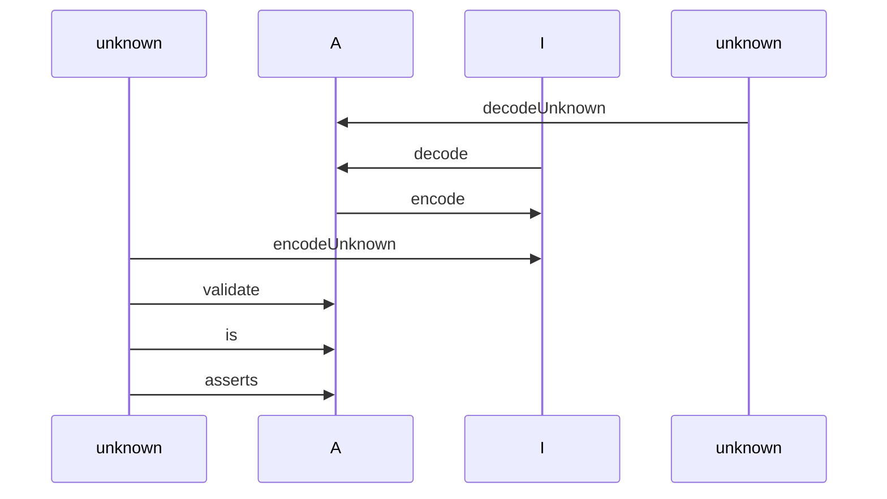
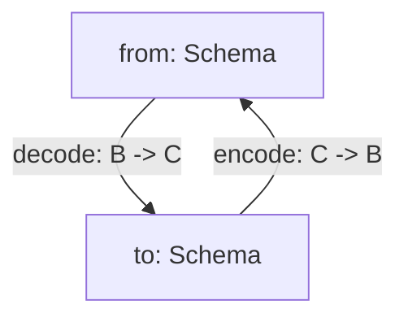
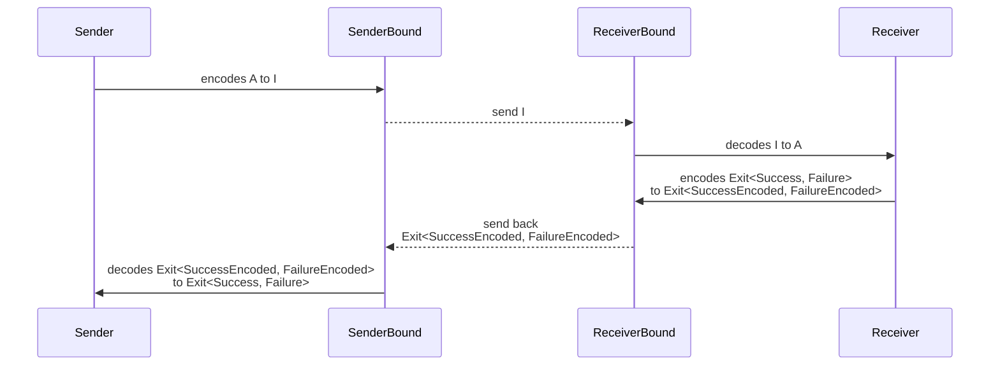

# Introduction

Welcome to the documentation for `@effect/schema`, **a library for defining and using schemas** to validate and transform data in TypeScript.

`@effect/schema` allows you to define a `Schema<Type, Encoded, Context>` that provides a blueprint for describing the structure and data types of your data. Once defined, you can leverage this schema to perform a range of operations, including:

| Operation       | Description                                                                                                    |
| --------------- | -------------------------------------------------------------------------------------------------------------- |
| Decoding        | Transforming data from an input type `Encoded` to an output type `Type`.                                       |
| Encoding        | Converting data from an output type `Type` back to an input type `Encoded`.                                    |
| Asserting       | Verifying that a value adheres to the schema's output type `Type`.                                             |
| Arbitraries     | Generate arbitraries for [fast-check](https://github.com/dubzzz/fast-check) testing.                           |
| Pretty printing | Support pretty printing for data structures.                                                                   |
| JSON Schemas    | Create JSON Schemas based on defined schemas.                                                                  |
| Equivalence     | Create [Equivalences](https://effect-ts.github.io/effect/schema/Equivalence.ts.html) based on defined schemas. |

If you're eager to learn how to define your first schema, jump straight to the [**Basic usage**](#basic-usage) section!

## The Schema Type

The `Schema<Type, Encoded, Context>` type represents an immutable value that describes the structure of your data.

The `Schema` type has three type parameters with the following meanings:

- **Type**. Represents the type of value that a schema can succeed with during decoding.
- **Encoded**. Represents the type of value that a schema can succeed with during encoding. By default, it's equal to `Type` if not explicitly provided.
- **Context**. Similar to the [`Effect`](https://effect.website/docs/guides/essentials/the-effect-type) type, it represents the contextual data required by the schema to execute both decoding and encoding. If this type parameter is `never` (default if not explicitly provided), it means the schema has no requirements.

**Examples**

- `Schema<string>` (defaulted to `Schema<string, string, never>`) represents a schema that decodes to `string`, encodes to `string`, and has no requirements.
- `Schema<number, string>` (defaulted to `Schema<number, string, never>`) represents a schema that decodes to `number` from `string`, encodes a `number` to a `string`, and has no requirements.

> [!NOTE]
> In the Effect ecosystem, you may often encounter the type parameters of `Schema` abbreviated as `A`, `I`, and `R` respectively. This is just shorthand for the type value of type **A**, **I**nput, and **R**equirements.

`Schema` values are immutable, and all `@effect/schema` functions produce new `Schema` values.

`Schema` values do not actually do anything, they are just values that model or describe the structure of your data.

`Schema` values don't perform any actions themselves; they simply describe the structure of your data. A `Schema` can be interpreted by various "compilers" into specific operations, depending on the compiler type (decoding, encoding, pretty printing, arbitraries, etc.).

## Understanding Decoding and Encoding



We'll break down these concepts using an example with a `Schema<Date, string, never>`. This schema serves as a tool to transform a `string` into a `Date` and vice versa.

**Encoding**

When we talk about "encoding," we are referring to the process of changing a `Date` into a `string`. To put it simply, it's the act of converting data from one format to another.

**Decoding**

Conversely, "decoding" entails transforming a `string` back into a `Date`. It's essentially the reverse operation of encoding, where data is returned to its original form.

**Decoding From Unknown**

Decoding from `unknown` involves two key steps:

1. **Checking:** Initially, we verify that the input data (which is of the `unknown` type) matches the expected structure. In our specific case, this means ensuring that the input is indeed a `string`.

2. **Decoding:** Following the successful check, we proceed to convert the `string` into a `Date`. This process completes the decoding operation, where the data is both validated and transformed.

**Encoding From Unknown**

Encoding from `unknown` involves two key steps:

1. **Checking:** Initially, we verify that the input data (which is of the `unknown` type) matches the expected structure. In our specific case, this means ensuring that the input is indeed a `Date`.

2. **Encoding:** Following the successful check, we proceed to convert the `Date` into a `string`. This process completes the encoding operation, where the data is both validated and transformed.

> [!NOTE]
> As a general rule, schemas should be defined such that encode + decode return the original value.

### Recap

- **Decoding:** Used for parsing data from external sources where you have no control over the data format.
- **Encoding:** Used when sending data out to external sources, converting it to a format that is expected by those sources.

For instance, when working with forms in the frontend, you often receive untyped data in the form of strings. This data can be tampered with and does not natively support arrays or booleans. Decoding helps you validate and parse this data into more useful types like numbers, dates, and arrays. Encoding allows you to convert these types back into the string format expected by forms.

By understanding these processes, you can ensure that your data handling is robust and reliable, converting data safely between different formats.

## The Rule of Schemas: Keeping Encode and Decode in Sync

When working with schemas, there's an important rule to keep in mind: your schemas should be crafted in a way that when you perform both encoding and decoding operations, you should end up with the original value.

In simpler terms, if you encode a value and then immediately decode it, the result should match the original value you started with. This rule ensures that your data remains consistent and reliable throughout the encoding and decoding process.

# Requirements

- TypeScript 5.0 or newer
- The `strict` flag enabled in your `tsconfig.json` file
- The `exactOptionalPropertyTypes` flag enabled in your `tsconfig.json` file
  ```
  {
    // ...
    "compilerOptions": {
      // ...
      "strict": true,
      "exactOptionalPropertyTypes": true
    }
  }
  ```
- Additionally, make sure to install the following packages, as they are peer dependencies. Note that some package managers might not install peer dependencies by default, so you need to install them manually:
  - `effect` package (peer dependency)
  - [fast-check](https://github.com/dubzzz/fast-check) package (peer dependency)

## Understanding `exactOptionalPropertyTypes`

The `@effect/schema` library takes advantage of the `exactOptionalPropertyTypes` option of `tsconfig.json`. This option affects how optional properties are typed (to learn more about this option, you can refer to the official [TypeScript documentation](https://www.typescriptlang.org/tsconfig#exactOptionalPropertyTypes)).

Let's delve into this with an example.

**With `exactOptionalPropertyTypes` Enabled**

```ts
import { Schema } from "@effect/schema"

const Person = Schema.Struct({
  name: Schema.optional(Schema.String.pipe(Schema.nonEmpty()), {
    exact: true
  })
})

/*
type Type = {
    readonly name?: string; // the type is strict (no `| undefined`)
}
*/
type Type = Schema.Schema.Type<typeof Person>

Schema.decodeSync(Person)({ name: undefined })
/*
TypeScript Error:
Argument of type '{ name: undefined; }' is not assignable to parameter of type '{ readonly name?: string; }' with 'exactOptionalPropertyTypes: true'. Consider adding 'undefined' to the types of the target's properties.
  Types of property 'name' are incompatible.
    Type 'undefined' is not assignable to type 'string'.ts(2379)
*/
```

Here, notice that the type of `name` is "exact" (`string`), which means the type checker will catch any attempt to assign an invalid value (like `undefined`).

**With `exactOptionalPropertyTypes` Disabled**

If, for some reason, you can't enable the `exactOptionalPropertyTypes` option (perhaps due to conflicts with other third-party libraries), you can still use `@effect/schema`. However, there will be a mismatch between the types and the runtime behavior:

```ts
import { Schema } from "@effect/schema"

const Person = Schema.Struct({
  name: Schema.optional(Schema.String.pipe(Schema.nonEmpty()), {
    exact: true
  })
})

/*
type Type = {
    readonly name?: string | undefined; // the type is widened to string | undefined
}
*/
type Type = Schema.Schema.Type<typeof Person>

Schema.decodeSync(Person)({ name: undefined }) // No type error, but a decoding failure occurs
/*
Error: { name?: a non empty string }
└─ ["name"]
   └─ a non empty string
      └─ From side refinement failure
         └─ Expected a string, actual undefined
*/
```

In this case, the type of `name` is widened to `string | undefined`, which means the type checker won't catch the invalid value (`undefined`). However, during decoding, you'll encounter an error, indicating that `undefined` is not allowed.

# Getting started

To install the **alpha** version:

```
npm install @effect/schema
```

Additionally, make sure to install the following packages, as they are peer dependencies. Note that some package managers might not install peer dependencies by default, so you need to install them manually:

- `effect` package (peer dependency)

> [!WARNING]
> This package is primarily published to receive early feedback and for contributors, during this development phase we cannot guarantee the stability of the APIs, consider each **minor** release to contain breaking changes.

Once you have installed the library, you can import the necessary types and functions from the `@effect/schema/Schema` module.

**Example** (Namespace Import)

```ts
import * as Schema from "@effect/schema/Schema"
```

**Example** (Named Import)

```ts
import { Schema } from "@effect/schema"
```

## Defining a schema

One common way to define a `Schema` is by utilizing the `struct` constructor provided by `@effect/schema`. This function allows you to create a new `Schema` that outlines an object with specific properties. Each property in the object is defined by its own `Schema`, which specifies the data type and any validation rules.

For example, consider the following `Schema` that describes a person object with a `name` property of type `string` and an `age` property of type `number`:

```ts
import { Schema } from "@effect/schema"

const Person = Schema.Struct({
  name: Schema.String,
  age: Schema.Number
})
```

> [!NOTE]
> It's important to note that by default, most constructors exported by `@effect/schema` return `readonly` types. For instance, in the `Person` schema above, the resulting type would be `{ readonly name: string; readonly age: number; }`.

## Extracting Inferred Types

### Type

Once you've defined a `Schema<A, I, R>`, you can extract the inferred type `A`, which represents the data described by the schema, in two ways:

- Using the `Schema.Schema.Type` utility.
- Using the `Type` field defined on your schema.

For example, you can extract the inferred type of a `Person` object as demonstrated below:

```ts
import { Schema } from "@effect/schema"

const Person = Schema.Struct({
  name: Schema.String,
  age: Schema.NumberFromString
})

// 1. Using the Schema.Type utility
type Person = Schema.Schema.Type<typeof Person>
/*
Equivalent to:
interface Person {
  readonly name: string;
  readonly age: number;
}
*/

// 2. Using the `Type` field
type Person2 = typeof Person.Type
```

Alternatively, you can define the `Person` type using the `interface` keyword:

```ts
interface Person extends Schema.Schema.Type<typeof Person> {}
/*
Equivalent to:
type Person {
  readonly name: string;
  readonly age: number;
}
*/
```

Both approaches yield the same result, but using an interface provides benefits such as performance advantages and improved readability.

### Encoded

In cases where in a `Schema<A, I>` the `I` type differs from the `A` type, you can also extract the inferred `I` type using the `Schema.Encoded` utility (or the `Encoded` field defined on your schema).

```ts
import { Schema } from "@effect/schema"

const Person = Schema.Struct({
  name: Schema.String,
  age: Schema.NumberFromString
})

// 1. Using the Schema.Encoded utility
type PersonEncoded = Schema.Schema.Encoded<typeof Person>
/*
type PersonEncoded = {
    readonly name: string;
    readonly age: string;
}
*/

// 2. Using the `Encoded` field
type PersonEncoded2 = typeof Person.Encoded
```

### Context

You can also extract the inferred type `R` that represents the context described by the schema using the `Schema.Context` utility:

```ts
import { Schema } from "@effect/schema"

const Person = Schema.Struct({
  name: Schema.String,
  age: Schema.NumberFromString
})

// type PersonContext = never
type PersonContext = Schema.Schema.Context<typeof Person>
```

### Advanced extracting Inferred Types

To create a schema with an opaque type, you can use the following technique that re-declares the schema:

```ts
import { Schema } from "@effect/schema"

const _Person = Schema.Struct({
  name: Schema.String,
  age: Schema.Number
})

interface Person extends Schema.Schema.Type<typeof _Person> {}

// Re-declare the schema to create a schema with an opaque type
const Person: Schema.Schema<Person> = _Person
```

Alternatively, you can use the `Class` APIs (see the [Class](#classes) section below for more details).

Note that the technique shown above becomes more complex when the schema is defined such that `A` is different from `I`. For example:

```ts
import { Schema } from "@effect/schema"

const _Person = Schema.Struct({
  name: Schema.String,
  age: Schema.NumberFromString
})

interface Person extends Schema.Schema.Type<typeof _Person> {}

interface PersonEncoded extends Schema.Schema.Encoded<typeof _Person> {}

// Re-declare the schema to create a schema with an opaque type
const Person: Schema.Schema<Person, PersonEncoded> = _Person
```

In this case, the field `"age"` is of type `string` in the `Encoded` type of the schema and is of type `number` in the `Type` type of the schema. Therefore, we need to define **two** interfaces (`PersonEncoded` and `Person`) and use both to redeclare our final schema `Person`.

## Decoding From Unknown Values

When working with unknown data types in TypeScript, decoding them into a known structure can be challenging. Luckily, `@effect/schema` provides several functions to help with this process. Let's explore how to decode unknown values using these functions.

### Using `decodeUnknown*` Functions

The `@effect/schema/Schema` module offers a variety of `decodeUnknown*` functions, each tailored for different decoding scenarios:

- `decodeUnknownSync`: Synchronously decodes a value and throws an error if parsing fails.
- `decodeUnknownOption`: Decodes a value and returns an `Option` type.
- `decodeUnknownEither`: Decodes a value and returns an `Either` type.
- `decodeUnknownPromise`: Decodes a value and returns a `Promise`.
- `decodeUnknown`: Decodes a value and returns an `Effect`.

**Example** (Using `decodeUnknownSync`)

Let's begin with an example using the `decodeUnknownSync` function. This function is useful when you want to parse a value and immediately throw an error if the parsing fails.

```ts
import { Schema } from "@effect/schema"

const Person = Schema.Struct({
  name: Schema.String,
  age: Schema.Number
})

// Simulate an unknown input
const input: unknown = { name: "Alice", age: 30 }

console.log(Schema.decodeUnknownSync(Person)(input))
// Output: { name: 'Alice', age: 30 }

console.log(Schema.decodeUnknownSync(Person)(null))
/*
throws:
Error: Expected { readonly name: string; readonly age: number }, actual null
*/
```

**Example** (Using `decodeUnknownEither`)

Now, let's see how to use the `decodeUnknownEither` function, which returns an `Either` type representing success or failure.

```ts
import { Schema } from "@effect/schema"
import { Either } from "effect"

const Person = Schema.Struct({
  name: Schema.String,
  age: Schema.Number
})

const decode = Schema.decodeUnknownEither(Person)

// Simulate an unknown input
const input: unknown = { name: "Alice", age: 30 }

const result1 = decode(input)
if (Either.isRight(result1)) {
  console.log(result1.right)
  /*
  Output:
  { name: "Alice", age: 30 }
  */
}

const result2 = decode(null)
if (Either.isLeft(result2)) {
  console.log(result2.left)
  /*
  Output:
  {
    _id: 'ParseError',
    message: 'Expected { readonly name: string; readonly age: number }, actual null'
  }
  */
}
```

The `decode` function returns an `Either<A, ParseError>`, where `ParseError` is defined as follows:

```ts
interface ParseError {
  readonly _tag: "ParseError"
  readonly issue: ParseIssue
}
```

Here, `ParseIssue` represents an error that might occur during the parsing process. It is wrapped in a tagged error to make it easier to catch errors using `Effect.catchTag`. The result `Either<A, ParseError>` contains the inferred data type described by the schema. A successful parse yields a `Right` value with the parsed data `A`, while a failed parse results in a `Left` value containing a `ParseError`.

### Handling Async Transformations

When your schema involves asynchronous transformations, neither the `decodeUnknownSync` nor the `decodeUnknownEither` functions will work for you. In such cases, you must turn to the `decodeUnknown` function, which returns an `Effect`.

```ts
import { Schema } from "@effect/schema"
import { Effect } from "effect"

const PersonId = Schema.Number

const Person = Schema.Struct({
  id: PersonId,
  name: Schema.String,
  age: Schema.Number
})

const asyncSchema = Schema.transformOrFail(PersonId, Person, {
  strict: true,
  // Simulate an async transformation
  decode: (id) =>
    Effect.succeed({ id, name: "name", age: 18 }).pipe(
      Effect.delay("10 millis")
    ),
  encode: (person) => Effect.succeed(person.id).pipe(Effect.delay("10 millis"))
})

const syncParsePersonId = Schema.decodeUnknownEither(asyncSchema)

console.log(JSON.stringify(syncParsePersonId(1), null, 2))
/*
Output:
{
  "_id": "Either",
  "_tag": "Left",
  "left": {
    "_id": "ParseError",
    "message": "(number <-> { readonly id: number; readonly name: string; readonly age: number })\n└─ cannot be be resolved synchronously, this is caused by using runSync on an effect that performs async work"
  }
}
*/

const asyncParsePersonId = Schema.decodeUnknown(asyncSchema)

Effect.runPromise(asyncParsePersonId(1)).then(console.log)
/*
Output:
{ id: 1, name: 'name', age: 18 }
*/
```

As shown in the code above, the first approach returns a `Forbidden` error, indicating that using `decodeUnknownEither` with an async transformation is not allowed. However, the second approach works as expected, allowing you to handle async transformations and return the desired result.

### Parse Options

#### Excess properties

When using a `Schema` to parse a value, by default any properties that are not specified in the `Schema` will be stripped out from the output. This is because the `Schema` is expecting a specific shape for the parsed value, and any excess properties do not conform to that shape.

However, you can use the `onExcessProperty` option (default value: `"ignore"`) to trigger a parsing error. This can be particularly useful in cases where you need to detect and handle potential errors or unexpected values.

Here's an example of how you might use `onExcessProperty` set to `"error"`:

```ts
import { Schema } from "@effect/schema"

const Person = Schema.Struct({
  name: Schema.String,
  age: Schema.Number
})

console.log(
  Schema.decodeUnknownSync(Person)({
    name: "Bob",
    age: 40,
    email: "bob@example.com"
  })
)
/*
Output:
{ name: 'Bob', age: 40 }
*/

Schema.decodeUnknownSync(Person)(
  {
    name: "Bob",
    age: 40,
    email: "bob@example.com"
  },
  { onExcessProperty: "error" }
)
/*
throws
Error: { readonly name: string; readonly age: number }
└─ ["email"]
   └─ is unexpected, expected "name" | "age"
*/
```

If you want to allow excess properties to remain, you can use `onExcessProperty` set to `"preserve"`:

```ts
import { Schema } from "@effect/schema"

const Person = Schema.Struct({
  name: Schema.String,
  age: Schema.Number
})

console.log(
  Schema.decodeUnknownSync(Person)(
    {
      name: "Bob",
      age: 40,
      email: "bob@example.com"
    },
    { onExcessProperty: "preserve" }
  )
)
/*
{ email: 'bob@example.com', name: 'Bob', age: 40 }
*/
```

> [!NOTE]
> The [`onExcessProperty`](#excess-properties) and [`error`](#all-errors) options also affect encoding.

#### All errors

The `errors` option allows you to receive all parsing errors when attempting to parse a value using a schema. By default only the first error is returned, but by setting the `errors` option to `"all"`, you can receive all errors that occurred during the parsing process. This can be useful for debugging or for providing more comprehensive error messages to the user.

Here's an example of how you might use `errors`:

```ts
import { Schema } from "@effect/schema"

const Person = Schema.Struct({
  name: Schema.String,
  age: Schema.Number
})

Schema.decodeUnknownSync(Person)(
  {
    name: "Bob",
    age: "abc",
    email: "bob@example.com"
  },
  { errors: "all", onExcessProperty: "error" }
)
/*
throws
Error: { readonly name: string; readonly age: number }
├─ ["email"]
│  └─ is unexpected, expected "name" | "age"
└─ ["age"]
   └─ Expected a number, actual "abc"
*/
```

> [!NOTE]
> The [`onExcessProperty`](#excess-properties) and [`error`](#all-errors) options also affect encoding.

#### Managing Property Order

The `propertyOrder` option provides control over the order of object fields in the output. This feature is particularly useful when the sequence of keys is important for the consuming processes or when maintaining the input order enhances readability and usability.

By default, the `propertyOrder` option is set to `"none"`. This means that the internal system decides the order of keys to optimize parsing speed. The order of keys in this mode should not be considered stable, and it's recommended not to rely on key ordering as it may change in future updates without notice.

Setting `propertyOrder` to `"original"` ensures that the keys are ordered as they appear in the input during the decoding/encoding process.

**Example** (Synchronous Decoding)

```ts
import { Schema } from "@effect/schema"

const schema = Schema.Struct({
  a: Schema.Number,
  b: Schema.Literal("b"),
  c: Schema.Number
})

// Decoding an object synchronously without specifying the property order
console.log(Schema.decodeUnknownSync(schema)({ b: "b", c: 2, a: 1 }))
// Output decided internally: { b: 'b', a: 1, c: 2 }

// Decoding an object synchronously while preserving the order of properties as in the input
console.log(
  Schema.decodeUnknownSync(schema)(
    { b: "b", c: 2, a: 1 },
    { propertyOrder: "original" }
  )
)
// Output preserving input order: { b: 'b', c: 2, a: 1 }
```

**Example** (Asynchronous Decoding)

```ts
import { ParseResult, Schema } from "@effect/schema"
import type { Duration } from "effect"
import { Effect } from "effect"

// Function to simulate an asynchronous process within the schema
const effectify = (duration: Duration.DurationInput) =>
  Schema.Number.pipe(
    Schema.transformOrFail(Schema.Number, {
      strict: true,
      decode: (x) =>
        Effect.sleep(duration).pipe(Effect.andThen(ParseResult.succeed(x))),
      encode: ParseResult.succeed
    })
  )

// Define a structure with asynchronous behavior in each field
const schema = Schema.Struct({
  a: effectify("200 millis"),
  b: effectify("300 millis"),
  c: effectify("100 millis")
}).annotations({ concurrency: 3 })

// Decoding data asynchronously without preserving order
Schema.decode(schema)({ a: 1, b: 2, c: 3 })
  .pipe(Effect.runPromise)
  .then(console.log)
// Output decided internally: { c: 3, a: 1, b: 2 }

// Decoding data asynchronously while preserving the original input order
Schema.decode(schema)({ a: 1, b: 2, c: 3 }, { propertyOrder: "original" })
  .pipe(Effect.runPromise)
  .then(console.log)
// Output preserving input order: { a: 1, b: 2, c: 3 }
```

#### Customizing Parsing Behavior at the Schema Level

You can tailor parse options for each schema using the `parseOptions` annotation. These options allow for specific parsing behavior at various levels of the schema hierarchy, overriding any parent settings and cascading down to nested schemas.

```ts
import { Schema } from "@effect/schema"
import { Either } from "effect"

const schema = Schema.Struct({
  a: Schema.Struct({
    b: Schema.String,
    c: Schema.String
  }).annotations({
    title: "first error only",
    parseOptions: { errors: "first" } // Only the first error in this sub-schema is reported
  }),
  d: Schema.String
}).annotations({
  title: "all errors",
  parseOptions: { errors: "all" } // All errors in the main schema are reported
})

const result = Schema.decodeUnknownEither(schema)(
  { a: {} },
  { errors: "first" }
)
if (Either.isLeft(result)) {
  console.log(result.left.message)
}
/*
all errors
├─ ["d"]
│  └─ is missing
└─ ["a"]
   └─ first error only
      └─ ["b"]
         └─ is missing
*/
```

**Detailed Output Explanation:**

In this example:

- The main schema is configured to display all errors. Hence, you will see errors related to both the `d` field (since it's missing) and any errors from the `a` subschema.
- The subschema (`a`) is set to display only the first error. Although both `b` and `c` fields are missing, only the first missing field (`b`) is reported.

### Managing Missing Properties

When using the `@effect/schema` library to handle data structures, it's important to understand how missing properties are processed. By default, if a property is not present in the input, it is treated as if it were present with an `undefined` value.

```ts
import { Schema } from "@effect/schema"

const schema = Schema.Struct({ a: Schema.Unknown })
const input = {}

console.log(Schema.decodeUnknownSync(schema)(input)) // Output: { a: undefined }
```

In this example, although the key `"a"` is not present in the input, it is treated as `{ a: undefined }` by default.

If your validation logic needs to distinguish between truly missing properties and those that are explicitly undefined, you can enable the `exact` option:

```ts
import { Schema } from "@effect/schema"

const schema = Schema.Struct({ a: Schema.Unknown })
const input = {}

console.log(Schema.decodeUnknownSync(schema)(input, { exact: true }))
/*
throws
Error: { readonly a: unknown }
└─ ["a"]
   └─ is missing
*/
```

For the APIs `is` and `asserts`, however, the default behavior is to treat missing properties strictly, where the default for `exact` is `true`:

```ts
import type { AST } from "@effect/schema"
import { Schema } from "@effect/schema"

const schema = Schema.Struct({ a: Schema.Unknown })
const input = {}

console.log(Schema.is(schema)(input)) // Output: false
console.log(Schema.is(schema)(input, { exact: false })) // Output: true

const asserts: (
  u: unknown,
  overrideOptions?: AST.ParseOptions
) => asserts u is {
  readonly a: unknown
} = Schema.asserts(schema)

try {
  asserts(input)
  console.log("asserts passed")
} catch (e: any) {
  console.error("asserts failed")
  console.error(e.message)
}
/*
Output:
asserts failed
{ readonly a: unknown }
└─ ["a"]
  └─ is missing
*/

try {
  asserts(input, { exact: false })
  console.log("asserts passed")
} catch (e: any) {
  console.error("asserts failed")
  console.error(e.message)
}
// Output: asserts passed
```

## Encoding

The `@effect/schema/Schema` module provides several `encode*` functions to encode data according to a schema:

- `encodeSync`: Synchronously encodes data and throws an error if encoding fails.
- `encodeOption`: Encodes data and returns an `Option` type.
- `encodeEither`: Encodes data and returns an `Either` type representing success or failure.
- `encodePromise`: Encodes data and returns a `Promise`.
- `encode`: Encodes data and returns an `Effect`.

Let's consider an example where we have a schema for a `Person` object with a `name` property of type `string` and an `age` property of type `number`.

```ts
import * as S from "@effect/schema/Schema"

import { Schema } from "@effect/schema"

// Age is a schema that can decode a string to a number and encode a number to a string
const Age = Schema.NumberFromString

const Person = Schema.Struct({
  name: Schema.NonEmpty,
  age: Age
})

console.log(Schema.encodeSync(Person)({ name: "Alice", age: 30 }))
// Output: { name: 'Alice', age: '30' }

console.log(Schema.encodeSync(Person)({ name: "", age: 30 }))
/*
throws:
Error: { readonly name: NonEmpty; readonly age: NumberFromString }
└─ ["name"]
   └─ NonEmpty
      └─ Predicate refinement failure
         └─ Expected NonEmpty (a non empty string), actual ""
*/
```

Note that during encoding, the number value `30` was converted to a string `"30"`.

> [!NOTE]
> The [`onExcessProperty`](#excess-properties) and [`error`](#all-errors) options also affect encoding.

### Handling Unsupported Encoding

Although it is generally recommended to define schemas that support both decoding and encoding, there are situations where encoding support might be impossible. In such cases, the `Forbidden` error can be used to handle unsupported encoding.

Here is an example of a transformation that never fails during decoding. It returns an `Either` containing either the decoded value or the original input. For encoding, it is reasonable to not support it and use `Forbidden` as the result.

```ts
import { ParseResult, Schema } from "@effect/schema"
import { Either } from "effect"

// Define a schema that safely decodes to Either type
export const SafeDecode = <A, I>(self: Schema.Schema<A, I, never>) => {
  const decodeUnknownEither = Schema.decodeUnknownEither(self)
  return Schema.transformOrFail(
    Schema.Unknown,
    Schema.EitherFromSelf({
      left: Schema.Unknown,
      right: Schema.typeSchema(self)
    }),
    {
      strict: true,
      decode: (input) =>
        ParseResult.succeed(
          Either.mapLeft(decodeUnknownEither(input), () => input)
        ),
      encode: (actual, _, ast) =>
        Either.match(actual, {
          onLeft: () =>
            ParseResult.fail(
              new ParseResult.Forbidden(ast, actual, "cannot encode a Left")
            ),
          onRight: ParseResult.succeed
        })
    }
  )
}
```

**Explanation**

- **Decoding**: The `SafeDecode` function ensures that decoding never fails. It wraps the decoded value in an `Either`, where a successful decoding results in a `Right` and a failed decoding results in a `Left` containing the original input.

- **Encoding**: The encoding process uses the `Forbidden` error to indicate that encoding a `Left` value is not supported. Only `Right` values are successfully encoded.

## Formatting Errors

When you're working with Effect Schema and encounter errors during decoding, or encoding functions, you can format these errors in two different ways: using the `TreeFormatter` or the `ArrayFormatter`.

### TreeFormatter (default)

The `TreeFormatter` is the default method for formatting errors. It organizes errors in a tree structure, providing a clear hierarchy of issues.

Here's an example of how it works:

```ts
import { Schema, TreeFormatter } from "@effect/schema"
import { Either } from "effect"

const Person = Schema.Struct({
  name: Schema.String,
  age: Schema.Number
})

const decode = Schema.decodeUnknownEither(Person)

const result = decode({})
if (Either.isLeft(result)) {
  console.error("Decoding failed:")
  console.error(TreeFormatter.formatErrorSync(result.left))
}
/*
Decoding failed:
{ readonly name: string; readonly age: number }
└─ ["name"]
   └─ is missing
*/
```

In this example, the tree error message is structured as follows:

- `{ readonly name: string; readonly age: number }` represents the schema, providing a visual representation of the expected structure. This can be customized by using annotations like `identifier`, `title`, or `description`.
- `["name"]` points to the problematic property, in this case, the `"name"` property.
- `is missing` details the specific error for the `"name"` property.

**Example of customizing the type output**

```ts
import { Schema, TreeFormatter } from "@effect/schema"
import { Either } from "effect"

const Person = Schema.Struct({
  name: Schema.String,
  age: Schema.Number
}).annotations({ title: "Person" }) // Adding a title annotation

const result = Schema.decodeUnknownEither(Person)({})
if (Either.isLeft(result)) {
  console.error(TreeFormatter.formatErrorSync(result.left))
}
/*
Person
└─ ["name"]
   └─ is missing
*/
```

In this adjusted example, adding the `title` annotation changes how the schema is represented in the error message.

**Handling Multiple Errors**

By default, decoding functions like `decodeUnknownEither` return only the first encountered error. If you require a comprehensive list of all errors, you can modify the behavior by passing the `{ errors: "all" }` option:

```ts
import { Schema, TreeFormatter } from "@effect/schema"
import { Either } from "effect"

const Person = Schema.Struct({
  name: Schema.String,
  age: Schema.Number
})

const decode = Schema.decodeUnknownEither(Person, { errors: "all" })

const result = decode({})
if (Either.isLeft(result)) {
  console.error("Decoding failed:")
  console.error(TreeFormatter.formatErrorSync(result.left))
}
/*
Decoding failed:
{ readonly name: string; readonly age: number }
├─ ["name"]
│  └─ is missing
└─ ["age"]
   └─ is missing
*/
```

This adjustment ensures that the formatter displays all errors related to the input, providing a more detailed diagnostic of what went wrong.

#### ParseIssueTitle Annotation

When a decoding or encoding operation fails, it's useful to have additional details in the default error message returned by `TreeFormatter` to understand exactly which value caused the operation to fail. To achieve this, you can set an annotation that depends on the value undergoing the operation and can return an excerpt of it, making it easier to identify the problematic value. A common scenario is when the entity being validated has an `id` field. The `ParseIssueTitle` annotation facilitates this kind of analysis during error handling.

The type of the annotation is:

```ts
export type ParseIssueTitleAnnotation = (
  issue: ParseIssue
) => string | undefined
```

If you set this annotation on a schema and the provided function returns a `string`, then that string is used as the title by `TreeFormatter`, unless a `message` annotation (which has the highest priority) has also been set. If the function returns `undefined`, then the default title used by `TreeFormatter` is determined with the following priorities:

- `identifier`
- `title`
- `description`
- `ast.toString()`

**Example**

```ts
import type { ParseResult } from "@effect/schema"
import { Schema } from "@effect/schema"

const getOrderItemId = ({ actual }: ParseResult.ParseIssue) => {
  if (Schema.is(Schema.Struct({ id: Schema.String }))(actual)) {
    return `OrderItem with id: ${actual.id}`
  }
}

const OrderItem = Schema.Struct({
  id: Schema.String,
  name: Schema.String,
  price: Schema.Number
}).annotations({
  identifier: "OrderItem",
  parseIssueTitle: getOrderItemId
})

const getOrderId = ({ actual }: ParseResult.ParseIssue) => {
  if (Schema.is(Schema.Struct({ id: Schema.Number }))(actual)) {
    return `Order with id: ${actual.id}`
  }
}

const Order = Schema.Struct({
  id: Schema.Number,
  name: Schema.String,
  items: Schema.Array(OrderItem)
}).annotations({
  identifier: "Order",
  parseIssueTitle: getOrderId
})

const decode = Schema.decodeUnknownSync(Order, { errors: "all" })

// No id available, so the `identifier` annotation is used as the title
decode({})
/*
throws
Error: Order
├─ ["id"]
│  └─ is missing
├─ ["name"]
│  └─ is missing
└─ ["items"]
   └─ is missing
*/

// An id is available, so the `parseIssueTitle` annotation is used as the title
decode({ id: 1 })
/*
throws
Error: Order with id: 1
├─ ["name"]
│  └─ is missing
└─ ["items"]
   └─ is missing
*/

decode({ id: 1, items: [{ id: "22b", price: "100" }] })
/*
throws
Error: Order with id: 1
├─ ["name"]
│  └─ is missing
└─ ["items"]
   └─ ReadonlyArray<OrderItem>
      └─ [0]
         └─ OrderItem with id: 22b
            ├─ ["name"]
            │  └─ is missing
            └─ ["price"]
               └─ Expected a number, actual "100"
*/
```

In the examples above, we can see how the `parseIssueTitle` annotation helps provide meaningful error messages when decoding fails.

### ArrayFormatter

The `ArrayFormatter` offers an alternative method for formatting errors within `@effect/schema`, organizing them into a more structured and easily navigable array format. This formatter is especially useful when you need a clear overview of all issues detected during the decoding or encoding processes.

The `ArrayManager` formats errors as an array of objects, where each object represents a distinct issue and includes properties such as `_tag`, `path`, and `message`. This structured format can help developers quickly identify and address multiple issues in data processing.

Here's an example of how it works:

```ts
import { ArrayFormatter, Schema } from "@effect/schema"
import { Either } from "effect"

const Person = Schema.Struct({
  name: Schema.String,
  age: Schema.Number
})

const decode = Schema.decodeUnknownEither(Person)

const result = decode({})
if (Either.isLeft(result)) {
  console.error("Decoding failed:")
  console.error(ArrayFormatter.formatErrorSync(result.left))
}
/*
Decoding failed:
[ { _tag: 'Missing', path: [ 'name' ], message: 'is missing' } ]
*/
```

Each error is formatted as an object in an array, making it clear what the error is (`is missing`), where it occurred (`name`), and its type (`Missing`).

**Handling Multiple Errors**

By default, decoding functions like `decodeUnknownEither` return only the first encountered error. If you require a comprehensive list of all errors, you can modify the behavior by passing the `{ errors: "all" }` option:

```ts
import { ArrayFormatter, Schema } from "@effect/schema"
import { Either } from "effect"

const Person = Schema.Struct({
  name: Schema.String,
  age: Schema.Number
})

const decode = Schema.decodeUnknownEither(Person, { errors: "all" })

const result = decode({})
if (Either.isLeft(result)) {
  console.error("Decoding failed:")
  console.error(ArrayFormatter.formatErrorSync(result.left))
}
/*
Decoding failed:
[
  { _tag: 'Missing', path: [ 'name' ], message: 'is missing' },
  { _tag: 'Missing', path: [ 'age' ], message: 'is missing' }
]
*/
```

### React Hook Form

If you are working with React and need form validation, `@hookform/resolvers` offers an adapter for `@effect/schema`, which can be integrated with React Hook Form for enhanced form validation processes. This integration allows you to leverage the powerful features of `@effect/schema` within your React applications.

For more detailed instructions and examples on how to integrate `@effect/schema` with React Hook Form using `@hookform/resolvers`, you can visit the official npm package page:
[React Hook Form Resolvers](https://www.npmjs.com/package/@hookform/resolvers#effect-ts)

## Type Guards

The `Schema.is` function provided by the `@effect/schema/Schema` module represents a way of verifying that a value conforms to a given `Schema`. It functions as a [type guard](https://www.typescriptlang.org/docs/handbook/2/narrowing.html#using-type-predicates), taking a value of type `unknown` and determining if it matches the structure and type constraints defined in the schema.

Here's how the `Schema.is` function works

1. **Schema Definition**: Define a schema to describe the structure and constraints of the data type you expect. For instance, `Schema<A, I, R>` where `A` is the desired type.

2. **Type Guard Creation**: Convert the schema into a user-defined type guard `(u: unknown) => u is A`. This allows you to assert at runtime whether a value meets the specified schema.

The type `I`, typically used in schema transformations, does not influence the generation of the type guard. The primary focus is on ensuring that the input conforms to the desired type `A`.

**Example Usage**:

```ts
import { Schema } from "@effect/schema"

const Person = Schema.Struct({
  name: Schema.String,
  age: Schema.Number
})

/*
const isPerson: (a: unknown, options?: number | ParseOptions) => a is {
    readonly name: string;
    readonly age: number;
}
*/
const isPerson = Schema.is(Person)

console.log(isPerson({ name: "Alice", age: 30 })) // true
console.log(isPerson(null)) // false
console.log(isPerson({})) // false
```

## Assertions

While type guards verify and inform about type conformity, the `Schema.asserts` function takes it a step further by asserting that an input matches the schema `A` type (from `Schema<A, I, R>`). If the input does not match, it throws a detailed error.

**Example Usage**:

```ts
import { Schema } from "@effect/schema"

const Person = Schema.Struct({
  name: Schema.String,
  age: Schema.Number
})

// equivalent to: (input: unknown, options?: ParseOptions) => asserts input is { readonly name: string; readonly age: number; }
const assertsPerson: Schema.Schema.ToAsserts<typeof Person> =
  Schema.asserts(Person)

try {
  assertsPerson({ name: "Alice", age: "30" })
} catch (e) {
  console.error("The input does not match the schema:")
  console.error(e)
}
/*
The input does not match the schema:
Error: { readonly name: string; readonly age: number }
└─ ["age"]
   └─ Expected a number, actual "30"
*/

// this will not throw an error
assertsPerson({ name: "Alice", age: 30 })
```

## Generating Arbitraries

The `make` function within the `@effect/schema/Arbitrary` module allows for the creation of random values that align with a specific `Schema<A, I, R>`. This utility returns an `Arbitrary<A>` from the [fast-check](https://github.com/dubzzz/fast-check) library, which is particularly useful for generating random test data that adheres to the defined schema constraints.

```ts
import { Arbitrary, FastCheck, Schema } from "@effect/schema"

const Person = Schema.Struct({
  name: Schema.NonEmpty,
  age: Schema.NumberFromString.pipe(Schema.int(), Schema.between(0, 200))
})

/*
FastCheck.Arbitrary<{
    readonly name: string;
    readonly age: number;
}>
*/
const PersonArbitraryType = Arbitrary.make(Person)

console.log(FastCheck.sample(PersonArbitraryType, 2))
/*
Example Output:
[ { name: 'q r', age: 1 }, { name: '&|', age: 133 } ]
*/

/*
Arbitrary for the "Encoded" type:
FastCheck.Arbitrary<{
    readonly name: string;
    readonly age: string;
}>
*/
const PersonArbitraryEncoded = Arbitrary.make(Schema.encodedSchema(Person))

console.log(FastCheck.sample(PersonArbitraryEncoded, 2))
/*
Example Output:
[ { name: 'key', age: '' }, { name: 'Gm', age: 'q' } ]
*/
```

### Understanding Schema Transformations and Arbitrary Generation

The generation of arbitrary data requires a clear understanding of how transformations and filters are applied within a schema:

- **Transformations and Filters**: Only the filters applied after the last transformation in the transformation chain are considered during arbitrary generation.

```ts
import { Arbitrary, FastCheck, Schema } from "@effect/schema"

const schema1 = Schema.compose(Schema.NonEmpty, Schema.Trim).pipe(
  Schema.maxLength(500)
)
// Might output empty strings despite `NonEmpty` due to filter order.
console.log(FastCheck.sample(Arbitrary.make(schema1), 10))

const schema2 = Schema.Trim.pipe(Schema.nonEmpty(), Schema.maxLength(500))
// Ensures no empty strings, correctly applying `nonEmpty()`.
console.log(FastCheck.sample(Arbitrary.make(schema2), 10))
```

**Explanation:**

- **Schema 1**: Considers the `Schema.maxLength(500)` because it follows the `Schema.Trim` transformation but disregards `Schema.NonEmpty` as it comes before any transformations.
- **Schema 2**: Properly adheres to all applied filters by ensuring they follow transformations, thus avoiding the generation of undesired data.

**Best Practices**

Organize transformations and filters to ensure clarity and effectiveness in data generation. Follow the pattern: `(I filters) -> (transformations) -> (A filters)` where "I" and "A" stand for the initial and transformed types in the schema.

"I" and "A" represent the initial and final types in the schema, ensuring that each stage of data processing is clearly defined.

Instead of indiscriminately combining transformations and filters:

```ts
import { Schema } from "@effect/schema"

// Less optimal mixing of transformations and filters
const schema = Schema.compose(
  // transformation + filter
  Schema.Lowercase,
  // transformation + filter
  Schema.Trim
)
```

Prefer separating transformation steps from filter applications:

```ts
import { Schema } from "@effect/schema"

// Recommended approach: Separate transformations from filters
const schema = Schema.transform(
  Schema.String,
  Schema.String.pipe(Schema.trimmed(), Schema.lowercased()),
  {
    strict: true,
    decode: (s) => s.trim().toLowerCase(),
    encode: (s) => s
  }
)
```

### Customizations

You can customize the output by using the `arbitrary` annotation:

```ts
import { Arbitrary, FastCheck, Schema } from "@effect/schema"

const schema = Schema.Number.annotations({
  arbitrary: () => (fc) => fc.nat()
})

const arb = Arbitrary.make(schema)

console.log(FastCheck.sample(arb, 2))
// Output: [ 1139348969, 749305462 ]
```

> [!WARNING]
> Customizing a schema can disrupt previously applied filters. Filters set after the customization will remain effective, while those applied before will be disregarded.

**Example**

```ts
import { Arbitrary, FastCheck, Schema } from "@effect/schema"

// Here, the 'positive' filter is overridden by the custom arbitrary definition
const problematic = Schema.Number.pipe(Schema.positive()).annotations({
  arbitrary: () => (fc) => fc.integer()
})

console.log(FastCheck.sample(Arbitrary.make(problematic), 2))
// Example Output: [ -1600163302, -6 ]

// Here, the 'positive' filter is applied after the arbitrary customization, ensuring it is considered
const improved = Schema.Number.annotations({
  arbitrary: () => (fc) => fc.integer()
}).pipe(Schema.positive())

console.log(FastCheck.sample(Arbitrary.make(improved), 2))
// Example Output: [ 7, 1518247613 ]
```

## Pretty print

The `make` function provided by the `@effect/schema/Pretty` module represents a way of pretty-printing values that conform to a given `Schema`.

You can use the `make` function to create a human-readable string representation of a value that conforms to a `Schema`. This can be useful for debugging or logging purposes, as it allows you to easily inspect the structure and data types of the value.

```ts
import { Pretty, Schema } from "@effect/schema"

const Person = Schema.Struct({
  name: Schema.String,
  age: Schema.Number
})

const PersonPretty = Pretty.make(Person)

// returns a string representation of the object
console.log(PersonPretty({ name: "Alice", age: 30 }))
/*
Output:
'{ "name": "Alice", "age": 30 }'
*/
```

### Customizations

You can customize the output using the `pretty` annotation:

```ts
import { Pretty, Schema } from "@effect/schema"

const schema = Schema.Number.annotations({
  pretty: () => (n) => `my format: ${n}`
})

console.log(Pretty.make(schema)(1)) // my format: 1
```

## Generating JSON Schemas

The `make` function from the `@effect/schema/JSONSchema` module enables you to create a JSON Schema based on a defined schema:

```ts
import { JSONSchema, Schema } from "@effect/schema"

const Person = Schema.Struct({
  name: Schema.NonEmpty,
  age: Schema.Number
})

const jsonSchema = JSONSchema.make(Person)

console.log(JSON.stringify(jsonSchema, null, 2))
/*
Output:
{
  "$schema": "http://json-schema.org/draft-07/schema#",
  "type": "object",
  "required": [
    "age",
    "name"
  ],
  "properties": {
    "age": {
      "type": "number",
      "description": "a number",
      "title": "number"
    },
    "name": {
      "type": "string",
      "description": "a non empty string",
      "title": "NonEmpty",
      "minLength": 1
    }
  },
  "additionalProperties": false
}
*/
```

In this example, we have created a schema for a "Person" with a name (a non-empty string) and an age (a number). We then use the `JSONSchema.make` function to generate the corresponding JSON Schema.

Note that `JSONSchema.make` attempts to produce the optimal JSON Schema for the input part of the decoding phase. This means that starting from the most nested schema, it traverses the chain, including each refinement, and stops at the first transformation found.

For instance, if we modify the schema of the `age` field:

```ts
import { JSONSchema, Schema } from "@effect/schema"

const Person = Schema.Struct({
  name: Schema.NonEmpty,
  age: Schema.Number.pipe(
    // refinement, will be included in the generated JSON Schema
    Schema.int(),
    // transformation, will be excluded in the generated JSON Schema
    Schema.clamp(1, 10)
  )
})

const jsonSchema = JSONSchema.make(Person)

console.log(JSON.stringify(jsonSchema, null, 2))
```

We can see that the new JSON Schema generated for the `age` field is of type `"integer"`, retaining the useful refinement (being an integer) and excluding the transformation (clamping between `1` and `10`):

```json
{
  "$schema": "http://json-schema.org/draft-07/schema#",
  "type": "object",
  "required": ["name", "age"],
  "properties": {
    "name": {
      "type": "string",
      "description": "a non empty string",
      "title": "NonEmpty",
      "minLength": 1
    },
    "age": {
      "type": "integer",
      "description": "an integer",
      "title": "integer"
    }
  },
  "additionalProperties": false
}
```

### Identifier Annotations

You can enhance your schemas with `identifier` annotations. If you do, your schema will be included within a "definitions" object property on the root and referenced from there:

```ts
import { JSONSchema, Schema } from "@effect/schema"

const Name = Schema.String.annotations({ identifier: "Name" })
const Age = Schema.Number.annotations({ identifier: "Age" })
const Person = Schema.Struct({
  name: Name,
  age: Age
})

const jsonSchema = JSONSchema.make(Person)

console.log(JSON.stringify(jsonSchema, null, 2))
/*
Output:
{
  "$schema": "http://json-schema.org/draft-07/schema#",
  "type": "object",
  "required": [
    "name",
    "age"
  ],
  "properties": {
    "name": {
      "$ref": "#/$defs/Name"
    },
    "age": {
      "$ref": "#/$defs/Age"
    }
  },
  "additionalProperties": false,
  "$defs": {
    "Name": {
      "type": "string",
      "description": "a string",
      "title": "string"
    },
    "Age": {
      "type": "number",
      "description": "a number",
      "title": "number"
    }
  }
}
*/
```

This technique helps organize your JSON Schema by creating separate definitions for each identifier annotated schema, making it more readable and maintainable.

### Standard JSON Schema Annotations

Standard JSON Schema annotations such as `title`, `description`, `default`, and `Examples` are supported:

```ts
import { JSONSchema, Schema } from "@effect/schema"

const schema = Schema.Struct({
  foo: Schema.optional(
    Schema.String.annotations({
      description: "an optional string field",
      title: "foo",
      examples: ["a", "b"]
    }).pipe(Schema.compose(Schema.Trim)),
    {
      default: () => ""
    }
  ).annotations({ description: "a required, trimmed string field" })
})

// Generate a JSON Schema for the input part
console.log(JSON.stringify(JSONSchema.make(schema), null, 2))
/*
Output:
{
  "$schema": "http://json-schema.org/draft-07/schema#",
  "type": "object",
  "required": [],
  "properties": {
    "foo": {
      "type": "string",
      "description": "an optional string field",
      "title": "foo",
      "examples": [
        "a",
        "b"
      ]
    }
  },
  "additionalProperties": false,
  "title": "Struct (Encoded side)"
}
*/

// Generate a JSON Schema for the output part
console.log(JSON.stringify(JSONSchema.make(Schema.typeSchema(schema)), null, 2))
/*
{
  "$schema": "http://json-schema.org/draft-07/schema#",
  "type": "object",
  "required": [
    "foo"
  ],
  "properties": {
    "foo": {
      "type": "string",
      "description": "a required string field",
      "title": "Trimmed",
      "pattern": "^.*[a-zA-Z0-9]+.*$"
    }
  },
  "additionalProperties": false,
  "title": "Struct (Type side)"
}
*/
```

### Recursive and Mutually Recursive Schemas

Recursive and mutually recursive schemas are supported, but in these cases, identifier annotations are **required**:

```ts
import { JSONSchema, Schema } from "@effect/schema"

interface Category {
  readonly name: string
  readonly categories: ReadonlyArray<Category>
}

const schema = Schema.Struct({
  name: Schema.String,
  categories: Schema.Array(
    Schema.suspend((): Schema.Schema<Category> => schema)
  )
}).annotations({ identifier: "Category" })

const jsonSchema = JSONSchema.make(schema)

console.log(JSON.stringify(jsonSchema, null, 2))
/*
Output:
{
  "$schema": "http://json-schema.org/draft-07/schema#",
  "$ref": "#/$defs/Category",
  "$defs": {
    "Category": {
      "type": "object",
      "required": [
        "name",
        "categories"
      ],
      "properties": {
        "name": {
          "type": "string",
          "description": "a string",
          "title": "string"
        },
        "categories": {
          "type": "array",
          "items": {
            "$ref": "#/$defs/Category"
          }
        }
      },
      "additionalProperties": false
    }
  }
}
*/
```

In the example above, we define a schema for a "Category" that can contain a "name" (a string) and an array of nested "categories." To support recursive definitions, we use the `S.suspend` function and identifier annotations to name our schema.

This ensures that the JSON Schema properly handles the recursive structure and creates distinct definitions for each annotated schema, improving readability and maintainability.

### Custom JSON Schema Annotations

When working with JSON Schema in the `@effect/schema` library, certain data types, such as `bigint`, lack a direct representation because JSON Schema does not natively support them. This absence typically leads to an error when the schema is generated:

```ts
import { JSONSchema, Schema } from "@effect/schema"

const schema = Schema.Struct({
  a_bigint_field: Schema.BigIntFromSelf
})

// Attempt to generate JSON Schema throws an error due to unsupported type
console.log("%o", JSONSchema.make(schema))
/*
throws:
Error: cannot build a JSON Schema for `bigint` without a JSON Schema annotation (path ["a_bigint_field"])
*/
```

To address this, you can enhance the schema with a custom annotation, defining how you intend to represent such types in JSON Schema:

```ts
import { JSONSchema, Schema } from "@effect/schema"

const schema = Schema.Struct({
  a_bigint_field: Schema.BigIntFromSelf.annotations({
    jsonSchema: { type: "some custom way to encode a bigint in JSON Schema" }
  })
})

// Now the JSON Schema generation will include the custom representation
console.log("%o", JSONSchema.make(schema))
/*
Output:
{
  '$schema': 'http://json-schema.org/draft-07/schema#',
  type: 'object',
  required: [ 'a_bigint_field', [length]: 1 ],
  properties: {
    a_bigint_field: { type: 'some custom way to encode a bigint in JSON Schema' }
  },
  additionalProperties: false
}
*/
```

When defining a **refinement** (e.g., through the `filter` function), you can attach a JSON Schema annotation to your schema containing a JSON Schema "fragment" related to this particular refinement. This fragment will be used to generate the corresponding JSON Schema. Note that if the schema consists of more than one refinement, the corresponding annotations will be merged.

> Note:
>
> The `jsonSchema` property is intentionally defined as a generic object. This allows it to describe non-standard extensions.
> As a result, the responsibility of enforcing type constraints is left to you, the user.
> If you prefer stricter type enforcement or need to support non-standard extensions, you can introduce a `satisfies` constraint on the object literal. This constraint should be used in conjunction with the typing library of your choice.
>
> In the following example, we've used the `@types/json-schema` package to provide TypeScript definitions for JSON Schema. This approach not only ensures type correctness but also enables autocomplete suggestions in your IDE.

```ts
import { JSONSchema, Schema } from "@effect/schema"
import type { JSONSchema7 } from "json-schema"

// Simulate one or more refinements
const Positive = Schema.Number.pipe(
  Schema.filter((n) => n > 0, {
    jsonSchema: { minimum: 0 } // `jsonSchema` is a generic object; you can add any key-value pair without type errors or autocomplete suggestions.
  })
)

const schema = Positive.pipe(
  Schema.filter((n) => n <= 10, {
    jsonSchema: { maximum: 10 } satisfies JSONSchema7 //  Now `jsonSchema` is constrained to fulfill the JSONSchema7 type; incorrect properties will trigger type errors, and you'll get autocomplete suggestions.
  })
)

const jsonSchema = JSONSchema.make(schema)

console.log(JSON.stringify(jsonSchema, null, 2))
/*
Output:
{
  "$schema": "http://json-schema.org/draft-07/schema#",
  "type": "number",
  "description": "a number",
  "title": "number",
  "minimum": 0,
  "maximum": 10
}
*/
```

For all other types of schema that are not refinements, the content of the annotation is used and overrides anything the system would have generated by default:

```ts
import { JSONSchema, Schema } from "@effect/schema"

const schema = Schema.Struct({ foo: Schema.String }).annotations({
  jsonSchema: { type: "object" }
})

const jsonSchema = JSONSchema.make(schema)

console.log(JSON.stringify(jsonSchema, null, 2))
/*
Output
{
  "$schema": "http://json-schema.org/draft-07/schema#",
  "type": "object"
}
the default would be:
{
  "$schema": "http://json-schema.org/draft-07/schema#",
  "type": "object",
  "required": [
    "foo"
  ],
  "properties": {
    "foo": {
      "type": "string",
      "description": "a string",
      "title": "string"
    }
  },
  "additionalProperties": false
}
*/
```

### Understanding `Schema.parseJson` in JSON Schema Generation

When utilizing `Schema.parseJson` within the `@effect/schema` library, JSON Schema generation follows a specialized approach. Instead of merely generating a JSON Schema for a string—which would be the default output representing the "from" side of the transformation defined by `Schema.parseJson`—it specifically generates the JSON Schema for the actual schema provided as an argument.

**Example of Generating JSON Schema with `Schema.parseJson`**

```ts
import { JSONSchema, Schema } from "@effect/schema"

// Define a schema that parses a JSON string into a structured object
const schema = Schema.parseJson(
  Schema.Struct({
    a: Schema.parseJson(Schema.NumberFromString) // Nested parsing from JSON string to number
  })
)

console.log(JSONSchema.make(schema))
/*
{
  '$schema': 'http://json-schema.org/draft-07/schema#',
  type: 'object',
  required: [ 'a' ],
  properties: { a: { type: 'string', description: 'a string', title: 'string' } },
  additionalProperties: false
}
*/
```

## Generating Equivalences

The `make` function, which is part of the `@effect/schema/Equivalence` module, allows you to generate an [Equivalence](https://effect-ts.github.io/effect/schema/Equivalence.ts.html) based on a schema definition:

```ts
import { Equivalence, Schema } from "@effect/schema"

const Person = Schema.Struct({
  name: Schema.String,
  age: Schema.Number
})

// $ExpectType Equivalence<{ readonly name: string; readonly age: number; }>
const PersonEquivalence = Equivalence.make(Person)

const john = { name: "John", age: 23 }
const alice = { name: "Alice", age: 30 }

console.log(PersonEquivalence(john, { name: "John", age: 23 })) // Output: true
console.log(PersonEquivalence(john, alice)) // Output: false
```

### Customizations

You can customize the output using the `equivalence` annotation:

```ts
import { Equivalence, Schema } from "@effect/schema"

const schema = Schema.String.annotations({
  equivalence: () => (a, b) => a.at(0) === b.at(0)
})

console.log(Equivalence.make(schema)("aaa", "abb")) // Output: true
```

# Basic Usage

## Cheatsheet

| Typescript Type                              | Description / Notes                      | Schema / Combinator                                       |
| -------------------------------------------- | ---------------------------------------- | --------------------------------------------------------- |
| `null`                                       |                                          | `S.Null`                                                  |
| `undefined`                                  |                                          | `S.Undefined`                                             |
| `string`                                     |                                          | `S.String`                                                |
| `number`                                     |                                          | `S.Number`                                                |
| `boolean`                                    |                                          | `S.Boolean`                                               |
| `symbol`                                     |                                          | `S.SymbolFromSelf` / `S.Symbol`                           |
| `BigInt`                                     |                                          | `S.BigIntFromSelf` / `S.BigInt`                           |
| `unknown`                                    |                                          | `S.Unknown`                                               |
| `any`                                        |                                          | `S.Any`                                                   |
| `never`                                      |                                          | `S.Never`                                                 |
| `object`                                     |                                          | `S.Object`                                                |
| `unique symbol`                              |                                          | `S.UniqueSymbolFromSelf`                                  |
| `"a"`, `1`, `true`                           | type literals                            | `S.Literal("a")`, `S.Literal(1)`, `S.Literal(true)`       |
| `a${string}`                                 | template literals                        | `S.TemplateLiteral("a", S.String)`                        |
| `{ readonly a: string, readonly b: number }` | structs                                  | `S.Struct({ a: S.String, b: S.Number })`                  |
| `{ readonly a?: string \| undefined }`       | optional fields                          | `S.Struct({ a: S.optional(S.String) })`                   |
| `{ readonly a?: string }`                    | optional fields                          | `S.Struct({ a: S.optional(S.String, { exact: true }) })`  |
| `Record<A, B>`                               | records                                  | `S.Record(A, B)`                                          |
| `readonly [string, number]`                  | tuples                                   | `S.Tuple(S.String, S.Number)`                             |
| `ReadonlyArray<string>`                      | arrays                                   | `S.Array(S.String)`                                       |
| `A \| B`                                     | unions                                   | `S.Union(A, B)`                                           |
| `A & B`                                      | intersections of non-overlapping structs | `S.extend(A, B)`                                          |
| `Record<A, B> & Record<C, D>`                | intersections of non-overlapping records | `S.extend(S.Record(A, B), S.Record(C, D))`                |
| `type A = { readonly a: A \| null }`         | recursive types                          | `S.Struct({ a: S.Union(S.Null, S.suspend(() => self)) })` |
| `keyof A`                                    |                                          | `S.keyof(A)`                                              |
| `partial<A>`                                 |                                          | `S.partial(A)`                                            |
| `required<A>`                                |                                          | `S.required(A)`                                           |

## Primitives

Here are the primitive schemas provided by the `@effect/schema/Schema` module:

```ts
import { Schema } from "@effect/schema"

Schema.String // Schema<string>
Schema.Number // Schema<number>
Schema.Boolean // Schema<boolean>
Schema.BigIntFromSelf // Schema<BigInt>
Schema.SymbolFromSelf // Schema<symbol>
Schema.Object // Schema<object>
Schema.Undefined // Schema<undefined>
Schema.Void // Schema<void>
Schema.Any // Schema<any>
Schema.Unknown // Schema<unknown>
Schema.Never // Schema<never>
```

These primitive schemas are building blocks for creating more complex schemas to describe your data structures.

## Literals

Literals in schemas represent specific values that are directly specified. Here are some examples of literal schemas provided by the `@effect/schema/Schema` module:

```ts
import { Schema } from "@effect/schema"

Schema.Null // same as S.Literal(null)
Schema.Literal("a")
Schema.Literal("a", "b", "c") // union of literals
Schema.Literal(1)
Schema.Literal(2n) // BigInt literal
Schema.Literal(true)
```

We can also use `pickLiteral` with a literal schema to narrow down the possible values:

```ts
import { Schema } from "@effect/schema"

Schema.Literal("a", "b", "c").pipe(Schema.pickLiteral("a", "b")) // same as S.Literal("a", "b")
```

Sometimes, we need to reuse a schema literal in other parts of our code. Let's see an example:

```ts
import { Schema } from "@effect/schema"

const FruitId = Schema.Number
// the source of truth regarding the Fruit category
const FruitCategory = Schema.Literal("sweet", "citrus", "tropical")

const Fruit = Schema.Struct({
  id: FruitId,
  category: FruitCategory
})

// Here, we want to reuse our FruitCategory definition to create a subtype of Fruit
const SweetAndCitrusFruit = Schema.Struct({
  fruitId: FruitId,
  category: FruitCategory.pipe(Schema.pickLiteral("sweet", "citrus"))
  /*
    By using pickLiteral from the FruitCategory, we ensure that the values selected
    are those defined in the category definition above.
    If we remove "sweet" from the FruitCategory definition, TypeScript will notify us.
    */
})
```

In this example, `FruitCategory` serves as the source of truth for the categories of fruits. We reuse it to create a subtype of `Fruit` called `SweetAndCitrusFruit`, ensuring that only the categories defined in `FruitCategory` are allowed.

### Exposed Values

You can access the literals of a literal schema:

```ts
import { Schema } from "@effect/schema"

const schema = Schema.Literal("a", "b")

// Accesses the literals
const literals = schema.literals // readonly ["a", "b"]
```

## Template literals

In TypeScript, template literals allow you to embed expressions within string literals. The `@effect/schema` library provides a `TemplateLiteral` constructor that you can use to create a schema for these template literal types.

Here's how you can use it:

```ts
import { Schema } from "@effect/schema"

// This creates a TemplateLiteral of type `a${string}`
Schema.TemplateLiteral("a", Schema.String)

// This creates a TemplateLiteral of type `https://${string}.com` or `https://${string}.net`
Schema.TemplateLiteral(
  "https://",
  Schema.String,
  ".",
  Schema.Literal("com", "net")
)
```

Let's look at a more complex example. Suppose you have two sets of locale IDs for emails and footers:

```ts
// example from https://www.typescriptlang.org/docs/handbook/2/template-literal-types.html
const EmailLocaleIDs = Schema.Literal("welcome_email", "email_heading")
const FooterLocaleIDs = Schema.Literal("footer_title", "footer_sendoff")
```

You can use the `TemplateLiteral` constructor to create a schema that combines these IDs:

```ts
// This creates a TemplateLiteral of type "welcome_email_id" | "email_heading_id" | "footer_title_id" | "footer_sendoff_id"
Schema.TemplateLiteral(Schema.Union(EmailLocaleIDs, FooterLocaleIDs), "_id")
```

The `TemplateLiteral` constructor supports the following types of spans:

- `Schema.String`
- `Schema.Number`
- Literals: `string | number | boolean | null | bigint`. These can be either wrapped by `Schema.Literal` or used directly
- Unions of the above types

## Unique Symbols

```ts
import { Schema } from "@effect/schema"

const mySymbol = Symbol.for("mysymbol")

// const mySymbolSchema: S.Schema<typeof mySymbol>
const mySymbolSchema = Schema.UniqueSymbolFromSelf(mySymbol)
```

## Filters

Using the `Schema.filter` function, developers can define custom validation logic that goes beyond basic type checks, allowing for in-depth control over the data conformity process. This function applies a predicate to data, and if the data fails the predicate's condition, a custom error message can be returned.

**Note**. For effectful filters, see [`filterEffect`](#effectful-filters).

**Simple Validation Example**:

```ts
import { Schema } from "@effect/schema"

const LongString = Schema.String.pipe(
  Schema.filter((s) =>
    s.length >= 10 ? undefined : "a string at least 10 characters long"
  )
)

console.log(Schema.decodeUnknownSync(LongString)("a"))
/*
throws:
Error: { string | filter }
└─ Predicate refinement failure
   └─ a string at least 10 characters long
*/
```

> [!WARNING]
> Please note that the use of filters do not alter the type of the `Schema`. They only serve to add additional constraints to the parsing process. If you intend to modify the `Type`, consider using [Branded types](#branded-types).

### Predicate Function Structure

The predicate for a filter is defined as follows:

```ts
type Predicate = (
  a: A,
  options: ParseOptions,
  self: AST.Refinement
) => FilterReturnType
```

where

```ts
export interface FilterIssue {
  readonly path: ReadonlyArray<PropertyKey>
  readonly issue: string | ParseResult.ParseIssue
}

export type FilterOutput =
  | undefined
  | boolean
  | string
  | ParseResult.ParseIssue
  | FilterIssue

type FilterReturnType = FilterOutput | ReadonlyArray<FilterOutput>
```

Filter predicates can return several types of values, each with specific implications:

- `true`: The data satisfies the filter's condition.
- `false` or `undefined`: The filter is not satisfied, and no specific error message is provided.
- `string`: The filter fails, and the provided string is used as the **default** error message.
- `ParseResult.ParseIssue`: The filter fails with a detailed error structure.
- `FilterIssue`: Allows specifying detailed error paths and messages, enhancing error specificity.

An array can be returned if multiple issues need to be reported, allowing for complex validations that may have multiple points of failure.

### Schema Metadata

It's beneficial to embed as much metadata as possible within the schema. This metadata can include identifiers, JSON schema specifications, and descriptive text to facilitate later analysis and understanding of the schema's purpose and constraints.

```ts
import { Schema } from "@effect/schema"

const LongString = Schema.String.pipe(
  Schema.filter(
    (s) =>
      s.length >= 10 ? undefined : "a string at least 10 characters long",
    {
      identifier: "LongString",
      jsonSchema: { minLength: 10 },
      description:
        "Lorem ipsum dolor sit amet, consectetur adipiscing elit, sed do eiusmod tempor incididunt ut labore et dolore magna aliqua"
    }
  )
)

console.log(Schema.decodeUnknownSync(LongString)("a"))
/*
throws:
Error: LongString
└─ Predicate refinement failure
   └─ a string at least 10 characters long
*/
```

### Specifying Error Paths

It's possible to specify an error path along with the message, which enhances error specificity and is particularly beneficial for integration with tools like `react-hook-form`.

```ts
import { ArrayFormatter, Schema } from "@effect/schema"
import { Either } from "effect"

const Password = Schema.Trim.pipe(Schema.minLength(1))

const MyForm = Schema.Struct({
  password: Password,
  confirm_password: Password
}).pipe(
  Schema.filter((input) => {
    if (input.password !== input.confirm_password) {
      return {
        path: ["confirm_password"],
        message: "Passwords do not match"
      }
    }
  })
)

console.log(
  "%o",
  Schema.decodeUnknownEither(MyForm)({
    password: "abc",
    confirm_password: "d"
  }).pipe(Either.mapLeft((error) => ArrayFormatter.formatErrorSync(error)))
)
/*
{
  _id: 'Either',
  _tag: 'Left',
  left: [
    {
      _tag: 'Type',
      path: [ 'confirm_password' ],
      message: 'Passwords do not match'
    }
  ]
}
*/
```

This allows the error to be directly associated with the `confirm_password` field, improving clarity for the end-user.

### Multiple Error Reporting

The `filter` API also supports reporting multiple issues at once, which is useful in forms where several validation checks might fail simultaneously.

```ts
import { ArrayFormatter, Schema } from "@effect/schema"
import { Either } from "effect"

const Password = Schema.Trim.pipe(Schema.minLength(1))
const OptionalString = Schema.optional(Schema.String)

const MyForm = Schema.Struct({
  password: Password,
  confirm_password: Password,
  name: OptionalString,
  surname: OptionalString
}).pipe(
  Schema.filter((input) => {
    const issues: Array<Schema.FilterIssue> = []
    // passwords must match
    if (input.password !== input.confirm_password) {
      issues.push({
        path: ["confirm_password"],
        message: "Passwords do not match"
      })
    }
    // either name or surname must be present
    if (!input.name && !input.surname) {
      issues.push({
        path: ["surname"],
        message: "Surname must be present if name is not present"
      })
    }
    return issues
  })
)

console.log(
  "%o",
  Schema.decodeUnknownEither(MyForm)({
    password: "abc",
    confirm_password: "d"
  }).pipe(Either.mapLeft((error) => ArrayFormatter.formatErrorSync(error)))
)
/*
{
  _id: 'Either',
  _tag: 'Left',
  left: [
    {
      _tag: 'Type',
      path: [ 'confirm_password' ],
      message: 'Passwords do not match'
    },
    {
      _tag: 'Type',
      path: [ 'surname' ],
      message: 'Surname must be present if name is not present'
    }
  ]
}
*/
```

### Exposed Values

You can access the base schema for which the filter has been defined:

```ts
import { Schema } from "@effect/schema"

const LongString = Schema.String.pipe(Schema.filter((s) => s.length >= 10))

// const From: typeof Schema.String
const From = LongString.from
```

In this example, you're able to access the original schema (`Schema.String`) for which the filter (`LongString`) has been defined. The `from` property provides access to this base schema.

### String Filters

```ts
import { Schema } from "@effect/schema"

Schema.String.pipe(Schema.maxLength(5)) // Specifies maximum length of a string
Schema.String.pipe(Schema.minLength(5)) // Specifies minimum length of a string
Schema.NonEmpty // Equivalent to ensuring the string has a minimum length of 1
Schema.String.pipe(Schema.length(5)) // Specifies exact length of a string
Schema.String.pipe(Schema.length({ min: 2, max: 4 })) // Specifies a range for the length of a string
Schema.String.pipe(Schema.pattern(regex)) // Matches a string against a regular expression pattern
Schema.String.pipe(Schema.startsWith(string)) // Ensures a string starts with a specific substring
Schema.String.pipe(Schema.endsWith(string)) // Ensures a string ends with a specific substring
Schema.String.pipe(Schema.includes(searchString)) // Checks if a string includes a specific substring
Schema.String.pipe(Schema.trimmed()) // Validates that a string has no leading or trailing whitespaces
Schema.String.pipe(Schema.lowercased()) // Validates that a string is entirely in lowercase
```

> [!NOTE]
> The `trimmed` combinator does not make any transformations, it only validates. If what you were looking for was a combinator to trim strings, then check out the `trim` combinator ot the `Trim` schema.

### Number Filters

```ts
import { Schema } from "@effect/schema"

Schema.Number.pipe(Schema.greaterThan(5)) // Specifies a number greater than 5
Schema.Number.pipe(Schema.greaterThanOrEqualTo(5)) // Specifies a number greater than or equal to 5
Schema.Number.pipe(Schema.lessThan(5)) // Specifies a number less than 5
Schema.Number.pipe(Schema.lessThanOrEqualTo(5)) // Specifies a number less than or equal to 5
Schema.Number.pipe(Schema.between(-2, 2)) // Specifies a number between -2 and 2, inclusive

Schema.Number.pipe(Schema.int()) // Specifies that the value must be an integer

Schema.Number.pipe(Schema.nonNaN()) // Ensures the value is not NaN
Schema.Number.pipe(Schema.finite()) // Ensures the value is finite and not Infinity or -Infinity

Schema.Number.pipe(Schema.positive()) // Specifies a positive number (> 0)
Schema.Number.pipe(Schema.nonNegative()) // Specifies a non-negative number (>= 0)
Schema.Number.pipe(Schema.negative()) // Specifies a negative number (< 0)
Schema.Number.pipe(Schema.nonPositive()) // Specifies a non-positive number (<= 0)

Schema.Number.pipe(Schema.multipleOf(5)) // Specifies a number that is evenly divisible by 5
```

### BigInt Filters

```ts
import { Schema } from "@effect/schema"

Schema.BigInt.pipe(Schema.greaterThanBigInt(5n)) // Specifies a BigInt greater than 5
Schema.BigInt.pipe(Schema.greaterThanOrEqualToBigInt(5n)) // Specifies a BigInt greater than or equal to 5
Schema.BigInt.pipe(Schema.lessThanBigInt(5n)) // Specifies a BigInt less than 5
Schema.BigInt.pipe(Schema.lessThanOrEqualToBigInt(5n)) // Specifies a BigInt less than or equal to 5
Schema.BigInt.pipe(Schema.betweenBigInt(-2n, 2n)) // Specifies a BigInt between -2 and 2, inclusive

Schema.BigInt.pipe(Schema.positiveBigInt()) // Specifies a positive BigInt (> 0n)
Schema.BigInt.pipe(Schema.nonNegativeBigInt()) // Specifies a non-negative BigInt (>= 0n)
Schema.BigInt.pipe(Schema.negativeBigInt()) // Specifies a negative BigInt (< 0n)
Schema.BigInt.pipe(Schema.nonPositiveBigInt()) // Specifies a non-positive BigInt (<= 0n)
```

### BigDecimal Filters

```ts
import { Schema } from "@effect/schema"
import { BigDecimal } from "effect"

Schema.BigDecimal.pipe(Schema.greaterThanBigDecimal(BigDecimal.fromNumber(5))) // Specifies a BigDecimal greater than 5
Schema.BigDecimal.pipe(
  Schema.greaterThanOrEqualToBigDecimal(BigDecimal.fromNumber(5))
) // Specifies a BigDecimal greater than or equal to 5
Schema.BigDecimal.pipe(Schema.lessThanBigDecimal(BigDecimal.fromNumber(5))) // Specifies a BigDecimal less than 5
Schema.BigDecimal.pipe(
  Schema.lessThanOrEqualToBigDecimal(BigDecimal.fromNumber(5))
) // Specifies a BigDecimal less than or equal to 5
Schema.BigDecimal.pipe(
  Schema.betweenBigDecimal(BigDecimal.fromNumber(-2), BigDecimal.fromNumber(2))
) // Specifies a BigDecimal between -2 and 2, inclusive

Schema.BigDecimal.pipe(Schema.positiveBigDecimal()) // Specifies a positive BigDecimal (> 0)
Schema.BigDecimal.pipe(Schema.nonNegativeBigDecimal()) // Specifies a non-negative BigDecimal (>= 0)
Schema.BigDecimal.pipe(Schema.negativeBigDecimal()) // Specifies a negative BigDecimal (< 0)
Schema.BigDecimal.pipe(Schema.nonPositiveBigDecimal()) // Specifies a non-positive BigDecimal (<= 0)
```

### Duration Filters

```ts
import { Schema } from "@effect/schema"

Schema.Duration.pipe(Schema.greaterThanDuration("5 seconds")) // Specifies a duration greater than 5 seconds
Schema.Duration.pipe(Schema.greaterThanOrEqualToDuration("5 seconds")) // Specifies a duration greater than or equal to 5 seconds
Schema.Duration.pipe(Schema.lessThanDuration("5 seconds")) // Specifies a duration less than 5 seconds
Schema.Duration.pipe(Schema.lessThanOrEqualToDuration("5 seconds")) // Specifies a duration less than or equal to 5 seconds
Schema.Duration.pipe(Schema.betweenDuration("5 seconds", "10 seconds")) // Specifies a duration between 5 seconds and 10 seconds, inclusive
```

### Array Filters

```ts
import { Schema } from "@effect/schema"

Schema.Array(Schema.Number).pipe(Schema.maxItems(2)) // Specifies the maximum number of items in the array
Schema.Array(Schema.Number).pipe(Schema.minItems(2)) // Specifies the minimum number of items in the array
Schema.Array(Schema.Number).pipe(Schema.itemsCount(2)) // Specifies the exact number of items in the array
```

## Branded types

TypeScript's type system is structural, which means that any two types that are structurally equivalent are considered the same. This can cause issues when types that are semantically different are treated as if they were the same.

```ts
type UserId = string
type Username = string

const getUser = (id: UserId) => { ... }

const myUsername: Username = "gcanti"

getUser(myUsername) // works fine
```

In the above example, `UserId` and `Username` are both aliases for the same type, `string`. This means that the `getUser` function can mistakenly accept a `Username` as a valid `UserId`, causing bugs and errors.

To avoid these kinds of issues, the `@effect` ecosystem provides a way to create custom types with a unique identifier attached to them. These are known as "branded types".

```ts
import { Brand } from "effect"

type UserId = string & Brand.Brand<"UserId">
type Username = string

const getUser = (id: UserId) => { ... }

const myUsername: Username = "gcanti"

getUser(myUsername) // error
```

By defining `UserId` as a branded type, the `getUser` function can accept only values of type `UserId`, and not plain strings or other types that are compatible with strings. This helps to prevent bugs caused by accidentally passing the wrong type of value to the function.

There are two ways to define a schema for a branded type, depending on whether you:

- want to define the schema from scratch
- have already defined a branded type via `effect/Brand` and want to reuse it to define a schema

### Defining a schema from scratch

To define a schema for a branded type from scratch, you can use the `brand` combinator exported by the `@effect/schema/Schema` module. Here's an example:

```ts
import { Schema } from "@effect/schema"

const UserId = Schema.String.pipe(Schema.brand("UserId"))
type UserId = Schema.Schema.Type<typeof UserId> // string & Brand<"UserId">
```

Note that you can use `unique symbol`s as brands to ensure uniqueness across modules / packages:

```ts
import { Schema } from "@effect/schema"

const UserIdBrand = Symbol.for("UserId")
const UserId = Schema.String.pipe(Schema.brand(UserIdBrand))

// string & Brand<typeof UserIdBrand>
type UserId = Schema.Schema.Type<typeof UserId>
```

### Reusing an existing branded type

If you have already defined a branded type using the `effect/Brand` module, you can reuse it to define a schema using the `fromBrand` combinator exported by the `@effect/schema/Schema` module. Here's an example:

```ts
import { Schema } from "@effect/schema"
import { Brand } from "effect"

// the existing branded type
type UserId = string & Brand.Brand<"UserId">
const UserId = Brand.nominal<UserId>()

// Define a schema for the branded type
const UserIdSchema = Schema.String.pipe(Schema.fromBrand(UserId))
```

## Native enums

```ts
import { Schema } from "@effect/schema"

enum Fruits {
  Apple,
  Banana
}

// Schema.Enums<typeof Fruits>
const schema = Schema.Enums(Fruits)
```

### Accessing Enum Members

Enums are exposed under an `enums` property of the schema:

```ts
// Access the enum members
Schema.Enums(Fruits).enums // Returns all enum members
Schema.Enums(Fruits).enums.Apple // Access the Apple member
Schema.Enums(Fruits).enums.Banana // Access the Banana member
```

## Nullables

```ts
import { Schema } from "@effect/schema"

// Represents a schema for a string or null value
Schema.NullOr(Schema.String)

// Represents a schema for a string, null, or undefined value
Schema.NullishOr(Schema.String)

// Represents a schema for a string or undefined value
Schema.UndefinedOr(Schema.String)
```

## Unions

`@effect/schema/Schema` includes a built-in `union` combinator for composing "OR" types.

```ts
import { Schema } from "@effect/schema"

// Schema<string | number>
Schema.Union(S.String, S.Number)
```

### Union of Literals

While the following is perfectly acceptable:

```ts
import { Schema } from "@effect/schema"

// Schema<"a" | "b" | "c">
const schema = Schema.Union(
  Schema.Literal("a"),
  Schema.Literal("b"),
  Schema.Literal("c")
)
```

It is possible to use `Literal` and pass multiple literals, which is less cumbersome:

```ts
import { Schema } from "@effect/schema"

// Schema<"a" | "b" | "c">
const schema = Schema.Literal("a", "b", "c")
```

Under the hood, they are the same, as `Literal(...literals)` will be converted into a union.

### Discriminated unions

TypeScript reference: https://www.typescriptlang.org/docs/handbook/2/narrowing.html#discriminated-unions

Discriminated unions in TypeScript are a way of modeling complex data structures that may take on different forms based on a specific set of conditions or properties. They allow you to define a type that represents multiple related shapes, where each shape is uniquely identified by a shared discriminant property.

In a discriminated union, each variant of the union has a common property, called the discriminant. The discriminant is a literal type, which means it can only have a finite set of possible values. Based on the value of the discriminant property, TypeScript can infer which variant of the union is currently in use.

Here is an example of a discriminated union in TypeScript:

```ts
type Circle = {
  readonly kind: "circle"
  readonly radius: number
}

type Square = {
  readonly kind: "square"
  readonly sideLength: number
}

type Shape = Circle | Square
```

This code defines a discriminated union using the `@effect/schema` library:

```ts
import { Schema } from "@effect/schema"

const Circle = Schema.Struct({
  kind: Schema.Literal("circle"),
  radius: Schema.Number
})

const Square = Schema.Struct({
  kind: Schema.Literal("square"),
  sideLength: Schema.Number
})

const Shape = Schema.Union(Circle, Square)
```

The `Literal` combinator is used to define the discriminant property with a specific string literal value.

Two structs are defined for `Circle` and `Square`, each with their own properties. These structs represent the variants of the union.

Finally, the `union` combinator is used to create a schema for the discriminated union `Shape`, which is a union of `Circle` and `Square`.

### How to transform a simple union into a discriminated union

If you're working on a TypeScript project and you've defined a simple union to represent a particular input, you may find yourself in a situation where you're not entirely happy with how it's set up. For example, let's say you've defined a `Shape` union as a combination of `Circle` and `Square` without any special property:

```ts
import { Schema } from "@effect/schema"

const Circle = Schema.Struct({
  radius: Schema.Number
})

const Square = Schema.Struct({
  sideLength: Schema.Number
})

const Shape = Schema.Union(Circle, Square)
```

To make your code more manageable, you may want to transform the simple union into a discriminated union. This way, TypeScript will be able to automatically determine which member of the union you're working with based on the value of a specific property.

To achieve this, you can add a special property to each member of the union, which will allow TypeScript to know which type it's dealing with at runtime. Here's how you can transform the `Shape` schema into another schema that represents a discriminated union:

```ts
import { Schema } from "@effect/schema"
import * as assert from "node:assert"

const Circle = Schema.Struct({
  radius: Schema.Number
})

const Square = Schema.Struct({
  sideLength: Schema.Number
})

const DiscriminatedShape = Schema.Union(
  Circle.pipe(
    Schema.transform(
      Schema.Struct({ ...Circle.fields, kind: Schema.Literal("circle") }), // Add a "kind" property with the literal value "circle" to Circle
      {
        strict: true,
        decode: (circle) => ({ ...circle, kind: "circle" as const }), // Add the discriminant property to Circle
        encode: ({ kind: _kind, ...rest }) => rest // Remove the discriminant property
      }
    )
  ),
  Square.pipe(
    Schema.transform(
      Schema.Struct({ ...Square.fields, kind: Schema.Literal("square") }), // Add a "kind" property with the literal value "square" to Square
      {
        strict: true,
        decode: (square) => ({ ...square, kind: "square" as const }), // Add the discriminant property to Square
        encode: ({ kind: _kind, ...rest }) => rest // Remove the discriminant property
      }
    )
  )
)

assert.deepStrictEqual(
  Schema.decodeUnknownSync(DiscriminatedShape)({ radius: 10 }),
  {
    kind: "circle",
    radius: 10
  }
)

assert.deepStrictEqual(
  Schema.decodeUnknownSync(DiscriminatedShape)({ sideLength: 10 }),
  {
    kind: "square",
    sideLength: 10
  }
)
```

The previous solution works perfectly and shows how we can add properties to our schema at will, making it easier to consume the result within our domain model. However, it requires a lot of boilerplate. Fortunately, there is an API called `attachPropertySignature` designed specifically for this use case, which allows us to achieve the same result with much less effort:

```ts
import { Schema } from "@effect/schema"
import * as assert from "node:assert"

const Circle = Schema.Struct({ radius: Schema.Number })
const Square = Schema.Struct({ sideLength: Schema.Number })
const DiscriminatedShape = Schema.Union(
  Circle.pipe(Schema.attachPropertySignature("kind", "circle")),
  Square.pipe(Schema.attachPropertySignature("kind", "square"))
)

// decoding
assert.deepStrictEqual(
  Schema.decodeUnknownSync(DiscriminatedShape)({ radius: 10 }),
  {
    kind: "circle",
    radius: 10
  }
)

// encoding
assert.deepStrictEqual(
  Schema.encodeSync(DiscriminatedShape)({
    kind: "circle",
    radius: 10
  }),
  { radius: 10 }
)
```

> [!NOTE]
> Please note that with `attachPropertySignature`, you can only add a property, it cannot override an existing one.

### Exposed Values

You can access the members of a union schema:

```ts
import { Schema } from "@effect/schema"

const schema = Schema.Union(Schema.String, Schema.Number)

// Accesses the members of the union
const members = schema.members // [typeof Schema.String, typeof Schema.Number]
```

## Tuples

### Required Elements

To define a tuple with required elements, you simply specify the list of elements:

```ts
import { Schema } from "@effect/schema"

// const opaque: Schema.Tuple<[typeof Schema.String, typeof Schema.Number]>
const opaque = Schema.Tuple(Schema.String, Schema.Number)

// const nonOpaque: Schema.Schema<readonly [string, number], readonly [string, number], never>
const nonOpaque = Schema.asSchema(opaque)
```

### Append a Required Element

```ts
import { Schema } from "@effect/schema"

// Schema.Tuple<[typeof Schema.String, typeof Schema.Number]>
const tuple1 = Schema.Tuple(Schema.String, Schema.Number)

// Schema.Tuple<[typeof Schema.String, typeof Schema.Number, typeof Schema.Boolean]>
const tuple2 = Schema.Tuple(...tuple1.elements, Schema.Boolean)
```

### Optional Elements

To define an optional element, wrap the schema of the element with the `OptionalElement` modifier:

```ts
import { Schema } from "@effect/schema"

// Schema.Tuple<[typeof Schema.String, Schema.OptionalElement<typeof Schema.Number>]>
const opaque = Schema.Tuple(
  Schema.String,
  Schema.optionalElement(Schema.Number)
)

// Schema.Schema<readonly [string, number?], readonly [string, number?], never>
const nonOpaque = Schema.asSchema(opaque)
```

### Rest Element

To define rest elements, follow the list of elements (required or optional) with an element for the rest:

```ts
import { Schema } from "@effect/schema"

// Schema.TupleType<readonly [typeof Schema.String, Schema.OptionalElement<typeof Schema.Number>], [typeof Schema.Boolean]>
const opaque = Schema.Tuple(
  [Schema.String, Schema.optionalElement(Schema.Number)],
  Schema.Boolean
)

// Schema.Schema<readonly [string, number?, ...boolean[]], readonly [string, number?, ...boolean[]], never>
const nonOpaque = Schema.asSchema(opaque)
```

Optionally, you can include other elements after the rest:

```ts
import { Schema } from "@effect/schema"

// Schema.TupleType<readonly [typeof Schema.String, Schema.OptionalElement<typeof Schema.Number>], [typeof Schema.Boolean, typeof Schema.String]>
const opaque = Schema.Tuple(
  [Schema.String, Schema.optionalElement(Schema.Number)],
  Schema.Boolean,
  Schema.String
)

// Schema.Schema<readonly [string, number | undefined, ...boolean[], string], readonly [string, number | undefined, ...boolean[], string], never>
const nonOpaque = Schema.asSchema(opaque)
```

### Exposed Values

You can access the elements and rest elements of a tuple schema:

```ts
import { Schema } from "@effect/schema"

const schema = Schema.Tuple(
  [Schema.String, Schema.optionalElement(Schema.Number)],
  Schema.Boolean,
  Schema.Number
)

// Accesses the elements of the tuple
const tupleElements = schema.elements // readonly [typeof Schema.String, Schema.OptionalElement<typeof Schema.Number>]

// Accesses the rest elements of the tuple
const restElements = schema.rest // readonly [typeof Schema.Boolean, typeof Schema.Number]
```

### Annotations

Annotations are used to add metadata to tuple elements, which can describe the purpose or requirements of each element more clearly. This can be particularly useful when generating documentation or JSON schemas from your schemas.

```ts
import { JSONSchema, Schema } from "@effect/schema"

// Defining a tuple with annotations for each coordinate in a point
const Point = Schema.Tuple(
  Schema.element(Schema.Number).annotations({
    title: "X",
    description: "X coordinate"
  }),
  Schema.optionalElement(Schema.Number).annotations({
    title: "Y",
    description: "optional Y coordinate"
  })
)

// Generating a JSON Schema from the tuple
console.log(JSONSchema.make(Point))
/*
Output:
{
  '$schema': 'http://json-schema.org/draft-07/schema#',
  type: 'array',
  minItems: 1,
  items: [
    { type: 'number', description: 'X coordinate', title: 'X' },
    {
      type: 'number',
      description: 'optional Y coordinate',
      title: 'Y'
    }
  ],
  additionalItems: false
}
*/
```

## Arrays

```ts
import { Schema } from "@effect/schema"

// Schema.Array$<typeof Schema.Number>
const opaque = Schema.Array(Schema.Number)

// Schema.Schema<readonly number[], readonly number[], never>
const schema = Schema.asSchema(opaque)
```

### Exposed Values

You can access the value of an array schema:

```ts
import { Schema } from "@effect/schema"

const schema = Schema.Array(Schema.String)

// Accesses the value
const value = schema.value // typeof Schema.String
```

### Mutable Arrays

By default, when you use `S.Array`, it generates a type marked as readonly. The `mutable` combinator is a useful function for creating a new schema with a mutable type in a **shallow** manner:

```ts
import { Schema } from "@effect/schema"

// Schema.mutable<Schema.Array$<typeof Schema.Number>>
const opaque = Schema.mutable(Schema.Array(Schema.Number))

// Schema.Schema<number[], number[], never>
const schema = Schema.asSchema(opaque)
```

### Non empty arrays

```ts
import { Schema } from "@effect/schema"

// Schema.NonEmptyArray<typeof Schema.Number>
const opaque = Schema.NonEmptyArray(Schema.Number)

// Schema.Schema<readonly [number, ...number[]], readonly [number, ...number[]], never>
const schema = Schema.asSchema(opaque)
```

#### Exposed Values

You can access the value of a non-empty array schema:

```ts
import { Schema } from "@effect/schema"

const schema = Schema.NonEmptyArray(Schema.String)

// Accesses the value
const value = schema.value // typeof Schema.String
```

## Records

### String keys

```ts
import { Schema } from "@effect/schema"

// Schema.Record$<typeof Schema.String, typeof Schema.Number>
const opaque1 = Schema.Record(Schema.String, Schema.Number)

// Schema.Schema<{ readonly [x: string]: number; }>
const schema1 = Schema.asSchema(opaque1)

// Schema.Record$<Schema.Union<[Schema.Literal<["a"]>, Schema.Literal<["b"]>]>, typeof Schema.Number>
const opaque2 = Schema.Record(
  Schema.Union(Schema.Literal("a"), Schema.Literal("b")),
  Schema.Number
)

// Schema.Schema<{ readonly a: number; readonly b: number; }>
const schema2 = Schema.asSchema(opaque2)
```

### Keys refinements

```ts
import { Schema } from "@effect/schema"

// Schema.Record$<Schema.filter<Schema.Schema<string, string, never>>, typeof Schema.Number>
const opaque = Schema.Record(
  Schema.String.pipe(Schema.minLength(2)),
  Schema.Number
)

// Schema.Schema<{ readonly [x: string]: number; }>
const schema = Schema.asSchema(opaque)
```

### Symbol keys

```ts
import { Schema } from "@effect/schema"

// Schema.Record$<typeof Schema.SymbolFromSelf, typeof Schema.Number>
const opaque = Schema.Record(Schema.SymbolFromSelf, Schema.Number)

// Schema.Schema<{ readonly [x: symbol]: number; }>
const schema = Schema.asSchema(opaque)
```

### Template literal keys

```ts
import { Schema } from "@effect/schema"

// Schema.Record$<Schema.Schema<`a${string}`, `a${string}`, never>, typeof Schema.Number>
const opaque = Schema.Record(
  Schema.TemplateLiteral(Schema.Literal("a"), Schema.String),
  Schema.Number
)

// Schema.Schema<{ readonly [x: `a${string}`]: number; }>
const schema = Schema.asSchema(opaque)
```

### Mutable Records

By default, when you use `S.Record`, it generates a type marked as readonly. The `mutable` combinator is a useful function for creating a new schema with a mutable type in a **shallow** manner:

```ts
import { Schema } from "@effect/schema"

// Schema.mutable<Schema.Record$<typeof Schema.String, typeof Schema.Number>>
const opaque = Schema.mutable(Schema.Record(Schema.String, Schema.Number))

// Schema.Schema<{ [x: string]: number; }>
const schema = Schema.asSchema(opaque)
```

### Exposed Values

You can access the key and the value of a record schema:

```ts
import { Schema } from "@effect/schema"

const schema = Schema.Record(Schema.String, Schema.Number)

// Accesses the key
const key = schema.key // typeof Schema.String

// Accesses the value
const value = schema.value // typeof Schema.Number
```

## Structs

In `@effect/schema`, structs are used to define schemas for objects with specific properties. Here's how you can create and use a struct schema:

```ts
import { Schema } from "@effect/schema"

// Define a struct schema for an object with properties a (string) and b (number)
const MyStruct = Schema.Struct({ a: Schema.String, b: Schema.Number })
```

The `MyStruct` constant will have the type `Schema.Struct<{ a: typeof Schema.String; b: typeof Schema.Number; }>`, representing the structure of the object.

To view the detailed type of `MyStruct`, you can use the `Schema.asSchema` function:

```ts
/*
const schema: Schema.Schema<{
    readonly a: string;
    readonly b: number;
}, {
    readonly a: string;
    readonly b: number;
}, never>
*/
const schema = Schema.asSchema(MyStruct)
```

> [!NOTE]
> Note that `Schema.Struct({})` models the TypeScript type `{}`, which is similar to `unknown`. This means that the schema will allow any type of data to pass through without validation.

### Index Signatures

The `Struct` constructor optionally accepts a list of key/value pairs representing index signatures:

```ts
(props, ...indexSignatures) => Struct<...>
```

**Example**

```ts
import { Schema } from "@effect/schema"

/*
Schema.TypeLiteral<{
    a: typeof Schema.Number;
}, readonly [{
    readonly key: typeof Schema.String;
    readonly value: typeof Schema.Number;
}]>
*/
const opaque = Schema.Struct(
  {
    a: Schema.Number
  },
  { key: Schema.String, value: Schema.Number }
)

/*
Schema.Schema<{
    readonly [x: string]: number;
    readonly a: number;
}, {
    readonly [x: string]: number;
    readonly a: number;
}, never>
*/
const nonOpaque = Schema.asSchema(opaque)
```

Since the `Record` constructor returns a schema that exposes both the `key` and the `value`, instead of passing a bare object `{ key, value }`, you can use the `Record` constructor:

```ts
import { Schema } from "@effect/schema"

/*
Schema.TypeLiteral<{
    a: typeof Schema.Number;
}, readonly [Schema.Record$<typeof Schema.String, typeof Schema.Number>]>
*/
const opaque = Schema.Struct(
  { a: Schema.Number },
  Schema.Record(Schema.String, Schema.Number)
)

/*
Schema.Schema<{
    readonly [x: string]: number;
    readonly a: number;
}, {
    readonly [x: string]: number;
    readonly a: number;
}, never>
*/
const nonOpaque = Schema.asSchema(opaque)
```

### Exposed Values

You can access the fields and the records of a struct schema:

```ts
import { Schema } from "@effect/schema"

const schema = Schema.Struct(
  { a: Schema.Number },
  Schema.Record(Schema.String, Schema.Number)
)

// Accesses the fields
const fields = schema.fields // { readonly a: typeof Schema.Number; }

// Accesses the records
const records = schema.records // readonly [Schema.Record$<typeof Schema.String, typeof Schema.Number>]
```

### Mutable Properties

By default, when you use `S.struct`, it generates a type with properties that are marked as readonly. The `mutable` combinator is a useful function for creating a new schema with properties made mutable in a **shallow** manner:

```ts
import { Schema } from "@effect/schema"

/*
Schema.mutable<Schema.Struct<{
    a: typeof Schema.String;
    b: typeof Schema.Number;
}>>
*/
const opaque = Schema.mutable(
  Schema.Struct({ a: Schema.String, b: Schema.Number })
)

// Schema.Schema<{ a: string; b: number; }>
const schema = Schema.asSchema(opaque)
```

## Property Signatures

A `PropertySignature` generally represents a transformation from a "From" field:

```ts
{
  fromKey: fromType
}
```

to a "To" field:

```ts
{
  toKey: toType
}
```

Let's start with the simple definition of a property signature that can be used to add annotations:

```ts
import { Schema } from "@effect/schema"

/*
Schema.Struct<{
    name: typeof Schema.String;
    age: Schema.PropertySignature<":", number, never, ":", string, false, never>;
}>
*/
const Person = Schema.Struct({
  name: Schema.String,
  age: Schema.propertySignature(Schema.NumberFromString).annotations({
    title: "Age"
  })
})
```

Let's delve into the details of all the information contained in the type of a `PropertySignature`:

```ts
age: PropertySignature<
  ToToken,
  ToType,
  FromKey,
  FromToken,
  FromType,
  HasDefault,
  Context
>
```

- `age`: is the key of the "To" field
- `ToToken`: either `"?:"` or `":"`, `"?:"` indicates that the "To" field is optional, `":"` indicates that the "To" field is required
- `ToType`: the type of the "To" field
- `FromKey` (optional, default = `never`): indicates the key from the field from which the transformation starts, by default it is equal to the key of the "To" field (i.e., `"age"` in this case)
- `FormToken`: either `"?:"` or `":"`, `"?:"` indicates that the "From" field is optional, `":"` indicates that the "From" field is required
- `FromType`: the type of the "From" field
- `HasDefault`: indicates whether it has a constructor default value.

In our case, the type

```ts
PropertySignature<":", number, never, ":", string, false, never>
```

indicates that there is the following transformation:

- `age` is the key of the "To" field
- `ToToken = ":"` indicates that the `age` field is required
- `ToType = number` indicates that the type of the `age` field is `number`
- `FromKey = never` indicates that the decoding occurs from the same field named `age`
- `FormToken = "."` indicates that the decoding occurs from a required `age` field
- `FromType = string` indicates that the decoding occurs from a `string` type `age` field
- `HasDefault = false`: no default.

Let's see an example of decoding:

```ts
console.log(Schema.decodeUnknownSync(Person)({ name: "name", age: "18" }))
// Output: { name: 'name', age: 18 }
```

Now, suppose the field from which decoding occurs is named `"AGE"`, but for our model, we want to keep the name in lowercase `"age"`. To achieve this result, we need to map the field key from `"AGE"` to `"age"`, and to do that, we can use the `fromKey` combinator:

```ts
import { Schema } from "@effect/schema"

/*
Schema.Struct<{
    name: typeof Schema.String;
    age: Schema.PropertySignature<":", number, "AGE", ":", string, false, never>;
}>
*/
const Person = Schema.Struct({
  name: Schema.String,
  age: Schema.propertySignature(Schema.NumberFromString).pipe(
    Schema.fromKey("AGE")
  )
})
```

This modification is represented in the type of the created `PropertySignature`:

```ts
// fromKey ----------------------v
PropertySignature<":", number, "AGE", ":", string, false, never>
```

Now, let's see an example of decoding:

```ts
console.log(Schema.decodeUnknownSync(Person)({ name: "name", AGE: "18" }))
// Output: { name: 'name', age: 18 }
```

### Optional Fields

**Cheatsheet**

| Combinator | From                                                 | To                                                                                                      |
| ---------- | ---------------------------------------------------- | ------------------------------------------------------------------------------------------------------- |
| `optional` | `Schema<A, I, R>`                                    | `PropertySignature<"?:", string \| undefined, never, "?:", string \| undefined, never>`                 |
| `optional` | `Schema<A, I, R>`, `{ nullable: true }`              | `PropertySignature<"?:", string \| null \| undefined, never, "?:", string \| null \| undefined, never>` |
| `optional` | `Schema<A, I, R>`, `{ exact: true }`                 | `PropertySignature<"?:", string, never, "?:", string, never>`                                           |
| `optional` | `Schema<A, I, R>`, `{ exact: true, nullable: true }` | `PropertySignature<"?:", string \| null, never, "?:", string \| null, never>`                           |

#### optional(schema)

- decoding
  - `<missing value>` -> `<missing value>`
  - `undefined` -> `undefined`
  - `i` -> `a`
- encoding
  - `<missing value>` -> `<missing value>`
  - `undefined` -> `undefined`
  - `a` -> `i`

#### optional(schema, { nullable: true })

- decoding
  - `<missing value>` -> `<missing value>`
  - `undefined` -> `undefined`
  - `null` -> `<missing value>`
  - `i` -> `a`
- encoding
  - `<missing value>` -> `<missing value>`
  - `undefined` -> `undefined`
  - `a` -> `i`

#### optional(schema, { exact: true })

- decoding
  - `<missing value>` -> `<missing value>`
  - `i` -> `a`
- encoding
  - `<missing value>` -> `<missing value>`
  - `a` -> `i`

#### optional(schema, { exact: true, nullable: true })

- decoding
  - `<missing value>` -> `<missing value>`
  - `null` -> `<missing value>`
  - `i` -> `a`
- encoding
  - `<missing value>` -> `<missing value>`
  - `a` -> `i`

### Default Values

The `default` option allows you to set a default value for both the decoding phase and the default constructor.

**Example**

Let's see how default values work in both the decoding and constructing phases, illustrating how the default value is applied when certain properties are not provided.

```ts
import { Schema } from "@effect/schema"

const Product = Schema.Struct({
  name: Schema.String,
  price: Schema.NumberFromString,
  quantity: Schema.optional(Schema.NumberFromString, { default: () => 1 })
})

// Applying defaults in the decoding phase
console.log(Schema.decodeUnknownSync(Product)({ name: "Laptop", price: "999" })) // { name: 'Laptop', price: 999, quantity: 1 }
console.log(
  Schema.decodeUnknownSync(Product)({
    name: "Laptop",
    price: "999",
    quantity: "2"
  })
) // { name: 'Laptop', price: 999, quantity: 2 }

// Applying defaults in the constructor
console.log(Product.make({ name: "Laptop", price: 999 })) // { name: 'Laptop', price: 999, quantity: 1 }
console.log(Product.make({ name: "Laptop", price: 999, quantity: 2 })) // { name: 'Laptop', price: 999, quantity: 2 }
```

| Combinator | From                                                                   | To                                                                                |
| ---------- | ---------------------------------------------------------------------- | --------------------------------------------------------------------------------- |
| `optional` | `Schema<A, I, R>`, `{ default: () => A }`                              | `PropertySignature<":", string, never, "?:", string \| undefined, never>`         |
| `optional` | `Schema<A, I, R>`, `{ exact: true, default: () => A }`                 | `PropertySignature<":", string, never, "?:", string, never>`                      |
| `optional` | `Schema<A, I, R>`, `{ nullable: true, default: () => A }`              | `PropertySignature<":", string, never, "?:", string \| null \| undefined, never>` |
| `optional` | `Schema<A, I, R>`, `{ exact: true, nullable: true, default: () => A }` | `PropertySignature<":", string, never, "?:", string \| null, never>`              |

#### optional(schema, { default: () => A })

- decoding
  - `<missing value>` -> `<default value>`
  - `undefined` -> `<default value>`
  - `i` -> `a`
- encoding
  - `a` -> `i`

#### optional(schema, { exact: true, default: () => A })

- decoding
  - `<missing value>` -> `<default value>`
  - `i` -> `a`
- encoding
  - `a` -> `i`

#### optional(schema, { nullable: true, default: () => A })

- decoding
  - `<missing value>` -> `<default value>`
  - `undefined` -> `<default value>`
  - `null` -> `<default value>`
  - `i` -> `a`
- encoding
  - `a` -> `i`

#### optional(schema, { exact: true, nullable: true, default: () => A })

- decoding
  - `<missing value>` -> `<default value>`
  - `null` -> `<default value>`
  - `i` -> `a`
- encoding
  - `a` -> `i`

### Optional Fields as `Option`s

| Combinator | From                                                               | To                                                                                        |
| ---------- | ------------------------------------------------------------------ | ----------------------------------------------------------------------------------------- |
| `optional` | `Schema<A, I, R>`, `{ as: "Option" }`                              | `PropertySignature<":", Option<string>, never, "?:", string \| undefined, never>`         |
| `optional` | `Schema<A, I, R>`, `{ exact: true, as: "Option" }`                 | `PropertySignature<":", Option<string>, never, "?:", string, never>`                      |
| `optional` | `Schema<A, I, R>`, `{ nullable: true, as: "Option" }`              | `PropertySignature<":", Option<string>, never, "?:", string \| null \| undefined, never>` |
| `optional` | `Schema<A, I, R>`, `{ exact: true, nullable: true, as: "Option" }` | `PropertySignature<":", Option<string>, never, "?:", string \| null, never>`              |

#### optional(schema, { as: "Option" })

- decoding
  - `<missing value>` -> `Option.none()`
  - `undefined` -> `Option.none()`
  - `i` -> `Option.some(a)`
- encoding
  - `Option.none()` -> `<missing value>`
  - `Option.some(a)` -> `i`

#### optional(schema, { exact: true, as: "Option" })

- decoding
  - `<missing value>` -> `Option.none()`
  - `i` -> `Option.some(a)`
- encoding
  - `Option.none()` -> `<missing value>`
  - `Option.some(a)` -> `i`

#### optional(schema, { nullable: true, as: "Option" })

- decoding
  - `<missing value>` -> `Option.none()`
  - `undefined` -> `Option.none()`
  - `null` -> `Option.none()`
  - `i` -> `Option.some(a)`
- encoding
  - `Option.none()` -> `<missing value>`
  - `Option.some(a)` -> `i`

#### optional(schema, { exact: true, nullable: true, as: "Option" })

- decoding
  - `<missing value>` -> `Option.none()`
  - `null` -> `Option.none()`
  - `i` -> `Option.some(a)`
- encoding
  - `Option.none()` -> `<missing value>`
  - `Option.some(a)` -> `i`

### Optional Fields Primitives

The `optional` API is based on two primitives: `optionalToOptional` and `optionalToRequired`. These primitives are incredibly useful for defining property signatures with more precision.

#### optionalToOptional

The `optionalToOptional` API is used to manage the transformation from an optional field to another optional field. With this, we can control both the output type and the presence or absence of the field.

For example a common use case is to equate a specific value in the source field with the absence of value in the destination field.

Here's the signature of the `optionalToOptional` API:

```ts
export const optionalToOptional = <FA, FI, FR, TA, TI, TR>(
  from: Schema<FA, FI, FR>,
  to: Schema<TA, TI, TR>,
  options: {
    readonly decode: (o: Option.Option<FA>) => Option.Option<TI>,
    readonly encode: (o: Option.Option<TI>) => Option.Option<FA>
  }
): PropertySignature<"?:", TA, never, "?:", FI, false, FR | TR>
```

As you can see, we can transform the type by specifying a schema for `to`, which can be different from the schema of `from`. Additionally, we can control the presence or absence of the field using `decode` and `encode`, with the following meanings:

- `decode`:
  - `none` as an argument means the value is missing in the input
  - `none` as a return value means the value will be missing in the output
- `encode`:
  - `none` as an argument means the value is missing in the input
  - `none` as a return value means the value will be missing in the output

**Example**

Suppose we have an optional field of type `string`, and we want to exclude empty strings from the output. In other words, if the input contains an empty string, we want the field to be absent in the output.

```ts
import { Schema } from "@effect/schema"
import { identity, Option } from "effect"

const schema = Schema.Struct({
  a: Schema.optionalToOptional(Schema.String, Schema.String, {
    decode: (input) => {
      if (Option.isNone(input)) {
        // If the field is absent in the input, returning `Option.none()` will make it absent in the output too
        return Option.none()
      }
      const value = input.value
      if (value === "") {
        // If the field is present in the input but is an empty string, returning `Option.none()` will make it absent in the output
        return Option.none()
      }
      // If the field is present in the input and is not an empty string, returning `Option.some` will make it present in the output
      return Option.some(value)
    },
    // Here in the encoding part, we can decide to handle things in the same way as in the decoding phase
    // or handle them differently. For example, we can leave everything unchanged and use the identity function
    encode: identity
  })
})

const decode = Schema.decodeUnknownSync(schema)

console.log(decode({})) // Output: {}
console.log(decode({ a: "" })) // Output: {}
console.log(decode({ a: "a non-empty string" })) // Output: { a: 'a non-empty string' }

const encode = Schema.encodeSync(schema)

console.log(encode({})) // Output: {}
console.log(encode({ a: "" })) // Output: { a: '' }
console.log(encode({ a: "foo" })) // Output: { a: 'foo' }
```

#### optionalToRequired

The `optionalToRequired` API allows us to transform an optional field into a required one, applying custom logic if the field is absent in the input.

```ts
export const optionalToRequired = <FA, FI, FR, TA, TI, TR>(
  from: Schema<FA, FI, FR>,
  to: Schema<TA, TI, TR>,
  options: {
    readonly decode: (o: Option.Option<FA>) => TI,
    readonly encode: (ti: TI) => Option.Option<FA>
  }
): PropertySignature<":", TA, never, "?:", FI, false, FR | TR>
```

For instance, a common use case is to assign a default value to the field in the output if it's missing in the input. Let's see an example:

```ts
import { Schema } from "@effect/schema"
import { Option } from "effect"

const schema = Schema.Struct({
  a: Schema.optionalToRequired(Schema.String, Schema.String, {
    decode: (input) => {
      if (Option.isNone(input)) {
        // If the field is absent in the input, we can return the default value for the field in the output
        return "default value"
      }
      // If the field is present in the input, return its value as it is in the output
      return input.value
    },
    // During encoding, we can choose to handle things differently, or simply return the same value present in the input for the output
    encode: (a) => Option.some(a)
  })
})

const decode = Schema.decodeUnknownSync(schema)

console.log(decode({})) // Output: { a: 'default value' }
console.log(decode({ a: "foo" })) // Output: { a: 'foo' }

const encode = Schema.encodeSync(schema)

console.log(encode({ a: "foo" })) // Output: { a: 'foo' }
```

#### requiredToOptional

This API allows developers to specify how a field that is normally required can be treated as optional based on custom logic.

```ts
export const requiredToOptional = <FA, FI, FR, TA, TI, TR>(
  from: Schema<FA, FI, FR>,
  to: Schema<TA, TI, TR>,
  options: {
    readonly decode: (fa: FA) => Option.Option<TI>
    readonly encode: (o: Option.Option<TI>) => FA
  }
): PropertySignature<"?:", TA, never, ":", FI, false, FR | TR>
```

- **`from` and `to` Schemas**: Define the starting and ending schemas for the transformation.
- **`decode`**: Custom logic for transforming the required input into an optional output.
- **`encode`**: Defines how to handle the potentially optional input when encoding it back to a required output.

**Example**

Let's look at a practical example where a field `name` that is typically required can be considered optional if it's an empty string during decoding, and ensure there is always a value during encoding by providing a default.

```ts
import { Schema } from "@effect/schema"
import { Option } from "effect"

const schema = Schema.Struct({
  name: Schema.requiredToOptional(Schema.String, Schema.String, {
    decode: Option.liftPredicate((s) => s !== ""), // empty string is considered as absent
    encode: Option.getOrElse(() => "")
  })
})

const decode = Schema.decodeUnknownSync(schema)

console.log(decode({ name: "John" })) // Output: { name: 'John' }
console.log(decode({ name: "" })) // Output: {}

const encode = Schema.encodeSync(schema)

console.log(encode({ name: "John" })) // { name: 'John' }
console.log(encode({})) // Output: { name: '' }
```

### Renaming a Property During Definition

To rename a property directly during schema creation, you can utilize the `Schema.fromKey` function. This function is particularly useful when you want to map properties from the input object to different names in the resulting schema object.

**Example: Renaming a Required Property**

```ts
import { Schema } from "@effect/schema"

const schema = Schema.Struct({
  a: Schema.propertySignature(Schema.String).pipe(Schema.fromKey("c")),
  b: Schema.Number
})

console.log(Schema.decodeUnknownSync(schema)({ c: "c", b: 1 }))
// Output: { a: "c", b: 1 }
```

**Example: Renaming an Optional Property**

```ts
import { Schema } from "@effect/schema"

const schema = Schema.Struct({
  a: Schema.optional(Schema.String).pipe(Schema.fromKey("c")),
  b: Schema.Number
})

console.log(Schema.decodeUnknownSync(schema)({ c: "c", b: 1 }))
// Output: { b: 1, a: "c" }

console.log(Schema.decodeUnknownSync(schema)({ b: 1 }))
// Output: { b: 1 }
```

Note that `Schema.optional` returns a `PropertySignature`, which simplifies the process by eliminating the need for explicit `Schema.propertySignature` usage as required in previous versions.

### Renaming Properties of an Existing Schema

For existing schemas, the `rename` API offers a way to systematically change property names across a schema, even within complex structures like unions.

**Example: Renaming Properties in a Struct Schema**

```ts
import { Schema } from "@effect/schema"

// Original Schema
const originalSchema = Schema.Struct({
  c: Schema.String,
  b: Schema.Number
})

// Renaming the "c" property to "a"
const renamedSchema = Schema.rename(originalSchema, { c: "a" })

console.log(Schema.decodeUnknownSync(renamedSchema)({ c: "c", b: 1 }))
// Output: { a: "c", b: 1 }
```

**Example: Renaming Properties in Union Schemas**

```ts
import { Schema } from "@effect/schema"

const originalSchema = Schema.Union(
  Schema.Struct({
    c: Schema.String,
    b: Schema.Number
  }),
  Schema.Struct({
    c: Schema.String,
    d: Schema.Boolean
  })
)

// Renaming the "c" property to "a" for all members
const renamedSchema = Schema.rename(originalSchema, { c: "a" })

console.log(Schema.decodeUnknownSync(renamedSchema)({ c: "c", b: 1 }))
// Output: { a: "c", b: 1 }

console.log(Schema.decodeUnknownSync(renamedSchema)({ c: "c", d: false }))
// Output: { d: false, a: 'c' }
```

## Tagged Structs

In TypeScript tags help to enhance type discrimination and pattern matching by providing a simple yet powerful way to define and recognize different data types.

### What is a Tag?

A tag is a literal value added to data structures, commonly used in structs, to distinguish between various object types or variants within tagged unions. This literal acts as a discriminator, making it easier to handle and process different types of data correctly and efficiently.

### Using the `tag` Constructor

The `tag` constructor is specifically designed to create a property signature that holds a specific literal value, serving as the discriminator for object types. Here's how you can define a schema with a tag:

```ts
import { Schema } from "@effect/schema"

const User = Schema.Struct({
  _tag: Schema.tag("User"),
  name: Schema.String,
  age: Schema.Number
})

assert.deepStrictEqual(User.make({ name: "John", age: 44 }), {
  _tag: "User",
  name: "John",
  age: 44
})
```

In the example above, `Schema.tag("User")` attaches a `_tag` property to the `User` struct schema, effectively labeling objects of this struct type as "User". This label is automatically applied when using the `make` method to create new instances, simplifying object creation and ensuring consistent tagging.

### Simplifying Tagged Structs with `TaggedStruct`

The `TaggedStruct` constructor streamlines the process of creating tagged structs by directly integrating the tag into the struct definition. This method provides a clearer and more declarative approach to building data structures with embedded discriminators.

```ts
import { Schema } from "@effect/schema"

const User = Schema.TaggedStruct("User", {
  name: Schema.String,
  age: Schema.Number
})

// `_tag` is optional
const userInstance = User.make({ name: "John", age: 44 })

assert.deepStrictEqual(userInstance, {
  _tag: "User",
  name: "John",
  age: 44
})
```

### Multiple Tags

While a primary tag is often sufficient, TypeScript allows you to define multiple tags for more complex data structuring needs. Here's an example demonstrating the use of multiple tags within a single struct:

```ts
import { Schema } from "@effect/schema"

const Product = Schema.TaggedStruct("Product", {
  category: Schema.tag("Electronics"),
  name: Schema.String,
  price: Schema.Number
})

// `_tag` and `category` are optional
const productInstance = Product.make({ name: "Smartphone", price: 999 })

assert.deepStrictEqual(productInstance, {
  _tag: "Product",
  category: "Electronics",
  name: "Smartphone",
  price: 999
})
```

This example showcases a product schema that not only categorizes each product under a general tag (`"Product"`) but also specifies a category tag (`"Electronics"`), enhancing the clarity and specificity of the data model.

## instanceOf

When you need to define a schema for your custom data type defined through a `class`, the most convenient and fast way is to use the `Schema.instanceOf` constructor. Let's see an example:

```ts
import { Schema } from "@effect/schema"

class MyData {
  constructor(readonly name: string) {}
}

// Schema.instanceOf<MyData>
const MyDataSchema = Schema.instanceOf(MyData)

console.log(Schema.decodeUnknownSync(MyDataSchema)(new MyData("name")))
// MyData { name: 'name' }
console.log(Schema.decodeUnknownSync(MyDataSchema)({ name: "name" }))
/*
throws
Error: Expected an instance of MyData, actual {"name":"name"}
*/
```

The `Schema.instanceOf` constructor is just a lightweight wrapper of the `Schema.declare` API, which is the primitive in `@effect/schema` for declaring new custom data types.

However, note that `instanceOf` can only be used for classes that expose a **public constructor**. If you try to use it with classes that, for some reason, have marked the constructor as `private`, you'll receive a TypeScript error:

```ts
import { Schema } from "@effect/schema"

class MyData {
  static make = (name: string) => new MyData(name)
  private constructor(readonly name: string) {}
}

/*
Argument of type 'typeof MyData' is not assignable to parameter of type 'abstract new (...args: any) => any'.
  Cannot assign a 'private' constructor type to a 'public' constructor type.ts(2345)
*/
const MyDataSchema = Schema.instanceOf(MyData)
```

In such cases, you cannot use `Schema.instanceOf`, and you must rely on `Schema.declare` like this:

```ts
import { Schema } from "@effect/schema"

class MyData {
  static make = (name: string) => new MyData(name)
  private constructor(readonly name: string) {}
}

const MyDataSchema = Schema.declare(
  (input: unknown): input is MyData => input instanceof MyData
)

console.log(Schema.decodeUnknownSync(MyDataSchema)(MyData.make("name")))
// MyData { name: 'name' }
console.log(Schema.decodeUnknownSync(MyDataSchema)({ name: "name" }))
/*
throws
Error: Expected <declaration schema>, actual {"name":"name"}
*/
```

To improve the error message in case of failed decoding, remember to add annotations:

```ts
const MyDataSchema = Schema.declare(
  (input: unknown): input is MyData => input instanceof MyData,
  {
    identifier: "MyData",
    description: "an instance of MyData"
  }
)

console.log(Schema.decodeUnknownSync(MyDataSchema)({ name: "name" }))
/*
throws
Error: Expected MyData (an instance of MyData), actual {"name":"name"}
*/
```

## pick

The `pick` static function available in each struct schema can be used to create a new `Struct` by selecting particular properties from an existing `Struct`.

```ts
import { Schema } from "@effect/schema"

const MyStruct = Schema.Struct({
  a: Schema.String,
  b: Schema.Number,
  c: Schema.Boolean
})

// Schema.Struct<{ a: typeof Schema.String; c: typeof Schema.Boolean; }>
const PickedSchema = MyStruct.pick("a", "c")
```

The `Schema.pick` function can be applied more broadly beyond just `Struct` types, such as with unions of schemas. However it returns a generic `SchemaClass`.

**Example: Picking from a Union**

```ts
import { Schema } from "@effect/schema"

const MyUnion = Schema.Union(
  Schema.Struct({ a: Schema.String, b: Schema.String, c: Schema.String }),
  Schema.Struct({ a: Schema.Number, b: Schema.Number, d: Schema.Number })
)

// Schema.SchemaClass<{ readonly a: string | number; readonly b: string | number }>
const PickedSchema = MyUnion.pipe(Schema.pick("a", "b"))
```

## omit

The `omit` static function available in each struct schema can be used to create a new `Struct` by excluding particular properties from an existing `Struct`.

```ts
import { Schema } from "@effect/schema"

const MyStruct = Schema.Struct({
  a: Schema.String,
  b: Schema.Number,
  c: Schema.Boolean
})

// Schema.Struct<{ a: typeof Schema.String; c: typeof Schema.Boolean; }>
const PickedSchema = MyStruct.omit("b")
```

The `Schema.omit` function can be applied more broadly beyond just `Struct` types, such as with unions of schemas. However it returns a generic `SchemaClass`.

```ts
import { Schema } from "@effect/schema"

const MyUnion = Schema.Union(
  Schema.Struct({ a: Schema.String, b: Schema.String, c: Schema.String }),
  Schema.Struct({ a: Schema.Number, b: Schema.Number, d: Schema.Number })
)

// Schema.SchemaClass<{ readonly a: string | number }>
const PickedSchema = MyUnion.pipe(Schema.omit("b"))
```

## partial

The `partial` operation makes all properties within a schema optional.

By default, the `partial` operation adds a union with `undefined` to the types. If you wish to avoid this, you can opt-out by passing a `{ exact: true }` argument to the `partial` operation.

**Example**

```ts
import { Schema } from "@effect/schema"

/*
Schema.Schema<{
    readonly a?: string | undefined;
}, {
    readonly a?: string | undefined;
}, never>
*/
const schema = Schema.partial(Schema.Struct({ a: Schema.String }))

Schema.decodeUnknownSync(schema)({ a: "a" }) // ok
Schema.decodeUnknownSync(schema)({ a: undefined }) // ok

/*
Schema.Schema<{
    readonly a?: string;
}, {
    readonly a?: string;
}, never>
*/
const exactSchema = Schema.partial(Schema.Struct({ a: Schema.String }), {
  exact: true
})

Schema.decodeUnknownSync(exactSchema)({ a: "a" }) // ok
Schema.decodeUnknownSync(exactSchema)({ a: undefined })
/*
throws:
Error: { readonly a?: string }
└─ ["a"]
   └─ Expected a string, actual undefined
*/
```

## required

The `required` operation ensures that all properties in a schema are mandatory.

```ts
import { Schema } from "@effect/schema"

// Schema<{ readonly a: string; readonly b: number; }>
Schema.required(
  Schema.Struct({
    a: Schema.optional(Schema.String, { exact: true }),
    b: Schema.optional(Schema.Number, { exact: true })
  })
)
```

## Extending Schemas

### Spreading Struct fields

Structs expose their fields through a `fields` property. This feature can be utilized to extend an existing struct with additional fields or to merge fields from another struct. Here's how you can enhance the functionality of your schemas by spreading fields:

**Example: Adding Fields**

```ts
import { Schema } from "@effect/schema"

const Struct1 = Schema.Struct({
  a: Schema.String,
  b: Schema.String
})

const Extended = Schema.Struct({
  ...Struct1.fields,
  // ...other fields
  c: Schema.String,
  d: Schema.String
})
```

**Example: Integrating Additional Property Signatures**

```ts
import { Schema } from "@effect/schema"

const Struct = Schema.Struct({
  a: Schema.String,
  b: Schema.String
})

const Extended = Schema.Struct(
  {
    ...Struct.fields
  },
  Schema.Record(Schema.String, Schema.String)
)
```

**Example: Merging Fields from Two Structs**

```ts
import { Schema } from "@effect/schema"

const Struct1 = Schema.Struct({
  a: Schema.String,
  b: Schema.String
})

const Struct2 = Schema.Struct({
  c: Schema.String,
  d: Schema.String
})

const Extended = Schema.Struct({
  ...Struct1.fields,
  ...Struct2.fields
})
```

**Example: Using Pick and Omit**

The `fields` property being a plain object allows for flexible manipulations such as picking or omitting specific fields using utility functions like `pick` and `omit`.

```ts
import { Schema } from "@effect/schema"
import { Struct } from "effect"

const Struct1 = Schema.Struct({
  a: Schema.String,
  b: Schema.String
})

const Struct2 = Schema.Struct({
  c: Schema.String,
  d: Schema.String,
  e: Schema.String
})

const Extended = Schema.Struct({
  ...Struct.pick(Struct1.fields, "a"),
  ...Struct.omit(Struct2.fields, "d")
})
```

### The extend combinator

The `extend` combinator offers a structured way to extend schemas, particularly useful when direct field spreading is insufficient—for instance, when you need to extend a struct with a union of structs.

> [!NOTE]
> Note that there are strict limitations on the schemas that can be handled by `extend`:

1. It only supports structs, refinements of structs, unions of structs, suspensions of structs (informally `Supported = Struct | Refinement of Supported | Union of Supported | suspend(() => Supported)`)
2. It requires that the combined schemas represent **disjoint types** to avoid type conflicts.

**Example: Extending a Struct with a Union of Structs**

```ts
import { Schema } from "@effect/schema"

const Struct = Schema.Struct({
  a: Schema.String
})

const UnionOfStructs = Schema.Union(
  Schema.Struct({ b: Schema.String }),
  Schema.Struct({ c: Schema.String })
)

const Extended = Schema.extend(Struct, UnionOfStructs)
```

This example shows an attempt to extend a struct with another struct where field names overlap, leading to an error:

```ts
import { Schema } from "@effect/schema"

const Struct = Schema.Struct({
  a: Schema.String
})

const OverlappingUnion = Schema.Union(
  Schema.Struct({ a: Schema.Number }), // duplicate key
  Schema.Struct({ d: Schema.String })
)

const Extended = Schema.extend(Struct, OverlappingUnion)
/*
throws:
Error: Unsupported schema or overlapping types
at path: ["a"]
details: cannot extend string with number
*/
```

**Example: Merging Compatible Structs**

However, schemas can be merged if they are structurally disjoint, even if they share the same top-level key:

```ts
import { Schema } from "@effect/schema"

const Struct1 = Schema.Struct({
  a: Schema.Struct({
    b: Schema.String
  })
})

const Struct2 = Schema.Struct({
  a: Schema.Struct({
    c: Schema.String // Different inner key under the same top-level 'a'
  })
})

const Extended = Schema.extend(Struct1, Struct2)
```

## Composition

Combining and reusing schemas is a common requirement, the `compose` combinator allows you to do just that. It enables you to combine two schemas, `Schema<B, A, R1>` and `Schema<C, B, R2>`, into a single schema `Schema<C, A, R1 | R2>`:

```ts
import { Schema } from "@effect/schema"

// Schema<readonly string[], string>
const schema1 = Schema.split(",")

// Schema<readonly number[], readonly string[]>
const schema2 = Schema.Array(Schema.NumberFromString)

// Schema<readonly number[], string>
const ComposedSchema = Schema.compose(schema1, schema2)
```

In this example, we have two schemas, `schema1` and `schema2`. The first schema, `schema1`, takes a string and splits it into an array using a comma as the delimiter. The second schema, `schema2`, transforms an array of strings into an array of numbers.

Now, by using the `compose` combinator, we can create a new schema, `ComposedSchema`, that combines the functionality of both `schema1` and `schema2`. This allows us to parse a string and directly obtain an array of numbers as a result.

### Non-strict Option

If you need to be less restrictive when composing your schemas, i.e., when you have something like `Schema<R1, A, B>` and `Schema<R2, C, D>` where `C` is different from `B`, you can make use of the `{ strict: false }` option:

```ts
declare const compose: <A, B, R1, D, C, R2>(
  from: Schema<B, A, R1>,
  to: Schema<D, C, R2>,
  options: { readonly strict: false } // Less strict constraint
) => Schema<D, A, R1 | R2>
```

This is useful when you want to relax the type constraints imposed by the `decode` and `encode` functions, making them more permissive:

```ts
import { Schema } from "@effect/schema"

// error: Type 'string | null' is not assignable to type 'string'
Schema.compose(
  Schema.Union(Schema.Null, Schema.String),
  Schema.NumberFromString
)

// ok
Schema.compose(
  Schema.Union(Schema.Null, Schema.String),
  Schema.NumberFromString,
  { strict: false }
)
```

## Projections

### typeSchema

The `typeSchema` function allows you to extract the `Type` portion of a schema, creating a new schema that conforms to the properties defined in the original schema without considering the initial encoding or transformation processes.

**Function Signature:**

```ts
export const typeSchema = <A, I, R>(schema: Schema<A, I, R>): Schema<A>
```

**Example Usage:**

```ts
import { Schema } from "@effect/schema"

const schema = Schema.Struct({
  foo: Schema.NumberFromString.pipe(Schema.greaterThanOrEqualTo(2))
})

// This creates a schema where 'foo' is strictly a number that must be greater than or equal to 2.
const resultingTypeSchema = Schema.typeSchema(schema)

// resultingTypeSchema is the same as:
Schema.Struct({
  foo: Schema.Number.pipe(Schema.greaterThanOrEqualTo(2))
})
```

In this example:

- **Original Schema**: The schema for `foo` is initially defined to accept a number from a string and enforce that it is greater than or equal to 2.
- **Resulting Type Schema**: The `typeSchema` extracts only the type-related information from `foo`, simplifying it to just a number while still maintaining the constraint that it must be greater than or equal to 2.

### encodedSchema

The `encodedSchema` function allows you to extract the `Encoded` portion of a schema, creating a new schema that conforms to the properties defined in the original schema without retaining any refinements or transformations that were applied previously.

**Function Signature:**

```ts
export const encodedSchema = <A, I, R>(schema: Schema<A, I, R>): Schema<I>
```

**Example Usage:**

Attenzione che `encodedSchema` non preserva i refinements:

```ts
import { Schema } from "@effect/schema"

const schema = Schema.Struct({
  foo: Schema.String.pipe(Schema.minLength(3))
})

// resultingEncodedSchema simplifies 'foo' to just a string, disregarding the minLength refinement.
const resultingEncodedSchema = Schema.encodedSchema(schema)

// resultingEncodedSchema is the same as:
Schema.Struct({
  foo: Schema.String
})
```

In this example:

- **Original Schema Definition**: The `foo` field in the schema is defined as a string with a minimum length of three characters.
- **Resulting Encoded Schema**: The `encodedSchema` function simplifies the `foo` field to just a string type, effectively stripping away the `minLength` refinement.

### encodedBoundSchema

The `encodedBoundSchema` function is similar to `encodedSchema` but preserves the refinements up to the first transformation point in the
original schema.

**Function Signature:**

```ts
export const encodedBoundSchema = <A, I, R>(schema: Schema<A, I, R>): Schema<I>
```

The term "bound" in this context refers to the boundary up to which refinements are preserved when extracting the encoded form of a schema. It essentially marks the limit to which initial validations and structure are maintained before any transformations are applied.

**Example Usage:**

```ts
import { Schema } from "@effect/schema"

const schema = Schema.Struct({
  foo: Schema.String.pipe(Schema.minLength(3), Schema.compose(Schema.Trim))
})

// The resultingEncodedBoundSchema preserves the minLength(3) refinement,
// ensuring the string length condition is enforced but omits the Trim transformation.
const resultingEncodedBoundSchema = Schema.encodedBoundSchema(schema)

// resultingEncodedBoundSchema is the same as:
Schema.Struct({
  foo: Schema.String.pipe(Schema.minLength(3))
})
```

In the provided example:

- **Initial Schema**: The schema for `foo` includes a refinement to ensure strings have a minimum length of three characters and a transformation to trim the string.
- **Resulting Schema**: `resultingEncodedBoundSchema` maintains the `minLength(3)` condition, ensuring that this validation persists. However, it excludes the trimming transformation, focusing solely on the length requirement without altering the string's formatting.

# Declaring New Data Types

Creating schemas for new data types is crucial to defining the expected structure of information in your application. This guide explores how to declare schemas for new data types. We'll cover two important concepts: declaring schemas for primitive data types and type constructors.

## Declaring Schemas for Primitive Data Types

A primitive data type represents simple values. To declare a schema for a primitive data type, like the `File` type in TypeScript, we use the `S.declare` constructor along with a type guard. Let's go through an example:

```ts
import { Schema } from "@effect/schema"

// Schema.SchemaClass<File, File, never>
const FileFromSelf = Schema.declare(
  (input: unknown): input is File => input instanceof File
)

const decode = Schema.decodeUnknownSync(FileFromSelf)

console.log(decode(new File([], ""))) // File { size: 0, type: '', name: '', lastModified: 1705595977234 }

decode(null)
/*
throws
Error: Expected <declaration schema>, actual null
*/
```

As you can see, the error message describes what went wrong but doesn't provide much information about which schema caused the error (`"Expected <declaration schema>"`). To enhance the default error message, you can add annotations, particularly the `identifier`, `title`, and `description` annotations (none of these annotations are required, but they are encouraged for good practice and can make your schema "self-documenting"). These annotations will be utilized by the messaging system to return more meaningful messages.

A "title" should be concise, while a "description" provides a more detailed explanation of the purpose of the data described by the schema.

```ts
import { Schema } from "@effect/schema"

const FileFromSelf = Schema.declare(
  (input: unknown): input is File => input instanceof File,
  {
    identifier: "FileFromSelf",
    description: "The `File` type in JavaScript"
  }
)

const decode = Schema.decodeUnknownSync(FileFromSelf)

console.log(decode(new File([], ""))) // File { size: 0, type: '', name: '', lastModified: 1705595977234 }

decode(null)
/*
throws
Error: Expected FileFromSelf (The File type in JavaScript), actual null
*/
```

## Declaring Schemas for Type Constructors

Type constructors are generic types that take one or more types as arguments and return a new type. If you need to define a schema for a type constructor, you can use the `S.declare` constructor. Let's illustrate this with a schema for `ReadonlySet<A>`:

```ts
import { ParseResult, Schema } from "@effect/schema"

export const MyReadonlySet = <A, I, R>(
  // Schema for the elements of the Set
  item: Schema.Schema<A, I, R>
): Schema.Schema<ReadonlySet<A>, ReadonlySet<I>, R> =>
  Schema.declare(
    // Store the schema for the elements
    [item],
    {
      // Decoding function
      decode: (item) => (input, parseOptions, ast) => {
        if (input instanceof Set) {
          // Decode the elements
          const elements = ParseResult.decodeUnknown(Schema.Array(item))(
            Array.from(input.values()),
            parseOptions
          )
          // Return a Set containing the parsed elements
          return ParseResult.map(elements, (as): ReadonlySet<A> => new Set(as))
        }
        return ParseResult.fail(new ParseResult.Type(ast, input))
      },
      // Encoding function
      encode: (item) => (input, parseOptions, ast) => {
        if (input instanceof Set) {
          // Encode the elements
          const elements = ParseResult.encodeUnknown(Schema.Array(item))(
            Array.from(input.values()),
            parseOptions
          )
          // Return a Set containing the parsed elements
          return ParseResult.map(elements, (is): ReadonlySet<I> => new Set(is))
        }
        return ParseResult.fail(new ParseResult.Type(ast, input))
      }
    },
    {
      description: `ReadonlySet<${Schema.format(item)}>`
    }
  )

// const setOfNumbers: S.Schema<ReadonlySet<string>, ReadonlySet<number>>
const setOfNumbers = MyReadonlySet(Schema.NumberFromString)

const decode = Schema.decodeUnknownSync(setOfNumbers)

console.log(decode(new Set(["1", "2", "3"]))) // Set(3) { 1, 2, 3 }

decode(null)
/*
throws
Error: Expected ReadonlySet<NumberFromString>, actual null
*/

decode(new Set(["1", null, "3"]))
/*
throws
Error: ReadonlySet<NumberFromString>
└─ ReadonlyArray<NumberFromString>
   └─ [1]
      └─ NumberFromString
         └─ From side transformation failure
            └─ Expected a string, actual null
*/
```

> [!WARNING]
> The decoding and encoding functions cannot use context (the `R` type parameter) and cannot use async effects.

## Adding Annotations

When you define a new data type, some compilers like `Arbitrary` or `Pretty` may not know how to handle the newly defined data. For instance:

```ts
import { Arbitrary, Schema } from "@effect/schema"

const FileFromSelf = Schema.declare(
  (input: unknown): input is File => input instanceof File,
  {
    identifier: "FileFromSelf"
  }
)

// Create an Arbitrary instance for FileFromSelf schema
const arb = Arbitrary.make(FileFromSelf)
/*
throws:
Error: cannot build an Arbitrary for a declaration without annotations (FileFromSelf)
*/
```

In such cases, you need to provide annotations to ensure proper functionality:

```ts
import { Arbitrary, FastCheck, Pretty, Schema } from "@effect/schema"

const FileFromSelf = Schema.declare(
  (input: unknown): input is File => input instanceof File,
  {
    identifier: "FileFromSelf",
    // Provide an arbitrary function to generate random File instances
    arbitrary: () => (fc) =>
      fc
        .tuple(fc.string(), fc.string())
        .map(([path, content]) => new File([content], path)),
    // Provide a pretty function to generate human-readable representation of File instances
    pretty: () => (file) => `File(${file.name})`
  }
)

// Create an Arbitrary instance for FileFromSelf schema
const arb = Arbitrary.make(FileFromSelf)

// Generate sample files using the Arbitrary instance
const files = FastCheck.sample(arb, 2)
console.log(files)
/*
Output:
[
  File { size: 5, type: '', name: 'C', lastModified: 1706435571176 },
  File { size: 1, type: '', name: '98Ggmc', lastModified: 1706435571176 }
]
*/

// Create a Pretty instance for FileFromSelf schema
const pretty = Pretty.make(FileFromSelf)

// Print human-readable representation of a file
console.log(pretty(files[0])) // "File(C)"
```

# Transformations

Transformations are a crucial aspect of working with schemas, especially when you need to convert data from one type to another, such as parsing a string into a number or converting a date string into a `Date` object.

## transform

The `transform` combinator is designed to facilitate these conversions by linking two schemas together: one for the input type and one for the output type.

The `transform` combinator takes four key parameters:

- **from**: This is the source schema, denoted as `Schema<B, A, R1>`, where `A` is the input type and `B` is the intermediate type after initial validation.
- **to**: This is the target schema, denoted as `Schema<D, C, R2>`, where `C` is the transformed type from `B`, and `D` is the final output type.
- **decode**: A function that transforms an intermediate value of type `B` into another value of type `C`.
- **encode**: A function that reverses the transformation, converting type `C` back to type `B`.

The resulting schema from using `transform` will be `Schema<D, A, R1 | R2>`, indicating it integrates the dependencies and transformations specified in both the `from` and `to` schemas.

**Flowchart Explanation**



This flowchart illustrates how the data flows through the `transform` combinator, starting from the `from` schema, passing through the transformation functions, and finally through the `to` schema.

**Practical Example: Doubling a Number**

Here's how you might define a simple schema transformation that doubles an input number:

```ts
import { Schema } from "@effect/schema"

// Define a transformation that doubles the input number
export const transformedSchema = Schema.transform(
  Schema.Number, // Source schema
  Schema.Number, // Target schema
  {
    strict: true, // optional but you get better error messages from TypeScript
    decode: (n) => n * 2, // Transformation function to double the number
    encode: (n) => n / 2 // Reverse transformation to revert to the original number
  }
)
```

In this example, if you provide the input value `2`, the transformation schema will decode it to `4` and encode it back to `2`.

Here's a simple example of how you might use the `transform` combinator to trim whitespace from string inputs:

```ts
import { Schema } from "@effect/schema"

export const transformedSchema = Schema.transform(
  Schema.String, // Source schema: accepts any string
  Schema.String, // Target schema: also accepts any string
  {
    strict: true,
    decode: (s) => s.trim(), // Trim the string during decoding
    encode: (s) => s // No change during encoding
  }
)
```

In this example, the `transform` function is used to create a schema that automatically trims leading and trailing whitespace from a string when decoding. During encoding, it simply returns the string as is, assuming it's already trimmed.

**Example: Converting an array to a ReadonlySet**

```ts
import { Schema } from "@effect/schema"

export const ReadonlySetFromArray = <A, I, R>(
  itemSchema: Schema.Schema<A, I, R>
): Schema.Schema<ReadonlySet<A>, ReadonlyArray<I>, R> =>
  Schema.transform(
    Schema.Array(itemSchema),
    Schema.ReadonlySetFromSelf(Schema.typeSchema(itemSchema)),
    {
      strict: true,
      decode: (as) => new Set(as),
      encode: (set) => Array.from(set.values())
    }
  )
```

> [!WARNING]
> Please note that to define the target schema, we used `Schema.typeSchema(itemSchema)`. This is because the decoding/encoding of the elements is already handled by the `from` schema, `Schema.Array(itemSchema)`.

### Improving the Transformation with a Filter

While the basic example ensures that strings are trimmed during the decoding process, it doesn't enforce that only trimmed strings are accepted or returned by the schema. To enhance this, you can restrict the target schema to only accept strings that are already trimmed:

```ts
import { Schema } from "@effect/schema"

export const transformedSchema = Schema.transform(
  Schema.String, // Source schema: accepts any string
  Schema.String.pipe(Schema.filter((s) => s === s.trim())), // Target schema now only accepts strings that are trimmed
  {
    strict: true,
    decode: (s) => s.trim(), // Trim the string during decoding
    encode: (s) => s // No change during encoding
  }
)
```

In this improved example, the target schema is piped through a `filter` function. This function checks that the string is equal to its trimmed version, effectively ensuring that only strings without leading or trailing whitespace are considered valid. This is particularly useful for maintaining data integrity and can help prevent errors or inconsistencies in data processing.

### Non-strict option

Sometimes the strict type checking can impede certain operations where types might slightly deviate during the transformation process. For such cases, `transform` provides an option, `strict: false`, to relax type constraints and allow for more flexible data manipulation.

**Example: Clamping Constructor**

Let's consider the scenario where you need to define a constructor `clamp` that ensures a number falls within a specific range. This function returns a schema that "clamps" a number to a specified minimum and maximum range:

```ts
import { Schema } from "@effect/schema"
import { Number } from "effect"

const clamp =
  (minimum: number, maximum: number) =>
  <A extends number, I, R>(self: Schema.Schema<A, I, R>) =>
    Schema.transform(
      self,
      self.pipe(
        Schema.typeSchema,
        Schema.filter((a) => a <= minimum || a >= maximum)
      ),
      {
        strict: true,
        decode: (a) => Number.clamp(a, { minimum, maximum }),
        encode: (a) => a
      }
    )
```

In this code, `Number.clamp` is a function that adjusts the given number to stay within the specified range. However, the return type of `Number.clamp` may not strictly be of type `A` but just a `number`, which can lead to type mismatches according to TypeScript's strict type-checking.

There are two ways to resolve the type mismatch:

1. **Using Type Assertion**:
   Adding a type cast can enforce the return type to be treated as type `A`:

   ```ts
   decode: (a) => Number.clamp(a, { minimum, maximum }) as A
   ```

2. **Using the Non-Strict Option**:
   Setting `strict: false` in the transformation options allows the schema to bypass some of TypeScript's type-checking rules, accommodating the type discrepancy:

   ```ts
   import { Schema } from "@effect/schema"
   import { Number } from "effect"

   export const clamp =
     (minimum: number, maximum: number) =>
     <A extends number, I, R>(self: Schema.Schema<A, I, R>) =>
       Schema.transform(
         self,
         self.pipe(
           Schema.typeSchema,
           Schema.filter((a) => a >= minimum && a <= maximum)
         ),
         {
           strict: false,
           decode: (a) => Number.clamp(a, { minimum, maximum }),
           encode: (a) => a
         }
       )
   ```

## transformOrFail

In data transformation processes, handling transformations that may fail is crucial. While the `transform` combinator is suitable for error-free transformations, the `transformOrFail` combinator is designed for more complex scenarios where transformations can fail during the decoding or encoding stages.

The `transformOrFail` combinator extends the capabilities of the `transform` combinator by allowing for potential failures in the transformation functions. This combinator enables functions to return either a successful result or an error, making it particularly useful for validating and processing data that might not always conform to expected formats.

### Error Handling with ParseResult

The `transformOrFail` combinator utilizes the `ParseResult` module to manage potential errors:

- **`ParseResult.succeed`**: This function is used to indicate a successful transformation, where no errors occurred.
- **`ParseResult.fail(issue)`**: This function signals a failed transformation, creating a new `ParseError` based on the provided `ParseIssue`.

Additionally, the `ParseError` module provides APIs for dealing with various types of parse issues, such as `Declaration`, `Refinement`, `TupleType`, `TypeLiteral`, `Union`, `Transformation`, `Type`, and `Forbidden`. These tools allow for detailed and specific error handling, enhancing the reliability of data processing operations.

**Example: Converting a String to a Number**

A common use case for `transformOrFail` is converting string representations of numbers into actual numeric types. This scenario is typical when dealing with user inputs or data from external sources.

```ts
import { ParseResult, Schema } from "@effect/schema"

export const NumberFromString = Schema.transformOrFail(
  Schema.String, // Source schema: accepts any string
  Schema.Number, // Target schema: expects a number
  {
    strict: true, // optional but you get better error messages from TypeScript
    decode: (input, options, ast) => {
      const parsed = parseFloat(input)
      if (isNaN(parsed)) {
        return ParseResult.fail(
          new ParseResult.Type(ast, input, "Failed to convert string to number")
        )
      }
      return ParseResult.succeed(parsed)
    },
    encode: (input, options, ast) => ParseResult.succeed(input.toString())
  }
)
```

In this example:

- **Decoding:** Attempts to parse the input string into a number. If the parsing results in `NaN` (indicating that the string is not a valid number), it fails with a descriptive error.
- **Encoding:** Converts the number back to a string, assuming that the input number is valid.

Both `decode` and `encode` functions not only receive the value to transform (`input`), but also the parse `options` that the user sets when using the resulting schema, and the `ast`, which represents the `AST` of the schema you're transforming.

### Async Operations

In modern applications, especially those interacting with external APIs, you might need to transform data asynchronously

**Example: Asynchronously Converting a String to a Number Using an API**

Consider a situation where you need to validate a person's ID by fetching data from an external API. Here's how you can implement it:

```ts
import { ParseResult, Schema, TreeFormatter } from "@effect/schema"
import { Effect } from "effect"

// Define an API call function
const api = (url: string): Effect.Effect<unknown, Error> =>
  Effect.tryPromise({
    try: () =>
      fetch(url).then((res) => {
        if (res.ok) {
          return res.json() as Promise<unknown>
        }
        throw new Error(String(res.status))
      }),
    catch: (e) => new Error(String(e))
  })

const PeopleId = Schema.String.pipe(Schema.brand("PeopleId"))

// Define a schema with async transformation
const PeopleIdFromString = Schema.transformOrFail(Schema.String, PeopleId, {
  strict: true,
  decode: (s, _, ast) =>
    Effect.mapBoth(api(`https://swapi.dev/api/people/${s}`), {
      onFailure: (e) => new ParseResult.Type(ast, s, e.message),
      onSuccess: () => s
    }),
  encode: ParseResult.succeed
})

const decode = (id: string) =>
  Effect.mapError(Schema.decodeUnknown(PeopleIdFromString)(id), (e) =>
    TreeFormatter.formatError(e)
  )

Effect.runPromiseExit(decode("1")).then(console.log)
/*
Output:
{ _id: 'Exit', _tag: 'Success', value: '1' }
*/

Effect.runPromiseExit(decode("fail")).then(console.log)
/*
Output:
{
  _id: 'Exit',
  _tag: 'Failure',
  cause: {
    _id: 'Cause',
    _tag: 'Fail',
    failure: '(string <-> string)\n└─ Transformation process failure\n   └─ Error: 404'
  }
}
*/
```

### Declaring Dependencies

For more complex scenarios where your transformation might depend on external services like a fetching function, you can declare these dependencies explicitly. This approach ensures that your schema transformations are not only testable but also modular.

**Example: Injecting Dependencies**

Here's how to inject a fetch dependency into your transformation process:

```ts
import { ParseResult, Schema, TreeFormatter } from "@effect/schema"
import { Context, Effect, Layer } from "effect"

const Fetch = Context.GenericTag<"Fetch", typeof fetch>("Fetch")

// API call function with dependency
const api = (url: string): Effect.Effect<unknown, Error, "Fetch"> =>
  Fetch.pipe(
    Effect.flatMap((fetch) =>
      Effect.tryPromise({
        try: () =>
          fetch(url).then((res) => {
            if (res.ok) {
              return res.json() as Promise<unknown>
            }
            throw new Error(String(res.status))
          }),
        catch: (e) => new Error(String(e))
      })
    )
  )

const PeopleId = Schema.String.pipe(Schema.brand("PeopleId"))

const PeopleIdFromString = Schema.transformOrFail(Schema.String, PeopleId, {
  strict: true,
  decode: (s, _, ast) =>
    Effect.mapBoth(api(`https://swapi.dev/api/people/${s}`), {
      onFailure: (e) => new ParseResult.Type(ast, s, e.message),
      onSuccess: () => s
    }),
  encode: ParseResult.succeed
})

const decode = (id: string) =>
  Effect.mapError(Schema.decodeUnknown(PeopleIdFromString)(id), (e) =>
    TreeFormatter.formatError(e)
  )

const FetchLive = Layer.succeed(Fetch, fetch)

Effect.runPromiseExit(decode("1").pipe(Effect.provide(FetchLive))).then(
  console.log
)
/*
Output:
{ _id: 'Exit', _tag: 'Success', value: '1' }
*/

Effect.runPromiseExit(decode("fail").pipe(Effect.provide(FetchLive))).then(
  console.log
)
/*
Output:
{
  _id: 'Exit',
  _tag: 'Failure',
  cause: {
    _id: 'Cause',
    _tag: 'Fail',
    failure: '(string <-> string)\n└─ Transformation process failure\n   └─ Error: 404'
  }
}
*/
```

## Effectful Filters

The `filterEffect` function enhances the `filter` functionality by allowing the integration of effects, thus enabling asynchronous or dynamic validation scenarios. This is particularly useful when validations need to perform operations that require side effects, such as network requests or database queries.

**Example: Validating Usernames Asynchronously**

```ts
import { Schema } from "@effect/schema"
import { Effect } from "effect"

async function validateUsername(username: string) {
  return Promise.resolve(username === "gcanti")
}

const ValidUsername = Schema.String.pipe(
  Schema.filterEffect((username) =>
    Effect.promise(() =>
      validateUsername(username).then((valid) => valid || "Invalid username")
    )
  )
).annotations({ identifier: "ValidUsername" })

Effect.runPromise(Schema.decodeUnknown(ValidUsername)("xxx")).then(console.log)
/*
ParseError: ValidUsername
└─ Transformation process failure
   └─ Invalid username
*/
```

## String Transformations

### split

The `split` combinator allows splitting a string into an array of strings.

```ts
import { Schema } from "@effect/schema"

// Schema<string[], string>
const schema = Schema.split(",")
const decode = Schema.decodeUnknownSync(schema)

console.log(decode("")) // [""]
console.log(decode(",")) // ["", ""]
console.log(decode("a,")) // ["a", ""]
console.log(decode("a,b")) // ["a", "b"]
```

### Trim

The `Trim` schema allows removing whitespaces from the beginning and end of a string.

```ts
import { Schema } from "@effect/schema"

// Schema<string>
const schema = Schema.Trim
const decode = Schema.decodeUnknownSync(schema)

console.log(decode("a")) // "a"
console.log(decode(" a")) // "a"
console.log(decode("a ")) // "a"
console.log(decode(" a ")) // "a"
```

**Note**. If you were looking for a combinator to check if a string is trimmed, check out the `trimmed` filter.

### Lowercase

The `Lowercase` schema converts a string to lowercase.

```ts
import { Schema } from "@effect/schema"

const decode = Schema.decodeUnknownSync(Schema.Lowercase)

console.log(decode("A")) // "a"
console.log(decode(" AB")) // " ab"
console.log(decode("Ab ")) // "ab "
console.log(decode(" ABc ")) // " abc "
```

**Note**. If you were looking for a combinator to check if a string is lowercased, check out the `Lowercased` schema or the `lowercased` filter.

### Uppercase

The `Uppercase` schema converts a string to uppercase.

```ts
import { Schema } from "@effect/schema"

const decode = Schema.decodeUnknownSync(Schema.Uppercase)

console.log(decode("a")) // "A"
console.log(decode(" ab")) // " AB"
console.log(decode("aB ")) // "AB "
console.log(decode(" abC ")) // " ABC "
```

**Note**. If you were looking for a combinator to check if a string is uppercased, check out the `Uppercased` schema or the `uppercased` filter.

### Capitalize

The `Capitalize` schema converts a string to capitalized one.

```ts
import { Schema } from "@effect/schema"

const decode = Schema.decodeUnknownSync(Schema.Capitalize)

console.log(decode("aa")) // "Aa"
console.log(decode(" ab")) // " ab"
console.log(decode("aB ")) // "AB "
console.log(decode(" abC ")) // " abC "
```

**Note**. If you were looking for a combinator to check if a string is capitalized, check out the `Capitalized` schema or the `capitalized` filter.

### Uncapitalize

The `Uncapitalize` schema converts a string to uncapitalized one.

```ts
import { Schema } from "@effect/schema"

const decode = Schema.decodeUnknownSync(Schema.Uncapitalize)

console.log(decode("AA")) // "aA"
console.log(decode(" AB")) // " AB"
console.log(decode("Ab ")) // "ab "
console.log(decode(" AbC ")) // " AbC "
```

**Note**. If you were looking for a combinator to check if a string is uncapitalized, check out the `Uncapitalized` schema or the `uncapitalized` filter.

### parseJson

The `parseJson` constructor offers a method to convert JSON strings into the `unknown` type using the underlying functionality of `JSON.parse`. It also employs `JSON.stringify` for encoding.

```ts
import { Schema } from "@effect/schema"

// Schema<unknown, string>
const schema = Schema.parseJson()
const decode = Schema.decodeUnknownSync(schema)

// Parse valid JSON strings
console.log(decode("{}")) // Output: {}
console.log(decode(`{"a":"b"}`)) // Output: { a: "b" }

// Attempting to decode an empty string results in an error
decode("")
/*
throws:
Error: (JsonString <-> unknown)
└─ Transformation process failure
   └─ Unexpected end of JSON input
*/
```

Additionally, you can refine the parsing result by providing a schema to the `parseJson` constructor:

```ts
import { Schema } from "@effect/schema"

/*
Schema.Schema<{
    readonly a: number;
}, string, never>
*/
const schema = Schema.parseJson(Schema.Struct({ a: Schema.Number }))
```

In this example, we've used `parseJson` with a struct schema to ensure that the parsed result has a specific structure, including an object with a numeric property "a". This helps in handling JSON data with predefined shapes.

## Number Transformations

### NumberFromString

Transforms a `string` into a `number` by parsing the string using `parseFloat`.

The following special string values are supported: "NaN", "Infinity", "-Infinity".

```ts
import { Schema } from "@effect/schema"

// Schema<number, string>
const schema = Schema.NumberFromString
const decode = Schema.decodeUnknownSync(schema)

// success cases
console.log(decode("1")) // 1
console.log(decode("-1")) // -1
console.log(decode("1.5")) // 1.5
console.log(decode("NaN")) // NaN
console.log(decode("Infinity")) // Infinity
console.log(decode("-Infinity")) // -Infinity

// failure cases
decode("a")
/*
throws:
Error: NumberFromString
└─ Transformation process failure
   └─ Expected NumberFromString, actual "a"
*/
```

### clamp

Clamps a `number` between a minimum and a maximum value.

```ts
import { Schema } from "@effect/schema"

// Schema<number>
const schema = Schema.Number.pipe(Schema.clamp(-1, 1)) // clamps the input to -1 <= x <= 1

const decode = Schema.decodeUnknownSync(schema)

console.log(decode(-3)) // -1
console.log(decode(0)) // 0
console.log(decode(3)) // 1
```

### parseNumber

Transforms a `string` into a `number` by parsing the string using the `parse` function of the `effect/Number` module.

It returns an error if the value can't be converted (for example when non-numeric characters are provided).

The following special string values are supported: "NaN", "Infinity", "-Infinity".

```ts
import { Schema } from "@effect/schema"

const schema = Schema.String.pipe(Schema.parseNumber)

const decode = Schema.decodeUnknownSync(schema)

console.log(decode("1")) // 1
console.log(decode("Infinity")) // Infinity
console.log(decode("NaN")) // NaN
console.log(decode("-"))
/*
throws
Error: (string <-> number)
└─ Transformation process failure
   └─ Expected (string <-> number), actual "-"
*/
```

## Boolean Transformations

### Not

Negates a boolean value.

```ts
import { Schema } from "@effect/schema"

// Schema<boolean>
const schema = Schema.Not

const decode = Schema.decodeUnknownSync(schema)

console.log(decode(true)) // false
console.log(decode(false)) // true
```

## Symbol transformations

### Symbol

Transforms a `string` into a `symbol` by parsing the string using `Symbol.for`.

```ts
import { Schema } from "@effect/schema"

const schema = Schema.Symbol // Schema<symbol, string>
const decode = Schema.decodeUnknownSync(schema)

console.log(decode("a")) // Symbol(a)
```

## BigInt transformations

### BigInt

Transforms a `string` into a `BigInt` by parsing the string using `BigInt`.

```ts
import { Schema } from "@effect/schema"

const schema = Schema.BigInt // Schema<BigInt, string>
const decode = Schema.decodeUnknownSync(schema)

// success cases
console.log(decode("1")) // 1n
console.log(decode("-1")) // -1n

// failure cases
decode("a")
/*
throws:
Error: BigInt
└─ Transformation process failure
   └─ Expected BigInt, actual "a"
*/
decode("1.5") // throws
decode("NaN") // throws
decode("Infinity") // throws
decode("-Infinity") // throws
```

### BigIntFromNumber

Transforms a `number` into a `BigInt` by parsing the number using `BigInt`.

```ts
import { Schema } from "@effect/schema"

const schema = Schema.BigIntFromNumber // Schema<BigInt, number>
const decode = Schema.decodeUnknownSync(schema)
const encode = Schema.encodeSync(schema)

// success cases
console.log(decode(1)) // 1n
console.log(decode(-1)) // -1n
console.log(encode(1n)) // 1
console.log(encode(-1n)) // -1

// failure cases
decode(1.5)
/*
throws:
Error: BigIntFromNumber
└─ Transformation process failure
   └─ Expected BigIntFromNumber, actual 1.5
*/
decode(NaN) // throws
decode(Infinity) // throws
decode(-Infinity) // throws
encode(BigInt(Number.MAX_SAFE_INTEGER) + 1n) // throws
encode(BigInt(Number.MIN_SAFE_INTEGER) - 1n) // throws
```

### clamp

Clamps a `BigInt` between a minimum and a maximum value.

```ts
import { Schema } from "@effect/schema"

const schema = Schema.BigIntFromSelf.pipe(Schema.clampBigInt(-1n, 1n)) // clamps the input to -1n <= x <= 1n

const decode = Schema.decodeUnknownSync(schema)

console.log(decode(-3n)) // -1n
console.log(decode(0n)) // 0n
console.log(decode(3n)) // 1n
```

## Date transformations

### Date

Transforms a `string` into a **valid** `Date`, ensuring that invalid dates, such as `new Date("Invalid Date")`, are rejected.

```ts
import { Schema } from "@effect/schema"

const schema = Schema.Date // Schema<Date, string>
const decode = Schema.decodeUnknownSync(schema)

console.log(decode("1970-01-01T00:00:00.000Z")) // 1970-01-01T00:00:00.000Z

decode("a")
/*
throws:
Error: Date
└─ Predicate refinement failure
   └─ Expected Date (a valid Date), actual Invalid Date
*/

const validate = Schema.validateSync(schema)

console.log(validate(new Date(0))) // 1970-01-01T00:00:00.000Z
validate(new Date("Invalid Date"))
/*
throws:
Error: Date
└─ Predicate refinement failure
   └─ Expected Date (a valid Date), actual Invalid Date
*/
```

## BigDecimal Transformations

### BigDecimal

Transforms a `string` into a `BigDecimal`.

```ts
import { Schema } from "@effect/schema"

const schema = Schema.BigDecimal // Schema<BigDecimal, string>
const decode = Schema.decodeUnknownSync(schema)

console.log(decode(".124")) // { _id: 'BigDecimal', value: '124', scale: 3 }
```

### BigDecimalFromNumber

Transforms a `number` into a `BigDecimal`.

> [!WARNING]
> Warning: When encoding, this Schema will produce incorrect results if the BigDecimal exceeds the 64-bit range of a number.

```ts
import { Schema } from "@effect/schema"

const schema = Schema.BigDecimalFromNumber // Schema<BigDecimal, number>
const decode = Schema.decodeUnknownSync(schema)

console.log(decode(0.111)) // { _id: 'BigDecimal', value: '111', scale: 3 }
```

### clampBigDecimal

Clamps a `BigDecimal` between a minimum and a maximum value.

```ts
import { Schema } from "@effect/schema"
import { BigDecimal } from "effect"

const schema = Schema.BigDecimal.pipe(
  Schema.clampBigDecimal(BigDecimal.fromNumber(-1), BigDecimal.fromNumber(1))
)

const decode = Schema.decodeUnknownSync(schema)

console.log(decode("-2")) // { _id: 'BigDecimal', value: '-1', scale: 0 }
console.log(decode("0")) // { _id: 'BigDecimal', value: '0', scale: 0 }
console.log(decode("3")) // { _id: 'BigDecimal', value: '1', scale: 0 }
```

# Advanced Usage

## Annotations

One of the fundamental requirements in the design of `@effect/schema` is that it is extensible and customizable. Customizations are achieved through "annotations". Each node contained in the AST of `@effect/schema/AST` contains an `annotations: Record<symbol, unknown>` field that can be used to attach additional information to the schema.
You can manage these annotations using the `annotations` method.

Let's see some examples:

```ts
import { Schema } from "@effect/schema"

const Password =
  // initial schema, a string
  Schema.String
    // add an error message for non-string values
    .annotations({ message: () => "not a string" })
    .pipe(
      // add a constraint to the schema, only non-empty strings are valid
      // and add an error message for empty strings
      Schema.nonEmpty({ message: () => "required" }),
      // add a constraint to the schema, only strings with a length less or equal than 10 are valid
      // and add an error message for strings that are too long
      Schema.maxLength(10, { message: (s) => `${s} is too long` })
      // add an identifier to the schema
    )
    .annotations({
      // add an identifier to the schema
      identifier: "Password",
      // add a title to the schema
      title: "password",
      // add a description to the schema
      description:
        "A password is a string of characters used to verify the identity of a user during the authentication process",
      // add examples to the schema
      examples: ["1Ki77y", "jelly22fi$h"],
      // add documentation to the schema
      documentation: `jsDoc documentation...`
    })
```

The example shows some built-in combinators to add meta information, but users can easily add their own meta information by defining a custom annotation.

Here's an example of how to add a `deprecated` annotation:

```ts
import { AST, Schema } from "@effect/schema"

const DeprecatedId = Symbol.for(
  "some/unique/identifier/for/the/custom/annotation"
)

const deprecated = <A, I, R>(
  self: Schema.Schema<A, I, R>
): Schema.Schema<A, I, R> =>
  Schema.make(AST.annotations(self.ast, { [DeprecatedId]: true }))

const schema = deprecated(Schema.String)

console.log(schema)
/*
Output:
{
  ast: {
    _tag: 'StringKeyword',
    annotations: {
      [Symbol(@effect/schema/annotation/Title)]: 'string',
      [Symbol(@effect/schema/annotation/Description)]: 'a string',
      [Symbol(some/unique/identifier/for/the/custom/annotation)]: true
    }
  }
  ...
}
*/
```

Annotations can be read using the `getAnnotation` helper, here's an example:

```ts
import { AST, Schema } from "@effect/schema"
import { Option } from "effect"

const DeprecatedId = Symbol.for(
  "some/unique/identifier/for/the/custom/annotation"
)

const deprecated = <A, I, R>(
  self: Schema.Schema<A, I, R>
): Schema.Schema<A, I, R> =>
  Schema.make(AST.annotations(self.ast, { [DeprecatedId]: true }))

const schema = deprecated(Schema.String)

const isDeprecated = <A, I, R>(schema: Schema.Schema<A, I, R>): boolean =>
  AST.getAnnotation<boolean>(DeprecatedId)(schema.ast).pipe(
    Option.getOrElse(() => false)
  )

console.log(isDeprecated(Schema.String)) // false
console.log(isDeprecated(schema)) // true
```

## Recursive Schemas

The `suspend` combinator is useful when you need to define a `Schema` that depends on itself, like in the case of recursive data structures. In this example, the `Category` schema depends on itself because it has a field `subcategories` that is an array of `Category` objects.

```ts
import { Schema } from "@effect/schema"

interface Category {
  readonly name: string
  readonly subcategories: ReadonlyArray<Category>
}

const Category = Schema.Struct({
  name: Schema.String,
  subcategories: Schema.Array(
    Schema.suspend((): Schema.Schema<Category> => Category)
  )
})
```

> [!NOTE]
> It is necessary to define the `Category` type and add an explicit type annotation (`const Category: S.Schema<Category>`) because otherwise TypeScript would struggle to infer types correctly. Without this annotation, you might encounter the error message: "'Category' implicitly has type 'any' because it does not have a type annotation and is referenced directly or indirectly in its own initializer.ts(7022)"

### A Helpful Pattern to Simplify Schema Definition

As we've observed, it's necessary to define an interface for the `Type` of the schema to enable recursive schema definition, which can complicate things and be quite tedious. One pattern to mitigate this is to **separate the field responsible for recursion** from all other fields.

```ts
import { Schema } from "@effect/schema"

const fields = {
  name: Schema.String
  // ...possibly other fields
}

// Define an interface for the Category schema, extending the Type of the defined fields
interface Category extends Schema.Struct.Type<typeof fields> {
  readonly subcategories: ReadonlyArray<Category> // Define `subcategories` using recursion
}

const Category = Schema.Struct({
  ...fields, // Include the fields
  subcategories: Schema.Array(
    Schema.suspend((): Schema.Schema<Category> => Category)
  ) // Define `subcategories` using recursion
})
```

### Mutually Recursive Schemas

Here's an example of two mutually recursive schemas, `Expression` and `Operation`, that represent a simple arithmetic expression tree.

```ts
import { Schema } from "@effect/schema"

interface Expression {
  readonly type: "expression"
  readonly value: number | Operation
}

interface Operation {
  readonly type: "operation"
  readonly operator: "+" | "-"
  readonly left: Expression
  readonly right: Expression
}

const Expression = Schema.Struct({
  type: Schema.Literal("expression"),
  value: Schema.Union(
    Schema.Number,
    Schema.suspend((): Schema.Schema<Operation> => Operation)
  )
})

const Operation = Schema.Struct({
  type: Schema.Literal("operation"),
  operator: Schema.Literal("+", "-"),
  left: Expression,
  right: Expression
})
```

### Recursive Types with Different Encoded and Type

Defining a recursive schema where the `Encoded` type differs from the `Type` type adds another layer of complexity. In such cases, we need to define two interfaces: one for the `Type` type, as seen previously, and another for the `Encoded` type.

Let's consider an example: suppose we want to add an `id` field to the `Category` schema, where the schema for `id` is `NumberFromString`. It's important to note that `NumberFromString` is a schema that transforms a string into a number, so the `Type` and `Encoded` types of `NumberFromString` differ, being `number` and `string` respectively. When we add this field to the `Category` schema, TypeScript raises an error:

```ts
import { Schema } from "@effect/schema"

const fields = {
  id: Schema.NumberFromString,
  name: Schema.String
}

interface Category extends Schema.Struct.Type<typeof fields> {
  readonly subcategories: ReadonlyArray<Category>
}

/*
TypeScript error:
Type 'Struct<{ subcategories: Array$<suspend<Category, Category, never>>; id: typeof NumberFromString; name: typeof String$; }>' is not assignable to type 'Schema<Category, Category, never>'.
  The types of 'Encoded.id' are incompatible between these types.
    Type 'string' is not assignable to type 'number'.ts(2322)
*/
const Category = Schema.Struct({
  ...fields,
  subcategories: Schema.Array(
    Schema.suspend((): Schema.Schema<Category> => Category)
  )
})
```

This error occurs because the explicit annotation `const Category: S.Schema<Category>` is no longer sufficient and needs to be adjusted by explicitly adding the `Encoded` type:

```ts
import { Schema } from "@effect/schema"

const fields = {
  id: Schema.NumberFromString,
  name: Schema.String
}

interface Category extends Schema.Struct.Type<typeof fields> {
  readonly subcategories: ReadonlyArray<Category>
}

interface CategoryEncoded extends Schema.Struct.Encoded<typeof fields> {
  readonly subcategories: ReadonlyArray<CategoryEncoded>
}

const Category = Schema.Struct({
  ...fields,
  subcategories: Schema.Array(
    Schema.suspend((): Schema.Schema<Category, CategoryEncoded> => Category)
  )
})
```

## Error messages

### Default Error Messages

By default, when a parsing error occurs, the system automatically generates an informative message based on the schema's structure and the nature of the error. For example, if a required property is missing or a data type does not match, the error message will clearly state the expectation versus the actual input.

**Type Mismatch Example**

```ts
import { Schema } from "@effect/schema"

const schema = Schema.Struct({
  name: Schema.String,
  age: Schema.Number
})

Schema.decodeUnknownSync(schema)(null)
/*
throws:
Error: Expected { readonly name: string; readonly age: number }, actual null
*/
```

**Missing Properties Example**

```ts
import { Schema } from "@effect/schema"

const schema = Schema.Struct({
  name: Schema.String,
  age: Schema.Number
})

Schema.decodeUnknownSync(schema)({}, { errors: "all" })
/*
throws:
Error: { readonly name: string; readonly age: number }
├─ ["name"]
│  └─ is missing
└─ ["age"]
   └─ is missing
*/
```

**Incorrect Property Type Example**

```ts
import { Schema } from "@effect/schema"

const schema = Schema.Struct({
  name: Schema.String,
  age: Schema.Number
})

Schema.decodeUnknownSync(schema)({ name: null, age: "age" }, { errors: "all" })
/*
throws:
ParseError: { readonly name: string; readonly age: number }
├─ ["name"]
│  └─ Expected string, actual null
└─ ["age"]
   └─ Expected number, actual "age"
*/
```

#### Enhancing Clarity in Error Messages with Identifiers

In scenarios where a schema has multiple fields or nested structures, the default error messages can become overly complex and verbose. To address this, you can enhance the clarity and brevity of these messages by utilizing annotations such as `identifier`, `title`, and `description`.

Incorporating an `identifier` annotation into your schema allows you to customize the error messages, making them more succinct and directly relevant to the specific part of the schema that triggered the error. Here's how you can apply this in practice:

```ts
import { Schema } from "@effect/schema"

const Name = Schema.String.annotations({ identifier: "Name" })

const Age = Schema.Number.annotations({ identifier: "Age" })

const Person = Schema.Struct({
  name: Name,
  age: Age
}).annotations({ identifier: "Person" })

Schema.decodeUnknownSync(Person)(null)
/*
throws:
Error: Expected Person, actual null
*/

Schema.decodeUnknownSync(Person)({}, { errors: "all" })
/*
throws:
Error: Person
├─ ["name"]
│  └─ is missing
└─ ["age"]
   └─ is missing
*/

Schema.decodeUnknownSync(Person)({ name: null, age: null }, { errors: "all" })
/*
throws:
Error: Person
├─ ["name"]
│  └─ Expected Name (a string), actual null
└─ ["age"]
   └─ Expected Age (a number), actual null
*/
```

#### Refinements

When a refinement fails, the default error message indicates whether the failure occurred in the "from" part or within the predicate defining the refinement:

```ts
import { Schema } from "@effect/schema"

const Name = Schema.NonEmpty.annotations({ identifier: "Name" }) // refinement

const Age = Schema.Positive.pipe(Schema.int({ identifier: "Age" })) // refinement

const Person = Schema.Struct({
  name: Name,
  age: Age
}).annotations({ identifier: "Person" })

// From side failure
Schema.decodeUnknownSync(Person)({ name: null, age: 18 })
/*
throws:
Error: Person
└─ ["name"]
   └─ Name
      └─ From side refinement failure
         └─ Expected a string, actual null
*/

// Predicate refinement failure
Schema.decodeUnknownSync(Person)({ name: "", age: 18 })
/*
throws:
Error: Person
└─ ["name"]
   └─ Name
      └─ Predicate refinement failure
         └─ Expected Name (a non empty string), actual ""
*/
```

In the first example, the error message indicates a "from side" refinement failure in the `name` property, specifying that a string was expected but received `null`. In the second example, a "predicate" refinement failure is reported, indicating that a non-empty string was expected for `name` but an empty string was provided.

#### Transformations

Transformations between different types or formats can occasionally result in errors. The system provides a structured error message to specify where the error occurred:

- **Encoded Side Failure:** Errors on this side typically indicate that the input to the transformation does not match the expected initial type or format. For example, receiving a `null` when a `string` is expected.
- **Transformation Process Failure:** This type of error arises when the transformation logic itself fails, such as when the input does not meet the criteria specified within the transformation functions.
- **Type Side Failure:** Occurs when the output of a transformation does not meet the schema requirements on the decoded side. This can happen if the transformed value fails subsequent validations or conditions.

```ts
import { ParseResult, Schema } from "@effect/schema"

const schema = Schema.transformOrFail(
  Schema.String,
  Schema.String.pipe(Schema.minLength(2)),
  {
    strict: true,
    decode: (s, _, ast) =>
      s.length > 0
        ? ParseResult.succeed(s)
        : ParseResult.fail(new ParseResult.Type(ast, s)),
    encode: ParseResult.succeed
  }
)

// Encoded side failure
Schema.decodeUnknownSync(schema)(null)
/*
throws:
ParseError: (string <-> string)
└─ Encoded side transformation failure
   └─ Expected string, actual null
*/

// transformation failure
Schema.decodeUnknownSync(schema)("")
/*
throws:
ParseError: (string <-> string)
└─ Transformation process failure
   └─ Expected (string <-> string), actual ""
*/

// Type side failure
Schema.decodeUnknownSync(schema)("a")
/*
throws:
ParseError: (string <-> a string at least 2 character(s) long)
└─ Type side transformation failure
   └─ a string at least 2 character(s) long
      └─ Predicate refinement failure
         └─ Expected a string at least 2 character(s) long, actual "a"
*/
```

### Custom Error Messages

You have the capability to define custom error messages specifically tailored for different parts of your schema using the `message` annotation. This allows developers to provide more context-specific feedback which can improve the debugging and validation processes.

```ts
type MessageAnnotation = (issue: ParseIssue) =>
  | string
  | Effect<string>
  | {
      readonly message: string | Effect<string>
      readonly override: boolean
    }
```

- **String**: A straightforward message that describes the error.
- **Effect<string>**: Allows for dynamic error messages that might depend on **synchronous** processes or **optional** dependencies.
- **Object with `message` and `override`**: Allows you to define a specific error message along with a boolean flag (`override`). This flag determines if the custom message should supersede any default or nested custom messages, providing precise control over the error output displayed to users.

Here's a simple example of how to set a custom message for the built-in `String` schema:

```ts
import { Schema } from "@effect/schema"

const MyString = Schema.String.annotations({
  message: () => "my custom message"
})

Schema.decodeUnknownSync(MyString)(null)
/*
throws:
ParseError: my custom message
*/
```

#### General Guidelines for Messages

The general logic followed to determine the messages is as follows:

1. If no custom messages are set, the default message related to the innermost schema where the operation (i.e., decoding or encoding) failed is used.

2. If custom messages are set, then the message corresponding to the **first** failed schema is used, starting from the innermost schema to the outermost. However, if the failing schema does not have a custom message, then **the default message is used**.

3. As an opt-in feature, **you can override guideline 2** by setting the `overwrite` flag to `true`. This allows the custom message to take precedence over all other custom messages from inner schemas. This is to address the scenario where a user wants to define a single cumulative custom message describing the properties that a valid value must have and does not want to see default messages.

Let's see some practical examples.

#### Scalar Schemas

```ts
import { Schema } from "@effect/schema"

const MyString = Schema.String.annotations({
  message: () => "my custom message"
})

const decode = Schema.decodeUnknownSync(MyString)

try {
  decode(null)
} catch (e: any) {
  console.log(e.message) // "my custom message"
}
```

#### Refinements

This example demonstrates setting a custom message on the last refinement in a chain of refinements. As you can see, the custom message is only used if the refinement related to `maxLength` fails; otherwise, default messages are used.

```ts
import { Schema } from "@effect/schema"

const MyString = Schema.String.pipe(
  Schema.minLength(1),
  Schema.maxLength(2)
).annotations({
  // This message is displayed only if the last filter (`maxLength`) fails
  message: () => "my custom message"
})

const decode = Schema.decodeUnknownSync(MyString)

try {
  decode(null)
} catch (e: any) {
  console.log(e.message)
  /*
  a string at most 2 character(s) long
  └─ From side refinement failure
    └─ a string at least 1 character(s) long
        └─ From side refinement failure
          └─ Expected string, actual null
  */
}

try {
  decode("")
} catch (e: any) {
  console.log(e.message)
  /*
  a string at most 2 character(s) long
  └─ From side refinement failure
    └─ a string at least 1 character(s) long
        └─ Predicate refinement failure
          └─ Expected a string at least 1 character(s) long, actual ""
  */
}

try {
  decode("abc")
} catch (e: any) {
  console.log(e.message)
  // "my custom message"
}
```

When setting multiple override messages, the one corresponding to the **first** failed predicate is used, starting from the innermost refinement to the outermost:

```ts
import { Schema } from "@effect/schema"

const MyString = Schema.String
  // This message is displayed only if a non-String is passed as input
  .annotations({ message: () => "String custom message" })
  .pipe(
    // This message is displayed only if the filter `minLength` fails
    Schema.minLength(1, { message: () => "minLength custom message" }),
    // This message is displayed only if the filter `maxLength` fails
    Schema.maxLength(2, { message: () => "maxLength custom message" })
  )

const decode = Schema.decodeUnknownSync(MyString)

try {
  decode(null)
} catch (e: any) {
  console.log(e.message) // String custom message
}

try {
  decode("")
} catch (e: any) {
  console.log(e.message) // minLength custom message
}

try {
  decode("abc")
} catch (e: any) {
  console.log(e.message) // maxLength custom message
}
```

You have the option to change the default behavior by setting the `override` flag to `true`. This is useful when you want to create a single comprehensive custom message that describes the required properties of a valid value without displaying default messages.

```ts
import { Schema } from "@effect/schema"

const MyString = Schema.String.pipe(
  Schema.minLength(1),
  Schema.maxLength(2)
).annotations({
  // By setting the `override` flag to `true`, this message will always be shown for any error
  message: () => ({ message: "my custom message", override: true })
})

const decode = Schema.decodeUnknownSync(MyString)

try {
  decode(null)
} catch (e: any) {
  console.log(e.message) // my custom message
}

try {
  decode("")
} catch (e: any) {
  console.log(e.message) // my custom message
}

try {
  decode("abc")
} catch (e: any) {
  console.log(e.message) // my custom message
}
```

#### Transformations

In this example, `IntFromString` is a transformation schema that converts strings to integers. It applies specific validation messages based on different scenarios.

```ts
import { ParseResult, Schema } from "@effect/schema"

const IntFromString = Schema.transformOrFail(
  // This message is displayed only if the input is not a string
  Schema.String.annotations({ message: () => "please enter a string" }),
  // This message is displayed only if the input can be converted to a number but it's not an integer
  Schema.Int.annotations({ message: () => "please enter an integer" }),
  {
    strict: true,
    decode: (s, _, ast) => {
      const n = Number(s)
      return Number.isNaN(n)
        ? ParseResult.fail(new ParseResult.Type(ast, s))
        : ParseResult.succeed(n)
    },
    encode: (n) => ParseResult.succeed(String(n))
  }
)
  // This message is displayed only if the input cannot be converted to a number
  .annotations({ message: () => "please enter a parseable string" })

const decode = Schema.decodeUnknownSync(IntFromString)

try {
  decode(null)
} catch (e: any) {
  console.log(e.message) // please enter a string
}

try {
  decode("1.2")
} catch (e: any) {
  console.log(e.message) // please enter an integer
}

try {
  decode("not a number")
} catch (e: any) {
  console.log(e.message) // please enter a parseable string
}
```

#### Compound Schemas

The custom message system becomes especially handy when dealing with complex schemas, unlike simple scalar values like `string` or `number`. For instance, consider a schema comprising nested structures, such as a struct containing an array of other structs. Let's explore an example demonstrating the advantage of default messages in handling decoding errors within such nested structures:

```ts
import { Schema } from "@effect/schema"
import { pipe } from "effect"

const schema = Schema.Struct({
  outcomes: pipe(
    Schema.Array(
      Schema.Struct({
        id: Schema.String,
        text: pipe(
          Schema.String.annotations({
            message: () => "error_invalid_outcome_type"
          }),
          Schema.minLength(1, { message: () => "error_required_field" }),
          Schema.maxLength(50, { message: () => "error_max_length_field" })
        )
      })
    ),
    Schema.minItems(1, { message: () => "error_min_length_field" })
  )
})

Schema.decodeUnknownSync(schema, { errors: "all" })({
  outcomes: []
})
/*
throws
ParseError: { readonly outcomes: an array of at least 1 items }
└─ ["outcomes"]
   └─ error_min_length_field
*/

Schema.decodeUnknownSync(schema, { errors: "all" })({
  outcomes: [
    { id: "1", text: "" },
    { id: "2", text: "this one is valid" },
    { id: "3", text: "1234567890".repeat(6) }
  ]
})
/*
throws
ParseError: { readonly outcomes: an array of at least 1 items }
└─ ["outcomes"]
   └─ an array of at least 1 items
      └─ From side refinement failure
         └─ ReadonlyArray<{ readonly id: string; readonly text: a string at most 50 character(s) long }>
            ├─ [0]
            │  └─ { readonly id: string; readonly text: a string at most 50 character(s) long }
            │     └─ ["text"]
            │        └─ error_required_field
            └─ [2]
               └─ { readonly id: string; readonly text: a string at most 50 character(s) long }
                  └─ ["text"]
                     └─ error_max_length_field
*/
```

#### Effectful messages

Messages are not only of type `string` but can return an `Effect` so that they can have dependencies (for example, from an internationalization service). Let's see the outline of a similar situation with a very simplified example for demonstration purposes:

```ts
import { Schema, TreeFormatter } from "@effect/schema"
import { Context, Effect, Either, Option } from "effect"

// internationalization service
class Messages extends Context.Tag("Messages")<
  Messages,
  {
    NonEmpty: string
  }
>() {}

const Name = Schema.NonEmpty.pipe(
  Schema.message(() =>
    Effect.gen(function* (_) {
      const service = yield* _(Effect.serviceOption(Messages))
      return Option.match(service, {
        onNone: () => "Invalid string",
        onSome: (messages) => messages.NonEmpty
      })
    })
  )
)

Schema.decodeUnknownSync(Name)("") // => throws "Invalid string"

const result = Schema.decodeUnknownEither(Name)("").pipe(
  Either.mapLeft((error) =>
    TreeFormatter.formatError(error).pipe(
      Effect.provideService(Messages, { NonEmpty: "should be non empty" }),
      Effect.runSync
    )
  )
)

console.log(result) // => { _id: 'Either', _tag: 'Left', left: 'should be non empty' }
```

#### Missing messages

You can provide custom messages for missing fields or elements using the `missingMessage` annotation.

Example (missing field)

```ts
import { Schema } from "@effect/schema"

const Person = Schema.Struct({
  name: Schema.propertySignature(Schema.String).annotations({
    missingMessage: () => "Name is required"
  })
})

Schema.decodeUnknownSync(Person)({})
/*
Output:
Error: { readonly name: string }
└─ ["name"]
   └─ Name is required
*/
```

Example (missing element)

```ts
import { Schema } from "@effect/schema"

const Point = Schema.Tuple(
  Schema.element(Schema.Number).annotations({
    missingMessage: () => "X coordinate is required"
  }),
  Schema.element(Schema.Number).annotations({
    missingMessage: () => "Y coordinate is required"
  })
)

Schema.decodeUnknownSync(Point)([], { errors: "all" })
/*
Output:
Error: readonly [number, number]
├─ [0]
│  └─ X coordinate is required
└─ [1]
   └─ Y coordinate is required
*/
```

## Classes

When working with schemas, you have a choice beyond the `S.Struct` constructor. You can leverage the power of classes through the `Class` utility, which comes with its own set of advantages tailored to common use cases:

Classes offer several features that simplify the schema creation process:

- **All-in-One Definition**: With classes, you can define both a schema and an opaque type simultaneously.
- **Shared Functionality**: You can incorporate shared functionality using class methods or getters.
- **Value Hashing and Equality**: Utilize the built-in capability for checking value equality and applying hashing (thanks to `Class` implementing [Data.Class](https://effect.website/docs/other/data-types/data#class)).

### Definition

To define a `Class` in `@effect/schema`, you need to provide:

- The type of the class being created.
- A unique identifier for the class.
- The desired fields, or any schema that has an exposed `fields` property.

```ts
import { Schema } from "@effect/schema"

// Define your schema by providing the type, a unique identifier and the desired fields
class Person extends Schema.Class<Person>("Person")({
  id: Schema.Number,
  name: Schema.String.pipe(Schema.nonEmpty())
}) {}
```

In this setup, `Person` is a class where `id` is a number and `name` is a non-empty string. The constructor for the class creates instances with these specified properties.

#### Classes Without Arguments

If your schema does not require any fields, you can define a class with an empty object:

```ts
import { Schema } from "@effect/schema"

class NoArgs extends Schema.Class<NoArgs>("NoArgs")({}) {}

const noargs = new NoArgs()
```

### Class Constructor as a Validator

When you define a class using `Schema.Class`, the constructor automatically checks that the provided properties adhere to the schema's rules. Here's how you can define and instantiate a `Person` class:

```ts
import { Schema } from "@effect/schema"

class Person extends Schema.Class<Person>("Person")({
  id: Schema.Number,
  name: Schema.String.pipe(Schema.nonEmpty())
}) {}

const john = new Person({ id: 1, name: "John" })

john.id
john.name
```

This ensures that each property of the `Person` instance, like `id` and `name`, meets the conditions specified in the schema, such as `id` being a number and `name` being a non-empty string.

If an instance is created with invalid properties, the constructor throws an error detailing what went wrong:

```ts
try {
  new Person({ id: 1, name: "" }) // Attempting to instantiate with an invalid name
} catch (error) {
  console.error(error)
}
/*
Error output:
Error: Person (Constructor)
└─ ["name"]
   └─ a non empty string
      └─ Predicate refinement failure
         └─ Expected a non empty string, actual ""

    ...stack...
*/
```

This error message clearly states that the `name` field failed the non-empty string predicate, providing precise feedback on why the validation failed.

There are scenarios where you might want to bypass validation during instantiation. Although not typically recommended, `@effect/schema` allows for this flexibility:

```ts
const john = new Person({ id: 1, name: "" }, true) // Bypasses validation and creates the instance without errors
// or more explicitly
new Person({ id: 1, name: "" }, { disableValidation: true }) // Bypasses validation and creates the instance without errors
```

### Hashing and Equality

Thanks to the implementation of [`Data.Class`](https://effect.website/docs/other/data-types/data#class), instances of your classes automatically support the [`Equal`](https://effect.website/docs/other/trait/equal) trait, which allows for easy comparison:

```ts
import { Schema } from "@effect/schema"
import { Equal } from "effect"

class Person extends Schema.Class<Person>("Person")({
  id: Schema.Number,
  name: Schema.String.pipe(Schema.nonEmpty())
}) {}

const john1 = new Person({ id: 1, name: "John" })
const john2 = new Person({ id: 1, name: "John" })

console.log(Equal.equals(john1, john2)) // Output: true
```

However, be aware that the `Equal` trait checks for equality only at the first level. If, for instance, a field is an array, the returned instances will not be considered equal:

```ts
import { Schema } from "@effect/schema"
import { Equal } from "effect"

class Person extends Schema.Class<Person>("Person")({
  id: Schema.Number,
  name: Schema.String.pipe(Schema.nonEmpty()),
  hobbies: Schema.Array(Schema.String)
}) {}

const john1 = new Person({
  id: 1,
  name: "John",
  hobbies: ["reading", "coding"]
})
const john2 = new Person({
  id: 1,
  name: "John",
  hobbies: ["reading", "coding"]
})

console.log(Equal.equals(john1, john2)) // Output: false
```

To ensure deep equality for arrays, use `Schema.Data` combined with `Data.array`:

```ts
import { Schema } from "@effect/schema"
import { Data, Equal } from "effect"

class Person extends Schema.Class<Person>("Person")({
  id: Schema.Number,
  name: Schema.String.pipe(Schema.nonEmpty()),
  hobbies: Schema.Data(Schema.Array(Schema.String))
}) {}

const john1 = new Person({
  id: 1,
  name: "John",
  hobbies: Data.array(["reading", "coding"])
})
const john2 = new Person({
  id: 1,
  name: "John",
  hobbies: Data.array(["reading", "coding"])
})

console.log(Equal.equals(john1, john2)) // Output: true
```

### Custom Getters and Methods

You have the flexibility to enhance schema classes with custom getters and methods.

Let's look at how you can add a custom getter to a class:

```ts
import { Schema } from "@effect/schema"

class Person extends Schema.Class<Person>("Person")({
  id: Schema.Number,
  name: Schema.String.pipe(Schema.nonEmpty())
}) {
  // Custom getter to return the name in uppercase
  get upperName() {
    return this.name.toUpperCase()
  }
}

const john = new Person({ id: 1, name: "John" })

console.log(john.upperName) // Output: "JOHN"
```

### Using Classes as Schemas

When you define a class using `Schema.Class`, it not only creates a new class but also treats this class as a schema. This means the class can be utilized wherever a schema is expected.

```ts
import { Schema } from "@effect/schema"

class Person extends Schema.Class<Person>("Person")({
  id: Schema.Number,
  name: Schema.String.pipe(Schema.nonEmpty())
}) {}

// Person can be used as a normal schema
const Persons = Schema.Array(Person)
```

#### The `.fields` Property

The class also includes a `.fields` static property, which outlines the fields defined during the class creation.

```ts
/*
{
    readonly id: typeof Schema.Number;
    readonly name: Schema.filter<Schema.Schema<string, string, never>>;
}
*/
Person.fields
```

### Recursive Schemas

The `suspend` combinator is useful when you need to define a `Schema` that depends on itself, like in the case of recursive data structures. In this example, the `Category` schema depends on itself because it has a field `subcategories` that is an array of `Category` objects.

```ts
import { Schema } from "@effect/schema"

class Category extends Schema.Class<Category>("Category")({
  name: Schema.String,
  subcategories: Schema.Array(
    Schema.suspend((): Schema.Schema<Category> => Category)
  )
}) {}
```

> [!NOTE]
> It is necessary to add an explicit type annotation (`S.suspend((): S.Schema<Category> => Category`) because otherwise TypeScript would struggle to infer types correctly. Without this annotation, you might encounter the error message: "Type 'typeof Category' is missing the following properties from type 'Schema<unknown, unknown, unknown>': ast, annotations, [TypeId], pipets(2739)"

#### Mutually Recursive Schemas

Here's an example of two mutually recursive schemas, `Expression` and `Operation`, that represent a simple arithmetic expression tree.

```ts
import { Schema } from "@effect/schema"

class Expression extends Schema.Class<Expression>("Expression")({
  type: Schema.Literal("expression"),
  value: Schema.Union(
    Schema.Number,
    Schema.suspend((): Schema.Schema<Operation> => Operation)
  )
}) {}

class Operation extends Schema.Class<Operation>("Operation")({
  type: Schema.Literal("operation"),
  operator: Schema.Literal("+", "-"),
  left: Expression,
  right: Expression
}) {}
```

#### Recursive Types with Different Encoded and Type

Defining a recursive schema where the `Encoded` type differs from the `Type` type adds another layer of complexity. In such cases, we need to define an interface for the `Encoded` type.

Let's consider an example: suppose we want to add an `id` field to the `Category` schema, where the schema for `id` is `NumberFromString`. It's important to note that `NumberFromString` is a schema that transforms a string into a number, so the `Type` and `Encoded` types of `NumberFromString` differ, being `number` and `string` respectively. When we add this field to the `Category` schema, TypeScript raises an error:

```ts
import { Schema } from "@effect/schema"

/*
TypeScript error:
Type 'Category' is not assignable to type '{ readonly id: string; readonly name: string; readonly subcategories: readonly Category[]; }'.
  Types of property 'id' are incompatible.
    Type 'number' is not assignable to type 'string'.ts(2322)
*/
class Category extends Schema.Class<Category>("Category")({
  id: Schema.NumberFromString,
  name: Schema.String,
  subcategories: Schema.Array(
    Schema.suspend((): Schema.Schema<Category> => Category)
  )
}) {}
```

This error occurs because the explicit annotation `S.suspend((): S.Schema<Category> => Category` is no longer sufficient and needs to be adjusted by explicitly adding the `Encoded` type:

```ts
import { Schema } from "@effect/schema"

interface CategoryEncoded {
  readonly id: string
  readonly name: string
  readonly subcategories: ReadonlyArray<CategoryEncoded>
}

class Category extends Schema.Class<Category>("Category")({
  id: Schema.NumberFromString,
  name: Schema.String,
  subcategories: Schema.Array(
    Schema.suspend((): Schema.Schema<Category, CategoryEncoded> => Category)
  )
}) {}
```

As we've observed, it's necessary to define an interface for the `Encoded` of the schema to enable recursive schema definition, which can complicate things and be quite tedious. One pattern to mitigate this is to **separate the field responsible for recursion** from all other fields.

```ts
import { Schema } from "@effect/schema"

const fields = {
  id: Schema.NumberFromString,
  name: Schema.String
  // ...possibly other fields
}

interface CategoryEncoded extends Schema.Struct.Encoded<typeof fields> {
  readonly subcategories: ReadonlyArray<CategoryEncoded> // Define `subcategories` using recursion
}

class Category extends Schema.Class<Category>("Category")({
  ...fields, // Include the fields
  subcategories: Schema.Array(
    Schema.suspend((): Schema.Schema<Category, CategoryEncoded> => Category)
  ) // Define `subcategories` using recursion
}) {}
```

### Tagged Class variants

You can also create classes that extend `TaggedClass` & `TaggedError` from the `effect/Data` module:

```ts
import { Schema } from "@effect/schema"

class TaggedPerson extends Schema.TaggedClass<TaggedPerson>()("TaggedPerson", {
  name: Schema.String
}) {}

class HttpError extends Schema.TaggedError<HttpError>()("HttpError", {
  status: Schema.Number
}) {}

const joe = new TaggedPerson({ name: "Joe" })
console.log(joe._tag) // "TaggedPerson"

const error = new HttpError({ status: 404 })
console.log(error._tag) // "HttpError"
console.log(error.stack) // access the stack trace
```

### Extending existing Classes

In situations where you need to augment your existing class with more fields, the built-in `extend` utility comes in handy:

```ts
import { Schema } from "@effect/schema"

class Person extends Schema.Class<Person>("Person")({
  id: Schema.Number,
  name: Schema.String.pipe(Schema.nonEmpty())
}) {
  get upperName() {
    return this.name.toUpperCase()
  }
}

class PersonWithAge extends Person.extend<PersonWithAge>("PersonWithAge")({
  age: Schema.Number
}) {
  get isAdult() {
    return this.age >= 18
  }
}
```

### Transformations

You have the option to enhance a class with (effectful) transformations. This becomes valuable when you want to enrich or validate an entity sourced from a data store.

```ts
import { Schema } from "@effect/schema"
import { Effect, Option } from "effect"

export class Person extends Schema.Class<Person>("Person")({
  id: Schema.Number,
  name: Schema.String
}) {}

console.log(Schema.decodeUnknownSync(Person)({ id: 1, name: "name" }))
/*
Output:
Person { id: 1, name: 'name' }
*/

function getAge(id: number): Effect.Effect<number, Error> {
  return Effect.succeed(id + 2)
}

export class PersonWithTransform extends Person.transformOrFail<PersonWithTransform>(
  "PersonWithTransform"
)(
  {
    age: Schema.optional(Schema.Number, { exact: true, as: "Option" })
  },
  {
    decode: (input) =>
      Effect.mapBoth(getAge(input.id), {
        onFailure: (e) =>
          new ParseResult.Type(Schema.String.ast, input.id, e.message),
        // must return { age: Option<number> }
        onSuccess: (age) => ({ ...input, age: Option.some(age) })
      }),
    encode: ParseResult.succeed
  }
) {}

Schema.decodeUnknownPromise(PersonWithTransform)({ id: 1, name: "name" }).then(
  console.log
)
/*
Output:
PersonWithTransform {
  id: 1,
  name: 'name',
  age: { _id: 'Option', _tag: 'Some', value: 3 }
}
*/

export class PersonWithTransformFrom extends Person.transformOrFailFrom<PersonWithTransformFrom>(
  "PersonWithTransformFrom"
)(
  {
    age: Schema.optional(Schema.Number, { exact: true, as: "Option" })
  },
  {
    decode: (input) =>
      Effect.mapBoth(getAge(input.id), {
        onFailure: (e) =>
          new ParseResult.Type(Schema.String.ast, input, e.message),
        // must return { age?: number }
        onSuccess: (age) => (age > 18 ? { ...input, age } : { ...input })
      }),
    encode: ParseResult.succeed
  }
) {}

Schema.decodeUnknownPromise(PersonWithTransformFrom)({
  id: 1,
  name: "name"
}).then(console.log)
/*
Output:
PersonWithTransformFrom {
  id: 1,
  name: 'name',
  age: { _id: 'Option', _tag: 'None' }
}
*/
```

The decision of which API to use, either `transformOrFail` or `transformOrFailFrom`, depends on when you wish to execute the transformation:

1. Using `transformOrFail`:

   - The transformation occurs at the end of the process.
   - It expects you to provide a value of type `{ age: Option<number> }`.
   - After processing the initial input, the new transformation comes into play, and you need to ensure the final output adheres to the specified structure.

2. Using `transformOrFailFrom`:
   - The new transformation starts as soon as the initial input is handled.
   - You should provide a value `{ age?: number }`.
   - Based on this fresh input, the subsequent transformation `{ age: S.optionalToOption(S.Number, { exact: true }) }` is executed.
   - This approach allows for immediate handling of the input, potentially influencing the subsequent transformations.

## Default Constructors

When dealing with data, creating values that match a specific schema is crucial. To simplify this process, we've introduced **default constructors** for various types of schemas: `Struct`s, `Record`s, `filter`s, and `brand`s. Let's dive into each of them with some examples to understand better how they work.

> [!NOTE]
> Default constructors associated with a schema `Schema<A, I, R>` are specifically related to the `A` type, not the `I` type.

Example (`Struct`)

```ts
import { Schema } from "@effect/schema"

const Struct = Schema.Struct({
  name: Schema.NonEmpty
})

Struct.make({ name: "a" }) // ok
Struct.make({ name: "" })
/*
throws
Error: { name: NonEmpty }
└─ ["name"]
   └─ NonEmpty
      └─ Predicate refinement failure
         └─ Expected NonEmpty (a non empty string), actual ""
*/
```

There are scenarios where you might want to bypass validation during instantiation. Although not typically recommended, `@effect/schema` allows for this flexibility:

```ts
Struct.make({ name: "" }, true) // Bypasses validation and creates the instance without errors
// or more explicitly
Struct.make({ name: "" }, { disableValidation: true }) // Bypasses validation and creates the instance without errors
```

Example (`Record`)

```ts
import { Schema } from "@effect/schema"

const Record = Schema.Record(Schema.String, Schema.NonEmpty)

Record.make({ a: "a", b: "b" }) // ok
Record.make({ a: "a", b: "" })
/*
throws
Error: { [x: string]: NonEmpty }
└─ ["b"]
   └─ NonEmpty
      └─ Predicate refinement failure
         └─ Expected NonEmpty (a non empty string), actual ""
*/
Record.make({ a: "a", b: "" }, { disableValidation: true }) // no errors
```

Example (`filter`)

```ts
import { Schema } from "@effect/schema"

const MyNumber = Schema.Number.pipe(Schema.between(1, 10))

// const n: number
const n = MyNumber.make(5) // ok
MyNumber.make(20)
/*
throws
Error: a number between 1 and 10
└─ Predicate refinement failure
  └─ Expected a number between 1 and 10, actual 20
*/
MyNumber.make(20, { disableValidation: true }) // no errors
```

Example (`brand`)

```ts
import { Schema } from "@effect/schema"

const BrandedNumberSchema = Schema.Number.pipe(
  Schema.between(1, 10),
  Schema.brand("MyNumber")
)

// const n: number & Brand<"MyNumber">
const n = BrandedNumberSchema.make(5) // ok
BrandedNumberSchema.make(20)
/*
throws
Error: a number between 1 and 10
└─ Predicate refinement failure
  └─ Expected a number between 1 and 10, actual 20
*/
BrandedNumberSchema.make(20, { disableValidation: true }) // no errors
```

When utilizing our default constructors, it's important to grasp the type of value they generate. In the `BrandedNumberSchema` example, the return type of the constructor is `number & Brand<"MyNumber">`, indicating that the resulting value is a number with the added branding "MyNumber".

This differs from the filter example where the return type is simply `number`. The branding offers additional insights about the type, facilitating the identification and manipulation of your data.

Note that default constructors are "unsafe" in the sense that if the input does not conform to the schema, the constructor throws an error containing a description of what is wrong. This is because the goal of default constructors is to provide a quick way to create compliant values (for example, for writing tests or configurations, or in any situation where it is assumed that the input passed to the constructors is valid and the opposite situation is exceptional). To have a "safe" constructor, you can use `Schema.validateEither`:

```ts
import { Schema } from "@effect/schema"

const MyNumber = Schema.Number.pipe(Schema.between(1, 10))

const ctor = Schema.validateEither(MyNumber)

console.log(ctor(5))
/*
{ _id: 'Either', _tag: 'Right', right: 5 }
*/

console.log(ctor(20))
/*
{
  _id: 'Either',
  _tag: 'Left',
  left: {
    _id: 'ParseError',
    message: 'a number between 1 and 10\n' +
      '└─ Predicate refinement failure\n' +
      '   └─ Expected a number between 1 and 10, actual 20'
  }
}
*/
```

### Introduction to Setting Default Values

When constructing objects, it's common to want to assign default values to certain fields to simplify the creation of new instances. Our new `withConstructorDefault` combinator allows you to effortlessly manage the optionality of a field in your default constructor.

Example Without Default

```ts
import { Schema } from "@effect/schema"

const PersonSchema = Schema.Struct({
  name: Schema.NonEmpty,
  age: Schema.Number
})

// Both name and age are required
PersonSchema.make({ name: "John", age: 30 })
```

Example With Default

```ts
import { Schema } from "@effect/schema"

const PersonSchema = Schema.Struct({
  name: Schema.NonEmpty,
  age: Schema.Number.pipe(
    Schema.propertySignature,
    Schema.withConstructorDefault(() => 0)
  )
})

// The age field is optional and defaults to 0
console.log(PersonSchema.make({ name: "John" })) // Output: { age: 0, name: 'John' }
```

In the second example, notice how the `age` field is now optional and defaults to `0` when not provided.

Defaults are **lazily evaluated**, meaning that a new instance of the default is generated every time the constructor is called:

```ts
import { Schema } from "@effect/schema"

const PersonSchema = Schema.Struct({
  name: Schema.NonEmpty,
  age: Schema.Number.pipe(
    Schema.propertySignature,
    Schema.withConstructorDefault(() => 0)
  ),
  timestamp: Schema.Number.pipe(
    Schema.propertySignature,
    Schema.withConstructorDefault(() => new Date().getTime())
  )
})

console.log(PersonSchema.make({ name: "name1" })) // { age: 0, timestamp: 1714232909221, name: 'name1' }
console.log(PersonSchema.make({ name: "name2" })) // { age: 0, timestamp: 1714232909227, name: 'name2' }
```

Note how the `timestamp` field varies.

Default values are also "portable", meaning that if you reuse the same property signature in another schema, the default is carried over:

```ts
import { Schema } from "@effect/schema"

const PersonSchema = Schema.Struct({
  name: Schema.NonEmpty,
  age: Schema.Number.pipe(
    Schema.propertySignature,
    Schema.withConstructorDefault(() => 0)
  ),
  timestamp: Schema.Number.pipe(
    Schema.propertySignature,
    Schema.withConstructorDefault(() => new Date().getTime())
  )
})

const AnotherSchema = Schema.Struct({
  foo: Schema.String,
  age: PersonSchema.fields.age
})

console.log(AnotherSchema.make({ foo: "bar" })) // => { foo: 'bar', age: 0 }
```

Defaults can also be applied using the `Class` API:

```ts
import { Schema } from "@effect/schema"

class Person extends Schema.Class<Person>("Person")({
  name: Schema.NonEmpty,
  age: Schema.Number.pipe(
    Schema.propertySignature,
    Schema.withConstructorDefault(() => 0)
  ),
  timestamp: Schema.Number.pipe(
    Schema.propertySignature,
    Schema.withConstructorDefault(() => new Date().getTime())
  )
}) {}

console.log(new Person({ name: "name1" })) // Person { age: 0, timestamp: 1714400867208, name: 'name1' }
console.log(new Person({ name: "name2" })) // Person { age: 0, timestamp: 1714400867215, name: 'name2' }
```

## API Interfaces

### What's an API Interface?

An "API Interface" is an `interface` specifically defined for a schema exported from `@effect/schema` or for a particular API exported from `@effect/schema`. Let's see an example with a simple schema:

**Example** (an `Age` schema)

```ts
import { Schema } from "@effect/schema"

// API interface
interface Age extends Schema.Schema<number> {}

const Age: Age = Schema.Number.pipe(Schema.between(0, 100))

// type AgeType = number
type AgeType = Schema.Schema.Type<typeof Age>
// type AgeEncoded = number
type AgeEncoded = Schema.Schema.Encoded<typeof Age>
```

The benefit is that when we hover over the `Age` schema, we see `Age` instead of `Schema<number, number, never>`. This is a small improvement if we only think about the `Age` schema, but as we'll see shortly, these improvements in schema visualization add up, resulting in a significant improvement in the readability of our schemas.

Many of the built-in schemas exported from `@effect/schema` have been equipped with API interfaces, for example `number` or `never`.

```ts
import { Schema } from "@effect/schema"

// const number: S.Number$
Schema.Number

// const never: S.Never
Schema.Never
```

> [!NOTE]
> Notice that we had to add a `$` suffix to the API interface name because we couldn't simply use "Number" since it's a reserved name for the TypeScript `Number` type.

Now let's see an example with a combinator that, given an input schema for a certain type `A`, returns the schema of the pair `readonly [A, A]`:

**Example** (a `pair` combinator)

```ts
import { Schema } from "@effect/schema"

// API interface
export interface pair<S extends Schema.Schema.Any>
  extends Schema.Schema<
    readonly [Schema.Schema.Type<S>, Schema.Schema.Type<S>],
    readonly [Schema.Schema.Encoded<S>, Schema.Schema.Encoded<S>],
    Schema.Schema.Context<S>
  > {}

// API
export const pair = <S extends Schema.Schema.Any>(schema: S): pair<S> =>
  Schema.Tuple(Schema.asSchema(schema), Schema.asSchema(schema))
```

> [!NOTE]
> The `Schema.Schema.Any` helper represents any schema, except for `never`. For more information on the `asSchema` helper, refer to the following section "Understanding Opaque Names".

If we try to use our `pair` combinator, we see that readability is also improved in this case:

```ts
// const Coords: pair<typeof Schema.Number>
const Coords = pair(Schema.Number)
```

In hover, we simply see `pair<typeof Schema.Number>` instead of the verbose:

```ts
// const Coords: Schema.Tuple<[typeof Schema.Number, typeof Schema.Number]>
const Coords = Schema.Tuple(Schema.Number, Schema.Number)
```

The new name is not only shorter and more readable but also carries along the origin of the schema, which is a call to the `pair` combinator.

### Understanding Opaque Names

Opaque names generated in this way are very convenient, but sometimes there's a need to see what the underlying types are, perhaps for debugging purposes while you declare your schemas. At any time, you can use the `asSchema` function, which returns an `Schema<A, I, R>` compatible with your opaque definition:

```ts
// const Coords: pair<typeof Schema.Number>
const Coords = pair(Schema.Number)

// const NonOpaqueCoords: Schema.Schema<readonly [number, number], readonly [number, number], never>
const NonOpaqueCoords = Schema.asSchema(Coords)
```

> [!NOTE]
> The call to `asSchema` is negligible in terms of overhead since it's nothing more than a glorified identity function.

Many of the built-in combinators exported from `@effect/schema` have been equipped with API interfaces, for example `struct`:

```ts
import { Schema } from "@effect/schema"

/*
const Person: Schema.Struct<{
    name: typeof Schema.String;
    age: typeof Schema.Number;
}>
*/
const Person = Schema.Struct({
  name: Schema.String,
  age: Schema.Number
})
```

In hover, we simply see:

```ts
const Person: Schema.Struct<{
  name: typeof Schema.String
  age: typeof Schema.Number
}>
```

instead of the verbose:

```ts
const Person: Schema.Schema<
  {
    readonly name: string
    readonly age: number
  },
  {
    readonly name: string
    readonly age: number
  },
  never
>
```

### Exposing Arguments

The benefits of API interfaces don't end with better readability; in fact, the driving force behind the introduction of API interfaces arises more from the need to expose some important information about the schemas that users generate. Let's see some examples related to literals and structs:

**Example** (exposed literals)

Now when we define literals, we can retrieve them using the `literals` field exposed by the generated schema:

```ts
import { Schema } from "@effect/schema"

// const myliterals: Schema.Literal<["A", "B"]>
const myliterals = Schema.Literal("A", "B")

// literals: readonly ["A", "B"]
myliterals.literals

console.log(myliterals.literals) // Output: [ 'A', 'B' ]
```

**Example** (exposed fields)

Similarly to what we've seen for literals, when we define a struct, we can retrieve its `fields`:

```ts
import { Schema } from "@effect/schema"

/*
const Person: Schema.Struct<{
    name: typeof Schema.String;
    age: typeof Schema.Number;
}>
*/
const Person = Schema.Struct({
  name: Schema.String,
  age: Schema.Number
})

/*
fields: {
    readonly name: typeof Schema.String;
    readonly age: typeof Schema.Number;
}
*/
Person.fields

console.log(Person.fields)
/*
{
  name: Schema {
    ast: StringKeyword { _tag: 'StringKeyword', annotations: [Object] },
    ...
  },
  age: Schema {
    ast: NumberKeyword { _tag: 'NumberKeyword', annotations: [Object] },
    ...
  }
}
*/
```

Being able to retrieve the `fields` is particularly advantageous when you want to extend a struct with new fields; now you can do it simply using the spread operator:

```ts
import * as S from "@effect/schema/Schema"

import { Schema } from "@effect/schema"

const Person = Schema.Struct({
  name: Schema.String,
  age: Schema.Number
})

/*
const PersonWithId: Schema.Struct<{
    id: typeof Schema.Number;
    name: typeof Schema.String;
    age: typeof Schema.Number;
}>
*/
const PersonWithId = Schema.Struct({
  ...Person.fields,
  id: Schema.Number
})
```

The list of APIs equipped with API interfaces is extensive; here we provide only the main ones just to give you an idea of the new development possibilities that have opened up:

```ts
import { Schema } from "@effect/schema"

// ------------------------
// array value
// ------------------------

// value: typeof Schema.String
Schema.Array(Schema.String).value

// ------------------------
// record key and value
// ------------------------

// key: typeof Schema.String
Schema.Record(Schema.String, Schema.Number).key
// value: typeof Schema.Number
Schema.Record(Schema.String, Schema.Number).value

// ------------------------
// union members
// ------------------------

// members: readonly [typeof Schema.String, typeof Schema.Number]
Schema.Union(Schema.String, Schema.Number).members

// ------------------------
// tuple elements
// ------------------------

// elements: readonly [typeof Schema.String, typeof Schema.Number]
Schema.Tuple(Schema.String, Schema.Number).elements
```

### Troubleshooting When Working With Generic Schemas

Sometimes, while working with functions that handle generic schemas, you may encounter the issue where TypeScript fails to fully resolve the schema type, making it unusable within the function body. Let's see an example:

```ts
import { Schema } from "@effect/schema"

// A function that uses a generic schema
const MyStruct = <X extends Schema.Schema.All>(x: X) => Schema.Struct({ x })

// Helper type that returns the return type of the `MyStruct` function
type MyStructReturnType<X extends Schema.Schema.All> = Schema.Schema.Type<
  ReturnType<typeof MyStruct<X>>
>

// In the function body, `obj` has type `{ [K in keyof Schema.Struct.Type<{ x: X; }>]: Schema.Struct.Type<{ x: X; }>[K]; }`
// so it's not possible to access the `x` field
function test<X extends Schema.Schema.All>(obj: MyStructReturnType<X>) {
  obj.x // error: Property 'x' does not exist on type '{ [K in keyof Type<{ x: X; }>]: Type<{ x: X; }>[K]; }'.ts(2339)
}
```

In the function body, `obj` has type

```ts
Simplify<Schema.Struct.Type<{ x: X }>>
```

so it's not possible to access the `x` field.

To solve the problem, you need to force TypeScript to resolve the type of `obj`, and you can do this with the type-level helper `Schema.Schema.AsSchema`, which is the type-level counterpart of the function `Schema.asSchema`:

```ts
function test<X extends Schema.Schema.All>(
  obj: MyStructReturnType<Schema.Schema.AsSchema<X>>
) {
  obj.x // Schema.Schema.Type<X>
}
```

Now the type of `obj` is resolved to

```ts
{
    readonly x: Schema.Schema.Type<X>;
}
```

and therefore, we can access its `x` field.

# Effect Data Types

## Interop With Data

The `effect/Data` module in the Effect ecosystem serves as a utility module that simplifies the process of comparing values for equality without the need for explicit implementations of the `Equal` and `Hash` interfaces. It provides convenient APIs that automatically generate default implementations for equality checks, making it easier for developers to perform equality comparisons in their applications.

```ts
import { Data, Equal } from "effect"

const person1 = Data.struct({ name: "Alice", age: 30 })
const person2 = Data.struct({ name: "Alice", age: 30 })

console.log(Equal.equals(person1, person2)) // true
```

You can use the `Schema.Data(schema)` combinator to build a schema from an existing schema that can decode a value `A` to a value with `Equal` and `Hash` traits added:

```ts
import { Schema } from "@effect/schema"
import { Equal } from "effect"

/*
Schema.Schema<{
    readonly name: string;
    readonly age: number;
}, {
    readonly name: string;
    readonly age: number;
}, never>
*/
const schema = Schema.Data(
  Schema.Struct({
    name: Schema.String,
    age: Schema.Number
  })
)

const decode = Schema.decode(schema)

const person1 = decode({ name: "Alice", age: 30 })
const person2 = decode({ name: "Alice", age: 30 })

console.log(Equal.equals(person1, person2)) // true
```

## Config

The `Config` API in the `@effect/schema` library is specifically designed to enhance configuration validation in software applications. This feature empowers developers to seamlessly integrate structured schema validation with configuration settings, ensuring that the configuration data is consistent with predefined schemas and providing detailed feedback when discrepancies are found.

The `Config` function is defined as follows:

```ts
Config: <A>(name: string, schema: Schema<A, string>) => Config<A>
```

This function requires two parameters:

- **name**: The identifier for the configuration setting.
- **schema**: A schema object that describes the expected data type and structure.

The function returns a [`Config`](https://effect.website/docs/guides/configuration) object that is directly integrated with your application's configuration management system.

The `Config` function operates through the following steps:

1. **Fetching Configuration**: The configuration value is retrieved based on its name.
2. **Validation**: The value is then validated against the schema. If the value does not conform to the schema, the function formats and returns detailed validation errors.
3. **Error Formatting**: Errors are formatted using `TreeFormatter.formatErrorSync` to provide clear, actionable error messages.

**Example**

Below is a practical example illustrating how to use the `Config` API:

```ts
// config.ts
import { Schema } from "@effect/schema"
import { Effect } from "effect"

// const myconfig: Config<string>
const myconfig = Schema.Config("Foo", Schema.String.pipe(Schema.minLength(4)))

const program = Effect.gen(function* () {
  const foo = yield* myconfig
  console.log(`ok: ${foo}`)
})

Effect.runSync(program)
```

To test the configuration, execute the following commands:

- **Test with Missing Configuration Data**:
  ```sh
  npx tsx config.ts
  # Output:
  # [(Missing data at Foo: "Expected Foo to exist in the process context")]
  ```
- **Test with Invalid Data**:
  ```sh
  Foo=bar npx tsx config.ts
  # Output:
  # [(Invalid data at Foo: "a string at least 4 character(s) long
  # └─ Predicate refinement failure
  #    └─ Expected a string at least 4 character(s) long, actual "bar"")]
  ```
- **Test with Valid Data**:
  ```sh
  Foo=foobar npx tsx config.ts
  # Output:
  # ok: foobar
  ```

## Option

**Cheatsheet**

| Combinator              | From                                   | To                                             |
| ----------------------- | -------------------------------------- | ---------------------------------------------- |
| `Option`                | `Schema<A, I, R>`                      | `Schema<Option<A>, OptionFrom<I>, R>`          |
| `OptionFromSelf`        | `Schema<A, I, R>`                      | `Schema<Option<A>, Option<I>, R>`              |
| `OptionFromUndefinedOr` | `Schema<A, I, R>`                      | `Schema<Option<A>, I \| undefined, R>`         |
| `OptionFromNullOr`      | `Schema<A, I, R>`                      | `Schema<Option<A>, I \| null, R>`              |
| `OptionFromNullishOr`   | `Schema<A, I, R>`, `null \| undefined` | `Schema<Option<A>, I \| null \| undefined, R>` |

where

```ts
type OptionFrom<I> =
  | {
      readonly _tag: "None"
    }
  | {
      readonly _tag: "Some"
      readonly value: I
    }
```

### Option

- **Decoding**
  - `{ _tag: "None" }` is converted to `Option.none()`.
  - `{ _tag: "Some", value: i }` is converted to `Option.some(a)`, where `i` is decoded into `a` using the inner schema.
- **Encoding**
  - `Option.none()` is converted to `{ _tag: "None" }`.
  - `Option.some(a)` is converted to `{ _tag: "Some", value: i }`, where `a` is encoded into `i` using the inner schema.

```ts
import { Schema } from "@effect/schema"
import { Option } from "effect"

const schema = Schema.Option(Schema.NumberFromString)

const decode = Schema.decodeUnknownSync(schema)
const encode = Schema.encodeSync(schema)

console.log(decode({ _tag: "None" })) // { _id: 'Option', _tag: 'None' }
console.log(decode({ _tag: "Some", value: "1" })) // { _id: 'Option', _tag: 'Some', value: 1 }

console.log(encode(Option.none())) // { _tag: 'None' }
console.log(encode(Option.some(1))) // { _tag: 'Some', value: '1' }
```

### OptionFromSelf

- **Decoding**
  - `Option.none()` remains as `Option.none()`.
  - `Option.some(i)` is converted to `Option.some(a)`, where `i` is decoded into `a` using the inner schema.
- **Encoding**
  - `Option.none()` remains as `Option.none()`.
  - `Option.some(a)` is converted to `Option.some(i)`, where `a` is encoded into `i` using the inner schema.

```ts
import { Schema } from "@effect/schema"
import { Option } from "effect"

const schema = Schema.OptionFromSelf(Schema.NumberFromString)

const decode = Schema.decodeUnknownSync(schema)
const encode = Schema.encodeSync(schema)

console.log(decode(Option.none())) // { _id: 'Option', _tag: 'None' }
console.log(decode(Option.some("1"))) // { _id: 'Option', _tag: 'Some', value: 1 }

console.log(encode(Option.none())) // { _id: 'Option', _tag: 'None' }
console.log(encode(Option.some(1))) // { _id: 'Option', _tag: 'Some', value: '1' }
```

### OptionFromUndefinedOr

- **Decoding**
  - `undefined` is converted to `Option.none()`.
  - `i` is converted to `Option.some(a)`, where `i` is decoded into `a` using the inner schema.
- **Encoding**
  - `Option.none()` is converted to `undefined`.
  - `Option.some(a)` is converted to `i`, where `a` is encoded into `i` using the inner schema.

```ts
import { Schema } from "@effect/schema"
import { Option } from "effect"

const schema = Schema.OptionFromUndefinedOr(Schema.NumberFromString)

const decode = Schema.decodeUnknownSync(schema)
const encode = Schema.encodeSync(schema)

console.log(decode(undefined)) // { _id: 'Option', _tag: 'None' }
console.log(decode("1")) // { _id: 'Option', _tag: 'Some', value: 1 }

console.log(encode(Option.none())) // undefined
console.log(encode(Option.some(1))) // "1"
```

### OptionFromNullOr

- **Decoding**
  - `null` is converted to `Option.none()`.
  - `i` is converted to `Option.some(a)`, where `i` is decoded into `a` using the inner schema.
- **Encoding**
  - `Option.none()` is converted to `null`.
  - `Option.some(a)` is converted to `i`, where `a` is encoded into `i` using the inner schema.

```ts
import { Schema } from "@effect/schema"
import { Option } from "effect"

const schema = Schema.OptionFromNullOr(Schema.NumberFromString)

const decode = Schema.decodeUnknownSync(schema)
const encode = Schema.encodeSync(schema)

console.log(decode(null)) // { _id: 'Option', _tag: 'None' }
console.log(decode("1")) // { _id: 'Option', _tag: 'Some', value: 1 }

console.log(encode(Option.none())) // null
console.log(encode(Option.some(1))) // "1"
```

### OptionFromNullishOr

- **Decoding**

  - `null` is converted to `Option.none()`.
  - `undefined` is converted to `Option.none()`.
  - `i` is converted to `Option.some(a)`, where `i` is decoded into `a` using the inner schema.

- **Encoding**
  - `Option.none()` is converted to a specified value (`undefined` or `null` based on user choice).
  - `Option.some(a)` is converted to `i`, where `a` is encoded into `i` using the inner schema.

```ts
import { Schema } from "@effect/schema"
import { Option } from "effect"

const schema = Schema.OptionFromNullishOr(Schema.NumberFromString, undefined)

const decode = Schema.decodeUnknownSync(schema)
const encode = Schema.encodeSync(schema)

console.log(decode(null)) // { _id: 'Option', _tag: 'None' }
console.log(decode(undefined)) // { _id: 'Option', _tag: 'None' }
console.log(decode("1")) // { _id: 'Option', _tag: 'Some', value: 1 }

console.log(encode(Option.none())) // undefined
console.log(encode(Option.some(1))) // "1"
```

## Either

### Either

- decoding
  - `{ _tag: "Left", left: li }` -> `Either.left(la)`
  - `{ _tag: "Right", right: ri }` -> `Either.right(ra)`
- encoding
  - `Either.left(la)` -> `{ _tag: "Left", left: li }`
  - `Either.right(ra)` -> `{ _tag: "Right", right: ri }`

```ts
import { Schema } from "@effect/schema"
import { Either } from "effect"

const schema = Schema.Either({
  left: Schema.Trim,
  right: Schema.NumberFromString
})

const decode = Schema.decodeUnknownSync(schema)
const encode = Schema.encodeSync(schema)

console.log(decode({ _tag: "Left", left: " a " })) // { _id: 'Either', _tag: 'Left', left: 'a' }
console.log(decode({ _tag: "Right", right: "1" })) // { _id: 'Either', _tag: 'Right', right: 1 }

console.log(encode(Either.left("a"))) // { _tag: 'Left', left: 'a' }
console.log(encode(Either.right(1))) // { _tag: 'Right', right: '1' }
```

### EitherFromSelf

- decoding
  - `Either.left(li)` -> `Either.left(la)`
  - `Either.right(ri)` -> `Either.right(ra)`
- encoding
  - `Either.left(la)` -> `Either.left(li)`
  - `Either.right(ra)` -> `Either.right(ri)`

```ts
import { Schema } from "@effect/schema"
import { Either } from "effect"

const schema = Schema.EitherFromSelf({
  left: Schema.Trim,
  right: Schema.NumberFromString
})

const decode = Schema.decodeUnknownSync(schema)
const encode = Schema.encodeSync(schema)

console.log(decode(Either.left(" a "))) // { _id: 'Either', _tag: 'Left', left: 'a' }
console.log(decode(Either.right("1"))) // { _id: 'Either', _tag: 'Right', right: 1 }

console.log(encode(Either.left("a"))) // { _id: 'Either', _tag: 'Left', left: 'a' }
console.log(encode(Either.right(1))) // { _id: 'Either', _tag: 'Right', right: '1' }
```

### EitherFromUnion

- decoding
  - `li` -> `Either.left(la)`
  - `ri` -> `Either.right(ra)`
- encoding
  - `Either.left(la)` -> `li`
  - `Either.right(ra)` -> `ri`

```ts
import { Schema } from "@effect/schema"
import { Either } from "effect"

const schema = Schema.EitherFromUnion({
  left: Schema.Boolean,
  right: Schema.NumberFromString
})

const decode = Schema.decodeUnknownSync(schema)
const encode = Schema.encodeSync(schema)

console.log(decode(true)) // { _id: 'Either', _tag: 'Left', left: true }
console.log(decode("1")) // { _id: 'Either', _tag: 'Right', right: 1 }

console.log(encode(Either.left(true))) // true
console.log(encode(Either.right(1))) // "1"
```

## ReadonlySet

### ReadonlySet

- decoding
  - `ReadonlyArray<I>` -> `ReadonlySet<A>`
- encoding
  - `ReadonlySet<A>` -> `ReadonlyArray<I>`

```ts
import { Schema } from "@effect/schema"

const schema = Schema.ReadonlySet(Schema.NumberFromString)

const decode = Schema.decodeUnknownSync(schema)
const encode = Schema.encodeSync(schema)

console.log(decode(["1", "2", "3"])) // Set(3) { 1, 2, 3 }
console.log(encode(new Set([1, 2, 3]))) // [ '1', '2', '3' ]
```

### ReadonlySetFromSelf

- decoding
  - `ReadonlySet<I>` -> `ReadonlySet<A>`
- encoding
  - `ReadonlySet<A>` -> `ReadonlySet<I>`

```ts
import { Schema } from "@effect/schema"

const schema = Schema.ReadonlySetFromSelf(Schema.NumberFromString)

const decode = Schema.decodeUnknownSync(schema)
const encode = Schema.encodeSync(schema)

console.log(decode(new Set(["1", "2", "3"]))) // Set(3) { 1, 2, 3 }
console.log(encode(new Set([1, 2, 3]))) // Set(3) { '1', '2', '3' }
```

## ReadonlyMap

### ReadonlyMap

- decoding
  - `ReadonlyArray<readonly [KI, VI]>` -> `ReadonlyMap<KA, VA>`
- encoding
  - `ReadonlyMap<KA, VA>` -> `ReadonlyArray<readonly [KI, VI]>`

```ts
import { Schema } from "@effect/schema"

const schema = Schema.ReadonlyMap({
  key: Schema.String,
  value: Schema.NumberFromString
})

const decode = Schema.decodeUnknownSync(schema)
const encode = Schema.encodeSync(schema)

console.log(
  decode([
    ["a", "2"],
    ["b", "2"],
    ["c", "3"]
  ])
) // Map(3) { 'a' => 2, 'b' => 2, 'c' => 3 }
console.log(
  encode(
    new Map([
      ["a", 1],
      ["b", 2],
      ["c", 3]
    ])
  )
) // [ [ 'a', '1' ], [ 'b', '2' ], [ 'c', '3' ] ]
```

### ReadonlyMapFromSelf

- decoding
  - `ReadonlyMap<KI, VI>` -> `ReadonlyMap<KA, VA>`
- encoding
  - `ReadonlyMap<KA, VA>` -> `ReadonlyMap<KI, VI>`

```ts
import { Schema } from "@effect/schema"

const schema = Schema.ReadonlyMapFromSelf({
  key: Schema.String,
  value: Schema.NumberFromString
})

const decode = Schema.decodeUnknownSync(schema)
const encode = Schema.encodeSync(schema)

console.log(
  decode(
    new Map([
      ["a", "2"],
      ["b", "2"],
      ["c", "3"]
    ])
  )
) // Map(3) { 'a' => 2, 'b' => 2, 'c' => 3 }
console.log(
  encode(
    new Map([
      ["a", 1],
      ["b", 2],
      ["c", 3]
    ])
  )
) // Map(3) { 'a' => '1', 'b' => '2', 'c' => '3' }
```

### ReadonlyMapFromRecord

- decoding
  - `{ readonly [x: string]: VI }` -> `ReadonlyMap<KA, VA>`
- encoding
  - `ReadonlyMap<KA, VA>` -> `{ readonly [x: string]: VI }`

```ts
import { Schema } from "@effect/schema"

const schema = Schema.ReadonlyMapFromRecord({
  key: Schema.BigInt,
  value: Schema.NumberFromString
})

const decode = Schema.decodeUnknownSync(schema)
const encode = Schema.encodeSync(schema)

console.log(
  decode({
    "1": "4",
    "2": "5",
    "3": "6"
  })
) // Map(3) { 1n => 4, 2n => 5, 3n => 6 }
console.log(
  encode(
    new Map([
      [1n, 4],
      [2n, 5],
      [3n, 6]
    ])
  )
) // { '1': '4', '2': '5', '3': '6' }
```

## HashSet

### HashSet

- decoding
  - `ReadonlyArray<I>` -> `HashSet<A>`
- encoding
  - `HashSet<A>` -> `ReadonlyArray<I>`

```ts
import { Schema } from "@effect/schema"
import { HashSet } from "effect"

const schema = Schema.HashSet(Schema.NumberFromString)

const decode = Schema.decodeUnknownSync(schema)
const encode = Schema.encodeSync(schema)

console.log(decode(["1", "2", "3"])) // { _id: 'HashSet', values: [ 1, 2, 3 ] }
console.log(encode(HashSet.fromIterable([1, 2, 3]))) // [ '1', '2', '3' ]
```

### HashSetFromSelf

- decoding
  - `HashSet<I>` -> `HashSet<A>`
- encoding
  - `HashSet<A>` -> `HashSet<I>`

```ts
import { Schema } from "@effect/schema"
import { HashSet } from "effect"

const schema = Schema.HashSetFromSelf(Schema.NumberFromString)

const decode = Schema.decodeUnknownSync(schema)
const encode = Schema.encodeSync(schema)

console.log(decode(HashSet.fromIterable(["1", "2", "3"]))) // { _id: 'HashSet', values: [ 1, 2, 3 ] }
console.log(encode(HashSet.fromIterable([1, 2, 3]))) // { _id: 'HashSet', values: [ '1', '3', '2' ] }
```

## HashMap

### HashMap

- decoding
  - `ReadonlyArray<readonly [KI, VI]>` -> `HashMap<KA, VA>`
- encoding
  - `HashMap<KA, VA>` -> `ReadonlyArray<readonly [KI, VI]>`

```ts
import { Schema } from "@effect/schema"
import { HashMap } from "effect"

const schema = Schema.HashMap({
  key: Schema.String,
  value: Schema.NumberFromString
})

const decode = Schema.decodeUnknownSync(schema)
const encode = Schema.encodeSync(schema)

console.log(
  decode([
    ["a", "2"],
    ["b", "2"],
    ["c", "3"]
  ])
) // { _id: 'HashMap', values: [ [ 'a', 2 ], [ 'c', 3 ], [ 'b', 2 ] ] }
console.log(
  encode(
    HashMap.fromIterable([
      ["a", 1],
      ["b", 2],
      ["c", 3]
    ])
  )
) // [ [ 'a', '1' ], [ 'c', '3' ], [ 'b', '2' ] ]
```

### HashMapFromSelf

- decoding
  - `HashMap<KI, VI>` -> `HashMap<KA, VA>`
- encoding
  - `HashMap<KA, VA>` -> `HashMap<KI, VI>`

```ts
import { Schema } from "@effect/schema"
import { HashMap } from "effect"

const schema = Schema.HashMapFromSelf({
  key: Schema.String,
  value: Schema.NumberFromString
})

const decode = Schema.decodeUnknownSync(schema)
const encode = Schema.encodeSync(schema)

console.log(
  decode(
    HashMap.fromIterable([
      ["a", "2"],
      ["b", "2"],
      ["c", "3"]
    ])
  )
) // { _id: 'HashMap', values: [ [ 'a', 2 ], [ 'c', 3 ], [ 'b', 2 ] ] }
console.log(
  encode(
    HashMap.fromIterable([
      ["a", 1],
      ["b", 2],
      ["c", 3]
    ])
  )
) // { _id: 'HashMap', values: [ [ 'a', '1' ], [ 'c', '3' ], [ 'b', '2' ] ] }
```

## SortedSet

### SortedSet

- decoding
  - `ReadonlyArray<I>` -> `SortedSet<A>`
- encoding
  - `SortedSet<A>` -> `ReadonlyArray<I>`

```ts
import { Schema } from "@effect/schema"
import { Number, SortedSet } from "effect"

const schema = Schema.SortedSet(Schema.NumberFromString, Number.Order)

const decode = Schema.decodeUnknownSync(schema)
const encode = Schema.encodeSync(schema)

console.log(decode(["1", "2", "3"])) // { _id: 'SortedSet', values: [ 1, 2, 3 ] }
console.log(encode(SortedSet.fromIterable(Number.Order)([1, 2, 3]))) // [ '1', '2', '3' ]
```

### SortedSetFromSelf

- decoding
  - `SortedSet<I>` -> `SortedSet<A>`
- encoding
  - `SortedSet<A>` -> `SortedSet<I>`

```ts
import { Schema } from "@effect/schema"
import { Number, SortedSet, String } from "effect"

const schema = Schema.SortedSetFromSelf(
  Schema.NumberFromString,
  Number.Order,
  String.Order
)

const decode = Schema.decodeUnknownSync(schema)
const encode = Schema.encodeSync(schema)

console.log(decode(SortedSet.fromIterable(String.Order)(["1", "2", "3"]))) // { _id: 'SortedSet', values: [ 1, 2, 3 ] }
console.log(encode(SortedSet.fromIterable(Number.Order)([1, 2, 3]))) // { _id: 'SortedSet', values: [ '1', '2', '3' ] }
```

## Duration

### Duration

Converts an hrtime(i.e. `[seconds: number, nanos: number]`) into a `Duration`.

```ts
import { Schema } from "@effect/schema"

const schema = Schema.Duration // Schema<Duration, number>
const decode = Schema.decodeUnknownSync(schema)

console.log(decode([0, 0])) // { _id: 'Duration', _tag: 'Millis', millis: 0 }
console.log(decode([5000, 0])) // { _id: 'Duration', _tag: 'Nanos', hrtime: [ 5000, 0 ] }
```

### DurationFromSelf

The `DurationFromSelf` schema is designed to validate that a given value conforms to the `Duration` type from the `effect` library.

```ts
import { Schema } from "@effect/schema"
import { Duration } from "effect"

const schema = Schema.DurationFromSelf
const decode = Schema.decodeUnknownSync(schema)

console.log(decode(Duration.seconds(2))) // { _id: 'Duration', _tag: 'Millis', millis: 2000 }
console.log(decode(null)) // throws Error: Expected DurationFromSelf, actual null
```

### DurationFromMillis

Converts a `number` into a `Duration` where the number represents the number of milliseconds.

```ts
import { Schema } from "@effect/schema"

const schema = Schema.DurationFromMillis // Schema<Duration, number>
const decode = Schema.decodeUnknownSync(schema)

console.log(decode(0)) // { _id: 'Duration', _tag: 'Millis', millis: 0 }
console.log(decode(5000)) // { _id: 'Duration', _tag: 'Millis', millis: 5000 }
```

### DurationFromNanos

Converts a `BigInt` into a `Duration` where the number represents the number of nanoseconds.

```ts
import { Schema } from "@effect/schema"

const schema = Schema.DurationFromNanos // Schema<Duration, BigInt>
const decode = Schema.decodeUnknownSync(schema)

console.log(decode(0n)) // { _id: 'Duration', _tag: 'Millis', millis: 0 }
console.log(decode(5000000000n)) // { _id: 'Duration', _tag: 'Nanos', hrtime: [ 5, 0 ] }
```

### clampDuration

Clamps a `Duration` between a minimum and a maximum value.

```ts
import { Schema } from "@effect/schema"
import { Duration } from "effect"

const schema = Schema.DurationFromSelf.pipe(
  Schema.clampDuration("5 seconds", "10 seconds")
)

const decode = Schema.decodeUnknownSync(schema)

console.log(decode(Duration.decode("2 seconds"))) // { _id: 'Duration', _tag: 'Millis', millis: 5000 }
console.log(decode(Duration.decode("6 seconds"))) // { _id: 'Duration', _tag: 'Millis', millis: 6000 }
console.log(decode(Duration.decode("11 seconds"))) // { _id: 'Duration', _tag: 'Millis', millis: 10000 }
```

## Redacted

### Redacted

The `Redacted` schema in `@effect/schema` is specifically designed to handle sensitive information by converting a `string` into a `Redacted` object. This transformation ensures that the sensitive data is not exposed in the application's output.

```ts
import { Schema } from "@effect/schema"

// Schema.Redacted<typeof Schema.String>
const schema = Schema.Redacted(Schema.String)
const decode = Schema.decodeUnknownSync(schema)

console.log(decode("keep it secret, keep it safe")) // {}
```

**Note on Logging**

It's important to note that when successfully decoding a `Redacted`, the output is intentionally obscured (`{}`) to prevent the actual secret from being revealed in logs or console outputs.

#### Warning on Schema Composition

When composing the `Redacted` schema with other schemas, care must be taken as decoding or encoding errors could potentially expose sensitive information.

**Practical Example Showing Potential Data Exposure**

```ts
import { Schema } from "@effect/schema"
import { Redacted } from "effect"

const schema = Schema.Trimmed.pipe(
  Schema.compose(Schema.Redacted(Schema.String))
)

console.log(Schema.decodeUnknownEither(schema)(" 123"))
/*
{
  _id: 'Either',
  _tag: 'Left',
  left: {
    _id: 'ParseError',
    message: '(Trimmed <-> (string <-> Redacted(<redacted>)))\n' +
      '└─ Encoded side transformation failure\n' +
      '   └─ Trimmed\n' +
      '      └─ Predicate refinement failure\n' +
      '         └─ Expected Trimmed (a string with no leading or trailing whitespace), actual " 123"'
  }
}
*/
console.log(Schema.encodeEither(schema)(Redacted.make(" 123")))
/*
{
  _id: 'Either',
  _tag: 'Left',
  left: {
    _id: 'ParseError',
    message: '(Trimmed <-> (string <-> Redacted(<redacted>)))\n' +
      '└─ Encoded side transformation failure\n' +
      '   └─ Trimmed\n' +
      '      └─ Predicate refinement failure\n' +
      '         └─ Expected Trimmed (a string with no leading or trailing whitespace), actual " 123"'
  }
}
*/
```

In the example above, if the input string does not meet the criteria (e.g., contains spaces), the error message generated might inadvertently expose sensitive information included in the input.

#### Mitigating Exposure Risks

To reduce the risk of sensitive information leakage in error messages, you can customize the error messages to obscure sensitive details:

```ts
import { Schema } from "@effect/schema"
import { Redacted } from "effect"

const schema = Schema.Trimmed.annotations({
  message: () => "Expected Trimmed, actual <redacted>"
}).pipe(Schema.compose(Schema.Redacted(Schema.String)))

console.log(Schema.decodeUnknownEither(schema)(" 123"))
/*
{
  _id: 'Either',
  _tag: 'Left',
  left: {
    _id: 'ParseError',
    message: '(Trimmed <-> (string <-> Redacted(<redacted>)))\n' +
      '└─ Encoded side transformation failure\n' +
      '   └─ Expected Trimmed, actual <redacted>'
  }
}
*/
console.log(Schema.encodeEither(schema)(Redacted.make(" 123")))
/*
{
  _id: 'Either',
  _tag: 'Left',
  left: {
    _id: 'ParseError',
    message: '(Trimmed <-> (string <-> Redacted(<redacted>)))\n' +
      '└─ Encoded side transformation failure\n' +
      '   └─ Expected Trimmed, actual <redacted>'
  }
}
*/
```

### RedactedFromSelf

The `RedactedFromSelf` schema is designed to validate that a given value conforms to the `Redacted` type from the `effect` library.

```ts
import { Schema } from "@effect/schema"
import { Redacted } from "effect"

const schema = Schema.RedactedFromSelf(Schema.String)
const decode = Schema.decodeUnknownSync(schema)

console.log(decode(Redacted.make("mysecret"))) // {}
console.log(decode(null)) // throws Error: Expected Redacted(<redacted>), actual <redacted>
```

**Note on Logging**

It's important to note that when successfully decoding a `Redacted`, the output is intentionally obscured (`{}`) to prevent the actual secret from being revealed in logs or console outputs.

# Serializable

## Serializable trait

The `Serializable` trait, part of the `@effect/schema/Serializable` module, enables objects to have self-contained schema(s) for serialization. This functionality is particularly beneficial in scenarios where objects need to be consistently serialized and deserialized across various runtime environments or sent over network communications.

**Example: Implementing the Serializable Trait**

```ts
import { Schema, Serializable } from "@effect/schema"
import { Effect } from "effect"

class Person {
  constructor(
    readonly id: number,
    readonly name: string,
    readonly createdAt: Date
  ) {}

  static FromEncoded = Schema.transform(
    Schema.Struct({
      id: Schema.Number,
      name: Schema.String,
      createdAt: Schema.Date
    }),
    Schema.instanceOf(Person),
    {
      decode: ({ createdAt, id, name }) => new Person(id, name, createdAt),
      encode: ({ createdAt, id, name }) => ({ id, name, createdAt })
    }
  )

  get [Serializable.symbol]() {
    return Person.FromEncoded
  }
}

const person = new Person(1, "John", new Date(0))

// ----------------
// serialization
// ----------------

const serialized = Effect.runSync(Serializable.serialize(person))
console.log(serialized)
// { id: 1, name: 'John', createdAt: '1970-01-01T00:00:00.000Z' }

// ----------------
// deserialization
// ----------------

const deserialized = Schema.decodeUnknownSync(Person.FromEncoded)(serialized)
console.log(deserialized)
// Person { id: 1, name: 'John', createdAt: 1970-01-01T00:00:00.000Z }

// if you have access to a Person instance you can use `Serializable.deserialize` to deserialize
const deserializedUsingAnInstance = Effect.runSync(
  Serializable.deserialize(person, serialized)
)
console.log(deserializedUsingAnInstance)
// Person { id: 1, name: 'John', createdAt: 1970-01-01T00:00:00.000Z }
```

## WithResult trait

The `WithResult` trait is designed to encapsulate the outcome of an operation, distinguishing between success and failure cases. Each case is associated with a schema that defines the structure and types of the success or failure data.

The primary aim of this trait is to model and serialize the function signature:

```ts
(arg: A): Exit<Success, Failure>
```

To achieve this, schemas need to be defined for the following:

- **The Argument**: Represented as `Schema<A, I, R>`, this schema handles the input data type `A`, its serialized form `I`, and the associated context `R`.
- **The Success Case**: This is defined by `Schema<Success, SuccessEncoded, SuccessAndFailureR>`, specifying the structure for a successful outcome along with its encoded form for serialization.
- **The Failure Case**: Similar to the success schema but for failures, represented by `Schema<Failure, FailureEncoded, SuccessAndFailureR>`.

The process for using `WithResult` in a practical scenario involves a series of steps, encapsulating a full roundtrip communication:

1. **Start with a Value of Type `A`**: Begin with your initial value which is of type `A`.
2. **Serialize to `I`**: Convert the initial value `A` into its serialized form `I`.
3. **Send Over the Wire**: The serialized value `I` is sent to a receiving end through network communication.
4. **Deserialization to `A`**: Upon receipt, the value `I` is deserialized back to type `A`.
5. **Process and Determine Outcome**: The receiver processes the deserialized value `A` and determines the result as either a success or failure, represented as `Exit<Success, Failure>`.
6. **Serialize the Result**: The outcome is then serialized into `Exit<SuccessEncoded, FailureEncoded>` for transmission.
7. **Send Back Over the Wire**: This serialized result is sent back to the original sender.
8. **Final Deserialization**: The sender deserializes the received result back into its original detailed types `Exit<Success, Failure>`.



**Example**

```ts
import type { ParseResult } from "@effect/schema"
import { Schema, Serializable } from "@effect/schema"
import { Effect, Exit } from "effect"

class Person {
  constructor(
    readonly id: number,
    readonly name: string,
    readonly createdAt: Date
  ) {}

  static FromEncoded = Schema.transform(
    Schema.Struct({
      id: Schema.Number,
      name: Schema.String,
      createdAt: Schema.Date
    }),
    Schema.instanceOf(Person),
    {
      decode: ({ createdAt, id, name }) => new Person(id, name, createdAt),
      encode: ({ createdAt, id, name }) => ({ id, name, createdAt })
    }
  )

  get [Serializable.symbol]() {
    return Person.FromEncoded
  }
}

class GetPersonById {
  constructor(readonly id: number) {}

  static FromEncoded = Schema.transform(
    Schema.Number,
    Schema.instanceOf(GetPersonById),
    {
      decode: (id) => new GetPersonById(id),
      encode: ({ id }) => id
    }
  )

  get [Serializable.symbol]() {
    return GetPersonById.FromEncoded
  }

  // WithResult implementation
  get [Serializable.symbolResult]() {
    return {
      Success: Person.FromEncoded,
      Failure: Schema.String
    }
  }
}

function handleGetPersonById(
  serializedReq: typeof GetPersonById.FromEncoded.Encoded
) {
  return Effect.gen(function* () {
    const req = yield* Schema.decodeUnknown(GetPersonById.FromEncoded)(
      serializedReq
    )
    return yield* Serializable.serializeExit(
      req,
      req.id === 0
        ? Exit.fail("User not found")
        : Exit.succeed(new Person(req.id, "John", new Date()))
    )
  })
}

const roundtrip = (
  req: GetPersonById
): Effect.Effect<Exit.Exit<Person, string>, ParseResult.ParseError> =>
  Effect.gen(function* () {
    const serializedReq = yield* Serializable.serialize(req)
    const exit = yield* handleGetPersonById(serializedReq)
    return yield* Serializable.deserializeExit(req, exit)
  })

console.log(Effect.runSync(roundtrip(new GetPersonById(1))))
/*
Output:
{
  _id: 'Exit',
  _tag: 'Success',
  value: Person { id: 1, name: 'John', createdAt: 2024-07-02T17:40:59.666Z }
}
*/

console.log(Effect.runSync(roundtrip(new GetPersonById(0))))
/*
Output:
{
  _id: 'Exit',
  _tag: 'Failure',
  cause: { _id: 'Cause', _tag: 'Fail', failure: 'User not found' }
}
*/
```

## Streamlining Code with Schema.Class and Schema.TaggedRequest

The previous example, although illustrative of the underlying mechanisms, involves considerable boilerplate code. To simplify development, we can utilize two specifically designed APIs: `Schema.Class` for modeling the `Person` class and `Schema.TaggedRequest` for modeling the `GetPersonById` operation.

```ts
import type { ParseResult } from "@effect/schema"
import { Schema, Serializable } from "@effect/schema"
import { Effect, Exit } from "effect"

class Person extends Schema.Class<Person>("Person")({
  id: Schema.Number,
  name: Schema.String,
  createdAt: Schema.Date
}) {}

// Represents the serializable function: `(arg: { readonly id: number }) => Exit<Person, string>`
class GetPersonById extends Schema.TaggedRequest<GetPersonById>()(
  "GetPersonById",
  Schema.String, // Failure schema
  Person, // Success schema
  { id: Schema.Number } // Argument schema
) {}

function handleGetPersonById(serializedReq: typeof GetPersonById.Encoded) {
  return Effect.gen(function* () {
    const req = yield* Schema.decodeUnknown(GetPersonById)(serializedReq)
    return yield* Serializable.serializeExit(
      req,
      req.id === 0
        ? Exit.fail("User not found")
        : Exit.succeed(
            new Person({ id: req.id, name: "John", createdAt: new Date() })
          )
    )
  })
}

const roundtrip = (
  req: GetPersonById
): Effect.Effect<Exit.Exit<Person, string>, ParseResult.ParseError> =>
  Effect.gen(function* () {
    const serializedReq = yield* Serializable.serialize(req)
    const exit = yield* handleGetPersonById(serializedReq)
    return yield* Serializable.deserializeExit(req, exit)
  })

console.log(Effect.runSync(roundtrip(new GetPersonById({ id: 1 }))))
/*
Output:
{
  _id: 'Exit',
  _tag: 'Success',
  value: Person { id: 1, name: 'John', createdAt: 2024-07-02T17:40:59.666Z }
}
*/

console.log(Effect.runSync(roundtrip(new GetPersonById({ id: 0 }))))
/*
Output:
{
  _id: 'Exit',
  _tag: 'Failure',
  cause: { _id: 'Cause', _tag: 'Fail', failure: 'User not found' }
}
*/
```

# Useful Examples

## Email

Since there are various different definitions of what constitutes a valid email address depending on the environment and use case, `@effect/schema` does not provide a built-in combinator for parsing email addresses. However, it is easy to define a custom combinator that can be used to parse email addresses.

```ts
import { Schema } from "@effect/schema"

// see https://stackoverflow.com/questions/46155/how-can-i-validate-an-email-address-in-javascript/46181#46181
const Email = Schema.pattern(
  /^(?!\.)(?!.*\.\.)([A-Z0-9_+-.]*)[A-Z0-9_+-]@([A-Z0-9][A-Z0-9-]*\.)+[A-Z]{2,}$/i
)
```

## Url

Multiple environments like the Browser or Node provide a built-in `URL` class that can be used to validate URLs. Here we demonstrate how to leverage it to validate if a string is a valid URL.

```ts
import { Schema } from "@effect/schema"

const UrlString = Schema.String.pipe(
  Schema.filter((value) => {
    try {
      new URL(value)
      return true
    } catch (_) {
      return false
    }
  })
)

const decode = Schema.decodeUnknownSync(UrlString)

console.log(decode("https://www.effect.website")) // https://www.effect.website
```

In case you prefer to normalize URLs you can combine `transformOrFail` with `URL`:

```ts
import { ParseResult, Schema } from "@effect/schema"

const NormalizedUrlString = Schema.String.pipe(
  Schema.filter((value) => {
    try {
      return new URL(value).toString() === value
    } catch (_) {
      return false
    }
  })
)

const NormalizeUrlString = Schema.transformOrFail(
  Schema.String,
  NormalizedUrlString,
  {
    strict: true,
    decode: (value, _, ast) =>
      ParseResult.try({
        try: () => new URL(value).toString(),
        catch: (err) =>
          new ParseResult.Type(
            ast,
            value,
            err instanceof Error ? err.message : undefined
          )
      }),
    encode: ParseResult.succeed
  }
)

const decode = Schema.decodeUnknownSync(NormalizeUrlString)

console.log(decode("https://www.effect.website")) // "https://www.effect.website/"
```

# Technical overview: Understanding Schemas

A schema is a description of a data structure that can be used to generate various artifacts from a single declaration.

From a technical point of view a schema is just a typed wrapper of an `AST` value:

```ts
interface Schema<A, I, R> {
  readonly ast: AST
}
```

The `AST` type represents a tiny portion of the TypeScript AST, roughly speaking the part describing ADTs (algebraic data types),
i.e. products (like structs and tuples) and unions, plus a custom transformation node.

This means that you can define your own schema constructors / combinators as long as you are able to manipulate the `AST` value accordingly, let's see an example.

Say we want to define a `pair` schema constructor, which takes a `Schema<A, I, R>` as input and returns a `Schema<readonly [A, A], readonly [I, I], R>` as output.

First of all we need to define the signature of `pair`

```ts
import type { Schema } from "@effect/schema"

declare const pair: <A, I, R>(
  schema: Schema.Schema<A, I, R>
) => Schema.Schema<readonly [A, A], readonly [I, I], R>
```

Then we can implement the body using the APIs exported by the `@effect/schema/AST` module:

```ts
import { AST, Schema } from "@effect/schema"

const pair = <A, I, R>(
  schema: Schema.Schema<A, I, R>
): Schema.Schema<readonly [A, A], readonly [I, I], R> => {
  const element = new AST.Element(
    schema.ast, // <= the element type
    false // <= is optional?
  )
  const tuple = new AST.TupleType(
    [element, element], // <= elements definitions
    [], // <= rest element
    true // <= is readonly?
  )
  return Schema.make(tuple) // <= wrap the AST value in a Schema
}
```

This example demonstrates the use of the low-level APIs of the `AST` module, however, the same result can be achieved more easily and conveniently by using the high-level APIs provided by the `Schema` module.

```ts
import { Schema } from "@effect/schema"

const pair = <A, I, R>(
  schema: Schema.Schema<A, I, R>
): Schema.Schema<readonly [A, A], readonly [I, I], R> =>
  Schema.Tuple(schema, schema)
```

# FAQ

## Is it Possible to Extend Functionality Beyond Built-in APIs?

If your needs aren't addressed by the existing built-in APIs, you have the option to craft your own API using the built-in APIs as a foundation. If these still don't suffice, you can delve into the lower-level APIs provided by the `@effect/schema/AST` module.

To develop a robust custom API, you need to address two primary challenges:

1. **Type-level challenge**: Can you define the TypeScript signature for your API?
2. **Runtime-level challenge**: Can you implement your API at runtime using either the `Schema` or `AST` module APIs?

Let's explore a practical example: "Is it possible to make all fields of a struct nullable?"

**Defining the API Signature in TypeScript**

First, let's determine if we can define the API's TypeScript signature:

```ts
import { Schema } from "@effect/schema"

const nullableFields = <Fields extends { readonly [x: string]: Schema.Schema.Any }>(
  schema: Schema.Struct<Fields>
): Schema.Struct<{ [K in keyof Fields]: Schema.NullOr<Fields[K]> }>

// Example use

/*
const schema: Schema.Struct<{
    name: Schema.NullOr<typeof Schema.String>;
    age: Schema.NullOr<typeof Schema.Number>;
}>
*/
const schema = nullableFields(Schema.Struct({
  name: Schema.String,
  age: Schema.Number
}))
```

You can preliminarily define the signature of `nullableFields` using TypeScript's `declare` keyword, allowing you to immediately test its validity (at the type-level, initially). The example above confirms that the API behaves as expected by inspecting a schema that utilizes this new API.

```ts
const schema: Schema.Struct<{
  name: Schema.NullOr<typeof Schema.String>
  age: Schema.NullOr<typeof Schema.Number>
}>
```

**Implementing the API at Runtime**

```ts
import { Schema } from "@effect/schema"
import { Record } from "effect"

const nullableFields = <
  Fields extends { readonly [x: string]: Schema.Schema.Any }
>(
  schema: Schema.Struct<Fields>
): Schema.Struct<{ [K in keyof Fields]: Schema.NullOr<Fields[K]> }> => {
  return Schema.Struct(
    Record.map(schema.fields, (schema) => Schema.NullOr(schema)) as any as {
      [K in keyof Fields]: Schema.NullOr<Fields[K]>
    }
  )
}

const schema = nullableFields(
  Schema.Struct({
    name: Schema.String,
    age: Schema.Number
  })
)

console.log(Schema.decodeUnknownSync(schema)({ name: "a", age: null }))
/*
Output:
{ name: 'a', age: null }
*/
```

# Comparisons

## Zod (v3)

Feature-wise, `schema` can do practically everything that `zod` can do.

The main differences are:

1.  `schema` transformations are bidirectional, so it not only decodes like `zod` but also encodes.
2.  `schema` is integrated with `Effect` and inherits some benefits from it (such as dependency tracking in transformations).
3.  `schema` is highly customizable through annotations, allowing users to attach meta-information.
4.  `schema` uses a functional programming style with combinators and transformations (while `zod` provides a chainable API).

### Basic usage

Zod

```ts
import { z } from "zod"

// creating a schema for strings
const mySchema = z.string()

// parsing
mySchema.parse("tuna") // => "tuna"
mySchema.parse(12) // => throws ZodError

// "safe" parsing (doesn't throw error if validation fails)
mySchema.safeParse("tuna") // => { success: true; data: "tuna" }
mySchema.safeParse(12) // => { success: false; error: ZodError }
```

Schema

```ts
import { Schema as S } from "@effect/schema"

// creating a schema for strings
const mySchema = S.String

// parsing
S.decodeUnknownSync(mySchema)("tuna") // => "tuna"
S.decodeUnknownSync(mySchema)(12) // => throws ParseError

// "safe" parsing (doesn't throw error if validation fails)
S.decodeUnknownEither(mySchema)("tuna") // => right("tuna")
S.decodeUnknownEither(mySchema)(12) // => left(ParseError)
```

Creating an object schema

Zod

```ts
import { z } from "zod"

const User = z.object({
  username: z.string()
})

User.parse({ username: "Ludwig" })

// extract the inferred type
type User = z.infer<typeof User>
// { username: string }
```

Schema

```ts
import { Schema as S } from "@effect/schema"

const User = S.Struct({
  username: S.String
})

S.decodeUnknownSync(User)({ username: "Ludwig" })

// extract the inferred type
type User = S.Schema.Type<typeof User>
// { readonly username: string }
```

### Primitives

Zod

```ts
import { z } from "zod"

// primitive values
z.string()
z.number()
z.bigint()
z.boolean()
z.date()
z.symbol()

// empty types
z.undefined()
z.null()
z.void() // accepts undefined

// catch-all types
// allows any value
z.any()
z.unknown()

// never type
// allows no values
z.never()
```

Schema

```ts
import { Schema as S } from "@effect/schema"

// primitive values
S.String
S.Number
S.BigInt
S.Boolean
S.Date
S.Symbol

// empty types
S.Undefined
S.Null
S.Void // accepts undefined

// catch-all types
// allows any value
S.Any
S.Unknown

// never type
// allows no values
S.Never
```

### Coercion for primitives

No equivalent.

### Literals

Zod

```ts
const tuna = z.literal("tuna")
const twelve = z.literal(12)
const twobig = z.literal(2n) // bigint literal
const tru = z.literal(true)

const terrificSymbol = Symbol("terrific")
const terrific = z.literal(terrificSymbol)

// retrieve literal value
tuna.value // "tuna"
```

Schema

```ts
import { Schema as S } from "@effect/schema"

const tuna = S.Literal("tuna")
const twelve = S.Literal(12)
const twobig = S.Literal(2n) // bigint literal
const tru = S.Literal(true)

const terrificSymbol = Symbol("terrific")
const terrific = S.UniqueSymbolFromSelf(terrificSymbol)

// retrieve literal value
tuna.literals // ["tuna"]
```

### Strings

Zod

```ts
// validations
z.string().max(5)
z.string().min(5)
z.string().length(5)
z.string().email()
z.string().url()
z.string().emoji()
z.string().uuid()
z.string().nanoid()
z.string().cuid()
z.string().cuid2()
z.string().ulid()
z.string().regex(regex)
z.string().includes(string)
z.string().startsWith(string)
z.string().endsWith(string)
z.string().datetime() // ISO 8601; by default only `Z` timezone allowed
z.string().date() // ISO date format (YYYY-MM-DD)
z.string().time() // ISO time format (HH:mm:ss[.SSSSSS])
z.string().duration() // ISO 8601 duration
z.string().ip() // defaults to allow both IPv4 and IPv6
z.string().base64()

// transforms
z.string().trim() // trim whitespace
z.string().toLowerCase() // toLowerCase
z.string().toUpperCase() // toUpperCase
```

Schema

```ts
import { Schema as S } from "@effect/schema"

// validations
S.String.pipe(S.maxLength(5))
S.String.pipe(S.minLength(5))
S.String.pipe(S.length(5))
// S.string().email() // No equivalent
// S.string().url() // No equivalent
// S.string().emoji() // No equivalent
S.UUID
// S.string().nanoid() // No equivalent
// S.string().cuid() // No equivalent
// S.string().cuid2() // No equivalent
S.ULID
S.String.pipe(S.pattern(regex))
S.String.pipe(S.includes(string))
S.String.pipe(S.startsWith(string))
S.String.pipe(S.endsWith(string))
// S.string().datetime() // No equivalent
// S.string().date() // No equivalent
// S.string().time() // No equivalent
// S.string().duration() // No equivalent
// S.string().ip() // No equivalent
S.Base64

// transforms
S.Trim // trim whitespace
S.Lowercase // toLowerCase
S.Uppercase // toUpperCase
```

You can customize some common error messages when creating a string schema.

Zod

```ts
const name = z.string({
  required_error: "Name is required",
  invalid_type_error: "Name must be a string"
})
```

Schema

```ts
const name = S.String.annotations({
  message: () => "Name must be a string"
})
```

When using validation methods, you can pass in an additional argument to provide a custom error message.

Zod

```ts
z.string().min(5, { message: "Must be 5 or more characters long" })
```

Schema

```ts
S.String.pipe(
  S.minLength(5, { message: () => "Must be 5 or more characters long" })
)
```

### Datetimes

No equivalent.

### Dates

Zod

```ts
const date = z.string().date()

date.parse("2020-01-01") // pass
date.parse("2020-1-1") // fail
date.parse("2020-01-32") // fail
```

Schema

```ts
import { Schema as S } from "@effect/schema"

S.decodeUnknownSync(S.Date)("2020-01-01") // pass
S.decodeUnknownSync(S.Date)("2020-1-1") // pass
S.decodeUnknownSync(S.Date)("2020-01-32") // fail
```

### Times

No equivalent.

### IP addresses

No equivalent.

### Numbers

Zod

```ts
z.number().gt(5)
z.number().gte(5) // alias .min(5)
z.number().lt(5)
z.number().lte(5) // alias .max(5)

z.number().int() // value must be an integer

z.number().positive() //     > 0
z.number().nonnegative() //  >= 0
z.number().negative() //     < 0
z.number().nonpositive() //  <= 0

z.number().multipleOf(5) // Evenly divisible by 5. Alias .step(5)

z.number().finite() // value must be finite, not Infinity or -Infinity
z.number().safe() // value must be between Number.MIN_SAFE_INTEGER and Number.MAX_SAFE_INTEGER
```

Schema

```ts
import { Schema as S } from "@effect/schema"

S.Number.pipe(S.greaterThan(5))
S.Number.pipe(S.greaterThanOrEqualTo(5))
S.Number.pipe(S.lessThan(5))
S.Number.pipe(S.lessThanOrEqualTo(5))

S.Number.pipe(S.int())

S.Number.pipe(S.positive())
S.Number.pipe(S.nonNegative())
S.Number.pipe(S.negative())
S.Number.pipe(S.nonPositive())

S.Number.pipe(S.multipleOf(5))

S.Number.pipe(S.finite())
// z.number().safe(); // No equivalent
```

Optionally, you can pass in a second argument to provide a custom error message.

Zod

```ts
z.number().lte(5, { message: "this👏is👏too👏big" })
```

Schema

```ts
S.Number.pipe(S.lessThanOrEqualTo(5, { message: () => "this👏is👏too👏big" }))
```

### BigInts

Zod

```ts
z.bigint().gt(5n)
z.bigint().gte(5n) // alias `.min(5n)`
z.bigint().lt(5n)
z.bigint().lte(5n) // alias `.max(5n)`

z.bigint().positive() // > 0n
z.bigint().nonnegative() // >= 0n
z.bigint().negative() // < 0n
z.bigint().nonpositive() // <= 0n

z.bigint().multipleOf(5n) // Evenly divisible by 5n.
```

Schema

```ts
import { Schema as S } from "@effect/schema"

S.BigInt.pipe(S.greaterThanBigInt(5n))
S.BigInt.pipe(S.greaterThanOrEqualToBigInt(5n))
S.BigInt.pipe(S.lessThanBigInt(5n))
S.BigInt.pipe(S.lessThanOrEqualToBigInt(5n))

S.BigInt.pipe(S.positiveBigInt())
S.BigInt.pipe(S.nonNegativeBigInt())
S.BigInt.pipe(S.negativeBigInt())
S.BigInt.pipe(S.nonPositiveBigInt())

// S.BigInt.pipe().multipleOf(5n);  // No equivalent
```

### Booleans

Zod

```ts
const isActive = z.boolean({
  required_error: "isActive is required",
  invalid_type_error: "isActive must be a boolean"
})
```

Schema

```ts
const isActive = S.Boolean.annotations({
  message: () => "isActive must be a boolean"
})
```

### Native enums

Zod

```ts
enum Fruits {
  Apple,
  Banana
}

const FruitEnum = z.nativeEnum(Fruits)
type FruitEnum = z.infer<typeof FruitEnum> // Fruits

FruitEnum.parse(Fruits.Apple) // passes
FruitEnum.parse(Fruits.Banana) // passes
FruitEnum.parse(0) // passes
FruitEnum.parse(1) // passes
FruitEnum.parse(3) // fails
```

Schema

```ts
enum Fruits {
  Apple,
  Banana
}

const FruitEnum = S.Enums(Fruits)
type FruitEnum = S.Schema.Type<typeof FruitEnum> // Fruits

S.decodeUnknownSync(FruitEnum)(Fruits.Apple) // passes
S.decodeUnknownSync(FruitEnum)(Fruits.Banana) // passes
S.decodeUnknownSync(FruitEnum)(0) // passes
S.decodeUnknownSync(FruitEnum)(1) // passes
S.decodeUnknownSync(FruitEnum)(3) // fails
```

### Optionals

Zod

```ts
const user = z.object({
  username: z.string().optional()
})
type C = z.infer<typeof user> // { username?: string | undefined };
```

Schema

```ts
const user = S.Struct({
  username: S.optional(S.String)
})
type C = S.Schema.Type<typeof user> // { readonly username?: string | undefined };
```

### Nullables

Zod

```ts
const nullableString = z.nullable(z.string())
nullableString.parse("asdf") // => "asdf"
nullableString.parse(null) // => null
```

Schema

```ts
const nullableString = S.NullOr(S.String)
S.decodeUnknownSync(nullableString)("asdf") // => "asdf"
S.decodeUnknownSync(nullableString)(null) // => null
```

### Objects

Zod

```ts
// all properties are required by default
const Dog = z.object({
  name: z.string(),
  age: z.number()
})

// extract the inferred type like this
type Dog = z.infer<typeof Dog>

// equivalent to:
type Dog = {
  name: string
  age: number
}
```

Schema

```ts
// all properties are required by default
const Dog = S.Struct({
  name: S.String,
  age: S.Number
})

// extract the inferred type like this
type Dog = S.Schema.Type<typeof Dog>

// equivalent to:
type Dog = {
  readonly name: string
  readonly age: number
}
```

#### shape

Zod

```ts
Dog.shape.name // => string schema
Dog.shape.age // => number schema
```

Schema

```ts
Dog.fields.name // => String schema
Dog.fields.age // => Number schema
```

#### keyof

Zod

```ts
const keySchema = Dog.keyof()
keySchema // ZodEnum<["name", "age"]>
```

Schema

```ts
// const keySchema: S.Schema<"name" | "age", "name" | "age", never>
const keySchema = S.keyof(Dog)
```

#### extend

Zod

```ts
const DogWithBreed = Dog.extend({
  breed: z.string()
})
```

Schema

```ts
const DogWithBreed = Dog.pipe(
  S.extend(
    S.Struct({
      breed: S.String
    })
  )
)

// or (recommended)

const DogWithBreed = S.Struct({
  ...Dog.fields,
  breed: S.String
})
```

#### pick / omit

Zod

```ts
const Recipe = z.object({
  id: z.string(),
  name: z.string(),
  ingredients: z.array(z.string())
})

const JustTheName = Recipe.pick({ name: true })

const NoIDRecipe = Recipe.omit({ id: true })
```

Schema

```ts
const Recipe = S.Struct({
  id: S.String,
  name: S.String,
  ingredients: S.Array(S.String)
})

const JustTheName = Recipe.pick("name")

const NoIDRecipe = Recipe.omit("id")
```

#### partial

Zod

```ts
const user = z.object({
  email: z.string(),
  username: z.string()
})

const partialUser = user.partial()
```

Schema

```ts
const user = S.Struct({
  email: S.String,
  username: S.String
})

const partialUser = S.partial(user)
```

#### deepPartial

No equivalent

#### required

Zod

```ts
const user = z
  .object({
    email: z.string(),
    username: z.string()
  })
  .partial()

const requiredUser = user.required()
```

Schema

```ts
const user = S.partial(
  S.Struct({
    email: S.String,
    username: S.String
  })
)

const requiredUser = S.required(user)
```

#### passthrough

Zod

```ts
const person = z.object({
  name: z.string()
})

person.parse({
  name: "bob dylan",
  extraKey: 61
})
// => { name: "bob dylan" }
// extraKey has been stripped

person.passthrough().parse({
  name: "bob dylan",
  extraKey: 61
})
// => { name: "bob dylan", extraKey: 61 }
```

Schema

```ts
const person = S.Struct({
  name: S.String
})

S.decodeUnknownSync(person)(
  {
    name: "bob dylan",
    extraKey: 61
  },
  { onExcessProperty: "preserve" }
)
// => { name: "bob dylan", extraKey: 61 }
```

#### strict

Zod

```ts
const person = z
  .object({
    name: z.string()
  })
  .strict()

person.parse({
  name: "bob dylan",
  extraKey: 61
})
// => throws ZodError
```

Schema

```ts
const person = S.Struct({
  name: S.String
})

S.decodeUnknownSync(person)(
  {
    name: "bob dylan",
    extraKey: 61
  },
  { onExcessProperty: "error" }
)
// => throws ParseError
```

#### catchall

Zod

````ts
const person = z
  .object({
    name: z.string()
  })
  .catchall(z.string())

person.parse({
  name: "bob dylan",
  validExtraKey: "foo" // works fine
})

person.parse({
  name: "bob dylan",
  validExtraKey: false // fails
})
// => throws ZodError```
````

Schema

```ts
const person = S.Struct(
  {
    name: S.String
  },
  S.Record(S.String, S.String)
)

S.decodeUnknownSync(person)({
  name: "bob dylan",
  validExtraKey: "foo" // works fine
})

S.decodeUnknownSync(person)({
  name: "bob dylan",
  validExtraKey: true // fails
})
// => throws ParseError
```

### Arrays

Zod

```ts
const stringArray = z.array(z.string())
```

Schema

```ts
const stringArray = S.Array(S.String)
```

#### element

Zod

```ts
stringArray.element // => string schema
```

Schema

```ts
stringArray.value // => String schema
```

#### nonempty

Zod

```ts
const nonEmptyStrings = z.string().array().nonempty()
// the inferred type is now
// [string, ...string[]]

nonEmptyStrings.parse([]) // throws: "Array cannot be empty"
nonEmptyStrings.parse(["Ariana Grande"]) // passes
```

Schema

```ts
const nonEmptyStrings = S.NonEmptyArray(S.String)
// the inferred type is now
// [string, ...string[]]

S.decodeUnknownSync(nonEmptyStrings)([])
/* throws:
Error: readonly [string, ...string[]]
└─ [0]
   └─ is missing
*/
S.decodeUnknownSync(nonEmptyStrings)(["Ariana Grande"]) // passes
```

#### min / max / length

Zod

```ts
z.string().array().min(5) // must contain 5 or more items
z.string().array().max(5) // must contain 5 or fewer items
z.string().array().length(5) // must contain 5 items exactly
```

Schema

```ts
S.Array(S.String).pipe(S.minItems(5)) // must contain 5 or more items
S.Array(S.String).pipe(S.maxItems(5)) // must contain 5 or fewer items
S.Array(S.String).pipe(S.itemsCount(5)) // must contain 5 items exactly
```

### Tuples

Zod

```ts
const athleteSchema = z.tuple([
  z.string(), // name
  z.number(), // jersey number
  z.object({
    pointsScored: z.number()
  }) // statistics
])

type Athlete = z.infer<typeof athleteSchema>
// type Athlete = [string, number, { pointsScored: number }]
```

Schema

```ts
const athleteSchema = S.Tuple(
  S.String, // name
  S.Number, // jersey number
  S.Struct({
    pointsScored: S.Number
  }) // statistics
)

type Athlete = S.Schema.Type<typeof athleteSchema>
// type Athlete = readonly [string, number, { readonly pointsScored: number }]
```

A variadic ("rest") argument can be added with the .rest method.

Zod

```ts
const variadicTuple = z.tuple([z.string()]).rest(z.number())
const result = variadicTuple.parse(["hello", 1, 2, 3])
// => [string, ...number[]];
```

Schema

```ts
const variadicTuple = S.Tuple([S.String], S.Number)
const result = S.decodeUnknownSync(variadicTuple)(["hello", 1, 2, 3])
// => readonly [string, ...number[]];
```

### Unions

Zod

```ts
const stringOrNumber = z.union([z.string(), z.number()])

stringOrNumber.parse("foo") // passes
stringOrNumber.parse(14) // passes
```

Schema

```ts
const stringOrNumber = S.Union(S.String, S.Number)

S.decodeUnknownSync(stringOrNumber)("foo") // passes
S.decodeUnknownSync(stringOrNumber)(14) // passes
```

### Discriminated unions

No equivalent needed as discriminated unions are automatically detected.

### Records

Zod

```ts
const User = z.object({ name: z.string() })

const UserStore = z.record(z.string(), User)
type UserStore = z.infer<typeof UserStore>
// => Record<string, { name: string }>
```

Schema

```ts
const User = S.Struct({ name: S.String })

const UserStore = S.Record(S.String, User)
type UserStore = S.Schema.Type<typeof UserStore>
// => type UserStore = { readonly [x: string]: { readonly name: string; }; }
```

### Maps

Zod

```ts
const stringNumberMap = z.map(z.string(), z.number())

type StringNumberMap = z.infer<typeof stringNumberMap>
// type StringNumberMap = Map<string, number>
```

Schema

```ts
const stringNumberMap = S.Map({ key: S.String, value: S.Number })

type StringNumberMap = S.Schema.Type<typeof stringNumberMap>
// type StringNumberMap = Map<string, number>
```

### Sets

Zod

```ts
const numberSet = z.set(z.number())
type NumberSet = z.infer<typeof numberSet>
// type NumberSet = Set<number>
```

Schema

```ts
const numberSet = S.Set(S.Number)

type NumberSet = S.Schema.Type<typeof numberSet>
// type NumberSet = Set<number>
```

### Intersections

No equivalent.

### Recursive types

Zod

```ts
const baseCategorySchema = z.object({
  name: z.string()
})

type Category = z.infer<typeof baseCategorySchema> & {
  subcategories: Category[]
}

const categorySchema: z.ZodType<Category> = baseCategorySchema.extend({
  subcategories: z.lazy(() => categorySchema.array())
})
```

Schema

```ts
const baseCategorySchema = S.Struct({
  name: S.String
})

type Category = S.Schema.Type<typeof baseCategorySchema> & {
  readonly subcategories: ReadonlyArray<Category>
}

const categorySchema: S.Schema<Category> = S.Struct({
  ...baseCategorySchema.fields,
  subcategories: S.suspend(() => S.Array(categorySchema))
})
```

### Promises

No equivalent.

### Instanceof

Zod

```ts
class Test {
  name: string = "name"
}

const TestSchema = z.instanceof(Test)

const blob: any = "whatever"
TestSchema.parse(new Test()) // passes
TestSchema.parse(blob) // throws
```

Schema

```ts
class Test {
  name: string = "name"
}

const TestSchema = S.instanceOf(Test)

const blob: any = "whatever"

S.decodeUnknownSync(TestSchema)(new Test()) // passes
S.decodeUnknownSync(TestSchema)(blob) // throws
```

### Functions

No equivalent.

### Preprocess

No equivalent.

### Custom schemas

Zod

```ts
z.custom
```

Schema

[`S.declare`](#declaring-new-data-types) function

### refine / superRefine

Zod

`.refine()` / `.superRefine()` methods

Schema

[`S.filter`](#filters) / [`S.filterEffect`](#effectful-filters) functions

### transform

Zod

`.transform()` method

Schema

[`S.transform`](#transform) / [`S.transformOrFail`](#transformorfail) functions

### describe

Zod

```ts
const documentedString = z
  .string()
  .describe("A useful bit of text, if you know what to do with it.")
documentedString.description // A useful bit of text…
```

Schema

```ts
import { AST, Schema as S } from "@effect/schema"

const documentedString = S.String.annotations({
  description: "A useful bit of text, if you know what to do with it."
})

console.log(AST.getDescriptionAnnotation(documentedString.ast))
/*
Output:
{
  _id: 'Option',
  _tag: 'Some',
  value: 'A useful bit of text, if you know what to do with it.'
}
*/
```

### nullish

Zod

```ts
const nullishString = z.string().nullish() // string | null | undefined
```

Schema

```ts
const nullishString = S.NullishOr(S.String) // string | null | undefined
```

### brand

Zod

```ts
const Cat = z.object({ name: z.string() }).brand<"Cat">()
```

Schema

```ts
const Cat = S.Struct({ name: S.String }).pipe(S.brand("Cat"))
```

### readonly

No equivalent as it's the default behavior.

# API Reference

- [API Reference](https://effect-ts.github.io/effect/docs/schema)

# License

The MIT License (MIT)

# Contributing Guidelines

Thank you for considering contributing to our project! Here are some guidelines to help you get started:

## Reporting Bugs

If you have found a bug, please open an issue on our [issue tracker](https://github.com/Effect-TS/effect/issues) and provide as much detail as possible. This should include:

- A clear and concise description of the problem
- Steps to reproduce the problem
- The expected behavior
- The actual behavior
- Any relevant error messages or logs

## Suggesting Enhancements

If you have an idea for an enhancement or a new feature, please open an issue on our [issue tracker](https://github.com/Effect-TS/effect/issues) and provide as much detail as possible. This should include:

- A clear and concise description of the enhancement or feature
- Any potential benefits or use cases
- Any potential drawbacks or trade-offs

## Pull Requests

We welcome contributions via pull requests! Here are some guidelines to help you get started:

1. Fork the repository and clone it to your local machine.
2. Create a new branch for your changes: `git checkout -b my-new-feature`
3. Ensure you have the required dependencies installed by running: `pnpm install` (assuming pnpm version `8.x`).
4. Make your desired changes and, if applicable, include tests to validate your modifications.
5. Run the following commands to ensure the integrity of your changes:
   - `pnpm check`: Verify that the code compiles.
   - `pnpm test`: Execute the tests.
   - `pnpm circular`: Confirm there are no circular imports.
   - `pnpm lint`: Check for code style adherence (if you happen to encounter any errors during this process, you can add the `--fix` option to automatically fix some of these style issues).
   - `pnpm dtslint`: Run type-level tests.
   - `pnpm docgen`: Update the automatically generated documentation.
6. Create a changeset for your changes: before committing your changes, create a changeset to document the modifications. This helps in tracking and communicating the changes effectively. To create a changeset, run the following command: `pnpm changeset`.
7. Commit your changes: after creating the changeset, commit your changes with a descriptive commit message: `git commit -am 'Add some feature'`.
8. Push your changes to your fork: `git push origin my-new-feature`.
9. Open a pull request against our `main` branch.

### Pull Request Guidelines

- Please make sure your changes are consistent with the project's existing style and conventions.
- Please write clear commit messages and include a summary of your changes in the pull request description.
- Please make sure all tests pass and add new tests as necessary.
- If your change requires documentation, please update the relevant documentation.
- Please be patient! We will do our best to review your pull request as soon as possible.

# Credits

This library was inspired by the following projects:

- [io-ts](https://github.com/gcanti/io-ts)
- [zod](https://github.com/colinhacks/zod)
- [zio-schema](https://github.com/zio/zio-schema)

## License

By contributing to this project, you agree that your contributions will be licensed under the project's [MIT License](./LICENSE).
