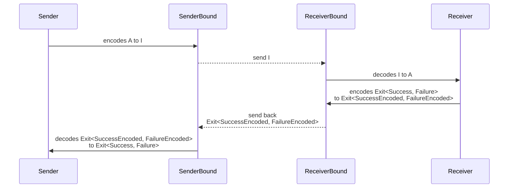

# Serializable

The `Serializable` module enables objects to have self-contained schema(s) for serialization. This functionality is particularly beneficial in scenarios where objects need to be consistently serialized and deserialized across various runtime environments or sent over network communications.

## Serializable trait

The `Serializable` trait equips objects with the capability to define their serialization logic explicitly.

```ts
interface Serializable<A, I, R> {
  readonly [symbol]: Schema.Schema<A, I, R>
}
```

**Example: Implementing the Serializable Trait**

```ts
import { Schema, Serializable } from "@effect/schema"
import { Effect } from "effect"

class Person {
  constructor(
    readonly id: number,
    readonly name: string,
    readonly createdAt: Date
  ) {}

  // Define the schema for serialization
  static FromEncoded = Schema.transform(
    Schema.Struct({
      id: Schema.Number,
      name: Schema.String,
      createdAt: Schema.Date
    }),
    Schema.instanceOf(Person),
    {
      decode: ({ createdAt, id, name }) => new Person(id, name, createdAt),
      encode: ({ createdAt, id, name }) => ({ id, name, createdAt })
    }
  )

  // Implementing the Serializable trait using the static schema
  get [Serializable.symbol]() {
    return Person.FromEncoded
  }
}

const person = new Person(1, "John", new Date(0))

// Example serialization
const serialized = Effect.runSync(Serializable.serialize(person))
console.log(serialized)
// { id: 1, name: 'John', createdAt: '1970-01-01T00:00:00.000Z' }

// Deserialization
const deserialized = Schema.decodeUnknownSync(Person.FromEncoded)(serialized)
console.log(deserialized)
// Person { id: 1, name: 'John', createdAt: 1970-01-01T00:00:00.000Z }

// Deserialization using an instance:
// if you have access to a Person instance you can use `Serializable.deserialize` to deserialize
const deserializedUsingAnInstance = Effect.runSync(
  Serializable.deserialize(person, serialized)
)
console.log(deserializedUsingAnInstance)
// Person { id: 1, name: 'John', createdAt: 1970-01-01T00:00:00.000Z }
```

## Streamlining Code with Schema.Class

While the above example provides a comprehensive view of serialization processes, using the `Schema.Class` API can significantly reduce boilerplate and simplify class modeling.

```ts
import { Schema, Serializable } from "@effect/schema"
import { Effect } from "effect"

class Person extends Schema.Class<Person>("Person")({
  id: Schema.Number,
  name: Schema.String,
  createdAt: Schema.Date
}) {
  get [Serializable.symbol]() {
    return Person
  }
}

const person = new Person({ id: 1, name: "John", createdAt: new Date(0) })

const serialized = Effect.runSync(Serializable.serialize(person))
console.log(serialized)
// { id: 1, name: 'John', createdAt: '1970-01-01T00:00:00.000Z' }

const deserialized = Schema.decodeUnknownSync(Person)(serialized)
console.log(deserialized)
// Person { id: 1, name: 'John', createdAt: 1970-01-01T00:00:00.000Z }

const deserializedUsingAnInstance = Effect.runSync(
  Serializable.deserialize(person, serialized)
)
console.log(deserializedUsingAnInstance)
// Person { id: 1, name: 'John', createdAt: 1970-01-01T00:00:00.000Z }
```

## WithResult trait

The `WithResult` trait is designed to encapsulate the outcome of an operation, distinguishing between success and failure cases. Each case is associated with a schema that defines the structure and types of the success or failure data.

```ts
interface WithResult<
  Success,
  SuccessEncoded,
  Failure,
  FailureEncoded,
  ResultR
> {
  readonly [symbolResult]: {
    readonly success: Schema.Schema<Success, SuccessEncoded, ResultR>
    readonly failure: Schema.Schema<Failure, FailureEncoded, ResultR>
  }
}
```

## SerializableWithResult trait

The `SerializableWithResult` trait is specifically designed to model remote procedures that require serialization of their input and output, managing both successful and failed outcomes.

This trait combines functionality from both the `Serializable` and `WithResult` traits to handle data serialization and the bifurcation of operation results into success or failure categories.

**Definition**

```ts
interface SerializableWithResult<
  A,
  I,
  R,
  Success,
  SuccessEncoded,
  Failure,
  FailureEncoded,
  ResultR
> extends Serializable<A, I, R>,
    WithResult<Success, SuccessEncoded, Failure, FailureEncoded, ResultR> {}
```

**Components**

- **Payload (`A, I, R`)**: The payload is described using the `Serializable<A, I, R>` trait, which includes the type of the payload (`A`), its serialized form (`I`), and any relevant runtime context (`R`).
- **Success Case (`Success, SuccessEncoded, ResultR`)**: Defined by `Schema<Success, SuccessEncoded, ResultR>`, this outlines the structure and type of the data upon a successful operation, along with its serialized form.
- **Failure Case (`Failure, FailureEncoded, ResultR`)**: This is analogous to the Success Case but caters to scenarios where the operation fails. It is described by `Schema<Failure, FailureEncoded, ResultR>`.

**Workflow**

1. **Initialization**: Begin with data of type `A`.
2. **Serialization**: Convert this data into its serialized format `I`.
3. **Transmission**: Send this serialized data over the network.
4. **Reception and Deserialization**: Upon receiving, convert the data back from type `I` to `A`.
5. **Processing**: The deserialized data is then processed to determine the outcome as either success (`Success`) or failure (`Failure`).
6. **Result Serialization**: Depending on the outcome, serialize the result into `Exit<SuccessEncoded, FailureEncoded>`.
7. **Response Transmission**: Send the serialized outcome back over the network.
8. **Final Deserialization**: Deserialize the received outcome back into `Exit<Success, Failure>` for final use.



**Example**

```ts
import type { ParseResult } from "@effect/schema"
import { Schema, Serializable } from "@effect/schema"
import { Effect, Exit } from "effect"

class Person extends Schema.Class<Person>("Person")({
  id: Schema.Number,
  name: Schema.String,
  createdAt: Schema.Date
}) {
  get [Serializable.symbol]() {
    return Person
  }
}

class GetPersonById {
  constructor(readonly id: number) {}

  static FromEncoded = Schema.transform(
    Schema.Number,
    Schema.instanceOf(GetPersonById),
    {
      decode: (id) => new GetPersonById(id),
      encode: ({ id }) => id
    }
  )

  get [Serializable.symbol]() {
    return GetPersonById.FromEncoded
  }

  get [Serializable.symbolResult]() {
    return {
      success: Person,
      failure: Schema.String
    }
  }
}

function handleGetPersonById(
  serializedReq: typeof GetPersonById.FromEncoded.Encoded
) {
  return Effect.gen(function* () {
    const req = yield* Schema.decodeUnknown(GetPersonById.FromEncoded)(
      serializedReq
    )
    return yield* Serializable.serializeExit(
      req,
      req.id === 0
        ? Exit.fail("User not found")
        : Exit.succeed(
            new Person({ id: req.id, name: "John", createdAt: new Date() })
          )
    )
  })
}

const roundtrip = (
  req: GetPersonById
): Effect.Effect<Exit.Exit<Person, string>, ParseResult.ParseError> =>
  Effect.gen(function* () {
    const serializedReq = yield* Serializable.serialize(req)
    const exit = yield* handleGetPersonById(serializedReq)
    return yield* Serializable.deserializeExit(req, exit)
  })

console.log(Effect.runSync(roundtrip(new GetPersonById(1))))
/*
Output:
{
  _id: 'Exit',
  _tag: 'Success',
  value: Person { id: 1, name: 'John', createdAt: 2024-07-02T17:40:59.666Z }
}
*/

console.log(Effect.runSync(roundtrip(new GetPersonById(0))))
/*
Output:
{
  _id: 'Exit',
  _tag: 'Failure',
  cause: { _id: 'Cause', _tag: 'Fail', failure: 'User not found' }
}
*/
```

## Streamlining Code with Schema.TaggedRequest

While the previous example effectively demonstrates the mechanisms involved, it does require a significant amount of boilerplate code. To streamline development, the `Schema.TaggedRequest` API is specifically designed to reduce complexity and increase readability.

```ts
import type { ParseResult } from "@effect/schema"
import { Schema, Serializable } from "@effect/schema"
import { Effect, Exit } from "effect"

// Define a simple person class using Schema.Class for ease of serialization
class Person extends Schema.Class<Person>("Person")({
  id: Schema.Number,
  name: Schema.String,
  createdAt: Schema.Date
}) {}

// Represents a serializable function: `(payload: { readonly id: number }) => Exit<Person, string>`
class GetPersonById extends Schema.TaggedRequest<GetPersonById>()(
  "GetPersonById",
  {
    payload: { id: Schema.Number }, // Define the schema for the payload,
    success: Person, // Schema for successful outcome
    failure: Schema.String // Schema for failure outcome
  }
) {}

// Function to handle the GetPersonById request and process the response
function handleGetPersonById(serializedReq: typeof GetPersonById.Encoded) {
  return Effect.gen(function* () {
    const req = yield* Schema.decodeUnknown(GetPersonById)(serializedReq)
    return yield* Serializable.serializeExit(
      req,
      req.id === 0
        ? Exit.fail("User not found")
        : Exit.succeed(
            new Person({ id: req.id, name: "John", createdAt: new Date() })
          )
    )
  })
}

// Simulates a roundtrip serialization and deserialization process
const roundtrip = (
  req: GetPersonById
): Effect.Effect<Exit.Exit<Person, string>, ParseResult.ParseError> =>
  Effect.gen(function* () {
    const serializedReq = yield* Serializable.serialize(req)
    const exit = yield* handleGetPersonById(serializedReq)
    return yield* Serializable.deserializeExit(req, exit)
  })

// Example outputs from invoking the roundtrip function
console.log(Effect.runSync(roundtrip(new GetPersonById({ id: 1 }))))
/*
Output:
{
  _id: 'Exit',
  _tag: 'Success',
  value: Person { id: 1, name: 'John', createdAt: 2024-07-02T17:40:59.666Z }
}
*/

console.log(Effect.runSync(roundtrip(new GetPersonById({ id: 0 }))))
/*
Output:
{
  _id: 'Exit',
  _tag: 'Failure',
  cause: { _id: 'Cause', _tag: 'Fail', failure: 'User not found' }
}
*/
```

## Communication and Serialization with Schema and Serializable Traits

This section outlines a streamlined client-server interaction using the `Serializable` and `WithResult` traits from the `@effect/schema` library to manage serialization and processing of data objects across network communications.

**Client-Side Operations:**

1. **Initialization**: Start with an object of type `A`, which implements `Serializable.SerializableWithResult`.
2. **Serialization**: Serialize the object `A` using `Serializable.serialize`, which employs the schema retrieved from the `Serializable` interface tied to `A`.
3. **Transmission**: Send the serialized data of type `I` to the server and wait for a response.

**Server-Side Operations:**

1. **Reception**: Receive the serialized data `I`.
2. **Deserialization**: Convert the serialized data `I` back into an object of type `A` using a predefined union schema `Schema<A | B | ..., I | IB | ...>`.
3. **Processing**: Handle the message of type `A` to derive an outcome as `Exit<Success, Failure>`.
4. **Result Serialization**: Serialize the result `Exit<Success, Failure>` to `Exit<SuccessEncoded, FailureEncoded>` utilizing the schema obtained from `A`'s `WithResult` interface.
5. **Response**: Send the serialized response `Exit<SuccessEncoded, FailureEncoded>` back to the client.

**Client-Side Response Handling:**

1. **Reception**: Receive the response `Exit<SuccessEncoded, FailureEncoded>`.
2. **Final Deserialization**: Convert `Exit<SuccessEncoded, FailureEncoded>` back to `Exit<Success, Failure>` using the original object `A` and the schema from the `WithResult` interface.
